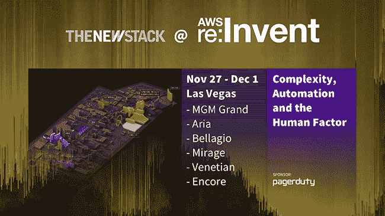

# 微软将 Azure 的容器服务集中在 Kubernetes 上

> 原文：<https://thenewstack.io/azure-kubernetes-service-powers-microsofts-container-integration-strategy-cloud/>

微软的新 Azure Kubernetes 服务(AKS)现在处于预览阶段，它将该公司现有的 [Azure 容器服务](https://azure.microsoft.com/en-gb/services/container-service/)扩展到一个更受管理的环境，一个围绕[云本地计算基金会](https://www.cncf.io/) s [Kubernetes](/category/kubernetes/) 容器编排引擎构建的环境。

“我们非常清楚地从客户那里听到，他们想要的是一种完全托管的体验，”微软 Azure 容器项目主管 Gabe Monroy 说。“最大的区别是[微软的基本 Azure 容器服务]提供的是一种非托管体验，而 AKS 是一种托管体验。”

将托管服务建立在 Kubernetes 的基础上并不是微软像过去那样挑选赢家；如今，微软的战略是走到客户所在的地方，支持全方位的选择。这就是为什么 Azure 容器服务支持 Swarm 和 DC/OS 以及 Kubernetes 他证实，对这些仍然有很多需求，这些替代的编排器将继续是“Azure 上的一流解决方案”。容器服务不会消失，但 AKS 是该服务的下一个版本。

“我认为我们已经看到了微软内部和外部，围绕 Kubernetes 作为一种事实上的开源容器编制者的一种非常快速的整合，”Monroy 告诉我们。Kubernetes 社区和生态系统的力量与此有很大关系。

正如 Kubernetes 的联合创始人和微软杰出的工程师 [Brendan Burns](https://github.com/brendandburns) 最近告诉新堆栈的那样，[管弦乐队应该很无聊](https://thenewstack.io/kubernetes-co-founder-brendan-burns-orchestration/)。“功能上的具体差异对客户来说并不重要，”蒙罗伊指出。“他们真的希望从这一层继续前进，专注于下一组问题，如服务网格技术、开发人员工具、安全性以及如何将所有这些集成到一个连贯的软件生命周期和治理框架中。在所有编排选项中，Kubernetes 拥有最强大的生态系统，所以如果你试图解决许多问题，使用 Kubernetes 会更容易。”

甚至传统上保守和受监管领域的大型组织，如金融服务，也在以他所谓的“惊人的速度”采用 Kubernetes 容器。“容器和流程编排的价值主张非常有前途，尽管缺乏广泛可用的托管服务，人们还是准备在它们身上下注。”

## 集装箱及其他

作为一项仍处于预览阶段的新服务，AKS 不具备基本容器服务中的所有功能，尽管 Monroy 告诉我们这一差距将很快缩小，因为“我们真的认为 AKS 是我们下一个服务产品的未来。”

在 preview 中，只支持 Linux 容器——因为一些核心的 Kubernetes 组件仍然必须在 Linux 主机上运行——但是只支持 Windows 以及混合 Linux 和 Windows 节点池都在路线图上。其中一部分取决于 Kubernetes 本身所做的工作；1.9 中有一些进步，1.10 中有更多改进，AKS 团队的目标是 2018 年上半年实现 Windows 容器支持。

“我们现在要求的大多数功能都属于网络和安全定制，”Monroy 说，并补充说，这些是竞争解决方案所不提供的，这意味着“客户要求我们领导行业。”

用户最大的需求是支持将 Kubernetes 集成到现有的虚拟网络服务端点(VNET)中，就像你已经可以使用基本的容器服务一样。在服务正式上市之前，应添加自定义虚拟网络。基于角色的访问控制和网络策略还没有出现在预览版中，但是它们已经计划在发布版中使用了。

持久卷的工作方式与它们在容器服务中的工作方式相同；目前支持 Azure 文件、Azure 数据盘和 Azure 托管盘。你可以为节点选择特定的虚拟机类型，只要它们在 Azure 区域可用，尽管有些虚拟机类型还不是一个选项——添加带有 NVidia 驱动程序的 Azure NC6 虚拟机即将到来，而且你还不能将托管磁盘预连接到代理虚拟机。假设上游的 Kubernetes 自动缩放器被合并到核心版本中，那么自动缩放也是计划中的。

在 preview 中，升级控制平面会导致短暂(10-15 秒)的停机时间；当服务退出预览时，和节点升级都将正常工作，不会出现任何停机。

Kubernetes 仪表盘配有 AKS。默认设置还不能改变，但在发布前会有改变其中一些设置的选项。PowerShell 支持也将在服务全面可用时到来，所有 AKS 功能最终都将通过 Azure CLI、Azure 门户和 Azure APIs 得到支持。

因为基本的容器服务仍然可用，所以不会自动迁移到 AKS，但微软正在与 Kubernetes 服务提供商 [Heptio](https://heptio.com/) 合作，以确保像 Heptio 的 [Ark](https://github.com/heptio/ark) 这样的工具将支持迁移到 AKS，包括像持久卷这样的选项。

预览版最初在美国东部和西欧地区推出，随后在美国中部推出；根据 GitHub 上的地区列表，美国西部和英国西部似乎是下一个地区。

最初的需求远高于微软的预期。“我们真的很惊讶人们如此迅速地一头扎进这些深层次的技术问题中，”蒙罗伊说。“一般来说，当你发布这种基础设施软件时，人们不会马上有时间去体验；这需要时间，而做这些评估的操作人员必须等到他们的时间有空的时候。”

虽然他没有承诺微软会将 AKS 引入公司的本地版本 Azure，即 Azure Stack，但他证实了团队正在讨论这种可能性，并且“对前景感到兴奋”

## 与 AKS 集成

AKS 不是 Kubernetes 的 Azure 专用版本，但它将与 Azure 服务深度集成，通过 Kubernetes APIs 向那些选择 Kubernetes 的可移植性和开放性的客户提供这些服务。

“我们的目标是让它坚固可靠，成为基础设施的一部分。我们不想把 AKS 变成一个成熟的平台；这个想法是提供一个 Kubernetes API 作为服务。然而，我们确实想让它成为一个很好的平台，因此我们正在与许多不同的合作伙伴合作，将我们正在构建的这一基础设施管道化，并真正充实到一个更大的解决方案中。”

云计算原生计算基金会(T4)和微软(T6)是新堆栈的赞助商。

由 [Jason Blackeye](https://unsplash.com/@jeisblack) 通过 [Unsplash](https://unsplash.com/photos/KUgDg__TMGk) 拍摄的特征图像。

<svg xmlns:xlink="http://www.w3.org/1999/xlink" viewBox="0 0 68 31" version="1.1"><title>Group</title> <desc>Created with Sketch.</desc></svg>