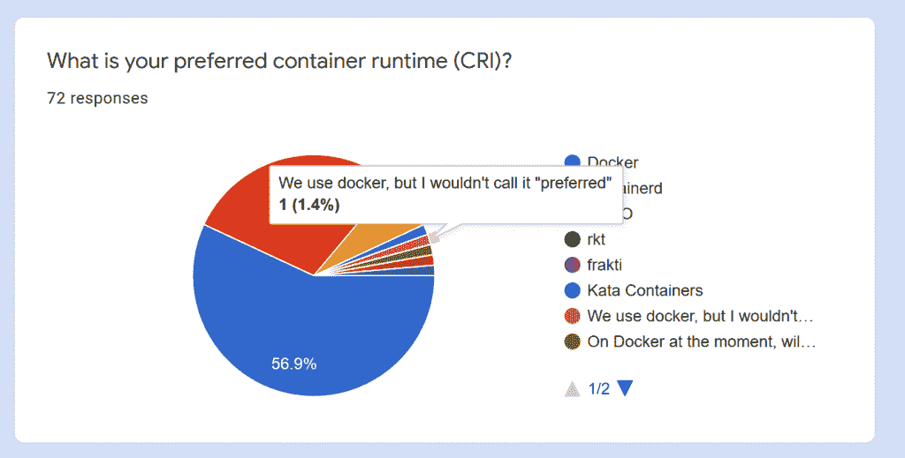

# Azure Kubernetes 服务用 containerd 替代 Docker

> 原文：<https://thenewstack.io/azure-kubernetes-service-replaces-docker-with-containerd/>

Kubernetes 1.20 [将反对 Docker 作为运行时](https://kubernetes.io/blog/2020/12/02/dockershim-faq/)并且它将被及时移除的消息引起了一定程度的混乱，尽管 Docker 运行时至少要到 1.23 才会消失。但是 containerd 支持已经是使用 [Kubernetes 1.19](https://docs.microsoft.com/en-us/azure/aks/cluster-configuration#container-runtime-configuration) 的 [Azure Kubernetes 服务](https://azure.microsoft.com/en-us/services/kubernetes-service) (AKS)集群的默认运行时，并且一旦 1.19 普遍可用，它将是所有新集群的默认运行时。

微软公司副总裁 Brendan Burns 告诉新的 Stack:“这在整个社区已经开发了很长时间，所以我希望大多数人都准备好了。”。“我们肯定很高兴能够完成这项工作并提供给用户。”

## **码头工人骚乱**

很长一段时间以来，Docker 是 Kubernetes 中最流行的容器运行时，它[仍然被广泛使用](https://docs.google.com/forms/d/1AA75xUUdsboenrGPFN-Dtnx8N8vfR_b3kmmQNrdXX4g/viewanalytics)，但是 [containerd](https://github.com/containerd/containerd) 是(由 Docker)设计的，为执行容器和管理节点上的映像提供最少的功能集，并为容器生命周期和快照管理提供版本化和稳定的 API。

事实上，Docker 引擎已经构建在 containerd 之上，因此[在 Kubernetes](https://thenewstack.io/kubernetes-vs-docker-swarm-whats-the-difference/) 中使用 Docker 意味着运行 dockershim 容器运行时接口实现(因为 Docker 没有办法与 CRI 交互)，以及 Docker 本身——和 Docker 内部的 containerd。一个 CRI 插件被直接内置到 containerd 中(从 1.1 版本开始)，去掉了两层并运行一个更小的代码库(因为 Docker 有像 Kubernetes 已经自己做的网络、日志和卷管理之类的代码)。

Burns 解释说，混淆的是作为容器运行时的 Docker 和作为整个开发栈的 Docker，后者为开发人员提供了完整的用户界面。

“码头工人真的是两样东西。Docker 是你运行容器的方式，但它也像是一个围绕构建、管理和与容器交互的完整工具包。很久以前 containerd 和 Docker 的分离实际上是运行时和用户界面的分离。在 Kubernetes 集群中，Kubernetes 实际上是用户界面。”

切换到 containerd 使 pod 创建更快，降低了资源使用，并保证了更好的速度和操作稳定性。这不仅仅是因为你在路径中去掉了两跳，而是因为它确保了 Kubernetes 可以正确地管理你的所有容器，因为 Kubernetes 用户不能手动控制那么多。

“留下残留的[Docker]用户界面总是有点问题，”Burns 指出。“这就像一个旁门左道。”

“这使得调度程序更难正常工作。例如，如果您使用 Docker 在那台机器上运行一个容器，调度程序实际上对此一无所知。它不能终止它。它不想破坏您可能已经做的任何它不理解的事情，并且它没有所有的元数据，如果您通过 orchestrator 创建它，它通常会有所有的元数据，并提供所有的元数据，如“这些是我需要的资源，这是这个副本集的一部分”。它没有任何关于您创建的某个随机容器的信息，但该容器却在那里消耗资源。”

大多数人使用 Kubernetes 接口，但是由于 Docker 接口是公开的，所以有人可能会不小心使编排变得更加困难。“很高兴知道那个表面区域已经被移除了，”伯恩斯补充道。

当开发者对 dockershim 的移除表示担忧时，Mirantis 宣布将与 Docker 合作，将 shim 代码作为 Kubernetes 之外的[独立项目进行维护。这可能需要大量的工作，因为 Burns 指出 dockershim 还没有进行积极的开发，这使得 Kubernetes 项目的开发人员的生活更加复杂。](https://www.mirantis.com/blog/mirantis-to-take-over-support-of-kubernetes-dockershim-2/)

## **对大多数人来说容易**

在集群中使用早期 Kubernetes 版本的用户将在这些版本的生命周期内得到支持，因此他们还不需要进行更改。

但自 2018 年以来，container 已经作为 Kubernetes 容器运行时普遍可用并得到支持，Burns 认为生态系统已经做好了准备。Xbox Game Pass 流媒体服务[已经在使用 containerd 和临时磁盘](https://thenewstack.io/kubecon-eu-azure-kubernetes-services-gets-ephemeral-disks/)(现在也在 AKS 中正式发布)来减少延迟。

那么转换会有多大的破坏性呢？

“人们偶尔会遇到问题的地方之一是那些直接安装在 Docker 插槽中的人。不推荐这样做，但是有些人想在 Docker 容器中运行 Docker。为此，他们将运行在主机上的 Docker 套接字直接安装到他们的容器中，然后他们可以在 Docker 中运行 Docker。或者有人会在容器中进行 Docker 推送，将图像推送到注册表中。这总是不受支持的:这是可能的，但我们真的不建议你这样做！”

随着 Docker 用户界面的消失，这种“标签外”的使用将不再可能，但有更好的方法来实现所有这些，他建议。

“它花了这么长时间，这是该平台成熟的一个标志，因为我们不能让人们崩溃:如果没有人使用它，我想我们可能会在四年前就退出，但在你愿意做出这样的改变之前，有很多事情要做，要做对，并确保稳定。”

从 1.19 版本开始切换到 containerd，因为版本是显式升级。

“每一次 Kubernetes 升级都有可能中断客户的工作流程，因此，通过将 containerd 与 Kubernetes 升级保持一致，人们希望他们需要谨慎，他们需要首先升级开发集群，并确保他们的工作流程继续工作，并从那里开始。但对大多数人来说，这应该是一个不可行的方案。”

人们对 Kubernetes for Windows 中的 containerd 有些担心，只是因为测试它的 Kubernetes Windows 版本较少，但 containerd 接口一直是 Windows 容器的接口，即使 Docker 是 Kubernetes 1.18 之前唯一受支持的 Windows 容器运行时，并且 containerd Windows 支持的稳定版本目标是 1.20。

“他们在 Windows 中使用的 Docker 二进制文件在代码中已经被分成了 Docker 前端和 containerd 后端，尽管它们是一起分发的，”Burns 解释道。

“当我们与 Windows 团队讨论他们的职责在哪里建立，以及我们的职责在操作系统运行人员和在操作系统之上构建流程编排的人员之间如何接管时，这是一个关键问题。”

“我对 containerd 的稳定性很有信心，因为这是他们一直关注的事情。这不像在 Linux 中，有很长一段时间没有 containerd，并且有一个遗留的代码被分离出来；在 Windows 的情况下，这是从一开始的世界。他们必须利用与 Docker 工作人员讨论‘路线图将何去何从’的机会，而不仅仅是‘路线图目前在哪里’。”

### 尽可能快地

AKS 最近的许多改进都是关于运营效率和为更广泛的用户增加灵活性 [Kubernetes 现在吸引了](https://thenewstack.io/microsoft-azure-stop-and-start-kubernetes-clusters-like-pausing-a-video/)，AKS 现在普遍提供的 maxSurge 功能也属于同一类别。Burns 告诉我们，通过选择集群中有多少并发虚拟机同时停机和升级，而不是一个接一个地升级，maxSurge 允许人们以最符合其工作负载的方式升级集群。

“传统上，我们的升级相当缓慢，假设每个人主要对稳定性而不是升级速度感兴趣:非常缓慢地移动，最大限度地减少对群集中应用程序的中断。这对于典型用户来说很好，但是对于一些用户和一些工作负载来说，如果你尽可能快地运行它，他们会更高兴。也许是一个你根本不在乎的发展集群。您只想尽可能快地完成它，而不想无所事事地等待开发集群完成升级。也许这是一个真正的无状态 web 应用程序或批处理作业，其目标是尽快完成升级，而不是关注稳定性。”

对于在升级过程中无法避免中断的工作负载，中断时间越短越好。“Jupyter 笔记本并不特别适合原生云，因为它们是单一来源的:实际上，如果你是一名科学家，你只有一台笔记本，它在一个进程中运行，你无法进行复制。对于正在运行一个包含大量 Jupiter 笔记本电脑的集群的人来说，升级就是中断，他们希望尽可能快地运行。将 maxSurge 设置得很高可以让他们在几分钟内完成升级，而不是一个小时；对他们来说，告诉用户‘我们将有五分钟不可用’比‘我们将有一小时不可用’要好。"

Burns 指出，Kubernetes 已经在单一应用程序的部署方面具备了类似的能力。

“当您升级单个应用程序时，您有相同的选择；你可以说‘我想非常缓慢、非常稳定、没有干扰地前进’，或者‘我想非常快速地前进；“只要完成它，尽量缩短时间就行了。”这反映了集群的这种能力。它只是为集群管理员提供了更多管理升级的灵活性。"

随着 Kubernetes 在 Azure 上的整体体验变得越来越完整，越来越适合主流受众，这些灵活性的小功能可能会变得更加重要。

<svg xmlns:xlink="http://www.w3.org/1999/xlink" viewBox="0 0 68 31" version="1.1"><title>Group</title> <desc>Created with Sketch.</desc></svg>