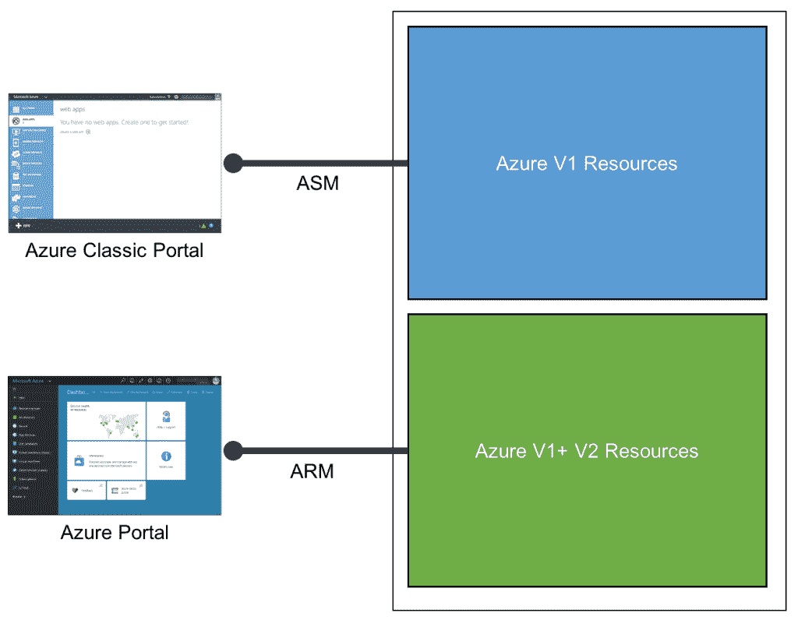
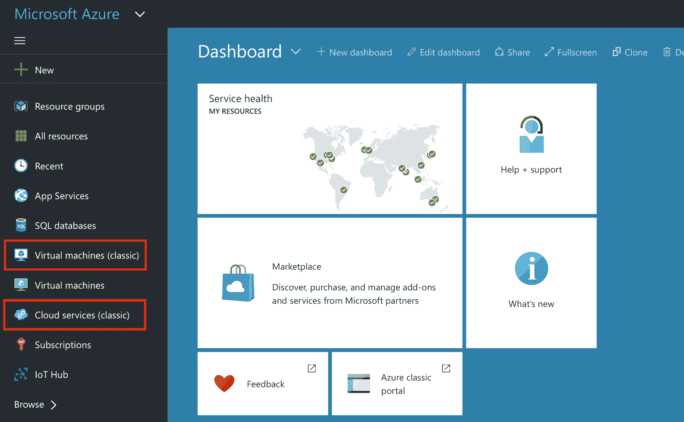
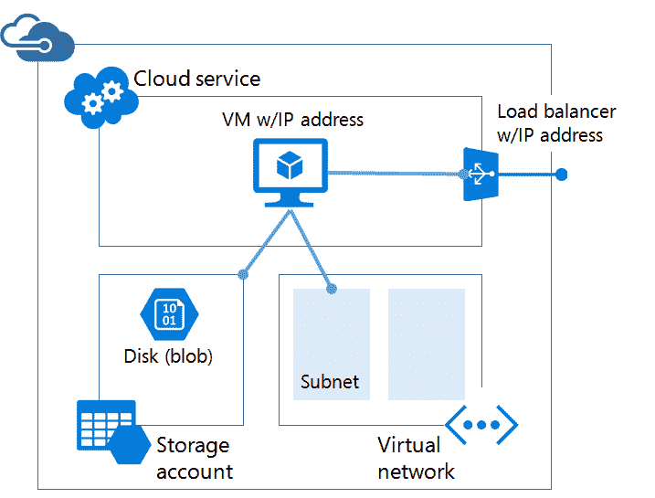
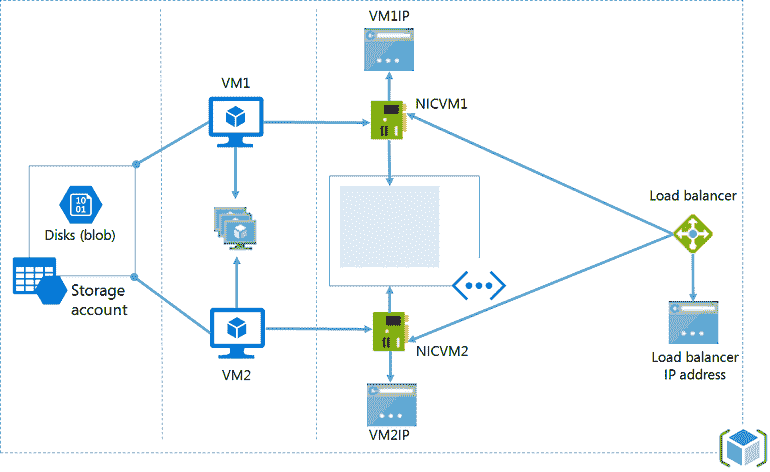

# 深入了解微软的 Azure 资源管理器

> 原文：<https://thenewstack.io/azure-resource-manager-microsoft-shifts-services-resources/>

在本系列的第一部分中，我们讨论了 Azure IaaS 的发展和 Azure Resource Manager 的角色。本系列的下一部分将解释 Azure 服务管理(ASM)和 Azure 资源管理(ARM)模型之间的主要区别。我们还将了解与 ARM 相关的关键概念和术语。

## ASM 还是 ARM？

云的关键原则之一，尤其是基础设施服务，是可编程性。几乎每个云提供商都公开了一组 API 来以编程方式操作虚拟基础架构。甚至在云计算这个术语成为流行语之前，亚马逊就公开了存储和计算的 API，这些 API 最终成为了 AWS 的核心。

当微软构建 Azure 时，开发者可以通过 [Azure 服务管理(ASM)](https://azure.microsoft.com/en-in/blog/introducing-the-windows-azure-service-management-api/) API 与控制平面进行交互。在正式支持 REST 之前，ASM 是作为一组 SOAP 端点公开的。考虑到基于存储、计算和应用服务的较小的服务集，ASM 对于开发者和第三方 ISV 与 Azure 对话来说已经足够好了。最终，随着新的服务被添加到 Azure 中，API 的足迹成比例地扩大。当合作伙伴生态系统开始为微软的公共云平台开发工具时，ASM 成为了 Azure 的核心。即使在今天，ASM 也被像 [CloudBerry Lab](http://www.cloudberrylab.com/) 和 [Cerebrata](https://www.cerebrata.com/) 这样的 ISV 广泛使用。微软开始发布严重依赖 ASM 的语言绑定、原生 SDK 和命令行工具。

由于 ASM 是 Azure IaaS 第一个版本的 API facade，所以它受到了同样的限制和约束。资源供应不一致，不支持原子部署和回滚。开发人员不得不处理一组杂乱无章的 API 来提供逻辑上属于同一工作负载的资源。

最初的 Windows Azure 管理门户建立在 ASM 之上。随着 Azure IaaS V2 的推出，微软推出了一个符合 ARM 战略的新门户。为了区分这两种界面，微软开始将旧门户称为经典门户。通过传统门户调配的一些资源(如虚拟机)也派生出传统虚拟机的别名。

正如我们之前讨论的，Azure Resource Manager (ARM)与微软的 IaaS 路线图紧密结合。从技术上讲，通过 ASM API 提供的资源不能通过 ARM 端点访问。它们是分开维护的，以避免可能的冲突。新的 Azure 门户有一个单独的链接来访问通过经典门户和 ASM 创建的虚拟机。在访问 V2 资源之前，甚至 CLI 也必须明确切换到 ARM。

新门户支持访问 ASM 和 ARM 资源。但是通过 ARM 提供的一些资源在传统门户上是看不到的。下面的屏幕截图显示了新门户如何让您访问使用 ASM 创建的传统虚拟机和云服务。

Azure 新门户支持 ASM 和 ARM 资源

当您部署一个带有 VM、存储帐户、公共 IP 地址、虚拟网络和负载平衡器的典型 web 应用程序时，ASM 和 ARM 之间的主要区别是显而易见的。ASM 独立处理每个资源，没有逻辑分组。

ASM 部署模型

当通过 ARM 部署时，同一个应用程序附带了一个可以作为一个单元来管理的资源逻辑分组。

ARM 部署模型

## 概念和术语

了解了 ASM 和 ARM 之间的主要区别之后，现在让我们来看看 ARM 的核心概念。

Azure 的构建块，如计算、存储和网络充当资源提供者。它们是创建资源的蓝图，是在资源组中打包和提供的。资源模板是一种声明性机制，用于定义和配置属于资源组的资源。

### 资源提供者

资源提供者是一种服务，它提供可以通过 ARM 部署和管理的资源。每个提供者都有自己的 API 来访问和操作服务。微软正致力于为所有 Azure 服务增加 ARM 支持。资源提供者通过唯一的命名空间可用。比如微软。Compute 代表[虚拟机](https://msdn.microsoft.com/en-us/library/azure/mt163647.aspx)资源。资源提供者拥有可通过 REST API 访问的资源类型。[微软。存储](https://msdn.microsoft.com/en-us/library/azure/dd179355.aspx)提供程序具有 Blob、队列和表的资源类型。同理，[微软。网络](https://msdn.microsoft.com/en-us/library/azure/mt163658.aspx)将负载平衡器、公共 IP、路由、子网和网络安全组作为资源类型公开。

任何带有资源提供者名称空间的 Azure 服务都可以参与 ARM 部署。资源类型可以在模板中声明。参考 Azure [文档](https://azure.microsoft.com/en-in/documentation/articles/resource-manager-supported-services/)的这一部分，获取资源提供者的更新列表。

ASM 和 ARM 的计算、存储和网络资源提供商有着根本的不同。由于操作不同，需要区别对待。

### 资源组

根据官方定义，资源组是保存应用程序相关资源的容器。资源组可以包括应用程序的所有资源，或者仅包括逻辑上组合在一起的那些资源。

属于同一资源组的所有资源共享一个公共的生命周期。它们一起被部署、更新和删除。如果像 SQL 数据库实例这样的资源需要独立，那么它必须在一个单独的资源组中。可以链接属于不同组的资源。例如，具有 SQL 数据库资源的资源组可以链接到包含不同 web 应用程序的多个组。

知道一个资源一次只能存在于一个资源组中也很重要。虽然资源可以从一个组移动到另一个组，但是它们不能共享。一个资源组可以包含跨越多个区域的资源。它们仍然被视为一个逻辑单元。

### 资源模板

资源模板是 ARM 最重要的组件，它提供了定义应用程序部署和配置的声明性方式。它们是 JSON 文档，可以重复部署并得到一致的结果。与手动或脚本部署相比，ARM 模板更不容易出错。

资源模板包含基础结构的定义、各个资源的配置以及应用程序发布到该基础结构的方式。资源的定义顺序并不重要，因为 Azure 可以确定资源供应的正确顺序。这让 IT 管理员和开发团队不必担心基础架构的依赖性。

大型部署往往包括多种资源，这可能会使模板变得太大而难以管理。为了避免复杂性，资源模板可以相互链接。为了部署特定的解决方案，管理员可以创建一个主模板来链接所有必需的模板。每个模板都可以独立管理和维护。

ARM 模板可以与现有的配置和配置管理工具集成，如 Chef、Puppet、Ansible 和 PowerShell DSC。这个特性使得 ARM 可以很好地与现有的 DevOps 工具配合使用。

最后，由于 ARM 模板只是一个 JSON 文件，所以它们可以和应用程序在同一个版本控制系统中维护。DevOps 团队可以轻松地将 ARM 与现有的基础设施即代码策略相集成。

在本系列的下一部分中，我们将创作一个 ARM 模板来在 Microsoft Azure 上部署 LAMP stack。敬请期待！

通过 Pixabay 的特征图像。

<svg xmlns:xlink="http://www.w3.org/1999/xlink" viewBox="0 0 68 31" version="1.1"><title>Group</title> <desc>Created with Sketch.</desc></svg>