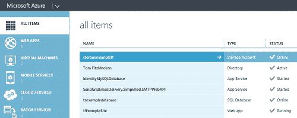
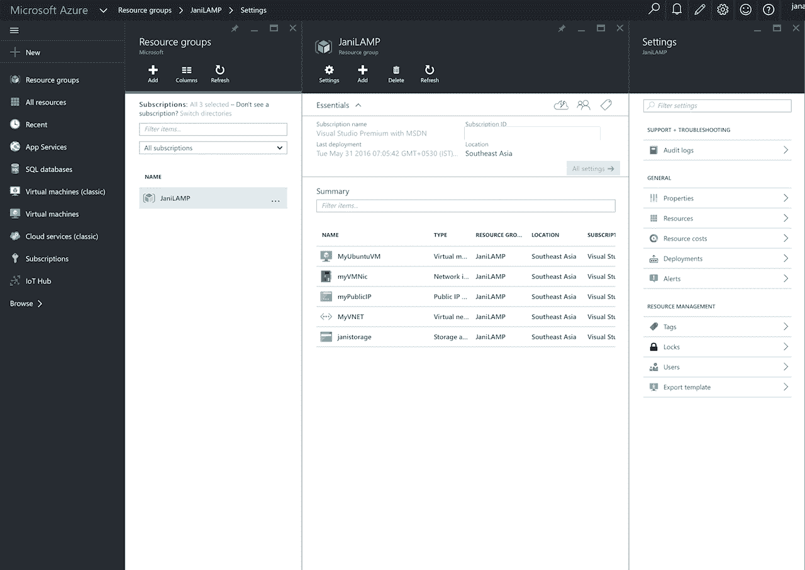

# Azure 资源管理器:微软云战略的秘方

> 原文：<https://thenewstack.io/azure-resource-manager-secret-sauce-microsoft-cloud-strategy-part-one/>

自 2009 年推出以来，[微软 Azure](https://azure.microsoft.com/) 经历了一次重大变革。最初作为一套核心平台服务的平台，现在也成为基础设施市场中不可忽视的力量。

根据 Gartner 的说法，Azure 正在慢慢接近 AWS，牢牢占据基础设施即服务(IaaS)魔力象限右上角的位置，该象限只为市场领导者保留。

一项加速微软基础设施服务的技术是 [Azure 资源管理器](https://azure.microsoft.com/en-in/documentation/articles/resource-group-overview/)，它已经成为微软云平台的基石。它正准备在 [Azure Stack](https://azure.microsoft.com/en-us/overview/azure-stack/) 中扮演关键角色，这是来自雷德蒙德的私有云产品。

在这个由多个部分组成的文章系列(本文是第一部分)中，我们将进一步了解 Azure Resource Manager 及其功能

## IaaS 的发展

早在 2008 年，微软的公共云愿景就围绕着面向开发者的平台服务。它将 Azure 设计成部署和运行的最佳平台。NET 应用程序。像它的早期对手——Google App Engine 和 Heroku——Azure 强调构建可以自动扩展的无状态应用程序。

开发人员必须将代码打包在两个部署单元之一中:Web 角色和 Worker 角色。web 角色托管面向公众的 Web 前端和 API，而业务逻辑则进入 Worker 角色。持久数据分布在微软的 NoSQL 和 RDBMS 产品 [Azure Storage](https://azure.microsoft.com/en-us/services/service-bus/) 和 [SQL Azure](https://azure.microsoft.com/en-us/services/sql-database/) 之间。服务总线公开了额外的应用服务，包括消息传递和排队。Web 角色和工作者角色的组合被称为[云服务](https://azure.microsoft.com/en-in/documentation/articles/cloud-services-choose-me/)，它们共同提供平台的计算能力。

毫无疑问，看着 Amazon EC2 的惊人增长，微软意识到了纯基础设施服务的重要性。但是 Azure 的设计和架构使得向外界公开原始虚拟机变得极其困难。有趣的是，Web 角色和 Worker 角色都只是运行在 Hyper-V 之上的无状态虚拟机。微软带来了另一种风格的云服务，称为 [VMRole](https://blogs.msdn.microsoft.com/plankytronixx/2012/06/08/the-difference-between-azure-vms-and-azure-vm-role/) ，它使客户能够打开远程桌面会话来安装定制软件。这些是 Azure IaaS 的早期迹象。

VMRole 甚至不是 Amazon EC2 实例的远程匹配。它本质上遵循了相同的无状态云服务理念。最终，客户可以将对象存储容器挂载为 VMRole 的持久磁盘。这部分解决了运行数据库和业务线应用程序等传统工作负载的问题。

2012 年，微软进一步调整了 VMRole，推出了 Azure VMs，这标志着它正式进入 IaaS 市场。它与 Canonical 和 Oracle 合作，支持各种版本的 Linux 和 Windows Server。

早期的 IaaS 产品存在许多问题。永久磁盘的 I/O 性能与预期不符。微软遭遇了与磁盘 I/O 和吞吐量相关的多个问题，这质疑了该平台运行任务关键型工作负载的可行性。

由于 Azure 虚拟机深深植根于云服务基础，微软在增强 IaaS 平台和提高性能方面几乎无能为力。另一个受到严重影响的领域是网络。实现透明的负载平衡、自动扩展、浮动 IP 地址和 VPN 连接非常困难。这些特性在 Azure 的最初版本中都没有考虑到。在微软的公共云上实施标准开发运维流程极其困难。

在同一时间段，谷歌决定从头开始构建 IaaS，而不是扩展 App Engine。谷歌计算引擎几乎在同一时间推出。另一方面，亚马逊继续在 EC2 上取得进展，给微软带来了巨大的压力。这些因素迫使微软回到白板上重新设计 Azure IaaS。

## Azure 资源管理器和 IaaS V2

微软在 Build 2014 上为下一代 IaaS 奠定了基础，并在预览版中宣布了新的门户。随之而来的是 Azure Resource Manager (ARM)，一种在微软云上声明和提供资源的新方式。新的门户具有将逻辑上相关联的资源集合分组为一个单元的独特能力，该单元被称为资源组。

在新的门户和资源组可用之前，Azure 用户不得不处理分散在不同服务中的相关资源。在 Azure 中，典型的 web 应用程序会有几个虚拟机、存储帐户、负载平衡器、安全组、虚拟网络和 Azure SQL 数据库。由于每个服务都是相互独立的，所以它们是在各自的沙箱中创建的，没有逻辑分组。它们不共享任何关于部署、计费和删除的上下文。最痛苦的部分是删除属于一个应用程序的所有资源。用户需要导航到门户的多个部分并手动删除每个部分:

使用 ARM，客户可以在一个 JSON 模板中声明所有相关的资源，该模板充当部署单元。这些模板可以通过门户或命令行实用程序提交。模板中声明的所有资源都属于一个资源组。新门户提供了属于同一资源组的资源的整合视图。下面的截图展示了一个通过 Azure 资源管理器模板部署的典型 web 应用程序。

Azure 资源组(RG)和 Azure 资源管理器的概念改变了微软的游戏。它不仅简化了 Azure 资源的供应和取消供应，还为该公司的公共云和私有云 IaaS 产品提供了一个通用的基础。微软的私有云 Azure Stack 与 ARM 进行了深度整合。同一个 ARM 模板可以同时部署在 Azure(公有云)和 Azure Stack(私有云)上。这是可能的，因为微软公开底层基础设施资源的方式。模板作者在声明资源时不需要决定目标环境。在运行时，它被转换为公共云中或私有云中的部署。使用 Visual Studio 的开发人员可以通过最强大的 IDE 交互式地创作 Azure 资源管理器模板。

在本系列接下来的部分中，我们将了解更多关于架构、资源提供者、从传统部署的迁移、与 AWS CloudFormation 的比较，以及创作 Azure 资源管理器模板的最佳实践。

通过 Pixabay 的特征图像。

<svg xmlns:xlink="http://www.w3.org/1999/xlink" viewBox="0 0 68 31" version="1.1"><title>Group</title> <desc>Created with Sketch.</desc></svg>