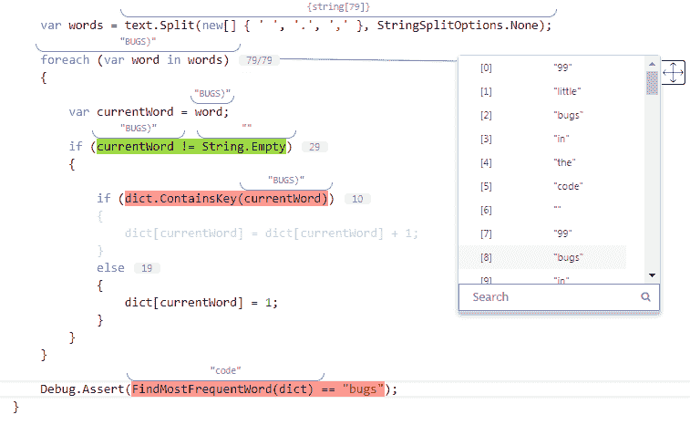
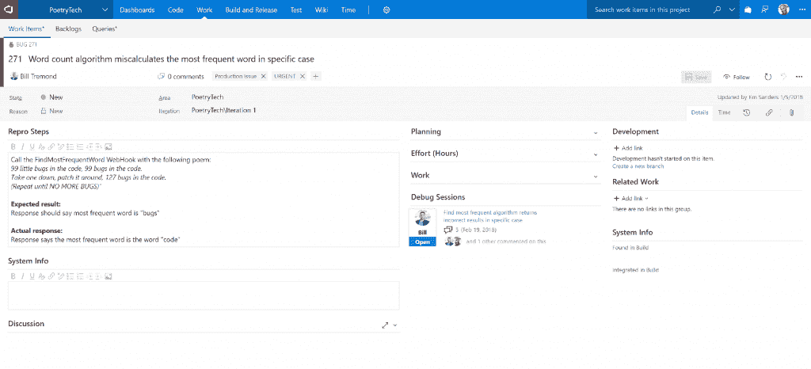
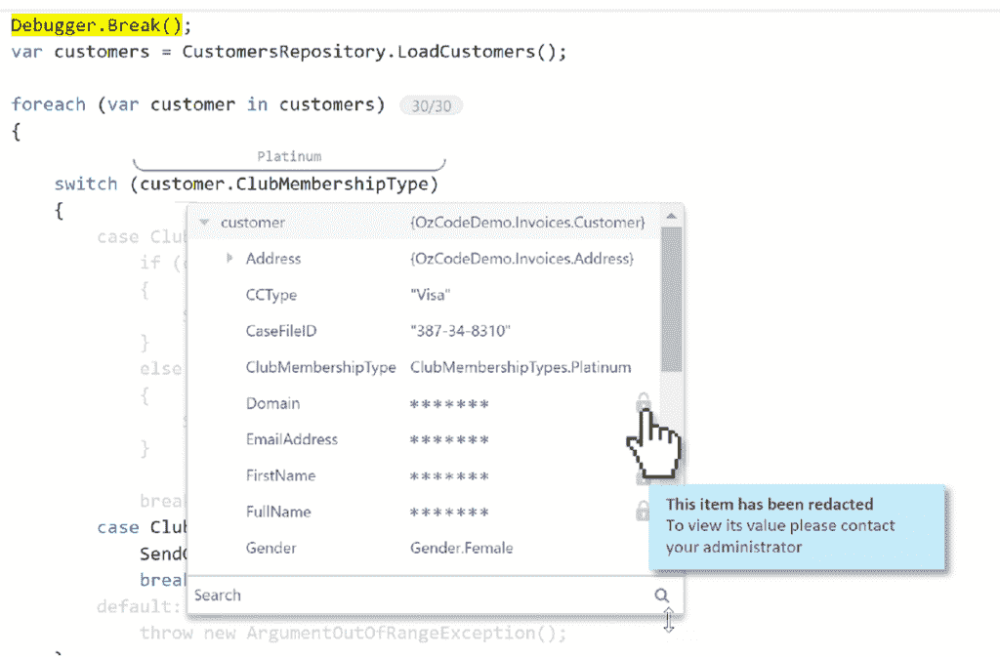

# AzureDevOps 与 OzCode 的协作远程调试

> 原文：<https://thenewstack.io/azuredevops-collaborative-remote-debugging-with-ozcode/>

微服务和容器、云托管 CI/CD 系统和无服务器平台的兴起，给了开发者更多的机会来构建丰富而强大的服务。但是调试这些服务变得越来越复杂，并且随着部署频率的增加，从问题中恢复的平均时间也会增加。部分原因是环境的复杂性和部署精确模拟生产环境的开发人员环境所需的时间，包括所有其他微服务、容器和外部依赖项，无论是第三方代码还是特定开发人员不处理的代码。

但这也是针对实时代码进行调试以及能够设置断点并从他们的开发环境中快速部署代码的难点。容器为开发和生产提供了相同的环境，但是建立这样的环境需要大量的工作；连接两者进行调试就更复杂了。一种方法是像 [Azure Dev Space](https://docs.microsoft.com/en-us/azure/dev-spaces/) 这样的服务，它在 Azure Kubernetes 服务中为开发人员创建沙盒环境，并使用服务网格路由将本地代码与生产环境[同步，以便他们可以针对实时应用](/how-the-azure-kubernetes-service-makes-developers-more-productive)进行调试。

除了 AKS 之外，还有许多其他环境，开发人员希望获得更好的调试体验，这就是为什么 [OzCode](https://www.oz-code.com/) 将其广受欢迎的 Visual Studio 调试扩展带到 Azure DevOps 服务(以前称为 VSTS)，该服务集成了多个云和第三方开发人员服务。OzCode“调试即服务”工具集与 Azure Pipelines 集成，帮助开发人员共享调试会话，包括迭代云服务中托管的代码，并在提交和部署代码之前尝试不同的代码修复。

[https://www.youtube.com/embed/ZGR82Rl0Z-g?feature=oembed](https://www.youtube.com/embed/ZGR82Rl0Z-g?feature=oembed)

视频

OzCode 首席技术官 Omer Raviv 告诉新的堆栈:“开发人员平均大约有 50%的时间花在调试上。“这一直是正确的，但它变得更加令人沮丧，因为这些代码行不再运行在开发人员的个人机器上。它们运行在云中，开发人员需要了解在不同的系统中哪里出错了。对于云原生开发者来说，当用户在他们的应用程序中按下一个按钮时，这一个按钮的按下会将他们发送到不同的微服务和无服务器功能。软件世界越来越分散和复杂，调试的复杂性也在增加，随着更多企业实施微服务，这个问题只会更加严重。”

像 Visual Studio 扩展一样，AzureDevops OzCode 工具旨在帮助开发人员进行根本原因分析——只针对在 AzureDevops 中运行的代码，而不是在他们自己的计算机上运行的代码。他们仍然可以在一个丰富的可视化调试器中通过范围和颜色编码来单步执行代码和检查内存，同时查看变量的内容。这包括变量以前的所有值，可以快速显示代码中的哪个迭代导致了问题。这种时间旅行调试(对于本地代码，Visual Studio 和 Visual Studio 代码用户将会很熟悉)对于找到事情开始出错的确切位置有很大的帮助。

逐句通过变量中的值，了解代码在生产中的作用。

Raviv 声称:“我们可以在一个复杂的分布式云执行中准确定位事情开始出错的时刻。”"在某些情况下，这个工具能够自己找到那个点. "如果有一个错误，软件抛出了一个异常，我们可以做一堆试探法来找出正确的时刻，给开发者足够的信息来理解这个问题。如果这是一个没有异常的更微妙的失败，我们让开发人员放入他们自己的工具来及时找到那个时刻。"

云调试器还允许开发者及时尝试他们提议的修正，他称之为“预调试”“我们正在捕捉代码故障发生前的瞬间快照。我们可以在程序执行的某个特定时刻，推断接下来会发生什么。”在用 OzCode 捕获执行后，开发人员可以通过更改代码并逐步执行来进行试验，看看会发生什么，并试验不同的方法。“您可以尝试在相同的快照中修复错误，该快照具有相同的内存状态，可再现生产中发生的情况。这消除了添加更多日志记录的冗长过程，以及在每次迭代之间等待如此长的时间以获得关于根本原因的更多信息。”

直接从 Azure DevOps 中的工作项返回并查看以前的调试会话。

这些代码执行的时间点快照，包括在同一环境中运行的实时代码和建议的修复，可以与同事共享，通过向他们指出问题发生的确切位置，使他们更容易协作解决问题。云调试器旁边的聊天面板让开发人员可以做一些平常的事情，比如添加评论和提及同事。他们还可以发布特定执行快照的链接，以便其他开发人员可以查看它，并建议他们认为可以修复 bug 的代码更改；它同时显示了新旧代码的不同之处，突出显示了更改，并显示了代码的执行情况。然后，代码所有者可以选择批准代码修复，并将其合并到主分支中进行部署。

“这是一个拉请求模型，让开发人员一起工作来了解背景，”Raviv 建议，“但这是一个拉请求，它不是对静态源代码进行更改，而是对云中执行的动态性质进行更改。”

用于屏蔽敏感个人信息的管理策略使开发人员遵守隐私法规。

这种协作可以包括任意多的开发人员；因为他们看到的是快照，所以没有必要让每个人都访问生产环境来协作调试。这样做的缺点是，每个参与的人都能够看到代码和流经实时生产环境的潜在敏感个人信息；崩溃转储通常包含客户电子邮件和电话号码等信息。

Azure DevOps 集成允许您通过您已经用于 CI/CD 工作流的相同机制来限制对项目和源代码的访问，OzCode 还允许管理员创建策略来自动编辑包含个人信息(如云调试器中的姓名和地址)的变量的内容，并为谁看过代码和内容提供审计跟踪。

Azure DevOps 集成还允许开发人员和管理员将 bug 和调试会话与工作项相关联。如果有回归错误在被解决后重新出现在代码中，他们可以回头看看问题是什么，上次是如何修复的，而不是从头开始重新调试，或者从代码注释和旧的 PRs 中挖掘。

最初，OzCode 处于仅限邀请的预览版，只支持 C#，但该公司已经在为未来的版本提供 JavaScript 和 TypeScript 支持，以及其他语言。它还在考虑如何集成到 Slack 和 Teams 这样的聊天客户端中，而不会用通知轰炸开发者。“告诉我一些我关心的事情，比如最近部署中的新错误或突然影响大量客户的错误。”

与微软的实时编码协作工具 Visual Studio Live Share 的集成也在路线图上。Raviv 说，OzCode 协作补充了这一点，而不是与之竞争，因为它增加了异步协作。“我们发现，当两个人试图一起调试一个问题时，会很麻烦；一个人对去哪里看和探索什么的观念可能与另一个人的观念大相径庭，我们看到人们在为车轮而奋斗。我们试图创造一种模式，在这种模式下，人们可以看着同一个问题，并使用预窃听的概念探索不同的方法来解决它。他们可以进入不同的时间，尝试不同的事情，但仍然有一种有意义的方式来合作和分享他们的假设，解释为什么代码没有按照他们的预期运行。”

[https://www.youtube.com/embed/69Ap26Ldgzg?feature=oembed](https://www.youtube.com/embed/69Ap26Ldgzg?feature=oembed)

视频

功能图片:OzCode 的协作环境结合了聊天、代码审查和实时生产环境快照的交互式调试。

<svg xmlns:xlink="http://www.w3.org/1999/xlink" viewBox="0 0 68 31" version="1.1"><title>Group</title> <desc>Created with Sketch.</desc></svg>