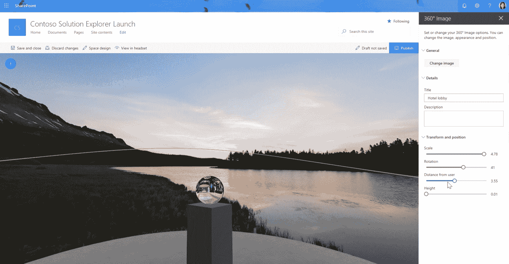

# Babylon.js 暗示微软元宇宙将基于网络

> 原文：<https://thenewstack.io/babylon-js-hints-that-microsoft-metaverse-will-be-web-based/>

如果元宇宙要成为现实，就需要开发和内容创作工具。“元宇宙”(目前是一个指 3D 互联网的模糊术语)也需要一个标准定义，随后是一套开发者和平台公司都可以努力实现的开放标准。迄今为止，在元宇宙炒作的早期，脸书——哦，我指的是*Meta*——一直试图顺应潮流。但其他大型科技公司也在元宇宙打转。听说微软是其中之一，你不会感到惊讶。

[Babylon.js](https://www.babylonjs.com/) 是基于 WebGL 和 WebGPU 构建的免费开源 3D 引擎，由两名微软工程师开发，于 2013 年首次发布[作为 IE11 浏览器的一部分](https://www.i-programmer.info/news/144-graphics-and-games/6243-babylonjs-a-webgl-game-engine-from-microsoft.html)。Babylon.js 不仅是开源的，它还支持网页版的元宇宙。直截了当地说，这是与 Meta 的一个区别点 Meta 还没有说它对元宇宙的设想是否是网络兼容的。

为了了解更多关于 Babylon.js 和微软对元宇宙的潜在愿景，我采访了 Babylon.js 的联合创始人之一 [David Rousset](https://www.linkedin.com/in/davrous/) 。作为一名技术工程师，Rousset 在过去的 15 年里一直在微软工作，工作地点位于法国巴黎附近。我是在阅读了[他上个月写的一篇博文](https://www.davrous.com/2022/04/12/from-gaming-to-metaverses-building-webxr-apps-with-babylon-js/)后遇到罗塞特的，他在博文中指出[WebXR](https://www.w3.org/TR/webxr/)——一种新兴的 3D 内容网络标准—“将是网络上 metaverses 的主要组成部分之一。”

## 巴比伦网:新的首页？

在我与罗塞特交谈之前，我对巴比伦游乐场(Babylon Playground)进行了一番修补，这是一款基于浏览器的工具，用于创建和编辑 3D 网络内容。该界面的页面左侧有 JavaScript 代码，右侧呈现的是生成的 3D 场景。我浏览了它主页上的一个教程，里面邀请你简单地通过调整代码来操作一个 3D 图形。我很惊讶这个过程如此简单——这让我想起了我在 20 世纪 90 年代使用 Dreamweaver 和 Microsoft FrontPage 等工具进行网站设计的早期实验。

巴比伦. js 游乐场

在与罗塞特的一次电话会谈中，我问他 Babylon.js 是否会成为现代版的 front page——即帮助开发者和内容创作者轻松进入元宇宙的工具？他回答说，这实际上是创建 Babylon.js 的主要动机，因为他自己当时并不熟悉 3D 开发。幸运的是，他的合作创作者大卫·卡图赫是。

“所以 Babylon.js 的制作主要是因为我，”鲁塞笑着回忆说。“我强迫另一个大卫考虑像我这样的人。我告诉他，我应该成为目标受众——比如，我足够优秀，可以学习，但我不是 3D 大师。”

在[的博客上，Catuhu 将 Babylon.js 描述为“我的‘宠物项目’，一段为了开发的乐趣而构建的代码。”他和罗塞特有理由为他们自 2013 年以来取得的进展感到自豪，因为如今 Babylon.js 正被用于一些项目，如微软的](https://www.catuhe.com/Retrospective/) [Sharepoint Spaces](https://www.exploresharepointspaces.com/) (“在任何设备上为每个人提供混合现实体验”)、IBM 的[五月花自主船体验](https://www.ibm.com/resources/cloud/mayflower-ship-experience/#/)，以及像 [Voxels](https://www.voxels.com/) 这样的新兴元宇宙/Web3 创业公司。

Sharepoint 共享空间

Rousset 继续解释说，Babylon.js“在引擎的某些部分固执己见，以使其易于使用。”换句话说:3D 开发工具还有其他种类。所以我问他 Babylon.js 与 Unity 的 3D 引擎有什么不同？

“我们的想法是为网络而生，”他回答说，意思是 Babylon.js 可以“在任何地方运行”另一方面，Unity 的主要目标是像游戏机和个人电脑这样的“功能强大的设备”。“所以与 Unity 相比，”他继续说道，“这显然是引擎的一个较低层。我们没有 Unity 生态系统拥有的所有服务和插件。但 Babylon.js 是开源的，这意味着我们有很多来自社区本身的贡献——现在超过一半的代码来自社区。”

## 定义元宇宙元与其他元

Babylon.js 是 web 原生的，并支持 WebXR 和 WebGPU 等新兴的 3D web 标准，这很好。我对脸书盗用“元宇宙”一词的抱怨之一是，没有迹象表明它打算支持网络。Meta 的首席执行官马克·扎克伯格将元宇宙比作移动互联网，顺便掩饰了两家公司(苹果和谷歌)开始主导移动应用生态系统的事实。

那么，微软对元宇宙的愿景是什么？

“我想说，我们仍在行业层面努力定义什么是元宇宙，”罗塞夫回答道。“显然，Meta 给出了他们的愿景，许多人认为这是唯一的愿景，但事实并非如此。我们将很快披露微软在元宇宙的愿景。但对我来说，网络需要成为其中的一大部分，因为你应该能够从一个元宇宙转移到另一个。”

按照 Rousset 的描述，未来的互联网用户应该能够从网络上的 3D 场景或网页(比如说用 Babylon.js 构建的)，通过虚拟现实中的链接，“传送到另一个元宇宙的另一个网站”需要澄清的是，这是罗塞特对元宇宙的愿景，而不是微软的官方路线。但是拥有 Babylon.js 这样的工具表明微软可能会将网络标准纳入其元宇宙战略。

公平地说，扎克伯格也说过，他希望元宇宙能够互通。问题是，还不清楚未来的 Meta 用户是否能够从 Meta“传送”到 web(反之亦然)。毫无疑问，Meta 将在适当的时候澄清技术细节。

## 有前途的元宇宙应用

抛开围绕元宇宙基础设施的问题不谈，罗塞特预计未来几年将会有哪些类型的应用程序使用 Babylon.js 这样的工具来构建？

他提到了游戏、电子商务和教育，这是 VR 和/或 AR 最常见的应用用例。他还谈到了一个有趣的新应用，名为 [Frame](https://appsource.microsoft.com/en-us/product/office/WA200003857?tab=Overview) ，据[的一篇博客文章](https://learn.framevr.io/post/bringing-the-metaverse-to-microsoft-teams)称，这是“将元宇宙带到微软团队”

面向微软团队的框架应用

“我真的很喜欢他们所做的，”罗塞特谈到创建 Frame 的 Virbela 公司时说，“因为，例如，使用 Babylon，你在 3D 场景中与你认识的人交谈，使用 [WebRTC](https://en.wikipedia.org/wiki/WebRTC) 作为每个人之间的一种交流。因此，它真正利用了网络所有的酷和先进的功能。”

从我在演示视频中看到的内容来看，Frame 最吸引人的地方在于，浏览器用户可以轻松地与 Oculus 设备上的用户进行互动。这种互操作性是元宇宙的梦想。

## 结论

虽然我们还不知道微软对元宇宙的具体设想(我们可能会在即将举行的 Build conference 上找到答案？)，令人鼓舞的是，像 Babylon.js 这样的微软项目和 Frame 这样的第三方应用程序正在 web 之上构建 3D 体验。

我们只能希望 Meta 也能效仿，因为 web 标准是我们实现可互操作的元宇宙的最大希望。

<svg xmlns:xlink="http://www.w3.org/1999/xlink" viewBox="0 0 68 31" version="1.1"><title>Group</title> <desc>Created with Sketch.</desc></svg>