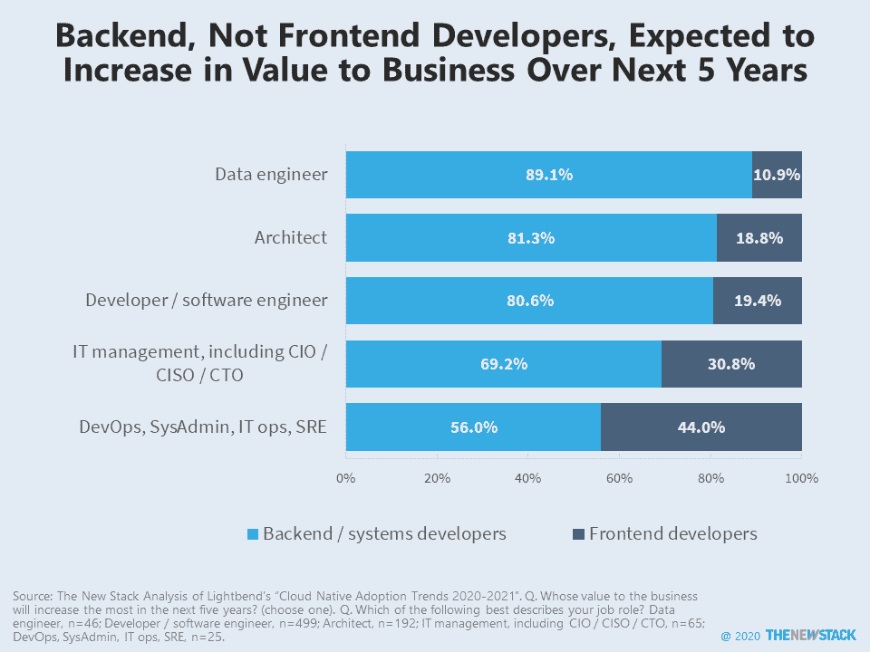

# 后端开发超越前端工作的声望

> 原文：<https://thenewstack.io/backend-development-surpassing-frontend-work-for-prestige/>

消费者和商业软件的前端已经失去了吸引力。还记得当一个伟大的用户界面或商业模式会产生收入和关注吗？现在，优雅的工程似乎是商业成功最重要的标准。

由 [Lightbend](https://www.lightbend.com/) 进行的[调查](https://info.lightbend.com/Cloud-Native-Adoption-Trends-Report.html)显示，相对于他们的前端同行，后端开发者的价值有望增加。89%的数据工程师和 81%的软件架构师认为后端开发者对企业的价值将超过前端开发者创造的价值。首席信息官、首席技术官和其他 IT 领导也了解系统开发人员带来了什么。然而，由于他们经常与其他业务领导互动，IT 管理人员也可能更好地理解前端开发人员如何在他们面向客户的互动中支持业务部门。

虽然一半的受访者是开发人员，但我们不知道他们是全栈、移动还是其他类型的软件工程师。也就是说，JavaScript 或 HTML 与前端开发人员有关，调查中经常使用这些技术的程序员更有可能欣赏前端的相对价值。

大多数工程师不想成为狭隘的人，即使他们主要专注于软件、数据、DevOps 或任何广泛的专业领域。也许曾经有一段时间，前端开发人员得到了比他们应得的更多的可见性，但那个时代已经过去了。至少目前，软件工程师认为他们正在设计的云、自动化、安全和其他类型的架构是未来产生商业价值的核心。如果这些开发者能够保持谦虚，并对[云本地驱动的数字化转型](https://thenewstack.io/no-easy-fix-cloud-natives-role-in-digital-transformation/)的局限性提供现实的预期，未来可能是光明的。

<svg xmlns:xlink="http://www.w3.org/1999/xlink" viewBox="0 0 68 31" version="1.1"><title>Group</title> <desc>Created with Sketch.</desc></svg>