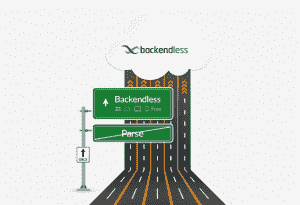

# Backendless 是个坏蛋 MBaaS

> 原文：<https://thenewstack.io/backendless-badass-baas/>

对于大多数前端开发者来说，移动后端即服务(MBaaS)听起来像是创业应用的天堂。将您的整个后端开发团队和基础架构替换为基于云、API 驱动的服务，您可以直接轻松地亲自驱动，这有什么不让人喜欢的呢？毕竟，当今移动开发市场的最大趋势是单枪匹马的开发者力争成为下一个 [Stardew Valley](http://stardewvalley.net/) (一款农业 RPG，在 2016 年 2 月推出后的两个月内销量超过 100 万份)。然而，许多雄心勃勃的独立企业缺乏管理 AWS 实例的能力，更不用说必要的后端 DevOps 技能——或者根本就不想去那里。

因此，MBaaS 应运而生，在过去几年中，它已经成为 IaaS/PaaS/Saas(基础设施/平台/软件)的最新版本。有来自像谷歌和亚马逊这样的大公司的产品，也有数以亿计的小公司。当然，随着脸书在 2013 年收购 Parse 和 PayPal 收购 StackMob，可以预见的土地争夺战已经到来。

然而，蜜月期很快就结束了:先是 [StackMob 在 2014 年](http://venturebeat.com/2014/02/12/paypal-closing-down-backend-service-stackmob-months-after-buying-it/)关闭，然后脸书[在今年早些时候关闭了 Parse](https://thenewstack.io/shuttering-parse-future-mobile-backend-service/) 。许多开发者艰难地发现了他们签署的“供应商锁定”合同在实践中的实际含义，在被迫的前客户中有相当数量的一朝被蛇咬十年怕井绳的抱怨。然而，仍然没有更简单的方法来进行移动应用程序开发。MBaaS 为市场提供了不可抗拒的效率和速度，因此开发人员仍然在购买后端服务——同时希望避免类似解析的陷阱。

总部位于达拉斯的 [Backendless](https://backendless.com/) 试图平息这些陷入困境的 mBaaS 之水，将自己定位为“一个 API 服务平台”(即将成为你身边的缩写:AaaS？).

“我们为任何开发客户端应用或服务的人提供开发和托管环境。定制服务可以通过 Java、PHP 或 Node.js 开发，”Backendless 创始人马克·皮勒说。“您编写代码并部署到 Backendless，我们从那里开始。”

Backendless 自动生成每个客户端独有的基于 REST 的 API 和原生库，在方法层面上提供从移动应用到服务的连接:“处理客户端和服务端之间的数据序列化、错误处理、方法调用，只要是你能想到的，我们都会为你处理，”皮勒继续说道。

对 [JavaScript](/tag/javascript/) 开发者特别有吸引力的是 Backend 的 SDK(软件开发工具包)，这是一个通过 [npm](https://www.npmjs.com/) 下载并安装的纯 JavaScript 库。还有一个可以和 Angular 2 一起使用的 Typescript 库。

根据皮勒的说法，Backendless 的库使得直接从你的客户端 JavaScript 代码中使用所有 API 成为可能，不管你使用的是哪种风格的 Javascript。

“REST APIs 在我们支持的每个级别上都可用，”皮勒说。“从数据持久性的角度来看，这是 Backendless 最强大的部分——动态数据脚本。所有数据变形都会自动发生，并以本机格式返回。

作为一个例子，皮勒描述了如何创建一个包含“姓名”和“年龄”属性的 person 对象“空白的应用程序，干净的石板，服务端没有存储任何东西。您编写您的 JS 代码并使用我们的 API 来持久化这些类的对象。当信息出现时，Backendless 将自动生成一个名为“person”的实例/JS 对象，该对象具有属性 name 和 age。一旦保存，任何客户端，包括但不仅仅是 JS，都可以访问该对象。从数据检索 API 来看，无论使用什么——PHP、iOS、Android——都以原生数据类型返回。如果 iOS 开始访问这个对象，这个实例将作为 objective C 或 Swift 到达 iOS。"

## 从零到英雄

此外，根据皮勒的说法，以防你的灵感应用程序成为下一个部落冲突，可扩展性是 Backendless 平台“内置”的服务功能。“不管你的客户端产生什么样的流量，不管有多少 API 调用，服务器都能够自动调整自己，”他说。

客户如何使用 Backendless 决定价格，[，有三种可能的安排](https://backendless.com/pricing/)。最基础的服务级别，叫做 Backendless Cloud，是免费的。用户访问运行在公司服务器上的集中平台。“无需下载，一切都是预先配置好的，进入门槛非常低，”这是皮勒的描述。

Backendless Cloud 是一种共享主机；不同开发人员开发的多个应用程序都运行在同一个安装上。不用担心，资源被适当地隔离了，所以一个应用程序看不到来自任何其他应用程序的文件，但是仍然存在这种托管，这在理论上可以降低响应时间。

还有内置的功能限制，比如只有 20 GB 的文件空间——嘿，你想要什么？价格是合理的，但是遇到各种上限的客户不一定需要升级到全面的专业服务。Backendless marketplace 中有一些“功能包”可以用来删除/增加限制或提供额外的自定义角色:如果您想延长业务逻辑执行的时间，有一个功能包可以满足您的需要。

第二层管理是无止境的。这提供了所有相同的后台无限平台服务，但完全启用/解锁，例如没有存储限制，并且在完全隔离的专用应用程序环境中运行。

“这样一来，Backendless 的所有业务流程(发送推送通知、执行任务、写入数据库)都是孤立运行的，因此没有共享资源。客户保证了正常运行时间，”皮勒解释道。价格是基于使用的:它随每秒的 API 请求数和所需的文件存储空间而变化。

最后，Backend Pro 提供了完整的后端平台，开发者可以在本地下载并安装，甚至可以选择云服务提供商，如 Google Cloud、Amazon 或 Azure。它完全不受限制，并提供 24/7 全天候监控、支持和服务。价格取决于客户的具体需求。

## “您的服务端应用商店”

然而，Backendless 不仅仅是你通常的通用服务的外卖容器。除了基本的(数据库、用户、文件、地理位置、消息)API，该公司还提供用户定义的服务。你为你独特的应用程序开发的每个服务都将由它自己的 API 来表示。

皮勒说:“最酷的是，你的服务的 API 将完全由 Backendless 自动生成，你可以通过 Backendless 的市场来管理这些 API，保护和分发它们。”。“所以我们实际上是一个 API 服务平台。”

这也是 Backendless 有别于许多其他 mBaaS 提供商的地方:服务范围只是旨在托管开发者定义的服务市场的更大环境的一部分。"

皮勒说:“你可以把它想象成开发者的服务端应用商店一些实体称自己为市场，但他们实际上只是服务目录，开发者仍然必须提供后端托管。我们的市场是我们服务平台不可或缺的一部分。即插即用。"

例如，皮勒说，想象一下，一个 Node.js 开发人员在构建自己的应用程序时，为图像缩放创建了一个非常好的算法。她可以通过 Backendless marketplace 发布该服务，其他 Backendless 客户可以选择采用和使用该代码，每月支付固定费用，或每次使用几分钱，或开发人员设定的任何其他价格。

目前，只有一个小市场处于测试阶段，提供 Backendless 自己的“功能包”以及一些通过公司审查过程的提交内容。当 Backendless 第 4 版在不到两个月后推出时，完整的市场就可以使用了。

“我们仍将审查服务，以确保没有恶意代码，如果是节点服务，一切都符合其他模块的依赖性，”皮勒说。“但在很大程度上，我们将依靠社区，通过评论和评级让人们根据反馈进行判断。”

这是否意味着 Backendless 将开放他们的源代码？“客户端代码是完全开源的，客户可以将他们的应用程序与之耦合。因此，无论你的应用程序包含什么，都是基于开源的理念构建的，”皮勒说。该公司尽可能支持开源；例如，CodeRunner——back endless 为用户开发和调试定制业务逻辑 ops 提供的一个漂亮的命令行实用工具——有自己的 GitHub repo，并且是开源的。“任何对它的工作方式感兴趣的人，任何认为他们可以做得更好的人，我们都会考虑来自社区的每一个请求，”皮勒说。

然而，该公司的后端服务端代码是封闭源代码的，这是 MBaaS 领域的标准——需要完全控制源代码的开发人员只能自己编写代码。“服务端，我们的核心服务，是私有的。毕竟，我们是一家企业。”

对于那些仍然感到解析后供应商锁定仇杀的受创开发人员来说呢？

“你的数据属于你，”皮勒说。“我们希望你永远不要离开，但如果你想离开，将所有内容导出是 Backendless 管理控制台的一部分。你可以随时随地重构整个应用。”

[https://www.youtube.com/embed/iVQbRLvWubw?feature=oembed](https://www.youtube.com/embed/iVQbRLvWubw?feature=oembed)

视频

Felix Russell-Saw 通过 Unsplash 提供的特写图像。

<svg xmlns:xlink="http://www.w3.org/1999/xlink" viewBox="0 0 68 31" version="1.1"><title>Group</title> <desc>Created with Sketch.</desc></svg>