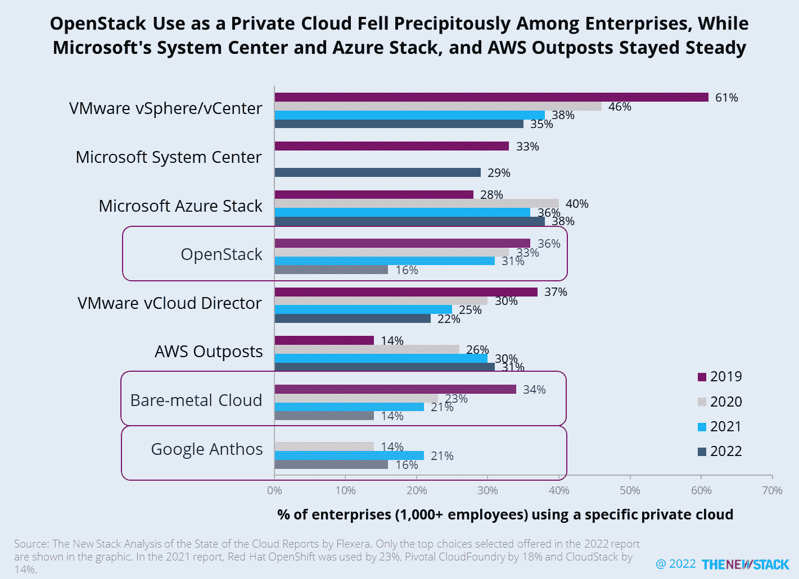
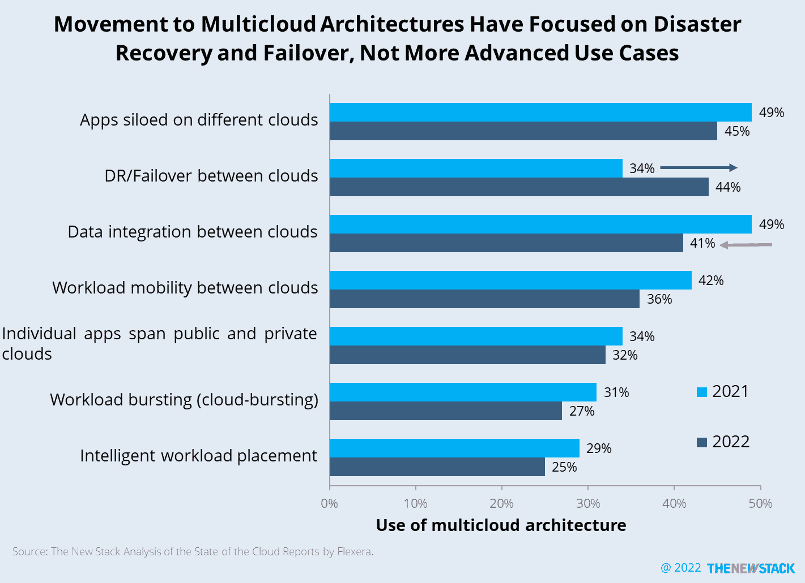
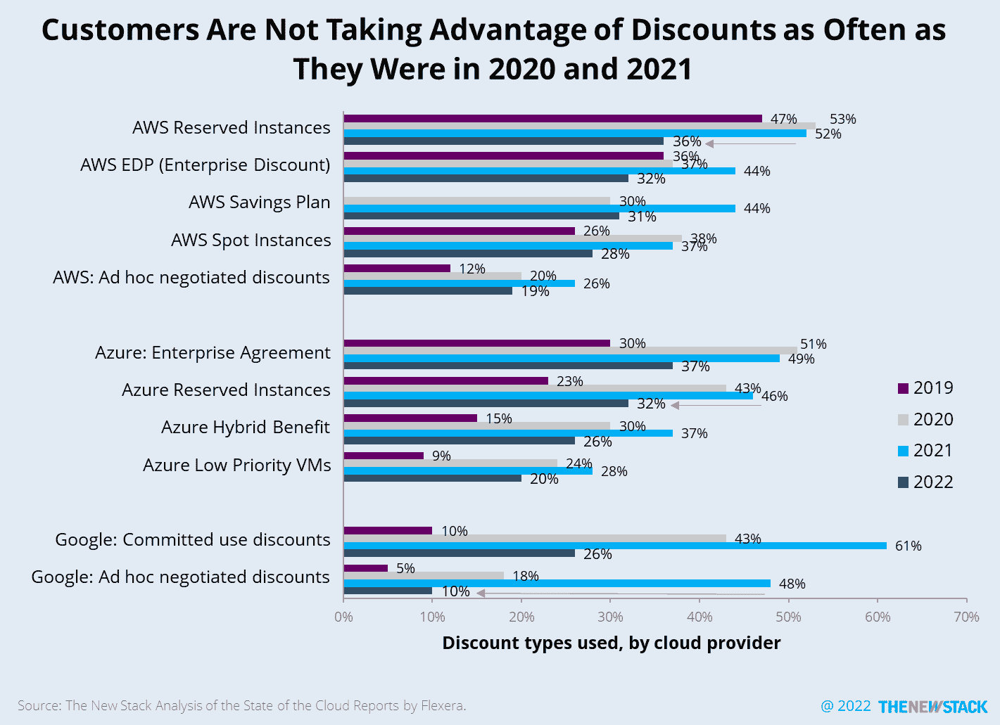

# 云计算的坏消息:OpenStack 使用量骤降，折扣枯竭

> 原文：<https://thenewstack.io/bad-news-for-cloud-computing-openstack-use-plummets-and-discounts-dry-up/>

根据 Flexera 的 [2022 年云状态](https://info.flexera.com/CM-REPORT-State-of-the-Cloud)报告， [OpenStack](https://www.openstack.org/) 在企业**、**中的使用从 2021 年的 31%下降到 2022 年的 16%。

裸机和[谷歌 Anthos](https://cloud.google.com/anthos) 也因公司使用私有云的方式而下跌。与此同时，[微软的 Azure Stack and Systems Center](https://azure.microsoft.com/en-us/overview/azure-stack/) 和[亚马逊网络服务](https://aws.amazon.com/?utm_content=inline-mention)在运行混合和多云架构的公司中保持着强势地位。

使用多云架构进行灾难恢复的比例从 34%跃升至 44%。出于其他原因，多云可能正在失宠。事实上，调查显示，所有四种类型的多云工具的采用率都有所下降，其中多云成本管理工具的采用率从 42%降至 25%。

如果客户使用这些工具，与两年前相比，他们利用折扣定价的可能性可能不会降低。2021 年，52%的 AWS 客户在 AWS 预订实例上获得折扣，现在只有 36%的客户获得折扣。2021 年，48%的谷歌云客户协商了临时折扣；2022 年，只有 10%。

<svg xmlns:xlink="http://www.w3.org/1999/xlink" viewBox="0 0 68 31" version="1.1"><title>Group</title> <desc>Created with Sketch.</desc></svg>