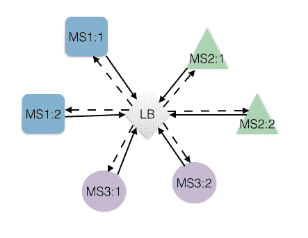
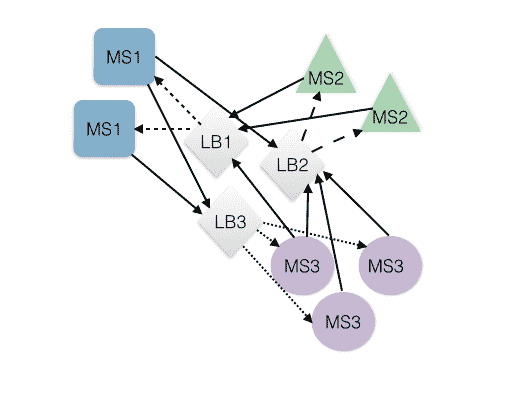
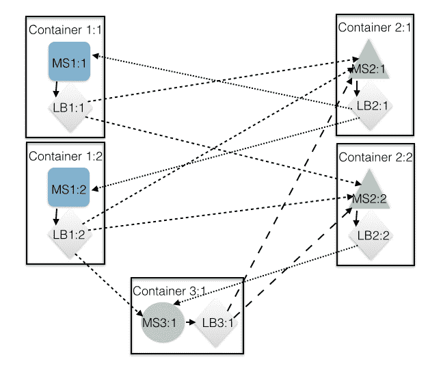
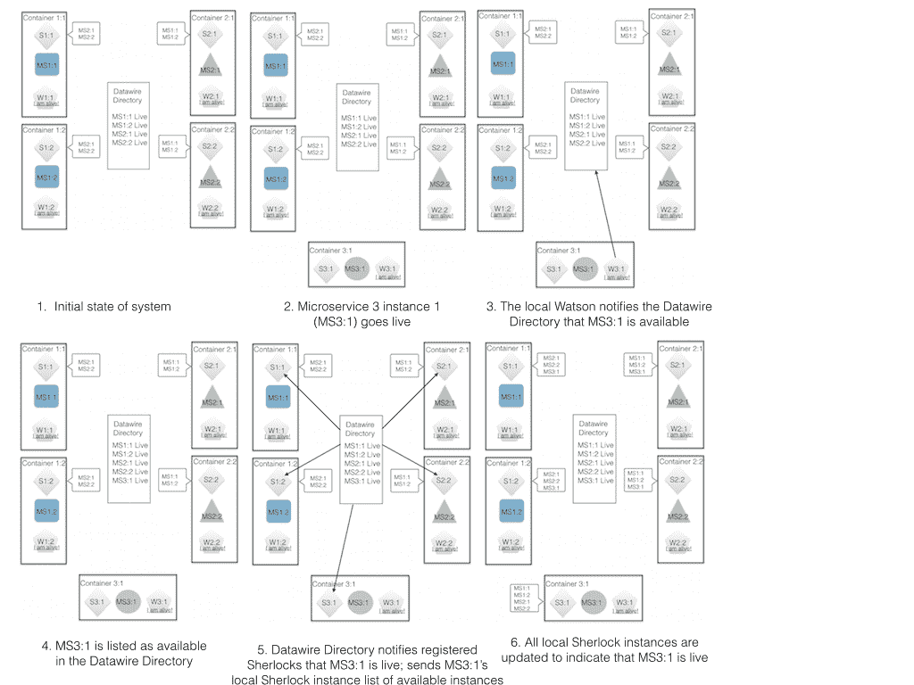
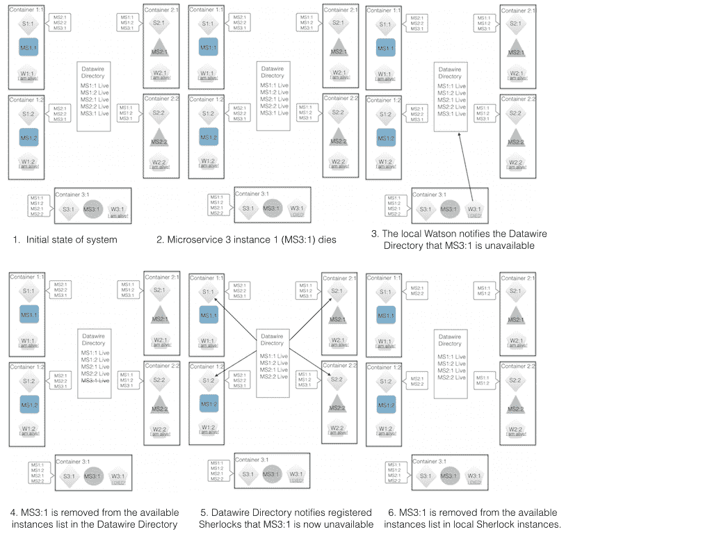

# 贝克街:用微服务的客户端负载平衡器避免瓶颈

> 原文：<https://thenewstack.io/baker-street-avoiding-bottlenecks-with-a-client-side-load-balancer-for-microservices/>

新的堆栈接受关于开源项目的帖子。Richard Li 是 Datawire.io 的首席执行官和创始人。贝克街是该公司的开源项目，其架构类似于 Yelp、Airbnb、Stripe 和网飞等公司广泛使用的架构。

在典型的微服务架构中，为了可用性和可伸缩性，部署了每个微服务的多个实例。这限制了单个微服务实例故障的影响，并保持了整体系统的可靠性。成功采用这种体系结构需要一种负载平衡机制，以确保传入的请求分布在所有可用的实例上，而不是在其他实例利用不足的同时使一些实例过载。

传统观点认为，中央负载平衡器是在可用的微服务实例之间分配请求的合适机制。这可以通过两种方式实现:对所有微服务的请求可以被发送到中央负载平衡器，以便在可用实例之间进行平衡分配(可能带有实时健康检查)，或者每个微服务可以有自己的中央负载平衡器，仅处理该微服务的请求。负载均衡的热门选择有 [HAProxy](http://www.haproxy.org) 和[亚马逊的弹性负载均衡器(ELB)](https://aws.amazon.com/elasticloadbalancing/) 。

对整个应用程序生态系统使用单个中央负载平衡器实质上复制了标准的整体架构，但是极大地增加了一个负载平衡器所服务的实例的数量。除了在整个系统出现故障时成为单点故障之外，这个负载平衡器还会很快成为一个主要瓶颈，因为每个微服务的所有流量都必须通过它，如下图所示，图中只显示了几个活动的微服务:

单一中央负载平衡器

为每种微服务类型使用一个独立的中央负载平衡器看起来像是标准 monolith 行为的逻辑扩展。在此模型中，每种类型的微服务的传入流量被发送到不同的负载平衡器，然后负载平衡器将每个请求路由到其循环中的下一个实例，如下所示:

每种微服务类型都有单独的中央负载平衡器

然而，更仔细的检查表明这种方法有一些缺点。首先，向系统添加(或移除)新的微服务或现有微服务的额外实例会带来大量开销。每个新组件在添加或删除时都需要注册和注销。此外，每种新类型的微服务都需要自己的中央负载平衡器，因此随着时间的推移，微服务环境将承受数十个负载平衡器的负担，每个负载平衡器都需要管理和维护。

此外，虽然为每个微服务类型使用一个中央负载平衡器可能不会为整个应用程序增加一个单点故障，但它确实会为每个微服务类型增加一个单点故障。如果负载平衡器或运行它的机器以某种方式出现故障，整个微服务将变得不可用，如果该服务对整个系统的运行至关重要，这实际上可能会导致整个系统不可用。这在某种程度上可以通过使用几个彼此协调的中央负载平衡器来处理，但是这增加了协调的额外复杂性，并且使系统必须维护的负载平衡器的总数加倍(或更多)。

中央负载平衡器的另一个问题是可伸缩性。如上所述，使用微服务的环境可能有几十个组件协同工作，每个组件都有多个实例。管理组件间通信所需的网络连接数量呈指数增长。虽然只为一个微服务处理流量的中央负载平衡器不太可能成为真正的瓶颈，但随着其微服务的可用实例数量的增加，它肯定会增加流失或消耗越来越多的资源。

## 客户端负载平衡

Baker Street 采用了不同的方法，将负载平衡推给每个客户端。在这种方法中，负载平衡是完全分布式的，每个客户端直接负责将请求路由到可用的微服务。注意，在该模型中，每个本地负载平衡器处理其本地实例的所有流量，而不管它与哪个或多少个其他微服务通信；这颠倒了中央负载平衡器模型，在该模型中，来自任何地方的请求都被发送到负载平衡器，然后负载平衡器将它们发送到单一类型的微服务:

【T2

使用一系列相互协作的客户端负载平衡器为微服务环境提供了几个好处:它简化了服务管理，它根据可用实例的数量自动扩展系统，并且它消除了所有单点故障。

特别是，Baker Street 创建了一个更简单的管理模型:微服务实例和本地负载平衡器之间存在 1:1 的映射(不需要中央负载平衡器！)，这意味着每个微服务都可以使用适用于大多数服务的默认配置，以完全相同的方式进行配置和设置。此外，分布式架构呈现线性规模:每个新的微服务实例都增加了新的负载平衡能力。因此，系统是自我供应的，并且自动提供处理服务的可用实例所需的容量。最后，通过在本地存储每个负载均衡器实例的可用性信息，Baker Street 确保所有活动的微服务实例仍然可以路由流量，即使某些微服务实例或 Baker Street 组件实例已经关闭(有关这方面的更多详细信息，请参见下面的架构讨论)。

## 贝克街建筑

为了充当本地负载平衡器，Baker Street 需要跟踪大型系统中所有微服务实例的可用性和位置。这是使用三个组件完成的:

*   **夏洛克:**一个基于 HAProxy 的路由系统，在本地运行你的微服务的每个实例，以确定来自那个实例的连接应该去哪里。
*   **Watson:** 一个健康检查器，本地实例对应于应用程序的每个实例。
*   **Datawire Directory:** 一种轻量级的全球服务发现机制，它从每个 Watson 实例接收可用性信息，并根据需要将可用性更改推送到本地夏洛克实例。

在微服务的新实例被提供之后，它的 Watson 服务在它上线时进行注册，并发送消息通知 Datawire 目录。Datawire 目录向已注册的夏洛克实例发送“它是活动的”消息，让它们知道新实例可用于处理请求。

类似地，当一个实例关闭时，Watson 或者告诉 Datawire 目录该实例现在不可用，或者，如果整个容器关闭，Datawire 目录注意到它与 Watson 实例的连接丢失，并将相关的微服务实例标记为不可用。然后向注册的夏洛克实例发送消息，告诉它们停止向该微服务实例发送流量。

想要连接到另一个微服务的微服务首先本地连接到夏洛克。夏洛克代理从本地微服务到可用微服务的连接，以处理请求。它知道将请求发送到哪里，因为它保存了可用实例的最新列表，通过来自中央 Datawire 目录服务的消息进行管理，该目录服务包含两个内容:

1.  将虚拟地址映射到物理地址的可用路由表。
2.  对接收更新感兴趣的客户端节点列表。

当贝克街第一次部署时，这两个列表都是空的。如上所述，每个本地 Watson 健康检查实例在每个活动服务第一次上线时向 Datawire 目录发送每个活动服务的虚拟和物理地址，并且如果后续健康检查失败，则发送通知以移除信息；这些消息填充目录列表，并确保它随着时间的推移保持最新。每个本地夏洛克负载平衡器都包含 Datawire 目录的地址及其自己的本地可用路由列表，该列表在实例首次启用时为空。每个夏洛克向数据线路目录注册以接收更新，并且每当从 Watson monitor 接收到可用路由的改变时，数据线路目录将这些改变推送到每个注册的夏洛克。

这种发布/订阅架构最大限度地减少了与健康和路由相关的消息，同时确保在系统健康发生变化时能够快速更新。该系统也是自我管理的:每个夏洛克和沃森自动向中央目录服务注册。最后，每个新的微服务实例都会增加额外的负载平衡能力。

此外，因为每个本地夏洛克实例维护其自己的可用服务器列表，所以即使 Datawire 目录组件关闭，系统也能保持运行；在这种情况下，唯一的问题是没有收到关于实例健康状况的更新，也没有对其采取行动。这意味着向无法处理流量的失效实例发送流量的可能性略有增加。

贝克街也消除了全球失败的所有其他单点。如果本地微服务实例关闭，但其容器保持活动，那么其对应的 Watson 实例将通知中央目录将其从轮换中移除，并且所有负载平衡器将被通知从其可用节点列表中移除该实例。如果整个客户端环境停止运行，Watson discovery 服务可能没有机会直接通知 Datawire 目录，但是两者之间的消息传递链接也会停止运行，目录服务会通知相关的夏洛克系统实例停止运行。基本上，不管在什么情况下，即使有一些连接丢失，系统作为一个整体应该保持正常工作，因为大多数实例仍然工作，并且仍然可以访问它们的本地负载平衡器，其中包含的信息仍然是最新的。

反对使用客户端负载平衡的一个可能的理由是跨整个全局实例网络平衡服务使用的有效性。每个负载平衡器将在整个系统中或多或少地均匀分布连接，随着时间的推移，全局流量应该是均匀分布的，但理论上，没有什么可以阻止每个本地负载平衡器随机决定将其下一个连接发送到与系统中所有其他负载平衡器相同的实例，并使该实例过载。这种情况发生的几率很低，尤其是在大型分布式系统中，实际上这种情况似乎不会发生。如果您特别担心这种可能性，那么通过设计本地负载平衡器使用的服务发现，使负载平衡器稍微偏向附近的实例，就很容易解决这个问题。

贝克街使用的方法已经在许多云部署中使用，包括 Airbnb 的 [SmartStack](https://nerds.airbnb.com/smartstack-service-discovery-cloud/) 和 Yelp。Baker Street 建立在这些架构之上，但通过使用合理的默认值，采用简化的安装和配置流程，强调简单性和可用性。其结果是一个高效的负载平衡器，可靠、自动扩展且易于管理。

要了解更多信息，请访问[贝克街](http://bakerstreet.io)或 [GitHub 知识库](https://github.com/datawire/bakerstreet)亲自体验一下。

<svg xmlns:xlink="http://www.w3.org/1999/xlink" viewBox="0 0 68 31" version="1.1"><title>Group</title> <desc>Created with Sketch.</desc></svg>