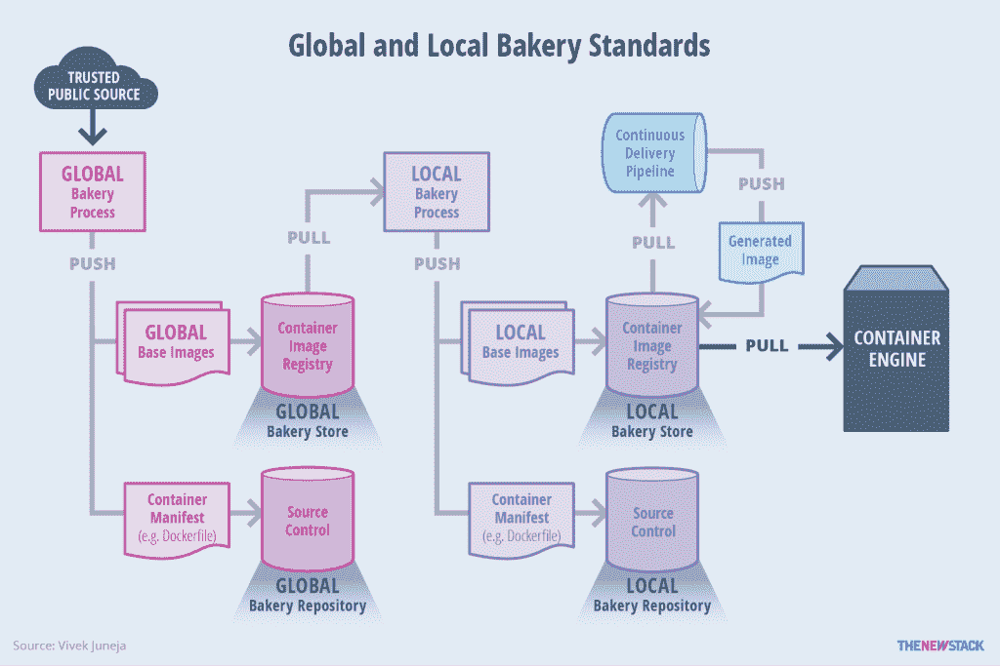
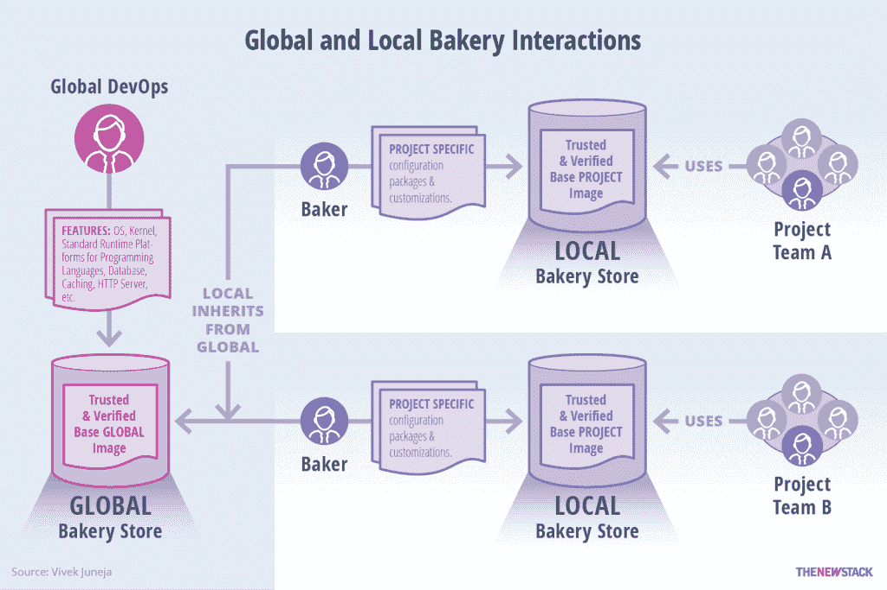

# 构建容器图像和微服务的烘焙模型

> 原文：<https://thenewstack.io/bakery-foundation-container-images-microservices/>

采用[微服务](/category/microservices/)和容器的一个基本要素是不可变变更以容器映像的形式打包。这种容器映像格式利用了连续交付(CD)的传输系统，并允许比虚拟机(VM)映像或 AWS 术语中的[亚马逊机器映像(AMI)](http://docs.aws.amazon.com/AWSEC2/latest/UserGuide/AMIs.html) 更好的模型。容器映像格式是新的可执行文件或构建资产，只需构建一次，就可以在任何兼容的微服务基础设施上运行。

将机器映像作为可移植实体的采用通常归因于自动化策略的兴起，这些策略允许开发团队将映像作为部署工件来生产。这始于 AWS AMI 格式，从那时起，生态系统中出现了各种各样的工具，它们通过承诺一种快速、可靠和简单的方式来生成可再分发的机器映像，从而简化了开发人员的生活。这也引发了一场关于在基础设施上分发应用程序的最佳方式的辩论:是将机器和代码的所有方面隐藏到工厂制作的保持不变的映像中，还是允许一定程度的自我意识和自我配置。

构建机器映像的方法之一是将它与应用程序代码捆绑在一起，作为构建过程的输出。在实例化容器实例时，可以将特定于应用程序的参数传递给映像，这样就可以对映像进行配置。这些参数可以用于服务发现和其他特定于应用程序的切换。每当需要对应用程序或应用程序拓扑进行任何更改时，这种方法都要求重新构建和重新部署所述映像。

[cyclone slider id = " ebook-3-赞助商"]

构建机器映像的另一种方法坚持创建一个最小的机器映像，只有在基础设施、运行时或拓扑结构发生变化时才构建。对于大多数代码更改，不会重新构建新的机器映像。从预先存在的机器映像中产生新的容器实例，然后通过引导脚本或通过在机器实例上运行的代理在其上部署代码。这种方法避免了连续生成新机器映像的需要，而是让新创建的容器实例自己发现和获取更改。这要求容器实例部分的自治行为。

然而，两种方法之间的区别在于机器映像构建过程的范围。

值得注意的是，在这两种方法中，共同的方面是在传播变更时不断创建新的基础设施实例，而不是依赖于长期运行的基础设施。然而，两种方法之间的区别在于机器映像构建过程的范围。

网飞记录了其内部[创建烘焙机器映像](http://techblog.netflix.com/2013/03/ami-creation-with-aminator.html)的过程，并在前不久开源了 [Aminator](https://github.com/Netflix/aminator) 工具。像哈希公司的[打包机](https://www.packer.io/)这样的工具，在现代运输管道中已经变得司空见惯。主要的 PaaS 供应商，比如 IBM Containers，拥有完整的工具集来管理和创建容器化环境中的映像。像 CloudNative.io 这样的风险企业为组织提供了一个名为 Bakery 的完整 AMI 生命周期管理工具，他们正在推销这种类似于网飞的功能。

机器映像有了新的含义，超越了通常对虚拟机映像的引用，如虚拟桌面基础架构(VDI)或 AMI。容器图像是机器图像含义的新补充。这一增加大大加快了速度，更加轻量级，并在普通开发人员的工作流程中取得了更多进展。与以前的版本相比，容器映像对开发人员来说更为明显，比如机器映像，它主要是基于机器的操作工具包的一部分。

## 定义面包店的模式

面包店是一种形式的基础设施实体，体现了获取、构建和发布机器映像的过程，以允许工作代码的可重复部署。面包店的输出是一个烘焙的映像，用于剥离任何兼容基础架构中的机器实例(虚拟机或容器)。兼容的基础设施以支持这些烘焙映像的部署的管理程序或容器引擎的形式表示所需的环境。

当烘焙图像的输出与各种类型的基础设施兼容时，一种形式的面包店表现出色，减少了为每种类型定制图像的需求。容器的兴起代表了标准化的形式，这将使面向容器的烘焙模型更有意义和更广泛。

在任何微服务和容器的故事中，容器映像的生成和维护都占有重要的位置。因此，成功的微服务和容器采用离不开对容器映像各个方面的优雅处理，包括:

*   基础图像的选择。
*   跨多租户/多项目的映像共享和隔离。
*   集装箱图像确认和验证。
*   容器图像工作流。
*   测试容器图像。
*   容器图像存储和生命周期。
*   容器图像到期和折旧。

所有这些都是面包店战略和组织实施的组成部分。

### 创建全球和本地烘焙标准

烘焙模型的故事始于开发过程中引入的适当基础图像的选择。最有可能的是，这些基础映像的选择将基于映像的大小和对分发的信任。Alpine Linux，以及源自该版本的映像仍然是基本映像的主要选择。值得注意的是，所选的每个基础图像必须附有历史记录，以确保图像的来源可以得到验证。

在一个有多个项目和不同团队的组织中，让每个团队选择他们自己的基础映像可能是有害的。构建可共享和标准化的可信基础映像阵列是一种适合大规模组织的方法。全球面包店是一个组织中的逻辑实体，专注于基础容器映像的标准化、治理和生命周期。

[cyclone slider id = " ebook-3-赞助商"]

这些共享的基础映像可以根据每个团队的需求进一步定制，并引入到开发工作流中。从团队的角度来看，重点不在于团队间的共享，而在于让容器映像作为可部署的基础。我把这个概念称为本地面包店——一个从全球面包店继承基本形象的实体，需要在单个团队的规模上工作。

全球面包店和本地面包店模型中涉及的各种系统的工作流程，展示了连续交付流程和容器引擎如何从工作流程中抽取。

Global Bakery 的输出是一个标准的基本映像池，每个映像都经过验证，可以添加到基本映像注册表中。然后，面向服务的组织中的所有团队都可以使用这些图像。

本地面包店的输出是基础映像，该映像可针对单个服务堆栈进行定制，并可针对服务进行部署。全球和本地面包店都使用持续集成(CI)来构建和测试容器映像，然后再将它们发送(或部署)到注册中心。

简单的标记策略有助于确保容器图像易于搜索和识别。通常，CI 服务器生成的构建 ID 用作获得标记的基础。全球和本地面包店实体都可以使用这个前提来避免混淆“最新”标签。

在烘焙模型流程中进入基础映像的功能范围，包括促进多个本地烘焙团队的能力。

## 发现和实施烘焙模式实践

### 使用图像进行测试和安全保护

测试基本映像对于容器的成功采用至关重要。基础映像将在整个基础设施中传播，并将被开发人员用于进一步的定制和扩展。行为驱动开发可以用来测试自动化基础设施。

通过使用像 [Serverspec](http://serverspec.org/) 这样的服务，您可以创建 rspec 测试来检查给定的服务器是否配置正确。在 CI 过程中，可以针对从基本映像派生的容器实例运行 Serverspec 脚本。这种形式的脚本允许根据容器运行时的一组规定的配置状态进行验证。

### 渗透测试和安全评估

基础映像及其周围的工作流为执行自动化安全评估提供了良好的基础。像 [Twistlock](https://www.twistlock.com/) 这样的工具，以及像 Docker 的 Project Nautilus 这样尚未公开的计划，可以与 CI 和部署管道集成，用于烘焙映像，并可以执行连续扫描，以确保映像的安全。如果发现并修复了漏洞，可以从全球面包店生成新的基础映像，然后传递给各个本地面包店。然后，每个本地面包店利用连续交付(CD)管道，根据更改后的基础映像发布新容器。这样，一旦在基础映像中引入修复，快速修复就可以生效。

### 避免了秘密烘烤的需要

容器的生产部署中一个常见的重复实践是存储机密，比如在容器实例中运行的服务所需的凭证和认证密钥。面包店可以灌输一种管理秘密的通用实践，这是运行在容器内部的服务不时需要的。作为治理流程的一部分，全球面包店可以将关键管理解决方案(如 Hashicorp 的 [Vault](https://www.hashicorp.com/blog/vault.html) 或 Square 的 [Keywhiz](https://square.github.io/keywhiz/) )集成到基础映像中，从而为食物链下游创建的所有容器映像提供一个公共基础。这也将消除每个服务团队为经营自己的本地面包店而重新发明轮子的需要；它允许存储和访问秘密的正确实践制度化。

### 烘焙模型中的配置管理

在大量采用容器之前，像 Ansible、Chef 和 Puppet 这样的配置管理(CM)工具有助于将一组给定的机器聚合成所需的配置。然而，随着容器图像的出现和它们极小的足迹，这些假设对 CM 工具的产生没有什么价值。因为容器图像需要是轻量级的，所以更重的 CM 方法听起来像是反模式。

然而，CM 工具确实有一个有序的编排安装的方法。在某些情况下，映像是用 CM 工具构建的，并且是通过一种 Chef-solo 模式提供的，不需要任何外部 CM 服务器。这两种范式的融合或分歧取决于容器引擎在未来几年中在配置管理方面采取的策略。

### 通过自动化实现全球烘焙

如前所述，Global Bakery 是一个逻辑实体，通常用于生成可由组织中的每个服务团队采用的共享基础容器映像。全球面包店可以实现为一组自动化工具，存在于本地面包店和托管在 Docker Hub、Quay.io、IBM Containers 或其他注册服务上的公共容器映像之间。自动化全球面包店必须在组织环境中执行以下操作:

*   验证来自源的基础映像，以检查是否存在有效的历史记录。
*   根据图片大小和社区实力(指使用 Docker pulls 图片的人数)比较基本图片的备选方案。
*   执行安全评估和漏洞扫描。
*   创建一个新的结果容器清单(Dockerfile ),它将为可调试性、监控、日志流和秘密存储等安装管理工具。
*   将元数据添加到容器清单中的结果基本映像。
*   将生成的容器清单推送到版本控制系统，将生成的图像推送到注册中心，即全球面包店。这种方法被各个团队进一步使用，每个团队经营自己的本地面包店。

### 淘汰旧的基础映像

基础映像在整个生命周期中会经历多个版本，最终会被废弃。特定全球基础映像的新版本的发布可以传达给各个团队，以便可以对本地映像进行更改。或者，每个服务团队的 CI 基础设施可以在每次迭代中检查基础映像的新版本，如果旧版本仍在运行，则可以触发警告。

## 面包店模式的未来之路

面包店模型可能是微服务基础设施中一个非常重要的实体。有一些新举措，比如围绕 unikernels 改进的容器工作流和对 Docker 图像 id 的更改，有望使面包店模型变得更加有用和相关。如果有效实施，面包店可以让服务团队变得更加独立，并实现微服务的承诺。

<svg xmlns:xlink="http://www.w3.org/1999/xlink" viewBox="0 0 68 31" version="1.1"><title>Group</title> <desc>Created with Sketch.</desc></svg>