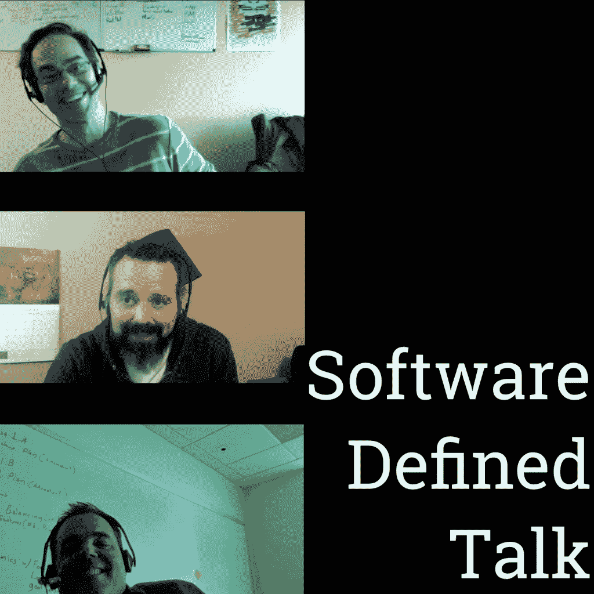

# 软件定义的对话:Joyent、LinkedIn 和 Habitat

> 原文：<https://thenewstack.io/bankers-smokin-ls-hot-tub-software-defined-talk-66/>

2016-06-22 06:32:04

软件定义的对话:Joyent、LinkedIn 和 Habitat

# 软件定义的对话:Joyent、LinkedIn 和 Habitat

Jun 22nd, 2016 6:32am by [Michael Coté](https://thenewstack.io/author/cote/ "Posts by Michael Coté")

随着本周的两项意外收购，我们有很多协同效应可以在本周的软件定义的谈话播客中讨论。我们报道了三星[收购](http://fortune.com/2016/06/16/samsung-buys-joyent/) Joyent，微软[收购](http://www.nytimes.com/2016/06/14/business/dealbook/microsoft-to-buy-linkedin-for-26-2-billion.html?_r=0) LinkedIn。然后，我们讨论最近的一篇文章，试图解释私募股权收购科技公司的情况。然后，我们讨论我们期待已久的大厨的大新闻:宣布[栖息地](https://thenewstack.io/chef-offers-habitat-application-automation-alternative-bimodal/)。

<https://traffic.libsyn.com/cote/SoftwareDefinedTalk066.mp3?_=1>

[https://traffic.libsyn.com/cote/SoftwareDefinedTalk066.mp3](https://traffic.libsyn.com/cote/SoftwareDefinedTalk066.mp3)

听上面的，[订阅 feed](http://feeds.feedburner.com/SoftwareDefinedTalk) (或者 [iTunes](https://itunes.apple.com/us/podcast/software-defined-talk-podcast/id893738521?mt=2) )，或者直接下载 MP3。

# 显示注释:

## 三星收购 Joyent

## 微软收购 LinkedIn

*   [微软发布的新闻稿](http://blogs.microsoft.com/firehose/2016/06/13/microsoft-to-acquire-linkedin/)。
*   M&A 协同理论搞什么鬼；
    *   [Slideshare 扩展到所有办公格式](https://twitter.com/monkchips/status/742379875667955713)。
    *   [登录 LinkedIn + AD = SSO won](https://twitter.com/cloud_opinion/status/742383636507328513) :“通过使用网络来增强微软超过 10 亿客户生态系统的社交和身份层，大规模扩展 LinkedIn 的覆盖范围和参与度。想想像 LinkedIn 的 graph 交织在 Outlook、日历、Active Directory、Office、Windows、Skype、Dynamics、Cortana、Bing 等等中的东西。”
    *   LinkedIn 上的 4.33 亿专业人士(来自[微软内部备忘录](http://www.recode.net/2016/6/13/11921064/microsoft-ceo-memo-linkedin-ceo-memo))。
    *   虽然是 T21，但可能都是同一批人。
    *   “随着我们 Office 365 商业和动态业务的新增长，这笔交易对于我们重塑生产力和业务流程的大胆雄心至关重要。”(微软 CEO，来自[微软内部备忘录](http://www.recode.net/2016/6/13/11921064/microsoft-ceo-memo-linkedin-ceo-memo)。)
        *   广告和人工智能环境:“这种结合将使新的体验成为可能，例如 LinkedIn 新闻订阅，它根据你正在进行的项目提供文章，Office 建议通过 LinkedIn 联系一位专家，以帮助你完成一项任务。随着这些体验变得更加智能和令人愉快，LinkedIn 和 Office 365 的参与度将会增长。反过来，通过个人和组织订阅以及有针对性的广告，将会创造新的盈利机会。”(微软 CEO，来自[微软内部备忘录](http://www.recode.net/2016/6/13/11921064/microsoft-ceo-memo-linkedin-ceo-memo))
    *   LinkedIn 自 2008 年 12 月以来的增长:“我们的团队从 338 人增长到超过 10，000 人，我们的成员从 3，200 万美元增长到超过 4.33 亿美元，我们的收入从 7，800 万美元增长到超过 30 亿美元。”([微软内部备忘录](http://www.recode.net/2016/6/13/11921064/microsoft-ceo-memo-linkedin-ceo-memo))。
    *   备忘录中的其他内容包括:Lydia 在微软应用程序中的内联培训；微软应用中的付费内容(a la Spiceworks)；人力资源和招聘。
*   交易公关甲板:相当好。我可以看到社交图和 LinkedIn 中的所有“语义 web sit ”,与 MSFT 的资产结合得很好。
*   [一个接广告，不喜欢办公室角度，造成隐私，但是哦等等:谷歌应用和 Gmail](http://marketingland.com/microsofts-linkedin-acqusition-represents-huge-opportunity-bing-ads-180572) 。
*   “微软可以改进 LinkedIn”:微软为那些不得不用电脑做无聊事情来赚钱的人设计。这是一家朝九晚五的软件供应商。
*   [之前的大手笔收购](https://en.wikipedia.org/wiki/List_of_mergers_and_acquisitions_by_Microsoft#Acquisitions) : [诺基亚 72 亿美元](http://www.theverge.com/2013/9/2/4688530/microsoft-buys-nokias-devices-and-services-unit-unites-windows-phone)，Skype 85 亿美元，Xamarin 亿美元。
*   从 [451 米&一个覆盖范围](https://451research.com/report-short?entityId=89397&type=mis&alertid=78&contactid=0033200001wgKCKAA2&utm_source=sendgrid&utm_medium=email&utm_campaign=market-insight&utm_content=newsletter&utm_term=89397-Microsoft+connects+with+LinkedIn+with+%2426bn+acquisition):
*   I-banker 的东西:“微软将以每股 196 美元的价格收购 LinkedIn，比交易宣布前的交易价格高出 50%，尽管远低于 11 月份每股 250 美元的价格。该价格标签对 LinkedIn 的估值为 8.2 倍的往绩收入。
*   “公司(微软)必须找到新的差异化途径。与 LinkedIn 的集成提供了难以复制的潜在功能。两家公司合并后，除了运营合并后的公司带来的其他好处之外，LinkedIn 的会员网络以及由此产生的数据将有多种方式用于改进微软的 Office 和 Dynamics 应用程序。”
*   “LinkedIn 为招聘人员提供的工具占其今年第一季度 8.6 亿美元收入的 58%[因此，34.4 亿美元的运营成本]。当结合从 Lynda.com 收购的教育材料，HCM 工具占销售额的 65%。面向营销人员的工具和高级订阅(包括面向销售团队的产品)各占不到 20%的业务，是业务增长最慢的部分。”
*   “微软是世界上最大的软件开发商，销售额约 1000 亿美元，市值 4000 亿美元。”
*   我的银行家们欢欣鼓舞！
*   [蒂姆·安德森无意中为 CRM/HCM 做了一个很好的案例](http://www.itwriting.com/blog/9393-microsoft-and-linkedin-some-early-thoughts.html)。

## 私募股权收购科技公司

## 重大新闻。Chef.io

*   [栖息地](https://habitat.sh)。
*   Habitat 以应用程序本身为中心进行应用程序配置、管理和行为，而不是应用程序运行的基础设施。
*   Habitat 由规划和构建系统、管理程序、管理程序上报告包状态 HTTP 接口、仓库、通过管理程序环传播谣言的通信模型以及许多其他组件组成。
*   [查看代码](https://github.com/habitat-sh)。
*   [不看镜头，也不笑](http://www.wired.com/2016/06/chef-just-took-big-step-quest-make-code-work-like-biology/)。
*   亚当向内森扔鸡蛋。

## 奖励链接！不包括在节目中

### 企业想从谷歌的云中得到什么

*   [谷歌，简而言之，需要学会无趣](http://readwrite.com/2016/06/07/enterprise-wants-googles-cloud-pl1-2/)。
*   … [根据 Gartner 分析师 Lydia Leong](https://twitter.com/cloudpundit/status/713825582719582209):“Azure 几乎总是在技术评估上轻易输给 AWS，但你猜怎么着？他们仍然赢得交易。商业不仅仅是技术。”这是一个多么奇怪的线程！
*   “Greene 还在利用她的 VMware Rolodex，与 SAP SE、微软和甲骨文等大型企业竞争对手进行谈判，以使他们的更多产品进入谷歌云。这是一些大公司的必备软件，它们需要这些提供商提供的预打包软件来运营业务。如今，谷歌的云上没有甲骨文或 SAP 的产品。微软和甲骨文拒绝置评，而 SAP 证实了早期的谈判。杰克·克拉克的彭博作品《T1》。

### 作为互操作性目标的 Docker、Kubernetes 和 Mesos

### 苹果公告

## 推荐

Docker 和 Joyent 是新堆栈的赞助商。

<svg xmlns:xlink="http://www.w3.org/1999/xlink" viewBox="0 0 68 31" version="1.1"><title>Group</title> <desc>Created with Sketch.</desc></svg>

TNS 的所有者 Insight Partners 是新堆栈 Docker 的投资者。

新堆栈更新一份时事通讯摘要，对本周最重要的新闻进行分析&。

新的堆栈不会出售您的信息，也不会与无关的第三方共享。如果继续，您同意我们的

[Terms of Use](/terms-of-use/)

和

[Privacy Policy](/privacy-policy/)

.