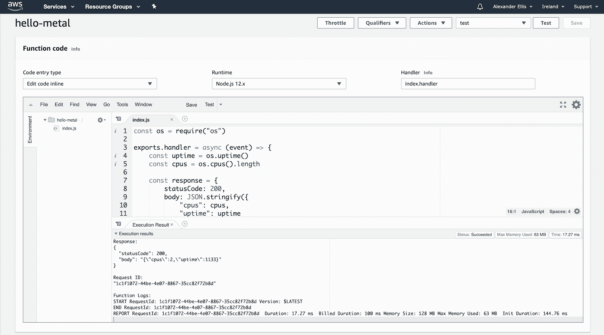
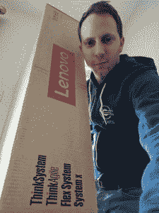
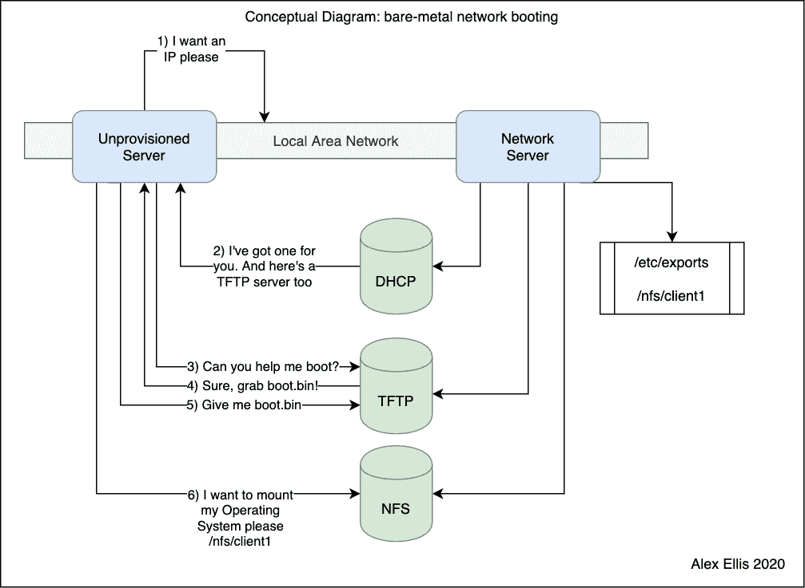

# 云原生世界中的裸机

> 原文：<https://thenewstack.io/bare-metal-in-a-cloud-native-world/>

听到“裸机”这个词，你会想到什么？对我来说，它让我想起一些非常有形的东西，一排排用彩色电缆连接在一起的服务器，大声旋转的风扇被锁在地下室或仓库里。

作为[云本地计算基金会](https://www.cncf.io/)的大使，我大部分时间都在堆栈的更高层度过，在“第 7 层”(应用程序)和“第 8 层”(人员)。我已经习惯于使用 API 和工具，如 [Terraform](https://www.terraform.io/) 来获得我需要的计算。我职业生涯的决定性部分之一是说服人们[忘记服务器](https://www.openfaas.com/)。

那么裸机与“原生云”有什么关系呢？如果你是这个领域的新手，你需要了解什么呢？

我让我在 Twitter 上的粉丝分享他们最喜欢的裸机工具，结果产生了一个精选列表:[棒极了](https://github.com/alexellis/awesome-baremetal)裸机。请继续阅读，了解裸机与原生云的比较，以及相关的一些概念和管理员面临的挑战。

## 云原生地平线

当涉及到部署一段代码时，让我们说一个 REST API——没有什么比前往您的 AWS 仪表板，将代码粘贴到文本框中，并从 AWS Lambda 看到您的代码以每秒计费和自动缩放的方式执行更简单的了。Lambda 函数的整体接口从一开始就变化很小，这使得它成为一个相对稳定的工作平台。

图为:我在 hello-world 上展示了一个 Lambda 函数的 CPU 计数和系统正常运行时间。

[AWS Lambda](https://aws.amazon.com/lambda/) 是 SaaS 的产品，它是闭源的，所以如果你担心被单一供应商锁定的风险，你可以看看 Kubernetes。 [Kubernetes，](https://kubernetes.io/)与 AWS Lambda 相反，通过利用 Docker 或 OCI 格式的容器映像，允许云之间的可移植性。一旦打包到一个映像中并推送到注册中心，您的代码就可以相对容易地在 Kubernetes 集群之间移动。如果您喜欢使用托管产品来减轻维护负担，那么 Kubernetes 提供了大量快速且易于设置的服务。

像 Kubernetes 这样的平台的一个缺点是，它的变化速度很快。在每个小版本之间，您可能会看到突破性的变化，并且不得不重写您拥有的任何集成，更不用说第三方工具和代码生成工具，它们以类似的节奏变化。出于这个原因，像亚马逊 EKS 这样的托管云通常会在社区后面运行几个版本。

*参见:[你的团队可能不需要库伯内特](https://medium.com/faun/your-team-might-not-need-kubernetes-57240e8d554a)*

[云本地计算基金会(CNCF)](https://cncf.io/) 中最受欢迎的软件集中在堆栈的顶层。Kubernetes 是基金会的第一个项目，许多后续项目是它的补充——在操作层面上，或者在组织层面上。像 [Prometheus 和 AlertManager](https://prometheus.io/) 这样的工具提高了运营效率，并允许监控我们的许多服务。 [NATS](https://nats.io/) 提供跨本地网络和互联网的高速信息服务。 [Linkerd](https://linkerd.io/) 在容器之间构建一个网格，以添加指标、策略和端到端加密。

我的妻子问我为什么我们在客厅的角落里有一个“塔”。她指的是我刚从安培那里收到的服务器。我是这样解释的:在公共云上使用虚拟机就像住在公寓楼里一样。大部分的维护都是由你来负责的，有时水电费(煤气、电、水)是预付的，这样会更便宜，但是有“吵闹的邻居”的风险。当你需要更多的空间时，你可以搬进一个独立的房子，在那里你可以展开更多的空间，但有时很难利用你所有的空间，这可能会浪费掉。现在成本更高了，所以你必须自己处理维护和公用事业。

作为一个流行的无服务器项目的实践者和维护者，我经常被告知“但是无服务器中有服务器”好像他们以为我不知道。对我来说，无服务器一直是开发者关注的焦点:它不是关于硬件规格和网络 VLANs，而是关于 API。根据 API 进行推理是云的原生方式。

同样，裸机服务器是 Kubernetes 和所有云原生应用程序的基础，无论是通过虚拟机管理程序直接访问，还是通过 IaaS 提供商的 API 访问。

你应该知道“它们就在那里的某个地方”，对许多人来说，除非你对它们有特别的需求，否则就只能到此为止了。一些公司如 [Cherry Servers](https://www.cherryservers.com/) 、 [AWS](https://aws.amazon.com/) 和 [Packet](https://www.packet.com/) 在裸机隔离和性能的[优势与通常与虚拟机相关的强大 API 之间提供了良好的平衡。](https://www.inap.com/blog/bare-metal-cloud-use-cases/)

*在本文的其余部分，请假设我们谈论的是自我管理的裸机。*

裸机:所见即所得，毫不夸张。没有像“无服务器”这样令人困惑的营销术语，取而代之的是千兆位内存、千兆位网络带宽和千兆位 CPU。这非常令人耳目一新，而且这也是从一开始就没有太大变化的事情。

大约 20 年前，我在学校每天都用裸机工作。我帮助网络管理人员在 i386 和 i486 以及采用英特尔奔腾处理器的新电脑上安装操作系统。当时的机器仍然有硬盘、RAM、网卡和存储，就像今天一样。

我们大约有五个实验室，每个实验室有 30 多台计算机，有时需要拿着光盘走过去重新安装操作系统，但其他时候需要通过网络启动计算机，以便远程部署映像。这比带着一把光盘到处走要容易得多，花费的时间也少得多。

这就是一切从裸机和操作系统开始的地方，一旦安装了操作系统，您可能无法分辨它和运行在 AWS 上的 EC2 虚拟机之间的区别。

我提到 Kubernetes 的发展速度相对较快。原来硬件没有。我们使用的工具和技术与我 20 年前在实验室中使用的工具和技术相同。

正如 Kubernetes 和 Cloud 有自己的一套行话一样，裸机也有自己的术语。我整理了一个关于概念和工具的快速词汇表:

*   **网卡** —通过电缆将计算机物理连接到网络。这可能是铜，或者在某些情况下是光纤[。一些计算机有多个网卡或端口。](https://en.wikipedia.org/wiki/Optical_fiber)
*   **管理端口** —这是一个特定于服务器的概念。为了提高效率，管理员需要远程管理计算机，而无需插入键盘和鼠标。
*   **[【IPMI】](https://en.wikipedia.org/wiki/Intelligent_Platform_Management_Interface)**—管理界面往往是特定于供应商的，通过网络使用客户端作为 Java 接口进行访问。
*   **[【唤醒局域网(WoL)](https://en.wikipedia.org/wiki/Wake-on-LAN)**——WoL 可用于远程打开计算机，而不是允许远程管理。
*   **[【PXE(预启动执行环境)](https://en.wikipedia.org/wiki/Preboot_Execution_Environment)** —用于通过局域网启动计算机，只需要一张网卡。iPXE 可用于扩展使用 TFTP 的现有 PXE 固件，或者可直接闪存到某些网卡。
*   **[iPXE](https://ipxe.org/)** —一种更新的开源网络引导固件，也允许通过 HTTP 和互联网进行引导。
*   **网络引导** —从网络引导意味着您不需要物理接触计算机来配置它或安装操作系统。
*   **DHCP** —向网络接口分配 IP 地址和其他元数据，如主 DNS 服务器
*   **TFTP(普通文件传输)** —一种基于 UDP 的文件服务器，用于获取固件以通过网络引导。
*   **[【NFS(网络文件系统)](https://en.wikipedia.org/wiki/Network_File_System)** — NFS 是最常见的文件系统之一，用于网络引导或文件共享，使 Linux 计算机无需自己的磁盘即可工作。不幸的是，NFS 与容器使用的覆盖文件系统不兼容
*   **[iSCSI(互联网小型计算机系统接口)](https://en.wikipedia.org/wiki/ISCSI)**—NFS 的替代方案，提供块级设备，而不是网络文件系统。您可以用 ext4 文件系统格式化磁盘，甚至可以运行 Docker。
*   **瘦客户机** —像 [Linux 终端服务器项目 LTSP](https://ltsp.org/) 这样的项目允许你把任何 PC 变成瘦客户机，而不需要任何本地存储。这对于像 [Raspberry Pi](https://www.raspberrypi.org/) 这样的物联网设备来说可能是有用的，这些设备需要依赖闪存存储，而闪存在耗尽之前的生命周期相对较短
*   **操作系统**——无论是部署 Windows、Linux，还是其他。通常必须使用交互式 UI、CLI 或通过预定义的配置来安装操作系统。

并非所有的裸机都是一样的。工作站、家用电脑、英特尔 NUC 或树莓派等消费类设备不太可能配备 IPMI 管理端口。

### 网络引导示例

以下是通过网络引导电脑的工作流程示例:

*   裸机服务器已打开。
*   网卡尝试使用 PXE 通过网络启动。
*   发送了一个请求 IP 地址的 DHCP 请求。
*   会收到一个 DHCP 响应，其中包含一个 IP 和一个在哪里查找引导固件的提示。
*   PXE 进程现在从 TFTP 服务器获取固件并加载它。

此时，可以使用 NFS 在网络上安装文件系统，远程运行操作系统，或者使用临时环境在本地系统上安装操作系统。在随后的引导中，硬盘将用于加载操作系统。

> 一些概念，如网络引导和网络接口，与虚拟机有交叉。AWS 上的 IPMI 相当于您的 EC2 仪表板，您可以在其中选择一个磁盘映像(又名 Amazon Machine Image/AMI)来启动，并定制机器的行为。

我最近在 Twitter 上问我的网络，他们最喜欢的裸机配置工具是什么。有许多不同的答案，gravity 围绕着一组 5-10 个项目，其中一些是较新的，而其他的则更为成熟。

事实证明，虽然裸机和 DHCP、TFTP 和 NFS 等低级工具在过去 20 年里没有太大变化，但人们正试图让它们更容易自动化。许多数据中心包含异构硬件，一些有 RAID 阵列，一些没有，一些有一个磁盘，一些有两个，以及不同的固件和功能。

配置工具需要帮助我们:

*   **服务** —提供 DHCP、TFP、NFS、HTTP 等的软件服务(或服务器)。
*   **库存** —用于列出和收集服务器及其功能。
*   **映像存储库** —存储操作系统映像，可随时通过网络部署到计算机上。这些图像通常需要定制，因此可以使用像 [Packer 这样的工具来构建。](https://www.packer.io/)
*   **交付** —将传统工具链接在一起，创建一种安装操作系统的安全方式。一些项目称之为“工作流”，其他项目使用状态机。

你可以在我管理的[令人敬畏的裸机 GitHub 库](https://github.com/alexellis/awesome-baremetal)中看到 Tweet 的结果。它涵盖了裸机配置软件以及使其更容易与底层网络一起工作的工具，如 [MetalLB](https://metallb.universe.tf/) 和 [inlets](https://inlets.dev/) 。

以下是社区提到的部分项目:

*   **[Digital Rebar](https://rebar.digital/)**——“Digital Rebar 是数据中心自动化、供应和基础设施即代码(IaC)平台，采用云原生架构设计，取代了 Cobbler、Foreman、MaaS 或类似技术。”
*   **[马斯《金属即服务》作者 Canonical。](https://maas.io/)**
*   **[讽刺的](https://github.com/openstack/ironic)**——open stack Foundation 的“管理和供应裸机服务器的服务”。
*   **[netboot . XYZ](https://netboot.xyz/)**—“一种从 BIOS 中的一个位置 PXE 启动各种操作系统安装程序或实用程序的方法，而无需检索介质来运行该工具。”
*   **丹·芬纳兰写的。**
*   **[小叮当](https://tinkerbell.org/)**——“小叮当是一个裸机配置引擎。它是由 Packet 团队用爱建造和维护的。”

最流行的工具有助于自动化我们在上面的示例工作流中看到的各种工具:PXE、DHCP、TFTP、NFS、硬盘准备和操作系统安装。一旦安装完毕，Kubernetes 集群就可以被引导，但是这些工具被设计成更通用的。一旦安装了操作系统，通常会使用 SSH、Ansible、Puppet 或 Chef 等管理工具来管理计算机及其软件包。

现在，社区共享的许多新工具都专注于在这些工具的基础上构建 Kubernetes 集群，因此我们结束了裸机与 Kubernetes 的对比。例子包括:

*   **[Metalk8s](https://github.com/scality/metalk8s)**——Scality“推出 metal K8s 是为了让在需要持久存储的裸机服务器上运行 Kubernetes (K8s)更容易”。
*   **[金属栈](https://metal-stack.io/)**——“我们相信 Kubernetes 在裸机上运行得最好。我们构建了一个 api 来管理裸机硬件，并在此基础上管理 Kubernetes。”
*   **[Metal](https://github.com/metal3-io)**——“为 Kubernetes 提供裸机主机”——支持 ClusterAPI，内置 Ironic。

在提到的 Kubernetes 工具中，有些更进一步，采用了一种叫做[集群 API (CAPI)](https://cluster-api.sigs.k8s.io/) 的抽象。CAPI 的目标是将一组虚拟机或服务器转变成一个功能性的 Kubernetes 集群。

集群 API 是一个 Kubernetes 项目，它将声明性的、Kubernetes 风格的 API 引入集群创建、配置和管理。它在核心 Kubernetes 之上提供了可选的附加功能来管理 Kubernetes 集群的生命周期。

关于集群 API 的更多信息:

## 展望未来

当考虑现代云计算时，有一系列的控制和可移植性。在一端，我们有 AWS Lambda，一个闭源的 SaaS 产品，它是高度专有的，提供很少的控制，但是具有很高的实用性和效率。接下来，我们有 Kubernetes，它带来了横向扩展的超级能力，但代价很高。最后，我们还有裸机服务器，需要使用专业工具进行精心管理。就个人而言，我认为这两者的交集很有趣，这就是为什么我对 Metal 和 Metal Stack 这样的工具感到兴奋，这些工具旨在平滑从异构裸机硬件到 Kubernetes 的体验。

我也在密切关注着小叮当和 T2 的项目。Plundr 采用整体式方法，将尽可能多的东西捆绑成一个简单的二进制工作流引擎— [“将裸机转变为云”](https://thebsdbox.co.uk/2019/12/08/The-alchemy-of-turning-bare-metal-into-a-cloud/)。

Tinkerbell 是一组微服务——基于 Packet [过去六年的工作成果](https://www.packet.com/blog/open-sourcing-tinkerbell/),设计时考虑了安全性和异构硬件。我喜欢 Tinkerbell 供应工作流中的每一步都被定义为 Docker 映像的方式。您定义一个 Dockerfile 文件，然后构建一个映像并将其存储在注册表中，从而实现可移植性、版本控制和可复制的工件。

您可能还喜欢:

你有什么意见、问题或建议吗？电子邮件[alex@openfaas.com](mailto:alex@openfaas.com)或 Twitter 上的[联络。](https://twitter.com/alexellisuk)

<svg xmlns:xlink="http://www.w3.org/1999/xlink" viewBox="0 0 68 31" version="1.1"><title>Group</title> <desc>Created with Sketch.</desc></svg>