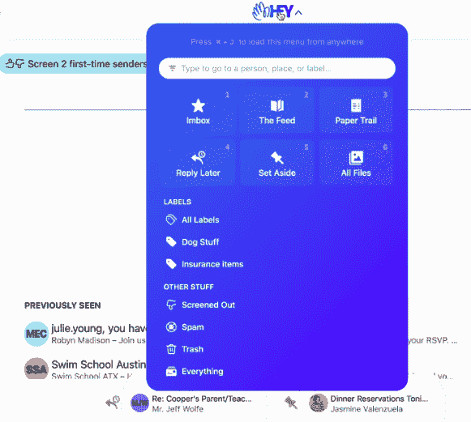

# Basecamp 的“嘿”试图重新发明电子邮件

> 原文：<https://thenewstack.io/basecamps-hey-app-attempts-to-re-invent-email/>

有没有可能升级一个存在了半个多世纪的通讯工具？或者，这项技术会继续被实时消息应用取代，沦为我们确认电子邮件和未读营销通讯的自动存储箱吗？

本周，项目管理软件提供商 [Basecamp](https://basecamp.com/) 展示了其[数百万美元的努力](https://twitter.com/jasonfried/status/1272533092939505664)来重新发明电子邮件，一项名为[嘿](https://hey.com/)的服务。这并不是第一次高调尝试重新发明电子邮件——但是通过一些精简和一些创新，Basecamp 已经提出了许多新的创新，让很多人重新审视这项古老的互联网技术。

## 有什么新鲜事？

Basecamp 显然在 HEY 的界面上花了一些心思——以及减少混乱的方法。例如，主题行首先以粗体字母出现在每个发件人姓名的上方，这是电子邮件第一行通常摘录的第一部分。也可以[将发件人的所有邮件捆绑在一起](https://hey.com/features/bundles/)，这样发件人仍然只能在你的收件箱中获得一行——你可以将来自多个发件人的相关邮件分组。甚至可以为整个线程设置一个“忽略”标志。

但更重要的是，第一次发邮件的人永远不会出现在你的收件箱里；相反，它上面有一个单独的警告，你可以选择批准(或不批准)它们。这款应用的安卓版下载页面[上写着:“像过滤电话一样过滤电子邮件”。此外，你还可以批准较低级别的访问权限，因此，它们不会出现在你的收件箱中，而是会被发送到 hey 的收据和确认电子邮件专用页面，或者由时事通讯和营销电子邮件组成的页面。](https://play.google.com/store/apps/details?id=com.basecamp.hey)

这就是 Hey 界面的真正不同之处:它将你的电子邮件分散到三个类似新闻订阅的页面上。当你检查你的“收件箱”时，重要的电子邮件仍然会出现，但时事通讯和营销电子邮件会被路由到一个脸书风格的专栏中的单独页面，在那里它们以标准的时间倒序显示。这是因为不是所有的电子邮件都应该被平等对待，HEY 的网页解释道。“您不需要将时事通讯、营销电子邮件或发货确认标记为已读。事实上，大多数电子邮件不应该附带阅读、处理或跟踪其状态的义务。它们只是信息，不是对话。”

第三页还提供了一种更小的收件箱，称为“文件线索”，用于“像收据这样你很少需要阅读的东西”

HEY 还提供了一个名为“ [The speakeasy code](https://hey.com/features/speakeasy/) ”的特殊功能，让你给发件人一个码字，让他们绕过你的筛选程序，直接进入你的收件箱，方法是在他们的主题行中包含这个码字。

即使对于新的和重要的电子邮件，也有一个“一起阅读”选项，可以一次打开所有邮件，并在一个类似新闻订阅的页面上一个接一个地显示它们，“就像我们在 2020 年习惯于阅读其他任何东西一样，对吗？”Basecamp 首席执行官[杰森·弗里德](https://www.linkedin.com/in/jason-fried/)在一次演讲中评论道。

左侧仍然有一个图标，上面有所有常见的选择——稍后回复，放在一边。

在在线教程中，弗里德还强调了另一个关键区别:HEY 不会按时间顺序列出你收到的每封邮件，包括你已经读过的邮件，他不屑地称之为不同类型邮件的“分条”,包括已读和未读邮件。“完全是一团糟。”收件箱页面将它们分为两部分——第一部分是“对您来说是新的”,第二部分是“以前看过的”

这意味着当你所有的电子邮件和新邮件都被阅读时，你会满意地看到弗里德所说的“一个美好的空白空间”

[https://www.youtube.com/embed/UCeYTysLyGI?feature=oembed](https://www.youtube.com/embed/UCeYTysLyGI?feature=oembed)

视频

该公司还试图改进将电子邮件标记为“未读”的旧方法，这样你就能记得稍后回复它。相反，每封邮件上都有一个“稍后回复”选项，这可以将邮件添加到一个可以从屏幕底部调出的虚拟面板中。此外，还有第二个标记为“搁置”的电子邮件虚拟堆选择“关注并回复”会弹出另一个类似新闻订阅的页面，上面有每封“稍后回复”邮件的全文，右边还有一个专门的区域用于输入该邮件的回复。“排好队，打倒他们，”嘿的网页上讽刺道。

或者，您可以将“稍后回复”电子邮件列表展开，选择一封单独的电子邮件进行回复…

其他一切都被简化成一个菜单(弗里德称之为“嘿菜单”))在所有图标的上方是一个搜索窗口，输入发件人的名字会弹出一个特殊的页面，显示你从他们那里收到了什么——每封电子邮件(包括你们都抄送的邮件)，以及每个附件。他们还提供了一个单独的页面显示每个收到的文件附件。(它们是按日期排序的，所以越往下滚动，附件就越旧。)还可以通过文件类型(图像、pdf、电子表格、文档)过滤视图，并为发件人提供额外的过滤器。

HEY 还发现了包含打开时激活的“间谍跟踪像素”的电子邮件，弗里德认为这些电子邮件收集的信息“不关他们的事……坦率地说，我们认为这应该是非法的，但在那之前我们会阻止它。”他们通过“代理”图像来做到这一点——而是将图像下载到 HEY.com 服务器。

他们还会使用他们的服务器来托管你发送的文件——甚至是其他电子邮件服务可能会拒绝作为附件的非常大的文件。“只需附上文件，我们将向收件人发送一个直接下载链接，”他们的网页解释道。

[https://www.youtube.com/embed/UCeYTysLyGI?feature=oembed](https://www.youtube.com/embed/UCeYTysLyGI?feature=oembed)

视频

## 它不会做什么

他们不会做的一件事是从另一个账户导入你所有的旧邮件——“因为我们相信一个新的开始是一种祝福，而不是诅咒。”但是您可以导入联系人(如果他们是 vCard 格式)。如果您取消了帐户，您可以将您的电子邮件和联系人导出到您的下一个电子邮件应用程序。(他们还会转发发送到您 Hey.com 帐户的任何电子邮件。)

你也不可能在邮件末尾自动添加一个“签名”页脚，显示你的名字和电话号码。(“不要贡献页脚垃圾，”他们的宣言说。“邮件已经说是你发的了。如果有人需要你的电话号码，他们可以问。”)

而且，您永远不会浪费一分钟来归档电子邮件，因为没有归档。“当你阅读一封电子邮件时，它只是向下移动，最终，当新的电子邮件到来并取代它的位置时，它就会移动，”它的宣言解释道。“在嘿，电子邮件只是流动，他们不会堆积。放手。”Gmail 限制你的存储空间为 15GB，而 HEY 给你 100GB。

该公司对其安全功能感到自豪。所有客户都需要使用双因素身份认证，它还支持指纹读取器和 USB Keys 等硬件安全令牌。常见问题还解释说，“HEY 的数据库(保存您的电子邮件)在休息和工作时都是加密的，这意味着我们的技术团队可以访问数据库进行服务、支持、调整和取证，而无需让他们访问人们的实际电子邮件。HEY 没有进行端到端加密(我们仍然持有密钥)，但除此之外，它已经被尽可能地锁定了。”

HEY 提供 14 天的免费试用，尽管唯一的付费选项是 99 美元一年。(尽管他们的 FAQ 也承认顾客取消订单然后要求退款的情况。)如果您在免费试用结束前取消，您的电子邮件地址将在 30 天后被“回收”并提供给其他人使用。

那些珍贵的两个字母的电子邮件地址有特别的价格。他们有 676 个地址，他们说这些最稀有的地址一年要花 999 美元。17576 个三个字母的电子邮件地址每年的费用为 375 美元。Basecamp 的联合创始人兼首席技术官 David Heinemeier Hansson “开玩笑说，它的高级地址服务将有助于偿还它去年为收购 Hey.com 域名支付的巨额资金，” [the Verge](https://www.msn.com/en-us/news/technology/email-service-hey-is-selling-two-letter-email-addresses-for-dollar999-a-year/ar-BB15zzWM) 报道。

## 其他尝试

还有其他重新发明电子邮件的尝试。根据 2013 年《the Verge》的一篇文章，一款名为 Mailbox 的应用程序提供了[，包括基于刷卡的过滤](https://www.theverge.com/2013/2/7/3961544/mailbox-app-for-iphone-inbox-unchained)，用于“打盹”一封电子邮件以便稍后阅读(或完全删除)。

根据 the Verge 的文章，该公司的创始人记得他的投资者告诉他，“追求电子邮件是一条铺在尸体上的路”。“这不是一个你作为一家小型初创公司所追求的空间。”它的范式似乎让电子邮件线程感觉更像是短信聊天，将电子邮件变成了 the Verge 所描述的“类似短信的泡沫”《纽约时报》记得，事实证明他们的投资者错了，无论如何，它在 2013 年被 Dropbox 以 1 亿美元收购。但不到两年，Mailbox 就写了自己的讣告，告诉用户去别处寻找电子邮件解决方案。“随着我们加深对协作的关注，我们意识到电子邮件应用程序在从根本上解决电子邮件问题方面只能做这么多。我们已经开始相信，未来提高人们工作效率的最佳方式是首先简化产生大量电子邮件的工作流程。”

还有 2011 年推出的 iOS 电子邮件应用“麻雀”。它的范例显然是 Twitter。(在 2011 年接受 Ars Technica 采访时，Sparrow 的创建者承认 Twitter 对他们自己的 UI 产生了重大影响。在[公司被谷歌](https://www.pcmag.com/archive/google-acquires-email-client-sparrow-300575)收购后，创作者们终止了《开发 2012》。

## 如今电子邮件的问题是

但是电子邮件本身是一种垂死的媒介吗？《纽约时报》的首席消费者技术记者最近写道，他的大多数在线对话[现在都发生在即时通讯应用](https://www.nytimes.com/2020/06/17/technology/personaltech/hey-email-service-screening.html)上，如 Slack、Google Hangouts 和 iMessage。App Annie 的市场洞察总监向《泰晤士报》证实，一般来说，45 岁以下的人在即时通讯应用上花费的时间更多。《纽约时报》记者注意到，“我的电子邮件账户已经变成了接收收据和时事通讯的被动渠道。”

目前，嘿的应用卷入了与苹果应用商店关于收入分成的[之争，这场斗争发现微软呼吁反垄断监管机构调查其他公司如何运营他们的应用商店。汉森](https://techcrunch.com/2020/06/18/interview-apples-schiller-says-position-on-hey-app-is-unchanged-and-no-rules-changes-are-imminent/)[在推特上说](https://twitter.com/dhh/status/1273305273029890049)他已经和司法部反垄断部门谈过了。

但 HEY 更大的问题可能只是说服人们在重新设计的电子邮件界面上碰碰运气——并不是每个人都被说服了。《纽约时报》的首席消费技术作家总结说，嘿"[还有一段路要走](https://www.nytimes.com/2020/06/17/technology/personaltech/hey-email-service-screening.html)，称之为“深思熟虑的第一步”，但每年 99 美元有点贵。”他一直在纠结如何屏蔽一家公司的促销信息，同时又不屏蔽来自同一家公司的重要信息——尽管他也承认自己“非常喜欢”其他功能，比如书面记录……

“更重要的是，我离开时确信，电子邮件作为一个整体是如此的破碎，以至于我们许多人都在别处进行了大部分的对话。”

但在 Twitter 上，陈的一位读者发现了一个细节:陈说他有 11.8 万封未读邮件。

“有 118，000 封未读邮件，没有软件能够帮助你。干脆全删了，或者换个新邮箱！”

* * *

# WebReduce

*目前新栈不允许直接在本网站评论。我们邀请所有希望讨论某个故事的读者通过推特或脸书与我们联系。我们也欢迎您通过电子邮件发送新闻提示和反馈:[feedback @ thenewstack . io](mailto:feedback@thenewstack.io)。*

<svg xmlns:xlink="http://www.w3.org/1999/xlink" viewBox="0 0 68 31" version="1.1"><title>Group</title> <desc>Created with Sketch.</desc></svg>