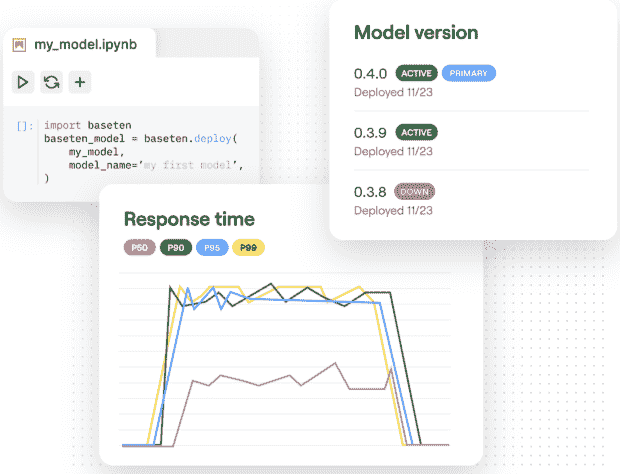

# Baseten:用 Python 部署和共享 ML 模型

> 原文：<https://thenewstack.io/baseten-deploy-and-share-ml-models-with-python/>

在采用机器学习的企业中，数据科学家通常会构建和训练模型，然后将它们交给 [MLOps](https://thenewstack.io/what-is-mlops/) 团队进行部署。但初创公司和许多小企业没有这样的数据工程团队，这让他们在实际将这些模型应用到他们的组织中时陷入困境。

这就是 [Baseten](https://www.baseten.co/) 联合创始人[图欣·斯里瓦斯塔瓦](https://www.linkedin.com/in/tuhin-srivastava-60601114/)、[阿米尔·哈格亚特](https://www.linkedin.com/in/amirhaghighat/)和[菲利普·霍维斯](https://www.linkedin.com/in/philhowes/)在数字出版平台 Gumroad 发现自己的处境。实际上，他们必须成为全栈工程师才能将模型投入生产。

“我们只是一次又一次地看到这个问题，一些公司在机器学习上进行大量投资，并相信这将对他们的组织产生变革性的影响，但当谈到高管们可以围绕机器学习指出的有形价值时，却真的缺乏，”斯里瓦斯塔瓦说。

在与大约 100 名机器学习从业者和几十个团队的交谈中，他们发现组织在苦苦挣扎。

“我们意识到，许多组织，特别是机器学习团队，正在努力解决更多的软件工程问题，使他们的模型与价值挂钩，而不是机器学习本身，”他说。

## 复杂的 ML 基础设施

OctoML 的联合创始人兼首席执行官 Luis Ceze 在 New Stack 的前一篇文章中写道:“今天，在 ML 模型的创建和投入生产的过程之间没有有效的桥梁。”

他认为 ML 车型的平均生产时间为 12 周，尽管其他调查显示这是一个漫长的过程。

“今天，这个过程如此具有挑战性，以至于即使是熟练的数据科学家和人工智能从业者也会犯错——模型往往会以自己独特的方式结束，”Ceze 写道。“除了少数例外，这些管道都是定制组装的，非常脆弱。对部署硬件选择、环境、培训框架、软件库或集成堆栈所做的更改可能需要彻底调试，甚至完全重建。”

总部位于旧金山的 Baseten 旨在抽象出数据基础设施的复杂性，使数据科学团队能够更快、更可靠地将 ML 模型投入生产，并减少对工程帮助的依赖。这项技术正处于公开测试阶段，其设计目的是让用户除了 Python 之外不需要了解任何东西，因为他们通常已经在他们的 Jupyter 笔记本上使用了 Python。

“根据 Omdia research 的数据，尽管近三分之二的美国公司正在调查或建立[机器学习]试点用例，但只有 9%的公司能够将这些努力投入生产，更少的公司(6%)在整个业务范围内实现了规模化，”AI 平台、分析和数据管理首席分析师 Bradley shimmen 说。

“是什么阻碍了他们？通常，开发一个工作模型和将该模型集成到行动点的业务应用程序环境中之间存在简单的阻抗不匹配。由于能够快速创建 API 并将机器学习模型直接嵌入到可共享的应用程序中，Baseten 有望最大限度地减少这种不匹配，并加快价值实现。”

一款由腾讯研究人员开发的基于 Baseten 的免费[工具](https://app.baseten.co/apps/QPp4nPE/operator_views/RqgOnqV) [GFP-GAN](https://arxiv.org/pdf/2101.04061.pdf) (生成面部优先生成对抗网络)，可以修复受损和低分辨率的照片，最近受到了一些关注。

## 掉进兔子洞

当被问及他们在 Gumroad 学到了什么时，斯利瓦斯塔瓦回答说:“天哪，太多了。

“但我们首先要学习的是如何在 API 背后实际提供这种模式。因此，我们进入这个长长的兔子洞，做了一系列基础设施工作，必须了解亚马逊网络服务，必须了解 Docker。那时 Kubernetes 还不存在，但我们必须学习配器。

“老实说，这花了我大约四分之一的时间。但最终，我们有了这个非常脆弱的系统，它能够为这个 API 提供服务，并且背后有一个模型。但后来我们意识到，我们必须用一些业务逻辑来包装基础架构背后的模型。所以你知道，一个模型接受一种特定类型的输入，这种输入通常不直接映射到另一个企业想要如何使用该模型。

“因此，我们最终不得不学习一系列后端工程和服务器端工程，比如构建 Ruby on Rails 应用和 Django 应用，以便能够包装该模型并调用集成到现有系统中的业务逻辑。”

然后是需要人工审查的模型问题。

“所以[我们]最终学习了一系列前端技能，能够将这些接口发布出来，以便分析师可以做出这些决定。…我们确实遍历了软件工程的整个领域，只是为了获得某种解放的模型，并为业务增加价值，”他解释道。

## Python，只是 Python

Baseten 专注于这三个支柱:服务于 API 背后的模型、后端基础设施和前端接口。

它负责自动缩放等基础工作。在后端，你不必担心服务器端工程，学习 Django 或 Ruby on Rails 或其他 web 服务。有了前端的拖放式应用构建器，你不必学习 JavaScript、React、HTML 或 CSS。

“这就是 Baseten 的整个前提，即机器学习团队非常非常擅长 Python。他们真的，真的很擅长模型，这就是他们必须关注的。斯利瓦斯塔瓦说:“我们把其他的东西都抽象掉了。

Python SDK 使用户能够直接从 Jupyter 笔记本电脑部署 TensorFlow、scikit-learn、PyTorch 模型或自定义模型。BaseTen 的无服务器基础设施支持链接模型输出以及预处理和后处理代码。它提供了一个预先训练的模型库，允许用户围绕模型构建和部署应用程序，以完成情感分析、图像分类和语音转录等任务。

Patreon 的高级机器学习工程师 Nikhil Harithas 说:“Baseten 消除了工具制造的过程，因此我们可以专注于我们的关键技能:建模、测量和解决问题。”

作为抽象的一部分，它创建并开源了 [Truss](https://github.com/basetenlabs/truss) ，帮助数据科学家部署用任何框架训练的模型，以便在任何环境中运行。它把你的 Python 模型变成一个带有生产就绪 API 端点的微服务，不需要 Flask 或者 Django。

“数据科学家的开发环境需要灵活和宽容，”霍维斯在一篇介绍 Truss 的博客文章中写道。

“模型服务，或者使模型对其他系统可用，是至关重要的；一个模型除非能在现实世界中运作，否则用处不大。我们构建 Truss 作为服务模型的[标准](https://www.baseten.co/blog/why-we-open-sourced-truss)，它利用了 Docker 等成熟的技术，但抽象出了复杂性，而不考虑模型框架。”

“Baseten 为我们提供了一种简单的方式来托管我们的模型，迭代它们并进行实验，而不用担心任何涉及的开发操作，”Pipe 数据科学负责人 Faaez Ul Haq 说。

## 早期

今年 4 月，该公司宣布已经筹集了 800 万美元的种子资金，由格雷洛克和南方公园共同基金共同牵头，并获得了 1200 万美元的首轮融资，由格雷洛克牵头。一月份只有 8 名员工的公司现在已经发展到 22 人。

虽然像[重组](https://retool.com/)、[精简](https://streamlit.io/)和 [SageMaker](https://aws.amazon.com/sagemaker/) 这样的工具解决了 MLOps 难题的一部分，但 Srivastava 坚持认为整个包没有真正的竞争对手。

“我们从客户那里看到的是，他们正在以一种非常零碎的方式将所有这三个部分粘在一起，这就是为什么我们认为捆绑包如此重要，”他说。

“作为一个产品，Baseten 非常非常新，所以我们要确保功能的完整性，”他说。

“是时候构建大型组织需要的许多功能了，你知道，与本地开发工作流的集成，与 GitHub 和 GitLab 的集成。此外，围绕模型部署的大量工作也变得更加繁重。

“因此，我们认为我们的模型部署部分非常新颖，实际上我们将以一种非常开放的方式开放它。…但这实际上是为了给我们的客户创造长期价值，同时也是为了让 Baseten 的新颖部分更易于使用。”

<svg xmlns:xlink="http://www.w3.org/1999/xlink" viewBox="0 0 68 31" version="1.1"><title>Group</title> <desc>Created with Sketch.</desc></svg>