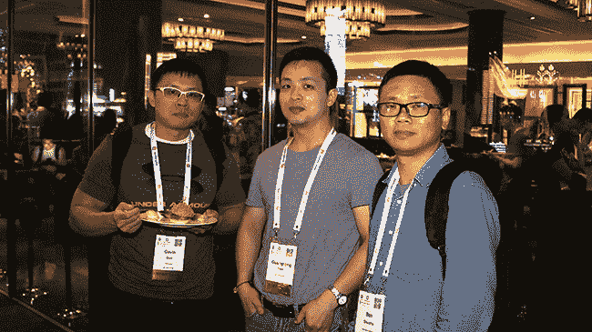
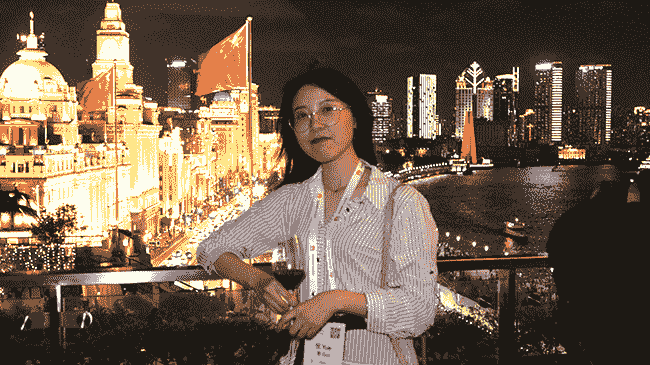

# 外滩狂欢！CNCF 在上海著名河边的贵宾招待会

> 原文：<https://thenewstack.io/bash-on-the-bund-cncfs-vip-reception-on-shanghais-famous-riverfront/>

2019 年中国开放源码峰会的演讲者和与会者从会议的启发中休息了一会儿，俯瞰上海著名的[外滩河边散步](https://en.wikipedia.org/wiki/The_Bund)的耀眼灯光。6 月 24 日，云原生计算基金会在美国流行音乐餐厅和酒吧举办了第二届年度贵宾招待会。新堆栈就在那里，这是我们喜欢见面的一些聚会参与者的照片。

[加文·郭](https://github.com/bboymimi)(左至右)，Canonical Ltd .工程技术负责人；腾讯团队负责人肖光荣；本·舒舒，Canonical

越国

云本地计算基金会和 KubeCon + CloudNativeCon、Linux 基金会是新堆栈的发起人。

特征图片:(L 至 R)[carlsia Campos](https://github.com/carlisia/carlisia.github.io)、VMware 高级技术人员、[宜丰(Daniel) Xiao](https://github.com/DanielXiao) 、VMware 高级技术人员。

<svg xmlns:xlink="http://www.w3.org/1999/xlink" viewBox="0 0 68 31" version="1.1"><title>Group</title> <desc>Created with Sketch.</desc></svg>