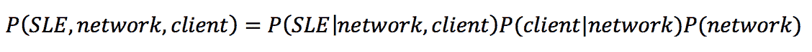
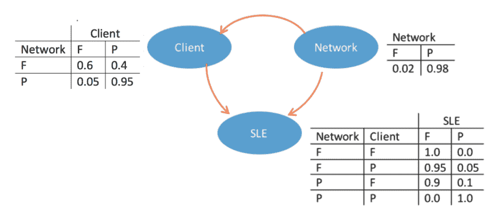
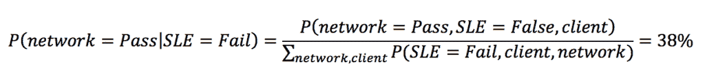
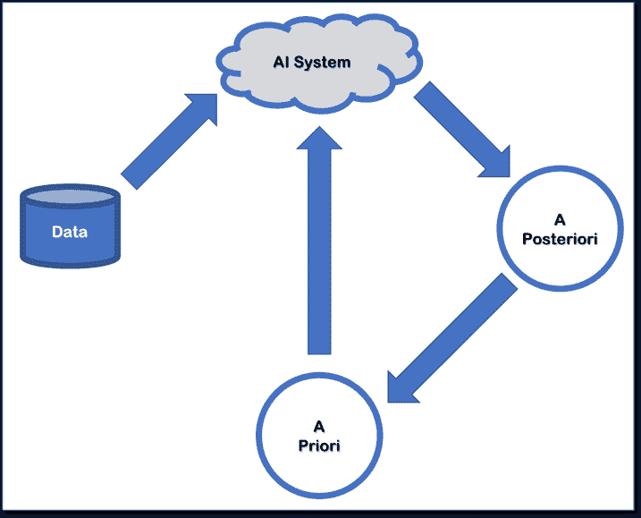

# 贝叶斯推理:人工智能基础的关键组成部分

> 原文：<https://thenewstack.io/bayesian-inference-a-key-building-block-of-an-ai-foundation/>

 [易卜拉欣·萨法维

易卜拉欣·萨法维是 Mist Systems 的数据科学家。他是一名人工智能爱好者，拥有从信息检索、知识发现和自然语言处理到物联网(IoT)等领域的经验。他利用机器学习和数据驱动的分析来解决现实世界的问题。易卜拉欣拥有史蒂文斯理工学院的认知学习网络博士学位。他喜欢听音乐、徒步旅行和摄影。](https://www.mist.com/) 

我的 [第一篇文章](https://thenewstack.io/mutual-information-pearson-correlation-building-blocks-ai/) 讨论了为什么互信息，加上皮尔逊相关性，是人工智能技术的重要组成部分。**贝叶斯推断**又是一个。贝叶斯定理允许我们使用一些我们已经拥有的知识或信念，也称为“先验”，来帮助我们计算相关事件的概率。这种数据挖掘方法可用于分析人工智能驱动的网络管理系统、虚拟助理和其他变量分析模型中的网络变量。

贝叶斯推理是一个非常强大的工具集，用于建模任何随机变量，如覆盖概率、位置统计和服务水平期望(SLE)度量等。贝叶斯模型映射我们对问题的理解，并将观察到的数据评估为我们对概率方面的特定事实有多确定的定量测量，其中命题的概率简单地表示对该命题的真实性的相信程度。

贝叶斯人不确定什么是真的；在网络示例中，这意味着覆盖概率、位置统计和 SLE 度量等。贝叶斯主义者用数据作为证据，证明某些事实比其他事实更有可能发生。先验分布反映了我们在看到任何数据之前的信念，后验分布反映了我们在考虑了所有证据之后的信念。

例如，假设在一个简单的无线网络实现中，有两个事件会影响 SLE 指标—网络功能和客户端功能—并且所有变量都有两个可能的值，即失败或通过。

然后，我们可以使用贝叶斯规则来找到如下的联合概率函数:

在贝叶斯推理中，我们的初始信念由先验分布 P(网络)表示，我们的最终信念由后验分布 P(客户端|网络)和 P(SLE |客户端，网络)表示。

在我们简化的无线网络实现中，客户端和网络是隐藏变量，唯一可观察的变量是 SLE 度量。然而，由于贝叶斯网络是变量及其相关性的完整模型，我们可以回答关于隐藏变量的干预性问题，如“假设 SLE 已经失败，网络成功通过的概率是多少(即 P(network=P | SLE=F))？”

我们可以使用贝叶斯法则、图表中的联合概率和条件概率表来回答这个问题:

贝叶斯方法的基本程序包括以下步骤。首先，分配一个初始先验概率分布，将所有相关信息量化为一个分布。接下来，选择一个概率模型，它将随机变量和与实验相关的模型参数联系起来。最后，应用贝叶斯定理，结合先验知识和新的观测数据，得到后验概率分布。

后验分布根据数据更新，意味着先验概率被数据信息提供的新证据改变，成为后验。我们可以说“*今天的后验就是明天的先验！*”

有几个概念超出了本教程的范围，但对于成功进行贝叶斯分析非常重要，例如:如何选择先验、贝叶斯网络结构，或者如何基于数据更新先验信念。希望这篇对贝叶斯方法的简要介绍能启发你继续探索人工智能系统贝叶斯推理的迷人世界。

通过 Pixabay 的特征图像。

<svg xmlns:xlink="http://www.w3.org/1999/xlink" viewBox="0 0 68 31" version="1.1"><title>Group</title> <desc>Created with Sketch.</desc></svg>