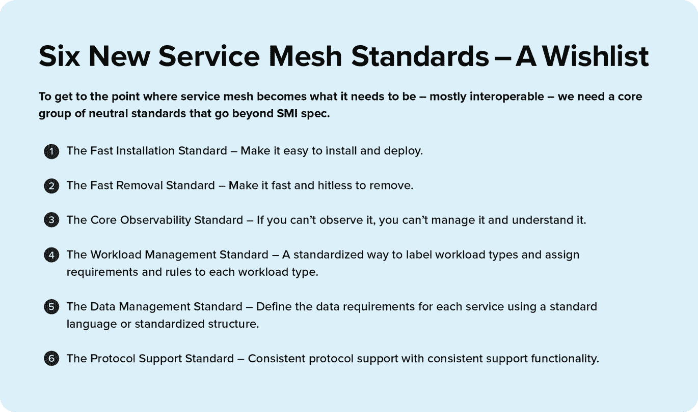

# 像瑞士一样:6 个新的服务网格标准

> 原文：<https://thenewstack.io/be-like-switzerland-6-new-service-mesh-standards/>

[Matthew Yacobucci](https://www.linkedin.com/in/matthew-yacobucci-323b4b2/)

[Matthew " Booch " Yacobucci 是 F5 的一名首席软件工程师，他主要负责 Kubernetes 技术，包括 NGINX 入口控制器和 NGINX 服务网格。他在分布式计算和网络行业经验丰富，精通 Linux、Go、容器编排系统、并发模式和午餐。](https://www.linkedin.com/in/matthew-yacobucci-323b4b2/)

在过去的几年里，在迅速崛起的[服务网格](https://www.nginx.com/resources/glossary/service-mesh/)领域工作的工程师们对媒体提及的“服务网格战争”表示不满。虽然看似夸张，但一场战斗确实存在。不管是好是坏，服务网不是外交。仅仅让两个不同的服务网格互相对话仍然是一场噩梦。虽然[服务网格接口(SMI)](https://smi-spec.io/) 已经将行业推向了真正的互操作性所需的开放标准，但要将这些标准推向服务网格可以成为通用通信和管理层的地步，还有许多工作要做。

一个特别的例子是:工作负载数据现在很难标准化，这在为服务网格构建标准化管理工具时产生了问题。不同的网格在可观测性和遥测方面也有冲突的观点。这些不同的视图意味着安装一个服务网格需要一些认真的调整，以便在不同的网格上建立相同的可观察性平面。

那么，我们如何结束这场战争，帮助服务网格实现互操作性呢？关键是中立。有了一组中立的核心标准，服务网格可以停止争斗，转而像瑞士这样以中立著称的国家那样行动。成为火锅和巧克力的乐土并非不可能。超越 SMI，这个愿望列表可以标准化服务网格——不是通过定义标准的角度，而是通过这些标准在实践中应该如何表现和交付。

## 1.快速安装标准

采用服务网格的一个重要障碍是害怕安装。可以理解。服务网格很难安装和部署。为了解决这个问题，作为一个设计原则，我们可以在标准的 [Kubernetes](https://kubernetes.io/) 集群上建立一个“快速安装”标准，甚至基准安装时间。

安装时间也很好地表明了服务网格处理复杂性的能力。它展示了交付良好用户体验的能力，尽管在幕后有复杂的活动。更好的是，它通过将网格限制在核心功能上，展示了智能的优先级划分。也就是说，总的目标应该是一个不太复杂的“选择加入”体验，而不是一个“选择退出”的噩梦。

## 2.快速移除标准

尽可能快速、无中断地移除是快速安装的另一面。任何难以移除的服务网格都将降低采用的可能性，并使应用程序团队更难信任网格来执行关键任务。回滚到在没有网格的情况下运行任何应用程序或服务，特别是在内部，将成为团队为 Kubernetes 环境设计的赌注，这些环境是流动的，并为他们提供完全的控制。

当然，快速清除里程可能会有所不同。例如，如果一个应用程序团队已经创建了一个网格环境，其中包含许多定制的[CRD](https://kubernetes.io/docs/concepts/extend-kubernetes/api-extension/custom-resources/)和高级功能，那么分离网格可能需要更长的时间。尽管为此设定标准和基准是一个容易达成一致的棘手问题。

## 3.核心可观察性标准

如果你不能观察它，你就不能[管理它，理解它](https://www.nginx.com/blog/how-to-improve-visibility-in-kubernetes/)。Kubernetes 和服务网格提出了一些新的可观察性挑战，因为它们的大部分焦点都在网络层，而不是发生面向用户的事务的应用层。

OpenTracing 是一个奇妙的开始，围绕它的社区构建了一个强大的愿景，用一个公共的 API 给所有的服务网格提供可观察性。 [Zipkin](https://zipkin.io/) 和 [Jaeger](https://www.jaegertracing.io/) 也各有所长，Zipkin 是一个一体化的追踪解决方案。然后你有了其他项目，像 [OpenCensus](https://opencensus.io/) 以其他方式攻击追踪和可观察性。然而，有太多的竞争项目导致了缺乏可接受的跟踪上下文的标准。

幸运的是，为了将可观测性统一到单一标准，不兼容的 OpenTracing 和 OpenCensus 项目在 2019 年春天开始合并，形成了 [OpenTelemetry](https://opentelemetry.io/) 。这是一个巨大的进步，将跟踪和支持的语言库结合到云本机遥测的更广阔的视野中。OpenTelemetry 还采用了 [W3C 跟踪上下文](https://www.w3.org/TR/trace-context/)作为标准化的跟踪传播机制。尽管如此，仍有工作要做。虽然支持最流行的编码语言，但仍有几十种不受支持。此外，并不是所有的可观测性后端都同样支持 OpenTelemetry。这是一项正在进行的工作，但非常有前途。

## 4.工作量管理标准

了解工作负载的需求会影响服务网格处理该工作负载的方式。例如，金融交易的工作负载应该要求对包含帐户或个人身份数据的所有活动进行加密和 [mTLS](https://en.wikipedia.org/wiki/Mutual_authentication) 。没有简单的方法来标记工作负载类型，并为如何在 Kubernetes 和服务网格中处理这些工作负载设置不同的标准。目前，最接近的事情是为每个服务设置规则和策略，例如重试、超时和终止。虽然这在有少量[微服务](https://www.nginx.com/resources/glossary/microservices/)的环境中可能行得通，但随着您添加更多微服务，它会很快变得更加复杂。服务网格需要一种标准化的方法来标记工作负载类型，同时为它们分配需求和规则。这样，工作负载管理将变得更加简单、自动化和精确。

## 5.数据管理标准

在瞬息万变的环境中管理数据极具挑战性。在早期，Kubernetes 用户避免在他们的集群中运行关键数据库，并将服务网格链接到外部数据存储，以确保他们的数据安全可靠。由于像 [GDPR](https://en.wikipedia.org/wiki/General_Data_Protection_Regulation) 、 [FIPS](https://www.nginx.com/blog/achieving-fips-compliance-nginx-plus/) 和 [CCPA](https://en.wikipedia.org/wiki/California_Consumer_Privacy_Act) 这样的法规，数据需要特别小心，这些法规涵盖了如何处理数据、如何让客户访问数据以及数据的物理位置。Kubernetes 和服务网格中的数据处理仍然很复杂，很大程度上是事后才想到的。

这与非 Kubernetes 世界类似，大多数开发人员将原型和早期应用程序项目的数据转储到一个简单的 SQL 存储、S3 存储或 MongoDB 中，从而延迟了数据管理决策过程。在 Kubernetes 和 service mesh 中，随着微服务将数据事务分解为更离散的任务和用途，一蹴而就会带来更多的复杂性。这反过来又需要更细致的管理。与工作负载类似，数据管理标准允许运营商和开发团队使用标准语言或标准化结构定义每项服务的数据要求，从而简化他们的工作。

## 6.协议支持标准

今天，服务网格之间的协议支持有很大的差异，这使得将一个服务网格替换为另一个服务网格变得复杂。此外，对于应该支持哪些协议以及这种支持应该是什么样的，还没有一个完全一致的意见。达成一致是至关重要的，因为协议在应用程序设计中通常是至关重要的。例如，一些应用程序使用 [gRPC](https://grpc.io/) 来满足特定的通信需求，但是并不是所有的服务网格都支持 gRPC 进程的完全可观察性。因此，具有一致支持功能的一致协议支持对于网格互操作性和可移植性是必不可少的。

## 瑞士并不遥远

在技术的冲突中，创造一个中立的、瑞士式的标准化既切实可行又十分必要。虽然这确实需要大量的协调，但我们知道这是可行的——即使是在尽可能广泛的范围内。web 浏览器和 W3C 已经证明了这一点，他们创建了不断发展的标准，为所有浏览器提供近乎完美的互操作性，同时在这些浏览器上运行 web 应用程序。

在 F5，NGINX 通过将“简单性”作为我们 [NGINX 服务网格](https://www.nginx.com/products/nginx-service-mesh/)的核心原则之一，为这些标准奠定了基础。简单是效率的趋势，我们很自豪能够支持快速简单的网格。安装和拆卸只需几分钟。我们也一直在寻求通过扩展协议支持来提供价值，既包括对 UDP 等 L4 需求的向下堆栈，也包括对 gRPC 和其他 L7+协议开发的功能奇偶校验的向上堆栈。最后，工作负载和数据分类是我们希望在未来实现的一个创新目标。

有了这些标准，就能找到中性，火锅和巧克力触手可及。集成这一标准化基础级别，以便架构师、开发人员、安全和平台运营团队可以根据需要混合和匹配网格，这将是推动采用并使服务网格像浏览器一样无处不在、可理解和可信的最佳方式。

<svg xmlns:xlink="http://www.w3.org/1999/xlink" viewBox="0 0 68 31" version="1.1"><title>Group</title> <desc>Created with Sketch.</desc></svg>