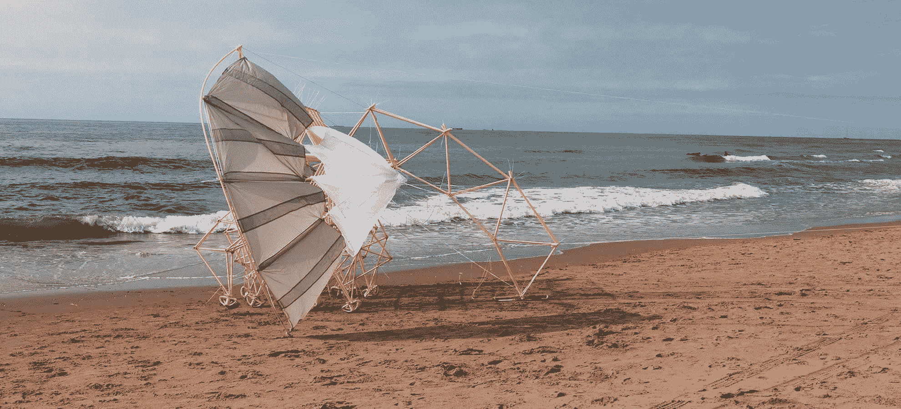
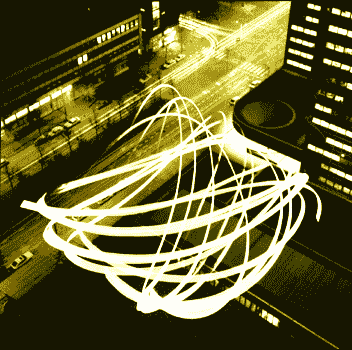

# 西奥·詹森的海滩漫步兽

> 原文：<https://thenewstack.io/beach-walking-beasts-theo-jansen/>

“艺术和工程之间的墙只存在于我们的脑海中，”西奥·詹森解释道，他已经用塑料 PVC 管建造了超过 25 年的巨型生物。本周末，他们将再次行走地球——在旧金山[探索博物馆](http://www.exploratorium.edu/)停留三个月的最后一站，参加名为“[strand beest:Theo Jansen 的梦想机器](http://www.exploratorium.edu/strandbeest)的巡回展览当他们漫步进入我们的记忆时，我们了解到 Strandbeest 是一个荷兰语单词，意思是“海滩动物”——这个项目有着悠久而迷人的历史。

“他的每一代 strand beets[都受到进化](http://www.ted.com/speakers/theo_jansen)力量的影响，”TED.com 的一个网页上写道，“成功的形式发展成新的设计……它们甚至包含原始的逻辑门，如果它感觉到危险的水或松散的沙子可能会卡住，这些逻辑门用来逆转机器的方向。”

詹森显然受到了理查德·道金斯(Richard Dawkins)的《盲人钟表匠》(The Blind Watchmaker )一书的启发，这本书认为进化虽然不是随机的，但仍在不断前进，没有最终目的地。根据《纽约时报》的报道，詹森首先开始在雅达利电脑上试验进化模型，他花了几个月的时间比较组成他的生物的腿的杆的每一种可能的长度，在他自己的一场进化比赛中，一组神奇的完美数字最终胜出。

“即使对计算机来说，11 根棒之间可能的比率数量也是巨大的。假设每根杆有 10 种不同的长度，那么就有 10，000，000，000，000 条可能的曲线。如果计算机系统地经历所有这些可能性，它将保持忙碌 100，000 年。我没有那么多时间，所以我选择了进化的方法。计算机生成了 1500 条带有随机长度杆的腿。然后评估哪一个接近理想的行走曲线。

从 1500 个排列中，计算机选出了最好的 100 个。这些被授予了复制的特权。电脑连续几周甚至几个月没日没夜地开着。它最终产生了十一个数字来表示所需杆的理想长度。"

詹森的网站将终极比例描述为“11 个神圣的数字”:38、41.5、39.3、40.1、55.8、39.4、36.7、65.7、49、50、61.9、7.8 和 15。他们的起源现在是他自己的神话中值得骄傲的一部分。《泰晤士报》指出:“关键是——詹森对此很坚定——他从未模仿任何自然生物的行走方式……”他产生他的比率的方式与自然本身很可能产生的方式非常相似，自然历史在这种情况下被理解为一种巨大的计算算法。"

詹森亲切的解释就像动物本身一样是展览的一部分。“在每种海滩动物的中间都有一种脊椎，更确切地说是一个曲轴，”他在自己的网页上写道。“这个脊椎的非凡之处在于它可以旋转…这种海滩动物不会摇晃…”

但这并没有结束。詹森的生物也有各种各样的胃。海滩上的风为这种生物体内的自行车打气筒提供动力，将能量(以气压的形式)储存在 Strandbeest 的腹部深处。詹森在另一个网页上解释道:“打开瓶盖，风就会从瓶子里高速冒出来。”。"诀窍是控制住这股不受控制的风，并用它来驱赶动物。"

但是除了技术上的解释，詹森的沙滩漫步生物实在是太美了…

《纽约时报》将詹森描述为“更像是莱昂纳多·达·芬奇和堂·吉诃德的结合体(也许还有一点西西弗斯的影子)”。他们还描述了他在运输这些庞然大物时遇到的麻烦，小心翼翼地将它们折叠成 40 英尺长的集装箱，以及他的旅行经理是如何给一些组件重新命名的——比如“绞杀棒”和“中足骨”——以避免它们通过海关时遇到可疑的问题。

据《泰晤士报》报道，这些动物去过日本、澳大利亚、南美，它们还在伦敦、巴黎、马德里和台北徘徊，并在美国的几个城市巡回演出，即塞勒姆、芝加哥和现在的旧金山。“无论游客走到哪里，都会受到詹森的激烈争辩，他们所目睹的事实上不亚于一种新的生活形式……”

这不是詹森令人愉快的不切实际的职业生涯中唯一的项目。在他的网站上，詹森描述了一个 1980 年的项目，其中包括建造一个不明飞行物。根据他的网站，他在其中一架飞机上充了氦气，并让它飞过荷兰的代尔夫特镇，然后“引起了一场近乎骚乱的事件”。它有 13 英尺宽，从头顶朦胧的天空向下面的所有地球人投射光和声音，尽管后来在官方警方报告中被描述为近 100 英尺宽。“我们再也没有找到它，”西奥在他的网页上伤感地写道。"它消失在云层中，可能降落在比利时."

另一个项目是在海牙附近的两栋建筑之间悬挂一根 145 英尺长的绳索，悬挂一个电钻。钻头被螺旋桨取代，使其[在空中疯狂移动](http://www.strandbeest.com/theo_flying_drill.php)，描绘出奇怪而复杂的图案。

但人们似乎记得的是 Strandbeests。詹森 2007 年在蒙特雷的 TED 演讲，题为“[我的创作，一种新的生活方式](http://www.ted.com/talks/theo_jansen_creates_new_creatures)”，现在已经被观看了 300 多万次。他的沙滩漫步生物显然在纪录片中永垂不朽[。](http://www.strandbeestmovie.com/)

正如 TED 指出的，“Jansen 的远见和对他的木制动物园的长期承诺就像动物本身一样令人着迷。”

<svg xmlns:xlink="http://www.w3.org/1999/xlink" viewBox="0 0 68 31" version="1.1"><title>Group</title> <desc>Created with Sketch.</desc></svg>