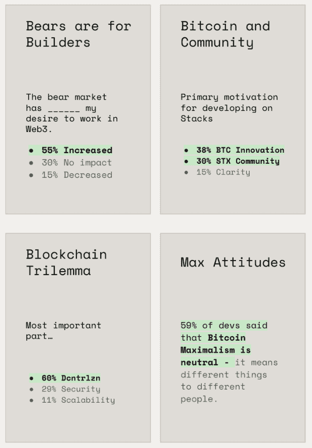
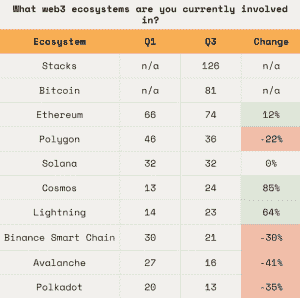
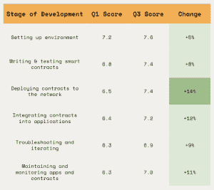

# Hiro 称熊市引发开发者对 Web3 的兴趣

> 原文：<https://thenewstack.io/bear-market-triggers-developer-interest-in-web3-claims-hiro/>

熊市可能会对投资者造成严重破坏，但熊市的一个不寻常的副作用是，它增加了开发者在 Web3 中开发的欲望。至少，这是 Hiro 最近一项开发者调查的发现，该公司为开发者提供基于比特币的开发工具。这是今年 [Hiro 第二次调查其 Stacks 开发者社区](https://www.hiro.so/blog/takeaways-from-hiros-q1-developer-survey)。

260 名开发者对第三季度的调查做出了回应，调查发现，55%的开发者表示熊市增加了他们在 Web3 中开发的愿望。30%的人说这对他们在 Web3 中工作的愿望没有影响，而 15%的人说这降低了他们的兴趣。

来源:Hiro

至于那些已经在 Web3 工作的人，调查发现，31%的人是全职、兼职或自雇人士。

风险投资公司 Electric Capital2022 年 1 月在[进行的一项调查也发现，新的开发者正在涌入 Web3 领域(尽管那是在熊市到来之前)。该调查报告称，2021 年有 34，000 名新开发人员为开源加密项目做出了贡献，这是自 2018 年以来新进入者人数最多的一年。](https://thenewstack.io/web3-developer-ecosystem/)

1 月份的研究确定了 Web3 中的 18，000 名活跃开发人员，这是根据每月至少一次向开源 crypto 和 Web3 项目提交代码的开发人员数量确定的。在报告中，新的堆栈指出，“Web3 开发者的总数可能更高，因为报告没有计算专有项目的工作。”

## 生态系统:谁是最可爱的？

Stacks 是一个开源网络，由分散的应用和智能合约组成，建立在[比特币](https://thenewstack.io/the-mechanics-of-bitcoin/)之上，用于开发智能合约。Hiro 的调查发现近一半——126 人——与书库生态系统有关。

“在比特币上创新的愿望和 Stacks 社区的力量显然是在 Stacks 上开发的首要动机，”Hiro 在关于调查的发布会上总结道。

来源:Hiro

第一季度的调查没有询问堆栈或比特币。最近的这项研究发现，大多数人(57%)在书库中的活跃时间不到一年。

在 Stacks 之后，[以太坊](https://thenewstack.io/ethereums-big-day-how-the-merge-will-impact-web3-developers/)仍然是希罗开发者社区最受欢迎的区块链——尽管报告指出大多数开发者尝试多种生态系统。希罗的 Q1 报告获得了 248 个回应，其中一个变化是以太坊平台增长了 12%，T2 宇宙增长了 85%，闪电增长了 64%。开发者对 [Polygon](https://thenewstack.io/polygon-future-following-the-ethereum-merge/) 、 [Avalanche](https://thenewstack.io/web3-tools-and-tipping-points-a-chat-with-infura-co-founder/) 、 [Polkadot](https://thenewstack.io/apis-in-web3-with-the-graph-how-it-differs-from-web-2-0/) 和[币安智能链](https://thenewstack.io/web3-watchdata-api-provides-a-single-view-into-blockchains/)的参与度显著下降，而 [Solana](https://thenewstack.io/solana-blockchain-crashes-into-open-source-top-10/) 在两个季度中保持不变。81 名开发者表示使用了比特币。

以太坊在 Electric Capital 的研究中排名也很高:超过 4000 名(22%)每月活跃的开源开发者表示他们在以太坊工作，其次是 680 多名在比特币区块链上开发的人。Polkadot、Cosmos 和 Solana 也位列区块链 Web3 开发项目的前五名。

## 只能有两个

区块链三难困境是指区块链可以有三个特征中的两个:分散的、安全的或可伸缩的。60%的开发者回答说去中心化优先。29%的人认为安全性重要，而只有 11%的人认为可扩展性重要。

[不可替代令牌(NFT)](https://thenewstack.io/crypto-and-nfts-dominate-the-headlines-but-smart-money-bets-on-web3/) 和[分散自治组织(Dao)](https://thenewstack.io/aleo-introduces-private-application-development-for-blockchain/)是这些建筑商最受欢迎的类别——自 Hiro 2022 年第一季度调查以来，这一类别没有变化。

## 改进的开发人员体验

Stacks 的开发人员说，他们发现在这次调查中，开发过程的每个阶段都比在 Q1 容易近 10%。Hiro 报告称，开发人员注意到的最大收益是网络部署合同的便利性，Q1 的“易用性”得分增加了 14%。越来越多的开发者也将合同集成到应用程序中的易用性排名更高，在“易用性”排名中上升了 12%。

来源:Hiro

该公司将这一变化归功于它对 Clarinet 的改进，这是一个自以为是的清晰工作流程；堆栈 API 和开发人员使用的其他工具。

<svg xmlns:xlink="http://www.w3.org/1999/xlink" viewBox="0 0 68 31" version="1.1"><title>Group</title> <desc>Created with Sketch.</desc></svg>