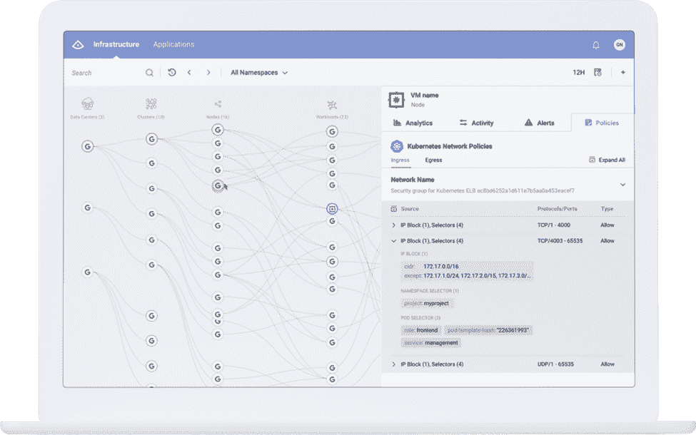
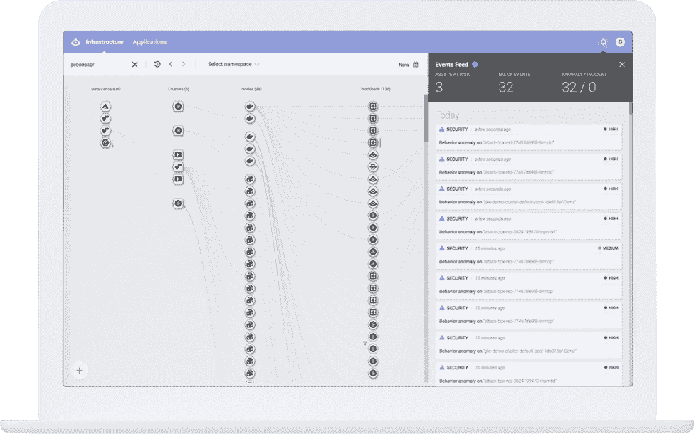
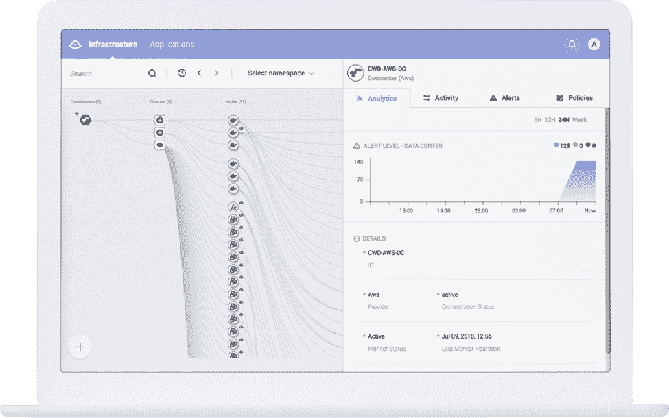
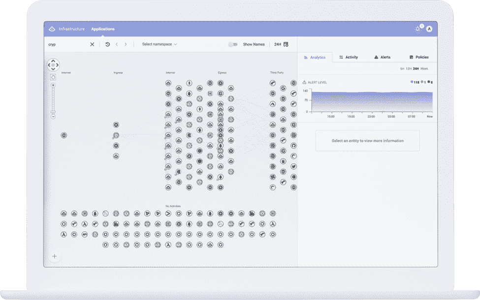

# 美丽的可视化:实现数据中心更深入的可视化

> 原文：<https://thenewstack.io/beautiful-visualization-towards-a-deeper-visualization-for-the-data-center/>

 [阿尔莫格本大卫

阿尔莫格是 Alcide 的一名软件工程师，专注于为数据中心构建新一代可视化工具。在他在软件行业的七年职业生涯中，Almog 曾为各种初创公司工作，在那里他将自己的热情用于开发人机交互软件、可视化工具以及将技术应用于教育发展。他拥有以色列 Herzliya 跨学科中心的计算机科学学士学位。](https://www.alcide.io/) 

Alcide 是新堆栈的赞助商。

十多年前，随着第一批公共云产品的出现，IT 基础架构的复杂性持续呈指数级增长。云本身变得更加多样化，工作负载分布在不同的提供商和裸机、虚拟机(VM)和容器化的服务器之间，而物理数据中心和不断增长的用户和帐户数量进一步增加了复杂性。

现代基础设施的显而易见的好处是它实现了令人难以置信的速度和效率——引领我们走向高度网络化、随需应变的世界。不利的一面是，复杂的基础架构难以管理和保护，这对于日常用户来说是显而易见的，但对于运营团队来说却再熟悉不过了。

虽然存在诸如 DevSecOps 之类的组织解决方案来改进负责基础设施管理的特定元素的各个团队之间的协调，但一个基本问题仍然存在:可见性(或缺乏可见性)。

由于基础架构的动态性越来越强，[最近的一项研究](https://published-prd.lanyonevents.com/published/rsaus18/sessionsFiles/9164/STR-R14_The-Impact-of-Multi-and-Hybrid-Clouds-to-Cybersecurity-Priorities.pdf)涵盖了 DevOps 团队在管理混合云时遇到的几乎所有源于缺乏可见性的问题，包括:

*   维护所有环境的安全性，
*   使用未经批准的应用程序和服务的员工，
*   跟上快速变化的步伐，
*   DevOps 和安全之间缺乏协调，
*   现有控制措施无法提供云可见性。

为了解决这些挑战，团队需要基础设施真相的单一来源，以掌握他们环境中正在发生的事情，并促进特定安全策略的实施。

## 云可见性被重新定义

一旦企业 IT 开始从物理数据中心扩展到多个云、平台和计算环境；可视化工具的出现有助于运营团队应对复杂性。

这些工具旨在提供基础设施的各种元素如何协同工作的地图。团队可以看到他们的物理数据中心和云环境，并了解与其相关的工作负载和服务。

这种顶级可见性非常有助于让团队达成共识，并在组织内实现转型技术，如转向 DevSecOps，但作为应对新兴安全和运营威胁的方法，它存在不足。这是因为除了传统的 IT 基础架构层之外，我们现在还有如此多样的容器、功能和服务网格池需要管理。

组织不仅需要详细、实时地了解基础架构层，还需要了解基础架构层之上的应用程序以及用户活动。如果没有这种全面的可见性，团队仍然无法确定他们的内部部署环境、公共云和私有云环境以及相关的计算技术在一个安全威胁瞬息万变的世界中是否安全和正常运行。

## 云可见性用例

传统的可视化工具提供整个基础架构的鸟瞰图，而新兴的深度可视化工具已经进入市场，以解决现代和云原生环境的挑战。

例如，我的公司 [Alcide](https://www.alcide.io/) 只有几年的历史，在过去的 12 个月里刚刚推出了它的深度可视化平台。Alcide 的平台专为现有的基础设施而构建，包括无服务器等更新的环境，能够更深入地洞察当今极其多样化的 IT 基础设施，无论是内部部署还是云部署，同时消除传统可视化平台无法提供的盲点。我们不仅提供空中可见性，还提供对应用程序和服务器的精细洞察，以及集中式安全管理和所有运营团队都可以使用的“单一控制台”。

这种新型可视化的用例包括:

*   执行的可见性:通过集中安全策略的单一视点，用户可以轻松设置和执行策略，确保更全面的安全性并减少有问题的用户行为；

*   威胁情报的可见性:能够根据 IP 或 DNS 信誉报告可疑流量，并阻止不良和禁止的连接，从而帮助减轻敏感工作负载数据和应用程序的潜在漏洞和威胁；

*   多个帐户和区域管理的可见性:以前，监控和管理跨各种帐户的多个不同云环境是在没有任何集中可见性的情况下完成的。我们的工具为每个云(以及其中的所有数据)提供单一可用性来源，而不考虑地区。因此，最终结果是在安全方面更加安心，而 DevOps 则拥有更多控制权。

*   应用监控的可见性:如果没有对微服务的实时可见性，故障可能会在瞬间发生。为了深入了解工作负载、实例和功能级别，了解哪些服务正在激活以及何时激活至关重要。此外，了解网络行为(包括对外部服务提供商的呼叫)有助于消除安全漏洞和操作问题。

在 Alcide，我们最近宣布[我们平台的新版本](https://www.alcide.io/news/alcide-announces-new-release-of-its-cloud-native-security-platform-for-modern-data-center-and-cloud-environments/)，旨在扩大我们提供的可视化的范围。我们还扩展了对 AWS Lambda 和许可的 AWS 安全组更改的可见性，同时通过 Slack 和 Splunk 集成以及新的威胁情报源增强了用户接收关键警报的方式。这确保了我们的用户永远不会错过基础架构的任何变化，无论变化有多复杂。

虽然更传统的可视化工具提供了基础架构和不同云环境的高级视图，但 Alcide 等工具则更进一步，提供了更整合的顶级视图以及对应用程序和环境实际行为的更深入的洞察。结果是运营方面的效率更高，安全方面的顾虑更少，这对现代云原生企业的成功越来越重要。

通过 Pixabay 的特征图像。

<svg xmlns:xlink="http://www.w3.org/1999/xlink" viewBox="0 0 68 31" version="1.1"><title>Group</title> <desc>Created with Sketch.</desc></svg>