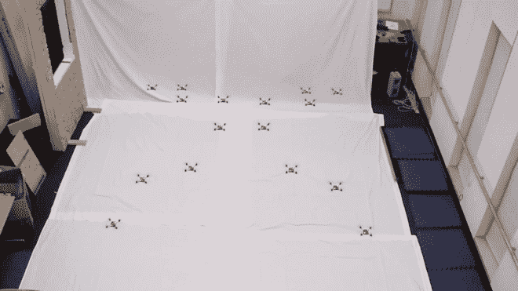
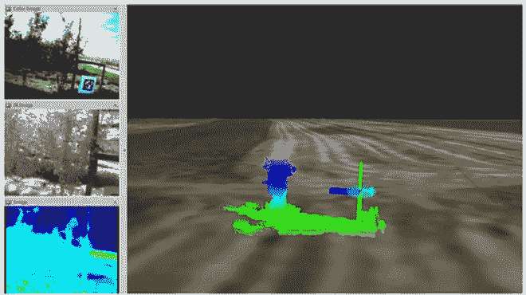
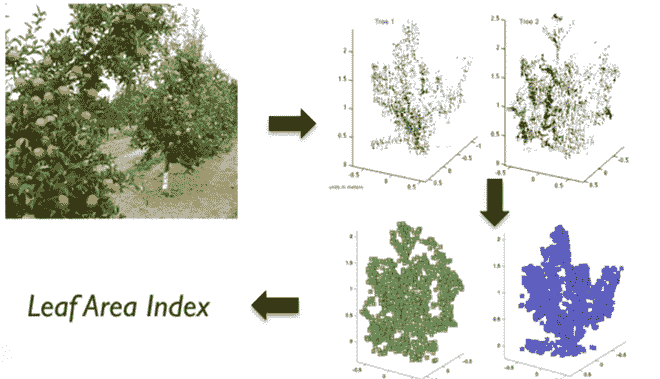
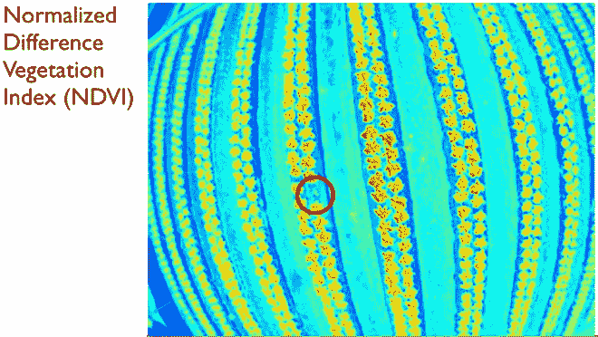

# 群体智能:机器人从蜜蜂身上学到了什么

> 原文：<https://thenewstack.io/bee-inspired-autonomous-robots-improve-crop-yields/>

已经发生了:机器人正在接管。他们正在学习适应大自然。

从[探索小行星](https://thenewstack.io/tumbling-hopping-hedgehog-robot-explore-asteroids/)，到[在月球上建造家园](https://thenewstack.io/3d-printed-buildings-made-by-robots-for-the-earth-moon-and-mars/)，到[经营酒店](https://thenewstack.io/hotel-run-entirely-robots-opens-japan/)并有可能在某一天进行[手术](https://thenewstack.io/self-folding-mini-origami-robots-are-the-nanosurgeons-of-tomorrow/)，各种各样的自主机器人正在被开发，用于许多可能曾经需要人类努力的情况。

首先，良好的老式劳动密集型农业似乎是人类有用的最后堡垒之一——尽管传统农场在上个世纪已经无可否认地经历了巨大的变化，这要归功于机械化和化学品的引入。

但是下一次农业革命很可能是机器人革命。正如许多行业观察家所指出的，“T10”精确农业机器人可能是未来解决日益严重的劳动力短缺问题的答案，并支撑不断下降的产量和效率——这在很大程度上是由可耕地缺乏、环境退化、气候变化、水资源短缺、农作物疾病和[蜂群衰竭失调](https://en.wikipedia.org/wiki/Colony_collapse_disorder)造成的。

## 群体智能

这些迫在眉睫的农业危机正是宾夕法尼亚大学通用机器人、自动化、感知实验室想要用他们的实验机器人来解决的。受蜜蜂的启发，这些[自主、无人驾驶飞行器](https://www.grasp.upenn.edu/projects/autonomous-micro-uavs)(无人机)将通过使用各种机载传感器、摄像机和激光测距扫描仪收集数据，帮助农场主人前所未有地优化产量。这些数据将使农民能够绘制地图，建立模型，并有效地管理他们经营的各个方面。

> 机器人群体的行为就像自然界中的动物群体，其中个体生物将独立地对其邻居和环境做出反应，但在一个分散的、自组织的系统中。

值得注意的是，由于该团队基于所谓的[群体智能](https://en.wikipedia.org/wiki/Swarm_intelligence)的算法，这些轻便的四旋翼机器也可以在没有人类输入的情况下作为“人工机器人群体”集体工作。这些算法是以自然界中群体的行为为模型的，在自然界中，个体生物将独立地对其邻居和环境做出反应，但在一个分散的、自组织的聚合和合作系统中，即使其中一个部分发生故障，该系统也可以继续运行。

这是你在成群的鱼、成群的鸟和成群的蜜蜂中看到的那种行为，正是这些算法对管理大型复杂的机器人网络至关重要，这些机器人网络能够感知、通信和计算。

这些机器人群体将分布在农场或果园，收集植物及其果实数量等数据，以便农民可以估计总产量，优化生产链。可以生成植物及其树冠大小的三维模型，使生产者知道每株植物上有多少“叶面积”可用于光合作用，这提供了每株植物健康程度的指标。

来自机器人群体的视觉和红外传感器的数据可以进行整理，形成显示农场归一化差异植被指数(NDVI)的图像，该图像给出了作物总体健康状况的“全景”，或者在某个区域发生黄化等疾病时直接警告种植者。

果园的 3D 制图。

每一株植物都可以被绘制成图并建模，以确定其可用于光合作用的总叶面积。

来自视觉和红外传感器的数据组合成一幅图像，显示果园的总体健康状况。

在[最近的一次 TED 演讲](http://www.ted.com/talks/vijay_kumar_the_future_of_flying_robots/transcript?language=en)(见下文)中，工程学教授兼院长 Vijay Kumar 负责 GRASP 机器人系统中四旋翼飞行器和集体行为的研究，他深入解释了这些小巧而强大的机器是如何工作的。

[https://www.youtube.com/embed/sj3Pn_pogXw?feature=oembed](https://www.youtube.com/embed/sj3Pn_pogXw?feature=oembed)

视频

大小很重要——在这里，小是最好的，尽管研究人员仍在试图找到平衡点，平衡大小与能效，以及速度和响应时间等其他因素。正如库马尔解释的那样:

> 越小越好， 因为随着尺寸变小，惯性变小。 随着惯性的降低，你对碰撞有抵抗力。 这让你更加健壮。所以就像这些蜜蜂一样，我们制造小型机器人。这个特别的只有 25 克重。它只消耗六瓦特的能量。 它的速度可以达到每秒六米。所以如果我把它的大小归一化，它就像一架以十倍音速飞行的波音 787。

将一大堆这种小动物分布在一个区域，你就有了一个高效、强大的自主系统，它可以扩大规模——无论农场的规模有多大，从小面积农场到工厂式的大型农场。如果在开发这些精准农业机器人时考虑到可负担性，它们可能会成为发展中国家小农场的一个更便宜的选择，因为对这些农场来说，大型、昂贵的设备是不必要的，也是遥不可及的。

库马尔和他的团队估计，精准农业机器人可以将产量提高 10%，并将水、化肥和农药等投入减少 25%。在一个农业部门是淡水最大用户之一的世界里，这一点非常重要。

## 机器人授粉者和自然资源保护者

但是精准农业可能不会止于收获和数据收集。随着大量蜜蜂继续神秘死亡，像哈佛大学的机器人授粉者可能有一天会被部署为我们的农作物授粉或分发农药微粒。人迹罕至地区的自然保护可能是另一种可能性，因为机器人群体可以协调重建受损的深海栖息地，监测污染或用于危及人类生命的危险搜救行动。

但是正如任何技术一样，也有潜在的黑暗面，比如可以用来进入私人住宅监视人们的“[微型机器人](http://www.networkworld.com/article/2222611/microsoft-subnet/the-future-of-drone-surveillance--swarms-of-cyborg-insect-drones.html)，或者可以卸载生物武器而不是杀虫剂的微型机器人刺客。或许很能说明问题的是，在过去十年中，GRASP 用于微型无人机研究的大部分资金都来自美国国防部。毫无疑问，任何技术，尤其是机器人技术，都很有可能以某种形式用于军事目的。

不过，有一件事是肯定的:机器人会一直存在。随着机器人研究的发展，我们肯定会看到更多这种适应性的群体策略被用于应对健康、环境保护和食品安全等紧迫问题。然而，它们是否会被用于人道主义目的，或者最终被用作更致命的毁灭武器，还有待观察。

图片:宾夕法尼亚大学 [GRASP 实验室](https://www.grasp.upenn.edu/)。

<svg xmlns:xlink="http://www.w3.org/1999/xlink" viewBox="0 0 68 31" version="1.1"><title>Group</title> <desc>Created with Sketch.</desc></svg>