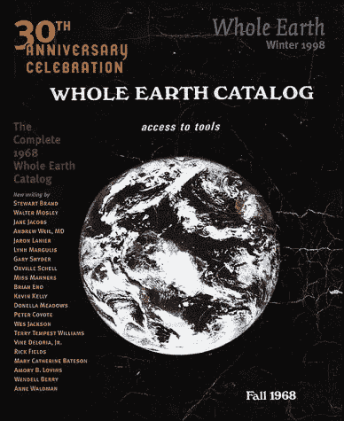
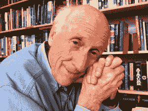

# 在谷歌之前:“全球目录”迎来 50 周年

> 原文：<https://thenewstack.io/before-google-the-whole-earth-catalog-turns-50/>

在基础设施之下隐藏着一种哲学——但是如果你一路追溯到起点，会发生什么呢？据说，几十年前，一种允许信息革命发生的原始文化已经开始酝酿。它的主要工具之一是奇怪的有影响力的“全球目录”，今年已经 50 岁了。

当时嬉皮士和反文化分子所钟爱的纸质目录，也被证明是“整个硅谷革命的核心”，约翰·佩里·巴洛曾打趣道。

为了庆祝这一时刻，约翰·马科夫在《洛杉矶时报》上写了一篇专栏文章，他称“全球目录”[为当时的谷歌搜索引擎](http://www.latimes.com/opinion/op-ed/la-oe-markoff-stewart-brand-whole-earth-catalog-20180328-story.html)。这是史蒂夫·乔布斯首先做的比较，他在 2005 年的[毕业典礼演讲中分享了自己对《全球目录》的美好回忆，称该杂志是“我这一代人的圣经之一……它充满了理想主义，充斥着简洁的工具和伟大的理念。”](https://www.washingtonpost.com/blogs/answer-sheet/post/steve-jobs-told-students-stay-hungry-stay-foolish/2011/10/05/gIQA1qVjOL_blog.html)

Markoff 认为，这让它的影响力超过了纸质搜索引擎。“使用搜索引擎就像快速穿过一个长长的大厅，在门后找到你要找的东西。相比之下，《全球目录》就像一个似乎没有尽头的大厅，相邻的门都敞开着，很容易窥视，”他写道。

Markoff 目前正在写一本关于该杂志创始人 Stewart Brand 的传记，他认为该杂志“引起了成长于一个向上流动但陈旧的社会的一代人的共鸣。”有些版本有一英寸多厚，它的任务很简单。从 1968 年第一期开始，目录的口号就是“获取工具”

在这期杂志的最前面，布兰德展示了他们肯定的哲学。如果一件物品被认为是:

*   作为一种有用的工具，
*   与独立教育相关，
*   高质量或低成本，
*   还不是常识，
*   很容易通过邮件获得。

一篇关于目录目的的配套文章[以“我们是上帝，最好习惯它”开始它谴责格罗斯掩盖实际收益的世界，声称“一个亲密的个人权力的领域正在发展个人的权力，以进行自己的教育，寻找自己的灵感，塑造自己的环境，并与任何感兴趣的人分享他的冒险。](http://www.wholeearth.com/issue/1010/article/195/we.are.as.gods)

"帮助这一过程的工具是由全球目录寻找和推广的."

第一期只印了 1000 份——尽管最终该杂志的销量超过了 200 万份。据《从反主流文化到网络文化:斯图尔特·布兰德、全球网络和数字乌托邦主义的兴起》一书的作者弗雷德·特纳说，它及时地说明了那个时刻。“在 1966 年到 1973 年间，保守估计表明有 1000 万美国人参与了公社，”他在 2006 年告诉一位采访者。“Brand 通过宣传 LSD、立体声音响、书籍、大众汽车等小规模技术的概念向这个群体说话；是建立新的替代社区的工具。”

在那次采访中，特纳试图追溯它与后来的信息革命的联系。“我们倾向于认为互联网的到来改变了一切。我自己的感觉是，互联网出现在一个已经开始改变事物的文化环境中。”

## 它是如何开始的

去年，作家蒂姆·费里斯[在播客](https://tim.blog/2017/11/21/stewart-brand/)中调侃道，斯图尔特·布兰德就像阿甘正传——他出现在每一个历史时刻。据报道，布兰德在 1968 年的“[所有演示之母](https://en.wikipedia.org/wiki/The_Mother_of_All_Demos)上操作了这台相机，在旧金山举行的 ACM/IEEE 计算机学会联合计算机会议上，它展示了第一个完整的计算机硬件和软件系统。

1966 年，布兰德制作了纽扣，为美国国家航空航天局(NASA)发布其地球卫星图像造势。按钮的简单信息？"为什么我们还没有看到整个地球的照片？"他在《全球目录》第一期的封面上刊登了美国国家航空航天局的照片

作为一名前陆军伞兵，布兰德在 29 岁时提出了他的新想法——在从内布拉斯加州他父亲的葬礼上飞回家的途中，[想起了一段历史。他正在读芭芭拉·沃德的《宇宙飞船地球》一书，并试图回答两个问题:我怎样才能帮助我所有正在搬回陆地的朋友？更重要的是，我怎样才能帮助拯救地球？”](https://www.mnn.com/lifestyle/arts-culture/stories/the-whole-earth-catalog-effect)

布兰德最初设想的是一辆经过改装的卡车，提供一个轮子上的商店，分发有用的材料和建议，包括“时髦的生存和露营设备”——以及作为附件的目录，描述卡车上出售的一切。布兰德和他的妻子确实在 1968 年进行了一次“公社之旅”，开着一辆 1963 年的道奇卡车在美国进行了教育之旅——但更实际的是分发一份目录，人们可以通过它直接联系供应商。

## 结束是开始

布兰德的愿景似乎不断从目录中找到出路，进入现实世界。对于最后一期，布兰德甚至委托作家格尼·诺曼(Gurney Norman)写了一整部小说，贯穿了目录的 452 页，然后作为单独的一本书出版。(小说[讲述了一个嬉皮士在一次越野公路旅行中“觉醒”的故事](https://en.wikipedia.org/wiki/Divine_Right%27s_Trip)。)

上一期的封底是一张开阔道路的照片，上面写着“保持饥饿”。呆傻。”但是表现出惊人的活力，最后一期其实连最后一期都算不上。随后是特别版，如“最新全球目录”(1974 年)、“下一个全球目录”(1980 年)、“基本全球目录”(1986 年)和“千禧年全球目录”(1994 年)。

一个档案网站[仍然在线](http://www.wholeearth.com/index.php)，仍然建议游客“保持饥饿”。呆傻。”(还有一条推特消息，尽管它上一次发布是在 2011 年。)

但是根据 2009 年的一系列采访，整个地球摄制组继续在其他方面产生影响。环境活动家休伊·约翰逊记得在 20 世纪 70 年代末，通过收集足够的签名帮助通过一项联邦法律，拯救了加利福尼亚的六条河流——他认为这只是因为“全球目录的人带着这个巨大的、神奇的盒子出现了。你把纸放在一头，它会从别的地方出来。这是一台神奇的机器，叫做传真机。”

但它真正的影响是在文化本身。在同一组采访中，建筑师理查德·沃尔曼记得“在 70 年代初，公众不知道蒙古包是什么，也不知道去哪里买。但是如果你对搬回农村感兴趣，并且需要坚固、便宜的住房，这是无价的信息。我认为你可以从《全球目录》中画出一条相当直的线，指向当今的许多文化。"

约翰·佩里·巴洛还记得《全球目录》催生了其他几个有影响力的项目，包括一个名为“井”的在线社区(代表“全球电子链接”)。巴洛在那里第一次见到了约翰·吉尔摩和米切尔·卡普尔，他们是电子前沿基金会的未来创始人。“布兰德希望为对新技术感兴趣的人提供一个聚集地，他希望为这些人提供一个比杂志更具互动性的论坛。就是这口井。在互联网出现之前，这是数字人的公告板。

[https://www.youtube.com/embed/zOP1LNr70aU?feature=oembed](https://www.youtube.com/embed/zOP1LNr70aU?feature=oembed)

视频

布兰德和他的全球伙伴还帮助组织了黑客大会，大约有 150 名有影响力的程序员、工程师和设计师参加了会议，包括史蒂夫·沃兹尼亚克、理查德·斯托尔曼、泰德·尼尔森和约翰·德雷珀。据说它帮助建立了支撑当今互联网的独立精神，正是在这次会议上，布兰德自己创造了短语“[信息想要免费](http://sb.longnow.org/SB_homepage/Info_free_story.html)”

也许这场革命从未真正结束——直到今天，你仍然可以看到布兰德对人类潜力无限信心的回响。现年 79 岁的布兰德仍在从事一个名为“ [Revive & Restore](http://reviverestore.org/) 的项目，这是一个以生物技术为导向的保护组织，希望复兴旅鸽等灭绝物种，充分利用他 1960 年在斯坦福大学获得的生物学学位。它的口号是“为保护建立 21 世纪的基因拯救工具包”

“我找到了东西，我找到了东西，”布兰德在他的网页上说。他谦虚地写道，他只是找到想法(和工具)以及人和书，“我混合并提供它们。”

* * *

# WebReduce

<svg xmlns:xlink="http://www.w3.org/1999/xlink" viewBox="0 0 68 31" version="1.1"><title>Group</title> <desc>Created with Sketch.</desc></svg>