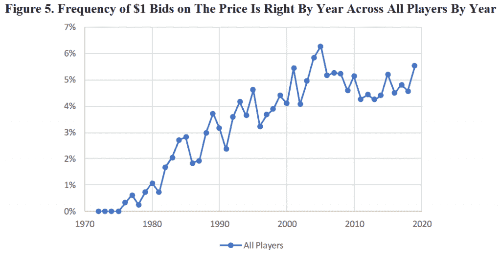

# 为什么参赛者总是对“价格合适”出价过低？行为经济学家的观点

> 原文：<https://thenewstack.io/behavioralist-economist-explores-the-data-on-why-contestants-keep-underbidding-on-the-price-is-right/>

数据分析师面临的第一个问题总是:在哪里可以找到好的数据？不止一名研究人员显然在日间电视游戏节目的编年史中发现了一个宝藏。

本月又出现了一个例子，一位经济作家[探究了美国历史上最长的游戏节目《价格是对的](https://papers.ssrn.com/sol3/papers.cfm?abstract_id=3469008)》47 年来的出价，参赛者在该节目中猜测消费品的价格。哈佛大学公共政策和公共管理学院的行为经济学家 Jonathan S. Hartley 想了解为什么参赛者似乎比过去出价更低。

但他也提出了一些有趣的理论，这些理论对理解消费者具有真正的意义——这总是理解一个经济体是否正在走向衰退的关键第一步——并为新技术可能已经如何改变我们的日常世界提供了新的见解。这是另一个看似愚蠢的问题的例子，这个问题最终可能会在未来几年有真正的用途。它还展示了经济学家如何利用我们现代的在线社区作为新的数据来源——同时也提供了一个有趣的视角，让我们得以一窥行动中的学院派经济学家的世界。

在他的网页上，Hartley 称自己是“一名对宏观经济、金融和体育分析感兴趣的经济学作家和研究员”，拥有沃顿商学院的 MBA 学位和芝加哥大学的经济学学士学位，称他为经济学神童可能是安全的。他曾在高盛资产管理公司担任固定收益投资组合构建和风险管理助理，以及达拉斯牛仔队的统计分析师。他的个人网站称，他还在美联储银行和芝加哥联邦储备银行担任过“不同的角色”，他的文章出现在《福布斯》、《华尔街日报》和《金融时报》等媒体上。2017 年何[登上《福布斯》“30 岁以下 30 人”](https://www.forbes.com/profile/jon-hartley/?list=30under30-law-policy#6970331920e0)[法律&政策榜](https://www.forbes.com/30-under-30-2017/law-policy/#3540802d1f69)。

哈特利的论文“疏忽和价格随时间的变化:来自‘价格是正确的’的实验证据”认为，该节目 50 年的数据使其成为“理解近几十年来对价格的关注如何变化的自然实验”。将近 30，000 次，节目的快乐主持人从观众中召集了四个兴奋的参赛者“下来”猜测一套奖品的价格。

但哈特利指出，这些年来，他们一直低估这些价格，“幅度越来越大。”我们是否越来越不关注商品的价格了？

### **逼近一个答案**

总共有 29，622 次摊牌要考虑——每次有四个投标人，总共有 118，488 个投标——哈特利认识到自己的黄金机会，“得出几个关于自 1972 年以来价格投标行为和信息如何演变的结论。”

人们从哪里得到这样的数据呢？来自[的《价格合适》剧集指南](http://tpirepguide.com/?page_id=11)，当然，这是一个在线数据宝库，“里面有超过 5000 个节目的抄本”该网站将自己描述为“一个规模宏大且鲁莽的项目”，指出有近 12.5 人重述了单个剧集，还有数十人将他们的剧集视频上传到 YouTube。多亏了这些志愿者的慷慨，从过去 50 年的大部分时间里成千上万的剧集中可以得到数据。他还仔细检查了过去 47 年的官方消费者价格指数，发现游戏节目的奖品价格与通货膨胀率保持一致。

经过对所有数据的分析，结果中出现了一个清晰的模式。“近几十年来，平均投标偏差已经从 20 世纪 70 年代的约-5%下降到 21 世纪头十年的约-20%。”

当然，还有一个因素在起作用。最后一个竞标者知道，如果他们的出价高于奖品的实际价格，所有的出价都将被取消——所以一个常见的策略是出价 1 美元，这表明他们厚脸皮地相信其他人的出价都太高了。如果这种情况发生得更频繁，显然会拉低平均出价，哈特利报告称，最终玩家出价仅为 1 美元的可能性是其他人的两倍，而且节目播出的时间越长，这种情况就越频繁。“随着时间的推移，参赛者可能会从观看节目中成功的 1 美元出价中学习，1 美元出价的频率会慢慢影响更多的 1 美元出价。”

但幸运的是，他准备调整他的统计数据，通过重新运行没有异常 1 美元出价的计算，并计算每个季度“价格是正确的”的平均年中值偏差。

哈特利写道，虽然这似乎是一个微不足道的工作，“这些结果对通胀预期和价格动态的形成有几个影响”。

### **模式识别**

例如，Hartley 还注意到，基于进行投标当月密歇根大学的官方通胀预期数字，投标偏差与通胀预期相关。“密歇根大学通胀预期增加 1%，与玩家 1-4 的“价格合适”出价相对于物品价格分别增加 1.37%、0.81%、0.79%和 2.63%…”

他假设，当通货膨胀率低的时候，也许人们就不再关注价格了。但他也指出，在过去的九年里，随着时间的推移，价格的波动性越来越小——因此，了解商品价格的总体好处也就越来越少。他引用 2016 年的一项研究指出，也许年轻一代没有太多应对通胀的经验，该研究发现，人们在制定对未来*通胀的预期时，会“高估”他们一生中经历过的通胀。*

 *哈特利还提出了另一种可能的解释:“新技术的引入减少了获取和保留此类价格信息的好处……可能……技术和电子商务网站的扩张使获取价格信息变得更加容易，这可能会阻碍价格信息的保留。”

就此而言，消费者似乎只是对市场中由技术引发的变化做出反应。哈特利总结了 2018 年的一项研究，该研究报告称，在线竞争“在过去 10 年里，提高了美国各地价格变化的频率和统一定价的程度。”线下零售商会跟随线上竞争对手的行为，因此，即使你想仔细跟踪价格，这种更高频率的价格变化也会让你更难做到。还有另一个可能的因素:更多的产品差异。

哈特利建议说，这一切都让“价格合适”的参赛者日子不好过。“获得所需的价格信息来更准确地猜测商品价格可能会变得极其困难。”

因此，虽然游戏规则没有改变，但消费者的世界变得更加不稳定。生活经历也发生了变化，甚至通胀本身也从上世纪 70 年代不可预测的飙升中有所收敛。这一切为评估过去的半个世纪提供了又一种方式，并在我们进入 2019 年 12 月时，反思我们在这个时代看到的变化以及当今世界的新技术。

如果你今年要为某个特别的人挑选礼物，这又是一个问自己的理由…价格是否真的合适？

* * *

# WebReduce

<svg xmlns:xlink="http://www.w3.org/1999/xlink" viewBox="0 0 68 31" version="1.1"><title>Group</title> <desc>Created with Sketch.</desc></svg>*