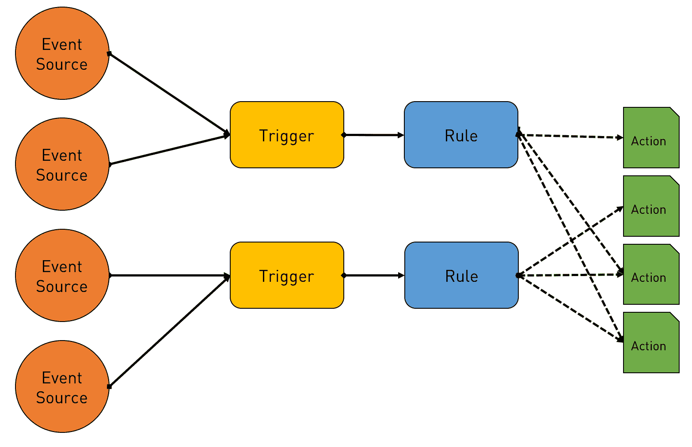
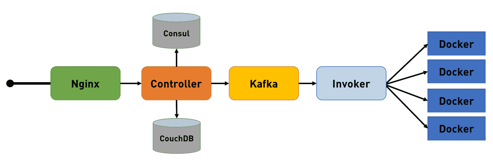
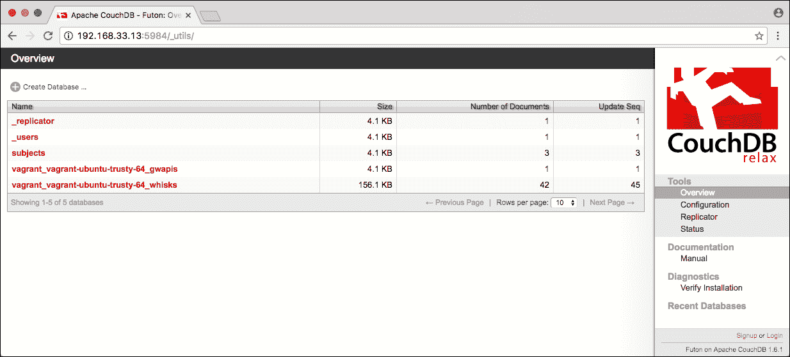
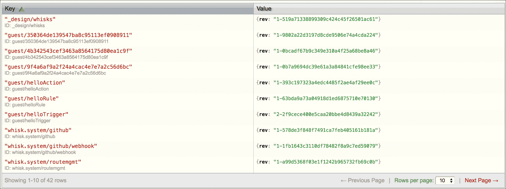
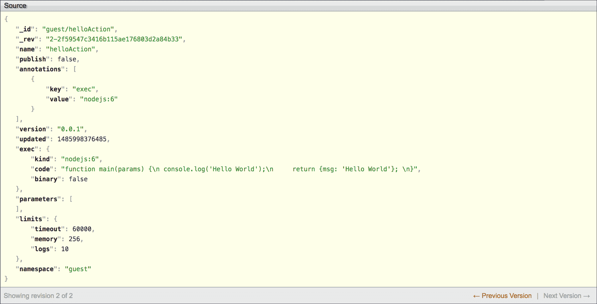
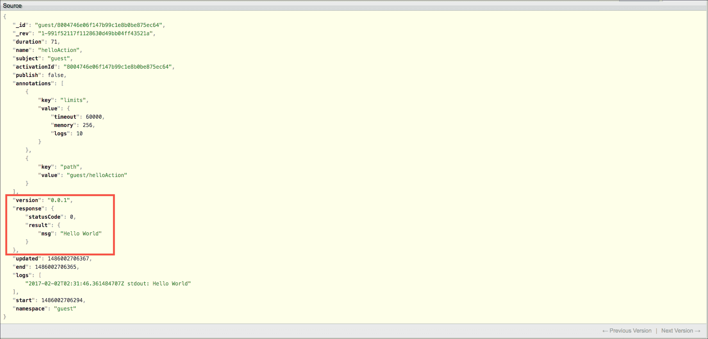
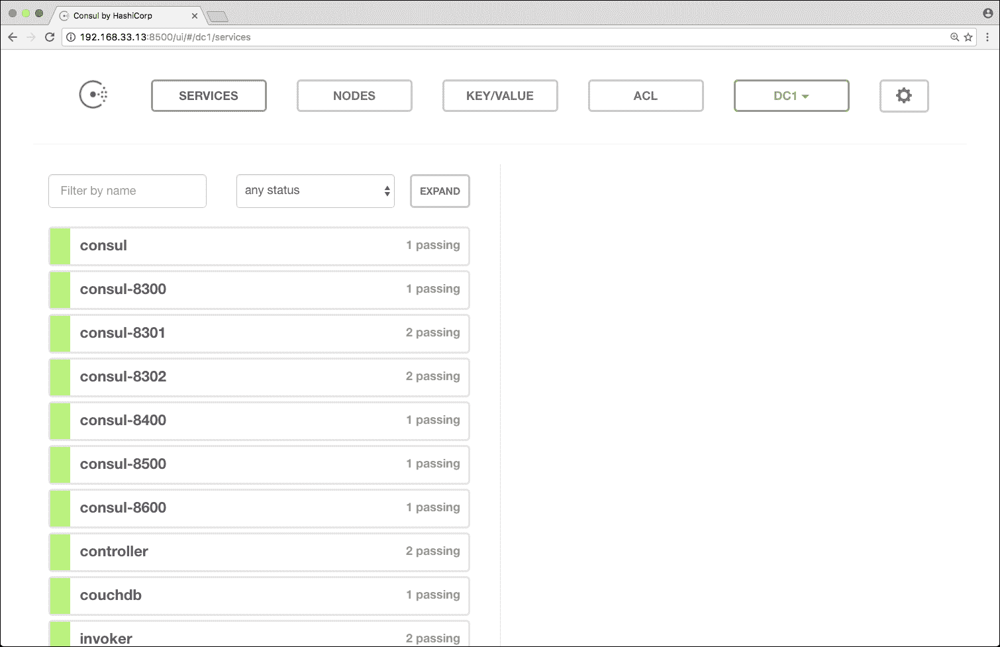
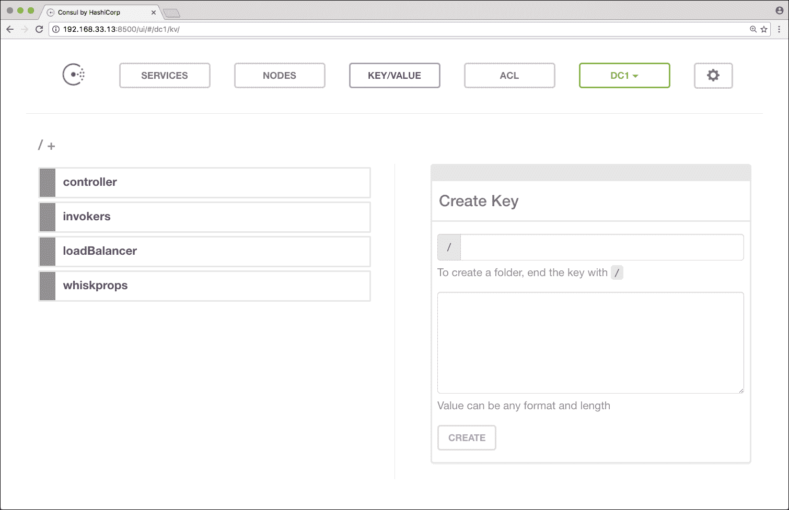

# Apache OpenWhisk 的架构视图

> 原文：<https://thenewstack.io/behind-scenes-apache-openwhisk-serverless-platform/>

由 IBM 和 Adobe 推动的开源项目， [Apache OpenWhisk](http://openwhisk.org/) 是一个健壮的功能即服务(FaaS)平台，可以部署在云中或数据中心内。与其他[无服务器](/category/serverless/)项目相比，OpenWhisk 是一个健壮的、可伸缩的平台，旨在支持数千个并发触发器和调用。

你可以注册运行在 [Bluemix](https://console.ng.bluemix.net/openwhisk/) 上的 OpenWhisk 的托管版本，或者在你的开发机器上部署一个基于流浪者的环境。参考我们之前关于 OpenWhisk 入门的报道。

在本文中，我们将探索 OpenWhisk 的设计和架构。我们将深入部署的幕后，确定各种组件及其角色。

为了充分利用本指南，建议您在机器上运行一个基于[vacant](https://www.vagrantup.com/)的完整配置的 OpenWhisk 环境。OpenWhisk 的 CLI， **wsk** ，应该配置为与本地设置对话。

## 架构的快速回顾

Apache OpenWhisk 被设计成一个异步的、松散耦合的执行环境，可以根据外部触发器运行函数。开发人员编写独立的函数，作为**动作**上传，这是完全自主的，独立于事件源。只要事件源传递了调用所必需的一组正确的参数，就可以调用它们。

一旦操作就绪，开发人员就可以创建**触发器**，它们是由事件源(如数据库、流处理引擎、文件系统和业务线应用程序)显式调用的端点。动作独立于触发器，这意味着它可能有也可能没有绑定任何动作。当事件源触发触发器时，它不知道可能会调用的操作。绑定到触发器的动作集仅在运行时被发现和执行。

但是，开发人员如何将动作与触发器绑定在一起呢？这就是**规则**发挥作用的地方。它们通过在触发器和动作之间创建松散耦合的关联，充当触发器和动作之间的粘合剂。这种设计模式允许不同的触发器调用相同的动作。



这种松散耦合的架构使得 OpenWhisk 成为一个可伸缩的、可靠的、健壮的无服务器平台。执行中涉及的每一层都被设计为独立扩展。

可以通过 REST 端点创建和管理动作、规则和触发器。事件源调用一个动作所需要做的就是调用触发器 REST API。

下面展示的工作流强调了创建和调用代码的简单而强大的机制:

```
$  cat  &gt;  hello.js  &lt;&lt;  EOF

function main()  {

    console.log('Hello World');

    return  {msg:  'Hello World'};

}

EOF

$  wsk  -i  action create helloAction hello.js

ok:  created action helloAction

$  wsk  -i  trigger create helloTrigger

ok:  created trigger helloTrigger

$  wsk  -i  rule create helloRule helloTrigger helloAction

ok:  created rule helloRule

$  wsk  -i  trigger fire helloTrigger

ok:  triggered  /guest/helloTrigger with id  350364de139547ba8c95113ef0908911

```

## OpenWhisk 的构建模块

现在让我们仔细看看 OpenWhisk 的核心组件。

下图描述了 OpenWhisk 的高级架构。从 Nginx 到 Kafka 到 Docker，多种技术正在为这个无服务器平台提供动力。



如果你有进入流浪者盒子的权限，用 SSH 进入它来检查正在运行的 Docker 容器和系统提取的图像:

```
$  docker ps  --format  "{{.Names}} - {{.Image}}"

wsk0_425_warmJsContainer_20170202T014345371Z  -  whisk/nodejs6action:latest

wsk0_424_warmJsContainer_20170202T014153330Z  -  whisk/nodejs6action:latest

nginx  -  nginx:1.11

invoker0  -  whisk/invoker:latest

controller  -  whisk/controller:latest

kafka  -  ches/kafka:0.10.0.1

zookeeper  -  zookeeper:3.4

registrator  -  gliderlabs/registrator

consul  -  consul:0.7.0

couchdb  -  couchdb:1.6

```

前两个容器代表最近调用的动作，而其他容器直接映射到核心组件。

让我们了解一下这些组件的作用。

### Nginx

这个[开源 web 服务器](https://www.nginx.com/)向客户端公开了面向公众的 HTTP(S)端点。它主要用作 API 的反向代理，也用于终止 SSL。每个到达 OpenWhisk 基础设施的请求，包括来自 wsk CLI 的请求，都要经过这一层。由于 Nginx 层完全是无状态的，因此可以很容易地向外扩展。

### 控制器

在一个请求通过反向代理后，它会到达控制器，控制器充当系统的看门人。这个组件用 Scala 编写，负责 OpenWhisk API 的实际实现。在将控制权移交给下一个组件之前，它会对每个请求进行身份验证和授权。请将此视为系统的指挥者，它将决定请求最终将采取的路径。

### CouchDB

系统的状态在 [CouchDB](http://couchdb.apache.org) 中维护和管理，这是一个开源的 [JSON 数据存储](http://www.json.org/)。凭证、元数据、名称空间以及动作、触发器和规则的定义都存储在 CouchDB 中。控制器对照存储在该数据库中的凭证来验证凭证。

您可以通过访问**http://192 . 168 . 33 . 13:5984/_ utils/**从浏览器访问数据库(该链接仅在开发人员机器上有效)



我们创建的初始动作、触发器和规则集可见于**http://192 . 168 . 33 . 13:5984/_ utils/database . html？流浪者 _ 流浪者-ubuntu-trusty-64_whisks** :



有趣的是，我们的 helloAction 的源代码也保存在 CouchDB 中，其中有操作的定义、默认参数和分配的资源配额:



OpenWhisk 中的每次调用都会导致一个包含动作输出的激活。例如，下面的命令异步调用 helloAction，产生一个新的激活 Id:

```
$  wsk  -i  action invoke helloAction

ok:  invoked  /guest/helloAction with id  8004746e06f147b99c1e8b0be875ec64

The output of this invocation can be retrieved through the following command.

$  wsk  -i  activation get  --summary  8004746e06f147b99c1e8b0be875ec64

activation result for  /guest/helloAction  (success at  2017-02-02  08:01:46  +0530  IST)

{

   "msg":  "Hello World"

}

```

我们可以看到输出存储在 CouchDB 中。



### 领事

当代的分布式计算平台，如 OpenWhisk、Kubernetes 和 Swarm，依赖于分布式键/值存储进行状态管理。OpenWhisk 使用[consult](https://www.consul.io)作为系统每个组件都可以访问的单一事实来源。它还提供了服务发现功能，使控制器能够轻松地发现将调用某个操作的实体。这些实体被称为**调用者**，它们直接负责执行代码。Consul 维护一个可用调用程序及其健康状态的列表。

Consul 由**注册员**支持，该注册员监视新的码头集装箱，并检查它们以决定它们提供的服务。当 Docker 引擎创建一个新容器时，Registrator 会收到一个事件，该事件会被推入 Consul。

当控制器需要将动作委托给调用者时，它会在 Consul 存储中查找以挑选理想的候选对象。

点击**http://192 . 168 . 33 . 13:8500/ui/#/dc1/services**网址，探索 Consul:



您可以通过访问**http://192 . 168 . 33 . 13:8500/ui/#/dc1/kv/Invokers/**查看可用的调用程序:



### 卡夫卡

[Apache Kafka](https://kafka.apache.org/) 通常用于构建实时数据管道和流媒体应用。它支持许多需要可靠、高速数据接收的生产工作负载。OpenWhisk 利用 Kafka 连接控制器和调用者。

Kafka 缓冲控制器发送的消息，然后将它们发送给在前一阶段从 Consul 中挑选的调用者。当 Kafka 确认消息被传递时，控制器立即用激活 ID 进行响应。这种无状态架构使得 OpenWhisk 具有高度的可伸缩性。

阿帕奇动物园管理员负责维护和管理卡夫卡集群。Zookeeper 的主要工作是跟踪 Kafka 集群中节点的状态，并跟踪主题、消息和配额。

### 调用者

用 Scala 编写的调用者处理执行过程的最后阶段。基于运行时需求和配额分配，它旋转出一个新的 Docker 容器，作为所选动作的执行单元。调用者从 CouchDB 复制源代码，并将其注入 Docker 容器。一旦执行完成，它会将激活的结果存储在 CouchDB 中，以供将来检索。调用者决定是重用现有的“热”容器，还是启动暂停的“热”容器，或者为新的调用启动新的“冷”容器。它在 Consul 中查找容器的状态以进行适当的调用。

根据平台的负载和利用率，可能有多个调用者。

根据元数据，调用者选择使用哪个容器映像。下面是调用 helloAction 产生的两个容器。

```
$  docker ps  --format  "{{.Names}} - {{.Image}}"|  grep  "JsContainer"

wsk0_457_warmJsContainer_20170202T035154330Z  -  whisk/nodejs6action:latest

wsk0_456_warmJsContainer_20170202T035037341Z  -  whisk/nodejs6action:latest

```

### 码头工人

Apache OpenWhisk 是建立在包括 [Docker](http://www.docker.io) 在内的成熟开源技术之上的，这一点起着非常重要的作用。OpenWhisk 的几乎所有组件都打包并部署为容器。从 Nginx 到 Kafka 再到 Consul，平台中的一切都作为一个容器运行。

请参考 [Docker Hub](https://hub.docker.com/u/openwhisk/) 上的可用图像，获取 OpenWhisk 容器图像列表。

### 即将推出:API 网关

尽管还没有完全集成，OpenWhisk 也有一个内置的 API 网关来将动作作为 HTTP 端点公开。基于 Openresty 和 Nginx，这个开源项目是由 Adobe[维护](https://github.com/adobe-apiplatform/apigateway)的。

这种能力目前是作为一种试验性的特性。以下命令显示了可能的选项。

```
$  wsk  -i  api-experimental

work with APIs

Usage:

 wsk api-experimental  [command]

Available Commands:

 create       create  a  new API

 get          get API details

 delete       delete an API

 list         list APIs

```

## 摘要

OpenWhisk 是一个学习分布式系统和无服务器平台的迷人项目。必须感谢 IBM 和 Adobe 将其捐赠给 Apache 基金会，鼓励社区参与。虽然许多开源无服务器平台在最近几年如雨后春笋般涌现，但 OpenWhisk 因其健壮的架构和设计而脱颖而出。

选择开源组件来构建 OpenWhisk 是最好的选择。他们为平台的整体成功做出了贡献。

我希望在接下来的几个月里能看到更多人采用 OpenWhisk。请关注这个空间，获取关于将 OpenWhisk 与流行的数据库、存储引擎和 API 网关集成的教程。

<svg xmlns:xlink="http://www.w3.org/1999/xlink" viewBox="0 0 68 31" version="1.1"><title>Group</title> <desc>Created with Sketch.</desc></svg>