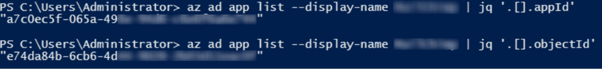

# 旭日袭击的幕后

> 原文：<https://thenewstack.io/behind-the-scenes-of-the-sunburst-attack/>

 [利奥·松塔格

Lior 是 Check Point 软件技术公司的安全研究员。他是一个安全爱好者，喜欢把东西打碎再装回去。他热衷于各种 InfoSec 主题，如云安全、攻击性安全、漏洞研究和逆向工程。](https://www.linkedin.com/in/lior-sonntag-229255143/) 

近年来最大的网络攻击似乎是以国家支持的供应链攻击的形式出现的，去年 12 月，网络安全管理软件产品的 Orion 产品上安装了 SUNBURST 恶意软件。这成为全球头条新闻是有原因的，因为妥协后的活动包括通过横向移动窃取数据，这是指攻击者在网络中移动，搜索目标关键数据和资产。这次袭击是一名技术高超的行动者所为，行动是在高度安全的情况下进行的。

这种攻击包括威胁参与者从内部网络到云的横向移动，它分两个阶段完成:

1.  **第一阶段:内部黄金样本攻击**。在这里，威胁参与者获得了对组织的活动目录联合服务(ADFS)服务器的管理访问权。这使得他们能够伪造安全声明标记语言(SAML)令牌，并创建非法的 SAML 信任关系注册。通过模拟具有有效管理凭证的用户，威胁参与者可以更改 SAML 服务提供者(在本例中是 Azure AD)的配置。从那里，他们成功地获得了 Azure AD 的管理权限。
2.  **第二阶段:云中的恶意活动**。然后，威胁参与者使用 Azure Active Directory 管理凭据进行恶意活动。这包括(但不限于):列举现有的应用程序和服务主体，向它们注入凭据，代表它们模拟和执行操作，以及泄漏用户和邮件等敏感数据。

 [德罗尔·阿龙

Dror 是 Check Point 软件技术公司的安全研究小组组长。他是网络领域的积极研究者；调查网络事件，识别和解决全球组织面临的安全问题。](https://www.linkedin.com/in/dror-alon-2b77a9118/) 

在此分析中，我们将重点关注**第二个攻击阶段(在云端)，**并展示民族国家参与者在恶意活动中使用的关键战术和技术。通过使用[米特 ATT & CK](https://attack.mitre.org/matrices/enterprise/cloud/) 框架，我们将提供最有可能的民族国家行动者的技术攻击流程。

回顾[微软的文章](https://techcommunity.microsoft.com/t5/azure-active-directory-identity/understanding-quot-solorigate-quot-s-identity-iocs-for-identity/ba-p/2007610)，通过这次攻击发生的一连串事件是:

1.  **初始访问(本地)**:伪造 SAML 令牌和非法注册 SAML 信任关系；使用管理凭据模拟用户(在本例中是 Azure AD)。
2.  **发现:**威胁参与者列举现有的应用程序/服务主体(最好具有高流量模式)。
3.  **凭证访问**:威胁参与者向现有的应用程序或服务主体添加凭证。
4.  **权限提升**:威胁参与者提升应用程序/服务主体的权限，以允许访问 MS Graph APIs 应用程序权限。
5.  **防御规避和横向移动**:威胁参与者获取应用程序的 OAuth 访问令牌，允许他们冒充应用程序并混淆其活动。
6.  **渗透:**威胁者调用 MS Graph APIs 来渗透敏感数据，如用户数据和电子邮件。

这里我们将重点介绍初始认证后**云环境**中的攻击流程(即**步骤 2-6** )。但是首先，让我们详细说明一下 [AzureAD 认证和授权机制](https://docs.microsoft.com/en-us/azure/active-directory/develop/authentication-vs-authorization)。

简而言之，认证就是证明你就是你所说的那个人。这是由身份提供者(在本例中是 Azure AD)完成的。授权是授予经过身份验证的一方做某事的权限的行为。这是由身份试图查询的资源利用 OAuth 2.0 协议来完成的。

## **发现**

首先，威胁参与者通过损害特权云用户对 Azure AD 的管理访问权，获得了进入云环境的最初立足点。然后，他们向现有的应用程序或服务主体添加凭据。但是，为了做到这一点，威胁参与者需要首先列出所有现有的应用程序:

威胁参与者更喜欢具有高流量模式的应用程序(如邮件归档应用程序)，这些应用程序可用于混淆他们的活动。因此，他们决定选择“ **MailApp** ”(一个虚构的应用程序名称)，并提取其 **ObjectId** 和 **ApplicationId** :

此外，威胁参与者提取帐户的 **tenantId** :

## **凭证访问**

接下来，威胁参与者创建新凭据并将它们添加到应用程序中:

或者，威胁参与者可以创建新的凭据，并将它们添加到与 MailApp 应用程序关联的现有服务主体:

在这个阶段之后，威胁参与者拥有应用程序的凭证——可以用来代表应用程序向 AzureAD 进行身份验证。

## **应用/服务主体权限提升**

在此步骤中，威胁执行元列出了与 Microsoft Graph APIs 相关的所有可用权限:

威胁参与者决定添加**用户。MailApp 应用程序的 ReadWrite.All** 权限:

之后，威胁参与者列出了与**邮件**相关的以及与 Microsoft Graph API 相关的所有可用权限:

他们决定也添加**邮件。对 MailApp 应用程序的读写**权限:

红色错误表示必须启动**管理员同意**来批准该权限。

**管理员同意**工作流为管理员提供了一种安全的方式来授予对需要管理员批准的应用程序的访问权限。当用户试图访问应用程序但无法提供许可时，他们可以发送请求以获得管理员批准。请求被发送给被指定为审阅者的管理员。

由于执行元已经拥有管理权限，他们可以自行启动管理许可:

管理员同意成功，Microsoft Graph APIs 权限已成功添加到 MailApp 应用程序！

## **防守闪避和横向移动**

然后，参与者通过发起一个 HTTP GET 请求来获取应用程序的 OAuth **访问令牌**，该请求包括之前获得的 **tenantId** 、 **objectId** 、 **appId** 和 **secret** (凭证):

这个访问令牌使参与者能够横向移动，模拟 MailApp 应用程序，并代表它执行操作。

## **渗出**

最后，威胁参与者使用分配给 MailApp 应用程序的权限调用 API。

威胁参与者发起了一个 HTTP GET 请求，该请求包括访问令牌，用于过滤租户中的**所有用户**和**与特定用户相关的所有电子邮件**。

用户渗出

电子邮件泄漏

电子邮件主题泄露

总之，SUNBURST 攻击是我们这个时代迄今为止最复杂的攻击之一——从内部扩展到云中。威胁者使用先进的技术来掩盖他们的踪迹；在一个攻击流中使用发现、凭据访问、权限提升、横向移动、防御规避和渗透。

自攻击以来，受 SUNBURST 影响的受害者人数持续上升，并且可能在任何云提供商身上再次发生。许多安全厂商正在提供免费试用版,以帮助组织掌握其环境的安全性。虽然这是朝着正确方向迈出的一步，但问题是，你知道要寻找什么吗？你准备好了吗？

通过 Pixabay 的特征图像。

<svg xmlns:xlink="http://www.w3.org/1999/xlink" viewBox="0 0 68 31" version="1.1"><title>Group</title> <desc>Created with Sketch.</desc></svg>