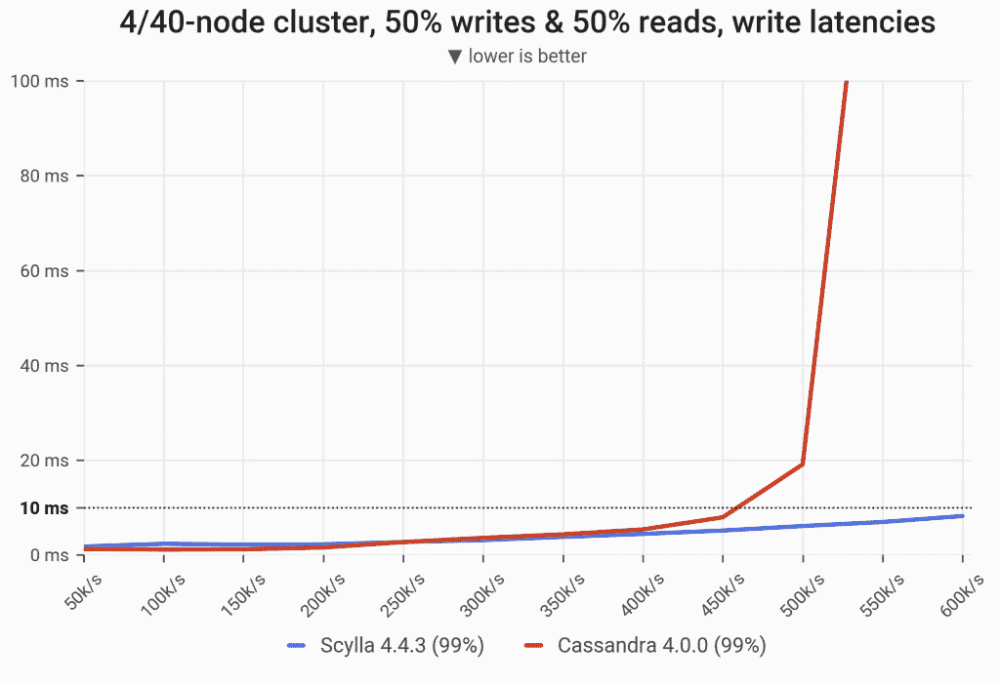
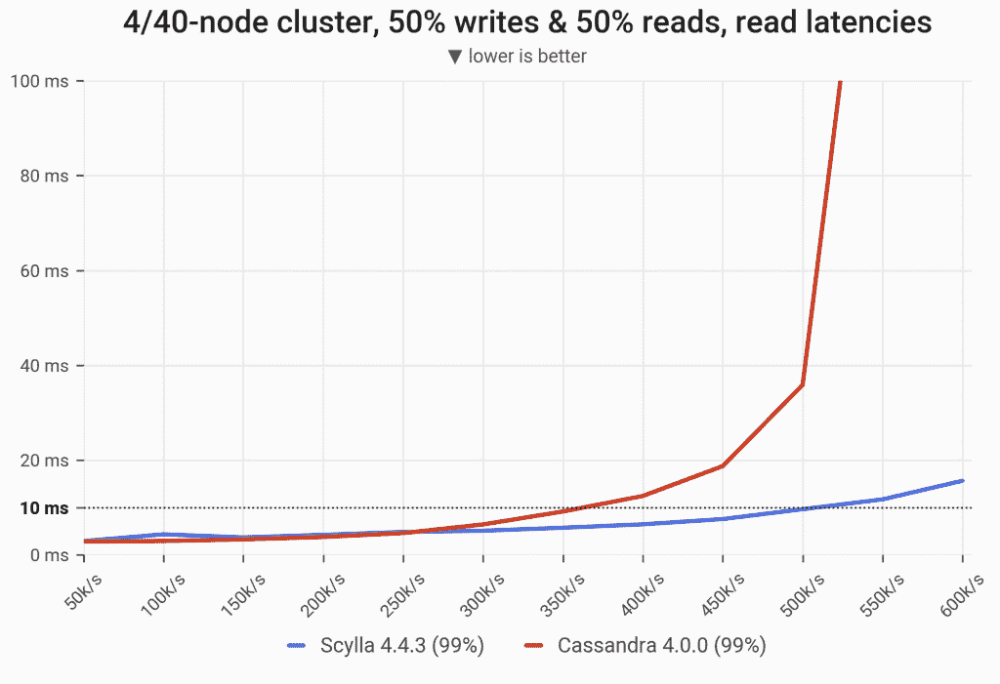
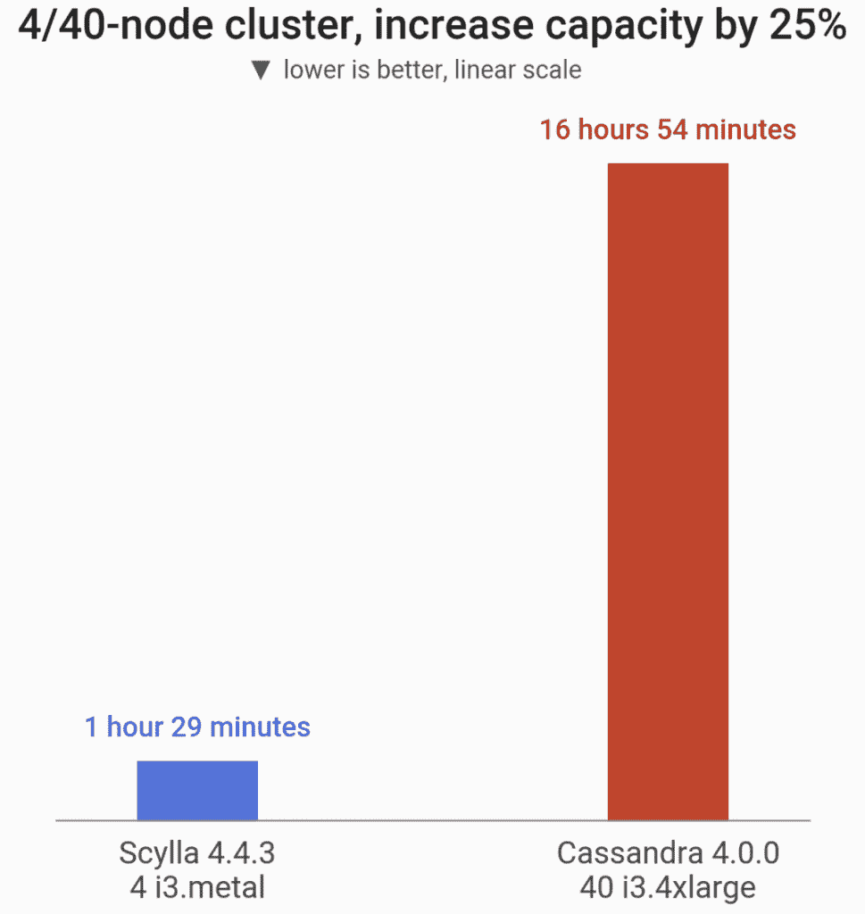
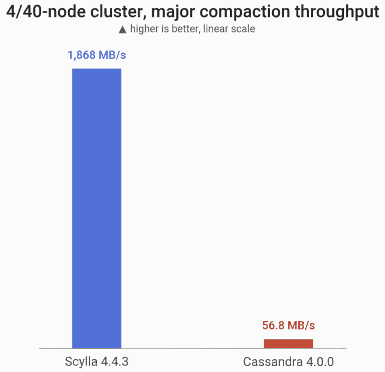

# Apache Cassandra (40 个节点)与 ScyllaDB (4 个节点)的基准测试

> 原文：<https://thenewstack.io/benchmarking-apache-cassandra-40-nodes-vs-scylladb-4-nodes/>

[Juliusz Stasiewicz](https://www.linkedin.com/in/juliusz-stasiewicz-a401678a/?originalSubdomain=pl)

[Juliusz 是 ScyllaDB 的一名软件工程师。他还在许多公司从事 C++编程，包括 Samsung 和 DataStax。](https://www.linkedin.com/in/juliusz-stasiewicz-a401678a/?originalSubdomain=pl)

自从十多年前数据库管理系统的 NoSQL 革命开始以来，各种规模的组织都受益于一个关键特征:使用相对便宜的商用硬件的大规模。它使组织能够部署昂贵得无法用传统关系数据库系统扩展的架构。

商用硬件本身在同一十年中也经历了转变，但大多数现代软件并没有利用现代计算资源。大多数面向数据密集型应用的横向扩展框架都无法纵向扩展。他们无法利用大型节点提供的资源，如增加的 CPU、内存和固态硬盘(SSD)，也无法高效地在磁盘上存储大量数据。

彼得·格拉博斯基

从年轻时起，Piotr 就参加了许多竞争性的编程竞赛。他总是努力掌握最新的商业和科技新闻，没有一天不查看他的 RSS 阅读器。Piotr 拥有华沙大学的计算机科学学士学位，现在正在攻读硕士学位。

托管运行时，如 Java，进一步受到堆大小的限制。多线程代码由于其锁定开销和缺乏对非统一内存架构(NUMA)的关注，对现代硬件架构造成了显著的性能损失。

软件无法跟上硬件的进步，这导致人们普遍认为，在许多小节点上运行数据库基础设施是扩展大规模工作负载的最佳架构。另一种方法是使用大型节点的小型集群，这种方法经常受到质疑。一些常见的问题是大型节点不会得到充分利用，它们在横向扩展时很难传输数据，最后，它们可能会对恢复时间产生灾难性影响。

根据我们使用 ScyllaDB 的经验，ScyllaDB 是一种快速、可扩展的数据库，它充分利用了现代基础设施和网络功能，我们相信纵向扩展优于横向扩展。所以，我们对它进行了测试。

 [凯罗尔·巴里拉

凯罗尔是 ScyllaDB 的一名初级软件工程师。他经常作为团队“Armia Prezesa”的成员参加安全 CTF (Capture the Flag)竞赛，在那里他解决 web 安全和逆向工程任务。他目前正在华沙大学攻读计算机科学硕士学位。](https://pl.linkedin.com/in/k-baryla) 

ScyllaDB 与 Apache Cassandra API 兼容(也与 DynamoDB 兼容)；它提供了相同的 Cassandra 查询语言(CQL)接口和查询，相同的驱动程序，甚至相同的磁盘表格式。我们的核心 [Apache Cassandra 4.0 性能基准测试](https://thenewstack.io/how-much-faster-is-apache-cassandra-4-0)对 ScyllaDB 和 Cassandra 使用了相同的三节点硬件(T1；DR，ScyllaDB 性能提高 3 到 8 倍)。因为 ScyllaDB 在垂直方向上伸缩性很好，所以我们执行了一个我们称之为“4×40”的测试，在一个大规模的设置中，我们使用了每个数据库的最佳节点大小。由于 ScyllaDB 的[架构充分利用了极大的节点](https://www.scylladb.com/product/technology/)，我们比较了四台 i3.metal 机器(总共 288 个 vcpu)与 40 台 i3 . 4x 大型 Cassandra 机器(总共 640 个 vcpu，几乎是 ScyllaDB 资源的 2.5 倍)的设置。

就 CPU 数量、RAM 容量或集群拓扑而言，这似乎是苹果与橙子的比较。你可能想知道为什么有人会考虑这样的测试。毕竟，我们是在比较四台机器和 40 台完全不同的机器。由于 ScyllaDB 的每核分片架构和定制内存管理，我们知道 ScyllaDB 可以利用非常强大的硬件。与此同时，Cassandra 及其 JVM 的垃圾收集器被优化为大量分布在许多更小的节点上。

该测试的真正目的是看看这两种 CQL 解决方案是否能在这场决斗中表现相似，即使 Cassandra 需要的硬件是它的 2.5 倍，成本是它的 2.5 倍。这里真正的利害关系是减少管理负担:一个数据库管理员可以只维护 4 台服务器而不是 40 台吗？

## 4 x 40 节点设置

我们在 us-east-2 数据中心内的单个可用性区域中的 Amazon EC2 上设置了集群。ScyllaDB 集群由四个 i3.metal 虚拟机组成，竞争对手 Cassandra 集群由 40 个 i3 . 4x 大型虚拟机组成。服务器使用 Ubuntu 20.04 (Cassandra 4.0)或 CentOS 7.9 (ScyllaDB 4.4)的干净机器映像(ami)进行初始化。

除了集群之外，还使用了 15 台 loader 机器来运行 cassandra-stress 以插入数据，并在稍后以 CL=QUORUM 提供后台负载，以扰乱管理操作。

一旦启动并运行，两个数据库都以 RF=3 加载随机数据，直到集群的总磁盘使用量达到大约 40 TB。这相当于每个 Cassandra 节点 1 TB 的数据和每个 ScyllaDB 节点 10 TB 的数据。加载完成后，我们刷新数据并等待压缩完成，这样我们就可以开始实际的基准测试了。

剧透:我们发现 ScyllaDB 集群的节点数量可以减少 10 倍，在集群上运行的成本降低 2.5 倍，但仍保持与 Cassandra 4 相当的性能。事情是这样发展的。

## 吞吐量和延迟

**更新查询**

下面显示了 90%和 99%的更新查询延迟，测量对象为:

*   四节点 ScyllaDB 集群(4 个 i3.metal，总共 288 个 vCPUs)
*   40 节点 Cassandra 集群(40 个 i3.4x 大，总共 640 个 vCPUs)

工作负载是均匀分布的——数 TB 数据集中的每个分区都有同等的机会被选择/更新。

低负载下，Cassandra 略胜 ScyllaDB。原因是 ScyllaDB 在空闲时会自动运行更多的压缩，默认的调度程序 0.5 毫秒会降低 P99 的延迟。(注意，有一个参数控制这一点，但是我们希望提供开箱即用的结果，不需要任何定制调整或配置。)

高负载下 P99 延迟<10 milliseconds, ScyllaDB’s throughput on four nodes was 33% higher than Cassandra’s on 40 nodes.

**选择查询**

下面显示了选择查询的 99%延迟，测量依据是:

*   四节点 ScyllaDB 集群(4 个 i3.metal，总共 288 个 vCPUs)
*   40 节点 Cassandra 集群(40 个 i3.4x 大，总共 640 个 vCPUs)

工作负载是均匀分布的——数 TB 数据集中的每个分区都有同等的机会被选择/更新。在低负载下，Cassandra 的表现略优于 ScyllaDB。在 P99 延迟< 10 毫秒的高负载下，ScyllaDB 在 4 个节点上的吞吐量再次比 Cassandra 在 40 个节点上的吞吐量高出 33%。

## 将集群纵向扩展 25%

在该基准测试中，我们将集群的容量增加了 25%:

*   通过向集群添加一个 ScyllaDB 节点(从四个节点增加到五个)
*   通过向群集中添加 10 个 Cassandra 节点(从 40 个节点到 50 个节点)

## 执行主要压缩

在这个基准测试中，我们测量主要压缩的吞吐量。为了补偿 Cassandra 多 10 倍的节点(每个节点有 1/10 的数据)，该基准测试测量了执行主要压缩的单个 ScyllaDB 节点的吞吐量，以及同时执行主要压缩的 10 个 Cassandra 节点的总吞吐量。

这里，ScyllaDB 在一台 i3.metal 机器(72 个 vCPUs)上运行，并与 Cassandra 4 的 10 节点集群(10x i3 . 4x 大型机器；总共 160 个 vCPUs)。ScyllaDB 可以将这个问题拆分到多个 CPU 核心上，而 Cassandra 则不能。在这种情况下，ScyllaDB 的性能提高了 32 倍。

## 底线

底线是 ScyllaDB 集群可以小 10 倍，便宜 2.5 倍，但仍然比 Cassandra 4.0 高出 42%。在这个用例中，选择 ScyllaDB 而不是 Cassandra 4.0 将导致每年仅硬件成本就节省数十万美元，还没有考虑减少的管理成本或环境影响。扩展集群的速度提高了 11 倍，并且 ScyllaDB 提供了额外的功能，从变更数据捕获(CDC)到缓存旁路和本机 Prometheus 支持以及更多的。这就是为什么 Discord、Expedia、Fanatics 和 Rakuten 等[公司的团队发生了变化。](https://resources.scylladb.com/scylladb-user-stories)

*有关如何配置该测试以及如何复制它的更多详细信息，* [*阅读完整的基准测试*](https://www.scylladb.com/wp-content/uploads/wp-apache-cassandra-4-performance-benchmark-3.pdf) *。*

<svg xmlns:xlink="http://www.w3.org/1999/xlink" viewBox="0 0 68 31" version="1.1"><title>Group</title> <desc>Created with Sketch.</desc></svg>