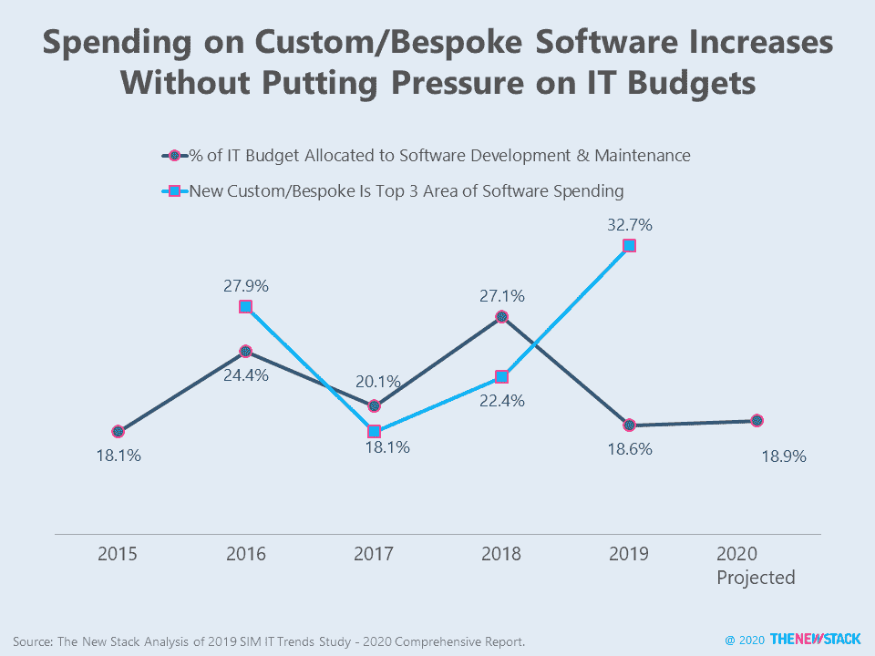
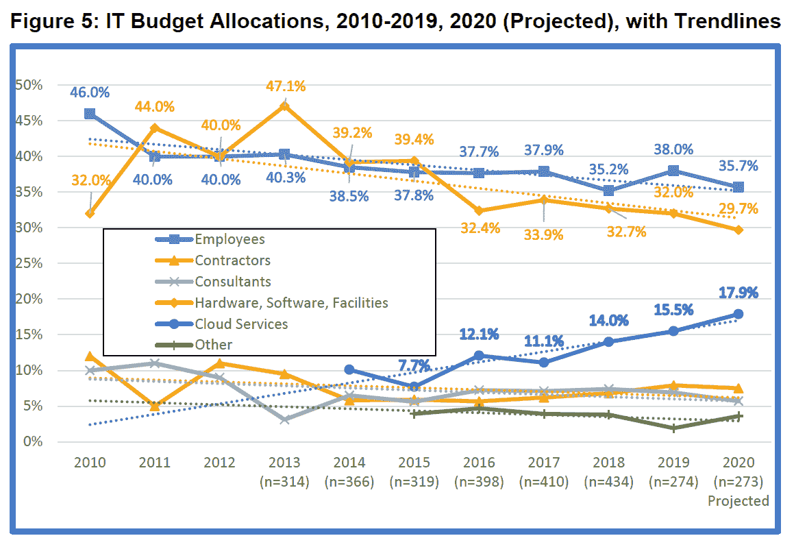

# 定制软件开发支出激增。这样好吗？

> 原文：<https://thenewstack.io/bespoke-software-development-spending-pops-is-that-good/>

根据信息管理学会(SIM)对高级 IT 高管的[年度调查](https://trends.simnet.org/trends-study-archive?CLK=d9a65738-96c1-4745-9602-9ff62fd8a681)，软件开发和维护占 IT 预算的比例从 2018 年的 27%下降到 2019 年的 19%，预计 2020 年几乎没有变化。与此同时，云服务的支出已经上升到平均 IT 预算的 16%,预计今年还会进一步增长。硬件占 IT 支出的比例在过去十年中大幅下降，但这一下降趋势正在放缓。公司似乎发现预算节省了 1。)减少用于业务应用和基础设施管理的商业现成软件(COTS ),以及 2 .)减少员工在日常软件维护和管理方面的支出。

只有部分软件开发领域面临压力。62%的人认为“集成”是关于软件支出的三大类别的主要答案。“维护或增强传统”排在第二位，占 48%，而“新定制或定制”是软件支出的首要领域，占研究的 33%。定制软件开发是唯一一个增长显著的类别，因为在 2017 年只有 18%的人提到它。我们的假设是，由于 SaaS 和依赖开源的基础设施而实现的效率已经被重新导向创新的软件项目，甚至一些可以被归类为支持数字化转型的项目。

> 我们的假设是，由于 SaaS 和依赖开源的基础设施而实现的效率已经被重新导向创新的软件项目。

员工队伍中开发人员总数的增加意味着个体业务部门中的程序员的增加，以及那些为软件供应商工作的程序员的增加。事实上，来自计算机经济学的最新数据表明，在过去的两年中，开发人员在所有 IT 员工中所占的比例已经下降了一个百分点，降至 14%。计算机经济学研究没有发现定制代码的百分比有显著变化，这表明企业开发人员正在将他们的工作从修改和定制 COTS 转向可以创造更多商业价值的定制计划类型。

在定制软件上的花费有时是削减的目标，因为当商业产品很容易实现时，这可能是浪费。因为在承包商、顾问和应用程序外包方面的支出没有增加，我们认为，企业已经将最近节省下来的编程人员时间用于其他项目。如果这是真的，那么更加强调定制编码可能是一件好事。

该图表仅显示了组织中最高级 IT 领导的数据。总体而言，2019 年的研究收到了代表 618 个组织的 1033 名 IT 高管的回复。来源:2019 SIM IT 趋势研究–2020 综合报告。

我们之前在“[软件预算的胃口受到底线](https://thenewstack.io/parity-check-software-budgets-appetite/)”和“[不要害怕你的影子 IT，还有](https://thenewstack.io/parity-check-dont-afraid-shadow-yet/)”中写过关于软件支出和 SIM 研究的文章。

通过 Pixabay 的特征图像。

<svg xmlns:xlink="http://www.w3.org/1999/xlink" viewBox="0 0 68 31" version="1.1"><title>Group</title> <desc>Created with Sketch.</desc></svg>