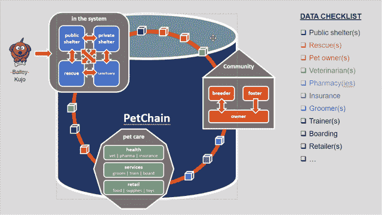
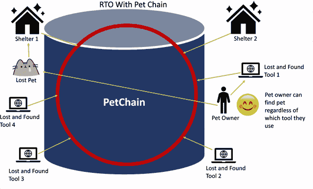

# 最好的朋友:利用数据拯救走失的猫和狗

> 原文：<https://thenewstack.io/best-friends-harnessing-data-to-save-lost-cats-and-dogs/>

像许多企业一样， [Best Friends Animal Society](https://bestfriends.org/) 开始应用数据来实现其使命——就其而言，就是降低全国动物收容所中被杀害的猫狗数量。然而，事实证明，收集数据并有效应用数据比看起来要困难得多。

首席信息官 [Angie Embree](https://www.linkedin.com/in/angela-embree-959a05a/) 说:“所有的数据都在筒仓中，这太可怕了。“我们无法像今天一样，知道有多少动物被杀害……一切都在黑暗中。这就像是，‘我们必须将这些数据公之于众，我们必须将它们从庇护所中拿出来，并创建这种创新机制。这样我们就可以创造新的方式让人们参与到运动中来，并收集数据以创造更多的创新，并继续以这种迭代的方式前进，”她说。

成立于 1984 年的“最好的朋友”是一个不杀生的组织，在犹他州的卡纳布经营着一个[保护区](https://bestfriends.org/sanctuary/about-sanctuary)，在那里它每天照顾大约 1600 只狗、猫、马、鸟、兔子、大腹便便的猪、农场动物和各种野生动物。它还在洛杉矶、纽约、盐湖城、亚特兰大、休斯顿和阿肯色州的罗杰斯经营工厂。

它在 2016 年宣布了一个雄心勃勃的目标:到 2025 年结束杀害庇护所中健康和可收养的动物。它报告说，收容所里被杀死的动物数量已经从最初的 1700 万只减少到 2020 年的 73.3 万只左右。2019 年，它推出了[宠物救生仪表板](https://bestfriends.widen.net/s/axymn0xsfv)，使人们能够跟踪从国家到地方层面的无杀戮运动。

它与全国 3000 多个收容所和救援组织合作，总共有大约 10000 个动物相关的合作伙伴。

“我们是非营利组织，我们没有很多钱花在技术上。我们需要它直接进入我们的程序。因此，对于如何实现这一目标，我们陷入了困境，”恩布里说。

它最终转向了 Vendia，这是一家结合了区块链和无服务器的初创公司，因为它的技术正在由来自好友的云提供商 AWS 的联合创始人进行升级。

## 分享+规模

“他们正在构建或已经构建并继续开发的平台，是一个允许我们参与游戏并实现我们的愿景和目标的平台，而无需我们自己构建和运营基础架构。我们的运营成本肯定会阻止我们进入这个领域。

在与亚马逊网络服务公司(Amazon Web Services)的一次研讨会上，它了解到区块链可能是一项值得考虑的技术，但它有局限性。

[Shruthi Rao](https://www.linkedin.com/in/shruthirao/?utm_source=thenewstack&utm_medium=website&utm_campaign=platform) 说，当她从 AWS 区块链的领导职位转到共同创立的 Vendia 时，她与 1，092 名客户进行了交谈，发现他们使用它的目的并不是为了安全，而是为了将他们的所有数据放在一个地方，以便能够有效地使用它们。

客户说，“看，我们有合作伙伴，……我们投资了这些数据收集技术、物联网和移动数字化转型。他们正在制造大量的数据。但是这个数据卡在合伙人身上了。而我们无法获得这些数据，无论是实时的，有时甚至是接近实时的。有些数据只能在一个星期后，一个月后才能获得。这是过时的数据。…这也适用于最好的朋友，”她说。

这些客户中的许多人都投资了人工智能和机器学习分析等数据密集型应用，这些应用需要大量数据来产生良好的智能。“但他们只能接触到一小部分数据，”她指出。“这些数据只是被困在筒仓中。”

[Vendia](https://thenewstack.io/vendia-serverless-pioneers-rethink-blockchain-for-collaboration/) 旨在结合区块链和无服务器，同时解决各自的局限性:区块链，一个点对点共享平台，具有完全复制的数据模型，但没有扩展能力，或无服务器，一个高度可扩展的服务，只能在单个帐户上运行。

“区块链应该是多方之间的联系，在这里你可以对谁做了什么、何时做了什么、如何做以及为什么做有一个精细的视图和谱系。这将是合适的，”饶说。“但是传统的区块链，当你想到那是在野外吗？它非常笨重，非常昂贵，大量的资本支出在垂直可扩展性方面都不能很好地扩展，这意味着吞吐量越高，它就不能很好地扩展。当你在网络中加入新的参与者时，无论他们是作者还是读者都没有关系，你加入的团体越多，情况就越糟糕，”她说。对于像“最好的朋友”这样的非营利组织，“你不能要求所有这些政党去建立他们自己的 Kubernetes 集群，你能吗？”

## **终身记录**

通过使用 Vendia 平台，Best Friends 正在创建一个位于区块链的名为 Pet Chain 的数据网络，它希望最终能够从宠物出生时输入的初始生物识别符(鼻印，与人类指纹一样独特)开始跟踪宠物的一生(加拿大养狗俱乐部在 1938 年开始接受狗鼻印作为身份证明)。

Vendia 提供了一个不可变的、完全有序的、防篡改的分类帐，以及应用程序运行的每个云、帐户和区域中的应用程序状态的复制副本，以及开箱即用的移动和 web 支持。

“我们的愿景是建立一个区块链网络，动物福利领域的任何人都可以为其做出贡献——一个收容所或救援机构，一个失物招领组织，一个交通管理系统……”Embree 说。

它将创造一个关于动物一生的单一版本的真相，尽管它可能有不同的名字，并跟随动物到任何地方。该组织最终希望包括兽医，美容，寄宿和其他信息。

“所以，如果那只动物最终进了收容所，这不是一张白纸——你知道，一只 5 岁的狗或猫有 5 年的历史。所以收容所知道它的药物治疗，知道它的行为问题，知道它的生活方式，这很重要，因为这将表明动物将在哪里茁壮成长，”她说。

## 新应用程序

“好朋友”最近的项目是“回归主人”，这是一项通过将数据链接到收容所、无数在线失物招领小组和邻居等邻居应用程序之间的宠物链来团聚走失宠物的努力。它与一家离岸商店合作开发了 Homefast 应用程序，目前正在北卡罗来纳州的皮特县、堪萨斯城和德克萨斯州的阿比林进行测试，不过在推广到其他地方之前，测试将于 5 月中旬进行。

“当宠物走失时，它们会被公众或动物管理人员捡到。他们被带到收容所。然后由父母决定在庇护所里找到那只动物。这是一个非常复杂的问题，因为父母经常不知道去哪里找到他们的动物，”恩布里解释说。

有很多失物招领工具，但它们变成了数据孤岛，就像多个微芯片数据库一样 Embree 说只有大约 10%的动物被植入了微芯片。

Homefast 是一个进步的网络应用程序。“没有什么可下载的，但它的行为就像你手机上的一个应用程序。你只需打开网址，把它添加到你的主页上，创建一个登录名，”她说。“如果你是一名动物管理官员，那么你就开始拍照，你把自己与你的组织联系起来……记录下来，它实际上捕捉到了你发现动物的地理位置，因为这在我们的工作中非常重要，因为它通常离家很近，对吗？”用户可以扫描狗牌或微芯片，或者只是对宠物的鼻子进行特写并输入，人工智能算法将试图识别宠物。

它可以立即连接到当地的收容所、失物招领工具和其他当地的数据源，希望主人能在宠物到达时到达正确的收容所。

中国初创公司 [Magvii](https://mp.weixin.qq.com/s/dXYK8V67MPPURVZw6MtqZA) 也在致力于应用人工智能来识别狗的鼻印，以归还丢失的宠物，该项目也称为 PetChain。

Rao 指出，由于救援组织通常依赖志愿者，而这些志愿者可能很少或根本没有技术专长，所以易用性对于好友的应用程序来说是必不可少的。席卷德克萨斯州的冬季风暴指出，用户在某个时候可能会有一段时间没有互联网连接，但仍可能在危机期间处理流浪动物。因此，他们需要能够输入数据，然后在连接恢复时上传数据。

“对我来说，最棒的是一个几乎没有任何专业开发人员的非营利组织能够以一种非常简单的方式做到这一点，”Rao 说。“如果一个非营利组织可以在他们的公司中使用最少或没有开发人员的尖端技术，那么任何人都可以。”

<svg xmlns:xlink="http://www.w3.org/1999/xlink" viewBox="0 0 68 31" version="1.1"><title>Group</title> <desc>Created with Sketch.</desc></svg>