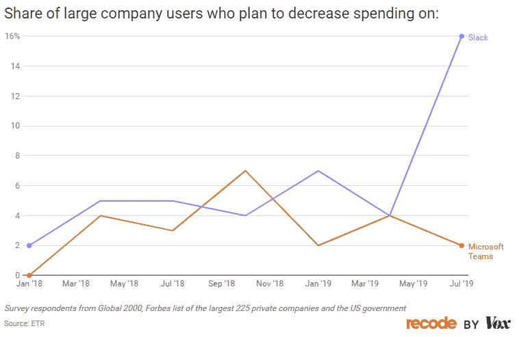
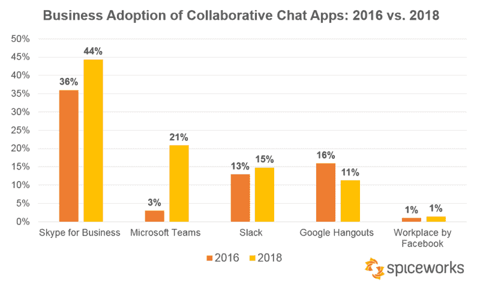
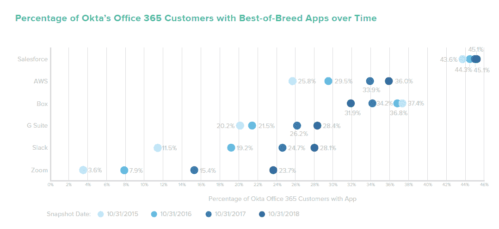

# 首先是同类最佳还是平台最佳？微软团队从懈怠中获益

> 原文：<https://thenewstack.io/best-of-breed-or-platform-first-microsoft-teams-gains-on-slack/>

像谷歌套件或微软 Office 365 这样的单一生产力平台会成为主导吗？还是像 Slack 和 Zoom 这样的一流应用——两家公司的母公司都在今年成功上市——会继续获得市场份额？

最近调查显示，无论是小型企业还是大型企业，微软团队的采用率都高于 Slack。这种趋势是否会持续将取决于应用程序的功能被利用的程度以及人们愿意花多少钱。这些问题与非投资者相关，这有两个原因。首先，和我们一样，你可能在某种程度上使用这些工具。第二，广泛使用的软件必须不断地与这些和其他竞争工具集成。

来源: [Recode by Vo](https://www.vox.com/2019/7/9/20686206/microsoft-teams-slack-facebook-snapchat-copy) 十、约 900 人参加了 2019 年 7 月报告的调查。在一家大公司工作的 246 名受访者回答了关于生产力应用程序的部分。

根据[市场研究公司 ETR](https://etr.plus/articles/no-slack-by-teams) 的说法，最初采用 Slack 和增加公司支出的计划已经急剧减速，该公司对高级 IT 管理人员进行季度调查。在大公司工作的受访者中，Slack 的实际使用率从 2018 年 10 月的 15%下降到 2019 年 7 月的 7%。下降的部分原因是尝试免费 Slack 实现的公司停止了试点。Slack 剩余的大公司客户的前景也变得暗淡，16%的客户计划减少支出或完全使用该产品。通常这不会被认为是一个坏数字，但这是一个戏剧性的增长，从 ETR 4 月份的研究只有 4%。大公司似乎对 Slack 今年春天上市计划的最新变化反应消极。

需要注意的是，Slack 仍在增长，只是没有微软团队的速度快。随着 Slack 试图将免费计划转化为付费客户，它面临着一个挑战，因为它的许多现有和潜在客户也使用微软的 Office 365，并计划利用微软团队，因为它与 Office 365 捆绑在一起是免费的。

对特定功能的自下而上的需求推动了 Slack、Zoom 和其他企业级协作和通信工具的采用。如果这种势头持续下去，他们很有可能成功。如果不是，与一个组织现有 IT 足迹的兼容性和大量现有用户的采用都是微软、谷歌和其他几家公司具有优势的因素。

来源:【2018 年 11 月对 Spiceworks 社区 901 名成员的调查，该社区倾向于中小型企业。

来源:Okta 的 [2019 Business @ Work](https://www.okta.com/businesses-at-work/2019/) 。尽管 Okta 的 Office 365 客户中有 28%使用 Slack，但同比增幅仅为 14%。相比之下，从 2017 年到 2018 年，Office 365 客户的缩放使用率上升了 53%。

通过 [ETR](https://etr.plus/articles/no-slack-by-teams) 获得特征图像。

<svg xmlns:xlink="http://www.w3.org/1999/xlink" viewBox="0 0 68 31" version="1.1"><title>Group</title> <desc>Created with Sketch.</desc></svg>