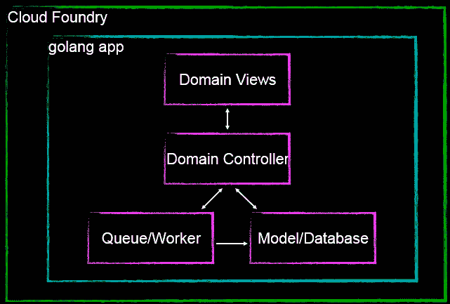
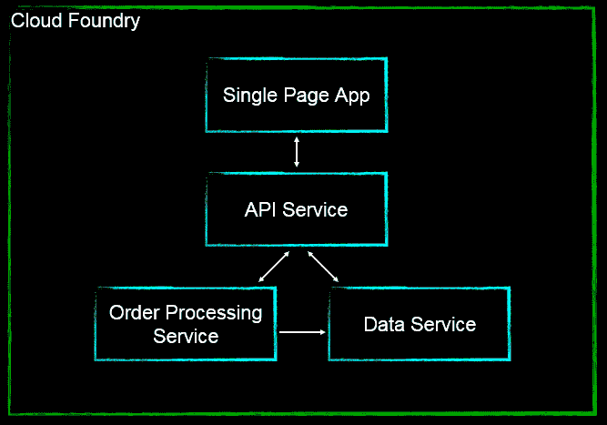
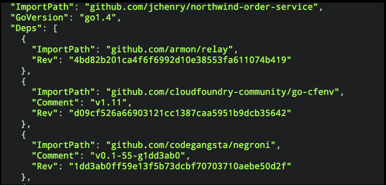
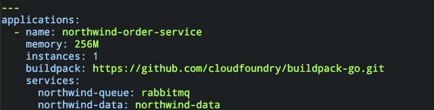
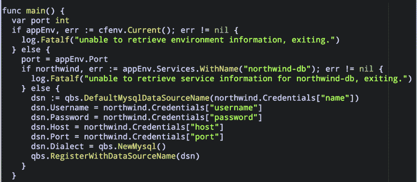
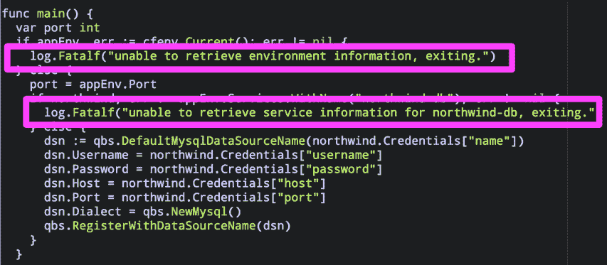

# 开发云原生应用和微服务架构的最佳实践

> 原文：<https://thenewstack.io/best-practices-for-developing-cloud-native-applications-and-microservice-architectures/>

Amy Feldman 是 HP Helion 的高级解决方案营销经理。她对应用充满热情，专注于云原生应用开发、DevOps 和 Cloud Foundry。她在 IT、开发和营销部门工作过。
Colin Henry 是西雅图的一名技术专家和社区组织者，他的职业生涯致力于为企业构建最佳软件的研究和实践，并领导 Simply Measured、Apptio 和 Opsware 等公司的团队。他目前正在惠普为 Cloud Foundry 组建工程团队。Colin 拥有宾夕法尼亚大学的计算机科学学士学位，是华盛顿大学软件产品管理项目的校友。

开发人员对开发可扩展、可移植、有弹性且易于更新的新应用感兴趣。为了实现这一点，他们经常寻求采用[云服务](https://thenewstack.io/10-key-attributes-of-cloud-native-applications/)，一种微服务架构，并利用 [十二因素应用程序方法](https://www.google.com/url?q=http%3A%2F%2F12factor.net%2F&sa=D&sntz=1&usg=AFQjCNHiNz3Nucs0_qkCa7MYUaEMvCnV_w) 。然而，这并不像只是将应用程序提升并转移到云或者将应用程序拆分成更小的容器那么简单。它必须以充分利用这些新技术的方式来设计、构建和编写。你从哪里开始？

## 被微

首先是微的，这需要你把你的应用程序重写为[微服务](https://thenewstack.io/kubernetes-and-the-cloud-native-community/)，其中每个服务做一件事情做得非常好。通过将应用程序分解成更小的服务，可以更容易地更新和扩展服务，这是现代云本地应用程序的关键。

为了更好地解释这一点，让我们来看一个名为 Northwind 的示例应用程序，这是一个订单处理应用程序，它提供了一个模型和数据集来说明典型订单交易流程中的概念。出于我们的目的，这个应用程序是用 Google 的 Go (golang)编程语言编写的。

传统的应用程序会在一个流程或单个端点中包含所有内容，如下所示:

对于许多应用程序来说，由于其原始的架构设计和依赖性，整体设计是可以接受的，也是不可避免的。然而，为了利用云的规模经济，应该重新设计应用程序。一种方法是将应用拆分成单独的服务或[微服务](https://thenewstack.io/what-are-cloud-native-patterns-and-how-should-you-use-them/)。通过将应用程序拆分成更小的服务，允许应用程序具有更大的灵活性和可伸缩性。开发人员能够轻松地为每个单独的服务更改代码，而不会影响其他服务。此外，当应用程序被部署到生产环境中时，这些单独的组件能够根据特定的性能特征独立扩展。

在上面的示例中，同一个 Northwind 示例应用程序被分解为单独的组件，并被现代化为“单页应用程序”，允许应用程序重新绘制 UI 的任何部分，而不需要服务器来回检索 HTML。这是通过将数据从数据的表示中分离出来实现的，在本例中，通过使用 API 服务来处理数据和用户请求。

## 要明确

接下来，明确你的代码依赖和你与后端服务的关系。开发云原生应用时，通过明确声明和隔离依赖关系，在开发/测试和生产中使用一致的库和系统是很重要的。这通常是通过依赖项声明清单文件来完成的，如 Ruby Gemfile。NET 解决方案文件或 JAVA Maven 文件。在 Cloud Foundry 中，构建包为应用程序提供框架和运行时依赖。下面是用 golang 编写的 Northwind order service 应用程序的依赖项示例，例如 web 服务、环境变量和消息服务。

这些都是 Cloud Foundry golang buildpack 的一部分，当应用程序被推送到 Cloud Foundry 时，Cloud Foundry 会拉最新的修订版，并将这些库与 Northwind 应用程序一起部署。由于 Cloud Foundry 负责管理这些依赖关系，它有助于确保不同开发、测试和生产环境之间的一致性。在开发云原生应用时，隔离依赖是关键，Cloud Foundry 通过其构建包的实现消除了管理依赖的猜测工作。

正如明确声明您的依赖关系很重要一样，将您与后台服务(数据库、队列、缓存或其他微服务)的关系明确定义为附属服务也很重要。这允许您轻松地交换服务，而不必对代码进行更改。在 Cloud Foundry 中，您可以轻松使用现有的后台服务，或者使用命令 cf create-service 快速创建自己的服务代理。 创建完成后，您可以使用命令cf bind-SERVICEAPPLICATION SERVICE _ INSTANCE， 或者通过在 Cloud Foundry 清单文件中声明这些支持服务，轻松地将这些服务绑定到应用。清单文件包含各种环境变量，从创建多少实例和分配多少内存，到应该使用哪些服务应用程序的配置细节。

在本例中，当我们部署将 Northwind 应用程序推送到 Cloud Foundry 时，它将从清单文件中读取信息，并且在某些情况下提示用户输入任何附加的配置信息。然后 Cloud Foundry 将部署依赖项，如运行时和其他支持服务，如 RabbitMQ。Cloud Foundry 不需要每个开发人员部署他们自己的环境，而是可以轻松地在应用程序的整个生命周期中快速部署一致的环境。

## 无国籍

另一个最佳实践是通过从环境中获取特定于环境的信息来实现无状态。一般来说，主机名和密码等配置变量应该是特定于环境的，而不是特定于存储库的，因为这些变量往往会在开发、测试和生产之间发生变化。通过在环境中存储配置，变量简化了配置，减少了部署过程中的错误。

在上一节中，我们声明了一个 go-cfenv 依赖项，它提供了映射到 Cloud Foundry 环境变量原语的便利函数和结构。这使得为 Northwind 示例应用程序编写配置变量变得很容易，如下所示:

此外，要实现无状态，您应该将日志视为事件流，而不是要写入的文件。日志是了解任何应用程序健康状况的关键，应该被视为事件流。任何管理过应用程序或编写过代码的人都知道，日志可能很复杂，也很痛苦。Cloud Foundry 用它的 loggregator 简化了日志，它从应用程序收集 STDOUT 和 STDERR。由于我们的示例应用程序是用 golang 编写的，这使得日志记录更加容易，因为 golang 将错误写入 STDOUT，然后由 Cloud Foundry loggregator 收集。

## 暂时的

最后，在开发云原生应用时，时间性很重要——改变你对应用的观念可能很困难。你应该能够在没有任何警告的情况下随时创建和终止应用程序，并采用面向过程的思维方式，以便在需要时可以水平扩展。

想到终止应用程序是很可怕的，但是在云环境中，应用程序应该能够优雅地关闭和启动。然而，如上所述，由于您已经使您的应用程序无状态，Cloud Foundry 可以随意启动和关闭您的应用程序，而不会丢失任何状态或数据。

最后，横向扩展应用是处理用户负载和并发请求的关键。在 Cloud Foundry 中，扩展应用程序会创建或销毁应用程序的实例。对应用程序的传入请求会在所有应用程序实例之间自动进行负载平衡，从而与每个实例并行处理任务。

将良好的设计与编码最佳实践相结合将使开发云原生应用变得更加容易。因此，下次您考虑设计和开发云应用时，请记住微服务架构、十二因素应用方法和云铸造。

<svg xmlns:xlink="http://www.w3.org/1999/xlink" viewBox="0 0 68 31" version="1.1"><title>Group</title> <desc>Created with Sketch.</desc></svg>