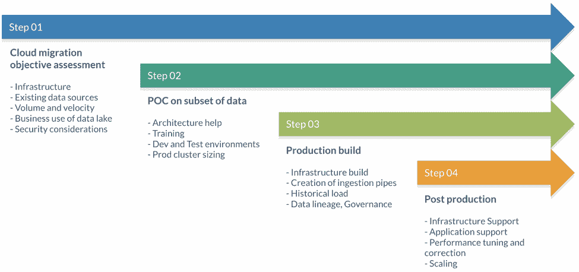
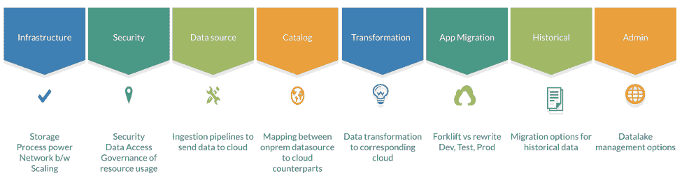

# 高效云迁移的最佳实践

> 原文：<https://thenewstack.io/best-practices-for-effective-cloud-migration/>

[Shantanu Mirajkar](https://in.linkedin.com/in/shantanumirajkar)

[Shantanu Mirajkaris 印度千里眼公司创始人兼 CTO。Mirajkar 是一位经验丰富的技术领导者和以结果为导向的解决方案架构师，拥有管理多个团队和为全球企业提供复杂业务问题解决方案的良好记录。他在最新的大数据技术方面拥有深入的专业知识，并在数据分析和企业堆栈应用方面拥有深厚的知识。Mirajkar 相信他的员工能够为成功而扩展，并建立一个充满激情的世界级工程师团队来提供优质的企业解决方案。他是各种技术会议和大数据活动的著名演讲者和组织者，包括在印度举行的年度浦那数据大会。](https://in.linkedin.com/in/shantanumirajkar)

云的采用正在上升，预计到 2020 年，云支出的增长率将是普通 IT 支出的六倍以上。如今，企业面临着将大量数据从内部迁移到云存储平台(如 AWS S3)的任务。有效的数据迁移策略极其重要，但在迁移过程中意识到其严重性之前，它往往会被忽视。

当我们考虑大数据的绝对数量和规模时，本地基础架构操作在规模和功能方面都相当有限。对于许多组织来说，将与大数据和人工智能相关的一切都默认为云操作非常方便。云迁移可能成为首选的几个场景:

*   您希望快速实现和部署应用程序
*   您的项目在一夜之间开始接收大量流量
*   您对数据中心停机的影响持谨慎态度
*   管理不断增长的数据库需求变得越来越昂贵

## 迁移数据的挑战

关于云迁移的一个常见误解是，这将是一次一次性的旅程。但事实是，将数据基础设施迁移到云的过程应该循序渐进，同时尽量减少停机时间和对用户的干扰。移动数据只是难题的一部分。还有其他一些与云迁移相关的挑战。

成本在决定采用何种方法时起着重要的作用。低估云迁移中涉及的资源会很快导致成本失控，云迁移最终可能变成一个吞噬现金的怪物。Lyft 最近报道称，未来三年将在亚马逊网络服务上投资 3 亿美元。随着大数据和云的出现，数据安全领域也出现了一只隐约可见的大象。从内部迁移到云中时，您组织的敏感数据会面临风险。如果这些数据在此过程中泄露，公司可能会遭受大量的经济损失。重要的是要记住，保护数据的责任是你的，而不是云提供商的。另一个严峻的挑战是找到具备正确技能的人来成功执行云迁移计划。缺乏对不断变化的云技术的了解和技能组合不足可能会导致无缝云迁移的采用速度缓慢、效率低下。

在开始迁移流程之前，详细分析云的依赖性和限制、迁移模式、潜在应用以及基础架构即服务(IaaS)的优势至关重要。这将有效地让你走上最适合你公司的道路。根据不同公司希望使用云来实现其目标的方式，云迁移有三种主要类型。

## 数据迁移模型

粗略分类后，我们可以看到三种从内部到云的数据湖迁移模式:

来源:千里眼(内部)

### 铲车

这种类型的迁移是指将本地 Hadoop 集群迁移到云中基于基本计算实例构建的集群。这是利用现有员工技能组合的最简单的迁移模型。它仅使用具有持久计算实例的云的 IaaS 方面，通常具有实例本地存储。除了基础设施访问之外，安全性完全是云客户的责任，群集的创建、配置、监控和维护也是如此。

### Hadoop AAS

从本地 Hadoop 迁移到使用云提供商的 Hadoop 即服务是第二种迁移模式。围绕 Hadoop 集群设置和配置以及确保 Hadoop 生态系统组件兼容性的许多繁重工作都留给了云提供商。数据湖管理应用程序可以帮助按需创建和使用临时 Hadoop 集群，并直接连接到云本机持久存储。

### 混合物

数据湖迁移的第三种模式涉及从 Hadoop 内部部署到混合架构(内部部署/云)的逐步过渡，除了 Hadoop 生态系统工具之外，还使用各种云原生存储选项和服务，采用云服务模式来处理事件流、实时分析和机器学习。该模型以元数据管理层为前提，以消除底层技术之间的任何不匹配，并提供跨所有数据的无缝数据结构视图，而不管存储位置如何。

根据您选择的选项集，可以有多种迁移方式:

*   上述三种迁移模式(叉车式、Hadoop AAS、混合式)
*   Hadoop 发行版(Cloudera、Hortonworks、MapR)
*   Hadoop 生态系统工具变体
*   云服务提供商(AWS、Azure、GCP)

需要在特定的业务和技术需求环境中进行有意义的比较。

## 制定有效的数据迁移策略

您的迁移对于您的 Hadoop 环境来说是独一无二的，因此不存在真正通用的迁移计划。为您的迁移制定一个计划，让您能够灵活地将每个部分转换为云计算范例。

来源:千里眼(内部)

### 客观评估

了解您当前的软件架构、基础架构和数据库模式有助于定义实施云迁移所需的时间框架、成本和工作量。您可以从评估数据湖的业务使用案例、安全性考虑因素以及优先考虑首先需要移动的应用程序/数据开始。

### 数据子集的概念验证

强烈建议您在与新的云供应商全面合作之前先试水。您需要开发一个概念证明来验证网络挑战、功能对等和性能比较。在此阶段，您需要有效地测试您的工作负载，并了解云存储服务、必要的安全控制和生产集群规模。

### 生产构建

现在，您已经按照您的要求验证了云提供商和模型，您可以继续迁移流程本身，并开始将您的数据和应用程序迁移到云中。与所选迁移模式一致的分阶段方法考虑了以下因素:

来源:千里眼(内部)

1.  基础架构迁移决策—存储和计算、规模确定、扩展、网络
2.  数据安全性和数据访问治理，以及云中的资源使用
3.  重组数据摄取，用于将内部部署平台当前从不同来源接收的数据发送到云数据湖
4.  内部数据湖的详细清单，并映射到云平台
5.  数据转换管道和相应的云转换机制
6.  应用程序迁移—叉车式与重写式，开发、测试和生产流程
7.  历史数据的迁移选项
8.  数据湖管理应用

### **后期制作**

由于您的数据和应用程序现已成功重新托管，您可以专注于在新基础架构内实现流程自动化并优化其性能。最好使用自动测试框架，并考虑基础设施即代码(IaC)方法来简化您的部署过程。您还可以手动仔细检查基础架构的一些最重要的方面，例如安全性、合规性、性能等。

## 结论

当迁移到云时，企业需要一个具有广泛云迁移能力的合作伙伴来支持各种技术、法规要求、运营模式和目标环境。今天的公司经常满足于他们现在能得到的，而不是他们真正想要或需要的。由专业的云专业知识支持的全面风险评估有助于实现个人的长期战略目标。另一方面，服务提供商必须保持灵活性，以适应不断变化的市场需求，从而充分利用新技术。

云计算可以提供多种组织优势——灵活性、效率和战略价值。通过全面的评估，任何组织都可以创建适合其短期和长期业务目标的可靠迁移计划。正如大多数成功的公司所展示的那样，云迁移流程所需的时间和精力被技术解决方案的质量、效率和上市速度所充分利用。

仍然在笨重过时的基础设施上运营您的业务？可能是时候考虑将您的流程迁移到云中，同时将您的业务风险降至最低。

来自 Pixabay 的 Lolame 的特征图像。其他图片由千里眼提供。

<svg xmlns:xlink="http://www.w3.org/1999/xlink" viewBox="0 0 68 31" version="1.1"><title>Group</title> <desc>Created with Sketch.</desc></svg>