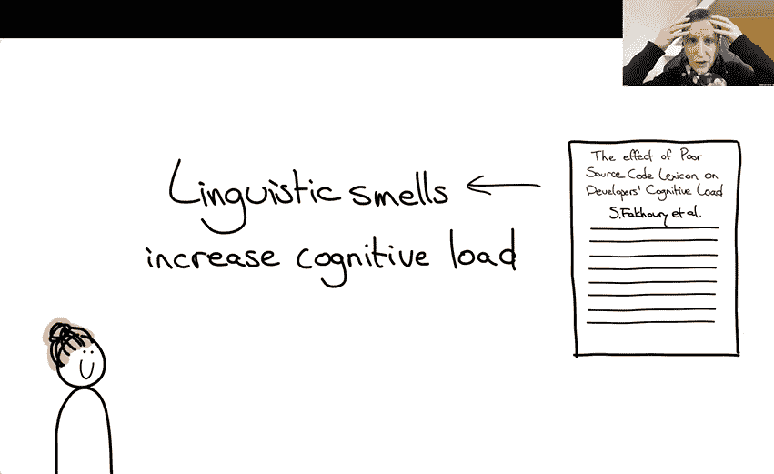
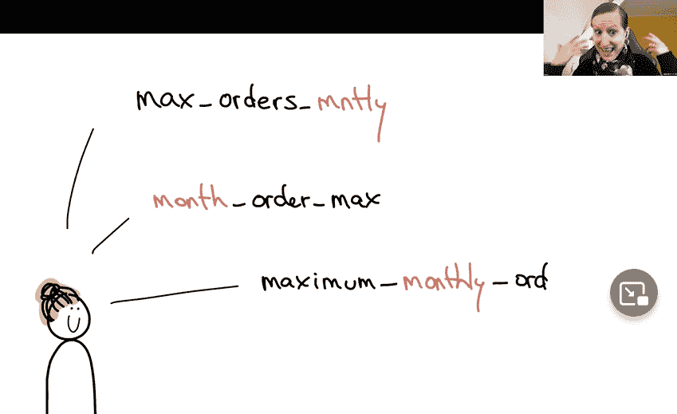

# 命名变量的最佳实践:研究结果

> 原文：<https://thenewstack.io/best-practices-for-naming-variables-what-the-research-shows/>

命名事物有时被认为是计算机科学中最难的问题。现在，有人正试图让这项任务变得更容易。

[菲利恩·赫曼斯](https://www.felienne.com/)，她在[莱顿大学高级计算机科学研究院](https://liacs.leidenuniv.nl/)领导编程教育研究实验室——赫曼斯也是那里的副教授——已经开发了一套基于研究的指导方针，用她的话说，将“帮助你更好地命名事物”，至少在软件开发领域是如此。

在最近的一次在线会议上，她在最近的一次演讲中总结了她的工作，[理论上是行不通的:直播！在线会议](https://neverworkintheory.org/events/)。

## 变量名的变化

首先，不要做什么。Hermans 提供了一个方法的例子，该方法检查一个逻辑名为`isValid()`的输入的有效性。但是，如果开发人员决定返回比“真”或“假”值更多的值，例如，也将值转换为不同的格式，不仅返回其有效性，还返回其重新格式化的版本，会发生什么呢？

这是方法名出错的三种常见方式之一——返回的*比它们的名字承诺的*多。

但是返回的*比名字所承诺的少*也是不好的，或者更令人迷惑:通过返回名字所隐含的*的反序*。“这些是你应该避免的事情，因为它们会让事情变得更加混乱，”赫尔曼斯指出。对于变量名来说也是如此，变量名承诺了更少、更多或相反的内容。

这不仅仅是一个教育家的观点。这是由学术研究支持的。Hermans 引用了 2016 年发表在杂志*experimental Software Engineering*上的一篇论文，题为“语言反模式:它们是什么以及开发者如何感知它们”。一般来说，术语[反模式](https://en.wikipedia.org/wiki/Anti-pattern)描述了那些对重复出现的编程问题的常见反应，这些问题实际上应该作为不好的实践来避免。

因此，在探索“语言反模式”时，研究人员试图识别会损害开发人员对代码的理解的具体事物。他们最终从现实世界的开源项目中收集了 17 种不同类型的反模式，然后询问开发人员他们是否认为它们是糟糕的实践。(研究人员还追踪了代码作者在被研究人员联系到*后回去修改代码的频率。)*

研究人员发现了类似的命名问题——比如“getter”方法不仅仅是获取变量值，或者“setter”方法不仅仅是*设置*变量。赫尔曼斯称这篇论文是最终定义了问题所在的学术著作之一。

Hermans 强调了另一篇论文，“糟糕的源代码词典和可读性对开发人员认知负荷的影响”，该论文警告说，糟糕的命名“损害了程序的理解，并因此增加了开发人员维护软件的努力。"

这些研究人员实际上使用了脑成像技术来测量产生的额外认知负荷，甚至通过实施眼球追踪设备将其结果映射到源代码中的特定标识符。

他们发现“源代码中语言反模式的存在显著增加了开发人员的认知负荷。"

“他们的结果表明‘语言代码气味’实际上会增加认知负荷，”她说。“你的大脑必须更加努力地处理带有这种代码味道的代码。所以这不是我们想要的。”

## 形式和实质

然而，除了变量名称中的实际单词之外，它的书写方式也会导致认知开销。例如，用大写字母表示新单词，或者在所谓的“snake case”中用下划线分隔单词，都会降低理解速度。

Hermans 引用了 2021 年 Arxiv 的一篇题为“[开发者如何选择名字](https://arxiv.org/abs/2103.07487)”的论文，其中包括一个惊人的统计数据:当 334 名开发者被要求选择 47 个变量名时，两人选择相同名字的中值概率仅为 6.9%。

研究人员发现，排列这些单词有几种明显和常见的模式，以及许多细微的变化，“有许多合理的选择”，从而不可避免地得出结论，“两个开发人员选择相同名称的概率很低。”

这些研究人员的后续实验发现，如果开发者有意识地首先决定他们想要包含什么概念，然后选择最能代表这些概念的单词，他们会选择更好的名字。(此外，“接受过该模型指导的受访者倾向于使用包含更多概念的更长的名字。”)

“作为一个团队，可以谈‘名模’。你可以说，‘好吧，我们该怎么办？我们总是在开头，还是在结尾做量词？“我们在这里的计划是什么？”赫尔曼斯总结道。

## 真实世界的反应

Hermans 的演讲在*黑客新闻* 上引发了一场即兴讨论，现实世界的开发者通过分享他们自己命名变量的最佳实践对演讲做出了回应。全栈开发人员 [Nick Janetakis](https://nickjanetakis.com/) (他也教授 web 应用程序开发)分享了一些[他自己的变量命名偏好](https://news.ycombinator.com/item?id=31470791):

*   如果一个变量只包含值“真”或“假”，那么就用一个问号结束它的名字。
*   如果一个变量包含一个日期，用 _on 结束，但是如果它包含一个有时间的日期，用 _at 结束

“这与认知负荷相反，”Janetakis 认为，因为你可以瞥一眼一个名字，知道它是什么，而无需了解更多。"

阿姆斯特丹的人工智能软件开发人员唐·霍普金斯分享了一个偏好，将最重要的单词放在变量名的开头，这样当自动完成功能按字母顺序排列变量名时，所有相关的单词都会自然地组合在一起。霍普金斯大学也对开发者没有界定一个新单词的开头感到恼火。“我的名字是 Don，所以每当我看到一个名为‘create Don’的列时，我就认为这是一个布尔标志，你可以设置 true 来创建我。我希望 db 设计师使用 snake case，而不是将所有单词混在一起。”

在整个帖子中，霍普金斯分享了更多最不喜欢的做法——比如对变量名中的单词进行不必要的排序，以便它们组成一个完整的语法正确的句子。

但是 Hopkins *真的*讨厌开发人员在每个类、变量或子例程前面加上几乎没有意义的大型项目或库的名称。Hopkins 将这种做法称为“蓝精灵”——显然是指蓝色卡通人物如何不断提醒观众他们的身份，通过不断地[用单词“蓝精灵”](https://smurfs.fandom.com/wiki/Smurf_(language))替换句子中的单词。

后来，霍普金斯还建议编码人员避免使用“ [Bill 和 Ted 的优秀后缀](https://news.ycombinator.com/item?id=31472819)”——也就是说，在变量名的最后一个单词中保留一个非常像冲浪运动员的“not”。

霍普金斯开玩笑说，“这是一个最完全伪造的代码气味，伙计。”

[https://www.youtube.com/embed/z7w2lKG8zWM?feature=oembed](https://www.youtube.com/embed/z7w2lKG8zWM?feature=oembed)

视频

<svg xmlns:xlink="http://www.w3.org/1999/xlink" viewBox="0 0 68 31" version="1.1"><title>Group</title> <desc>Created with Sketch.</desc></svg>