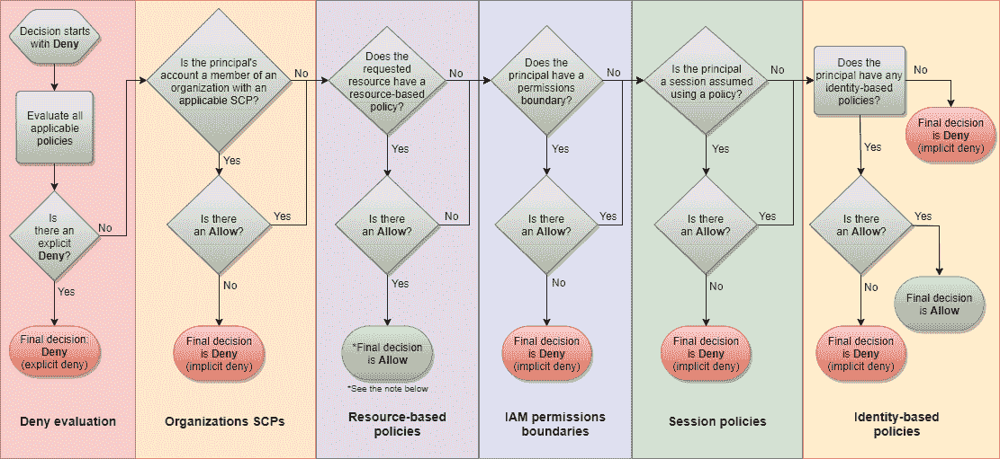
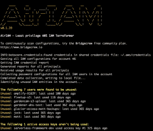
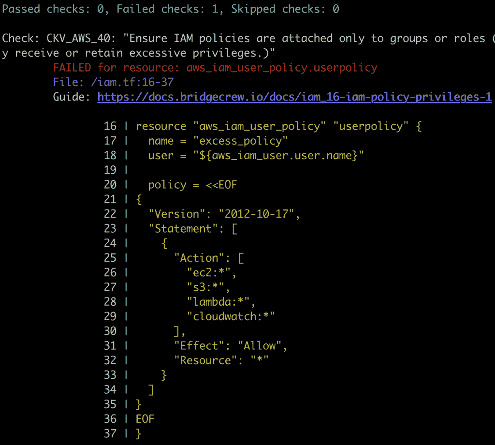
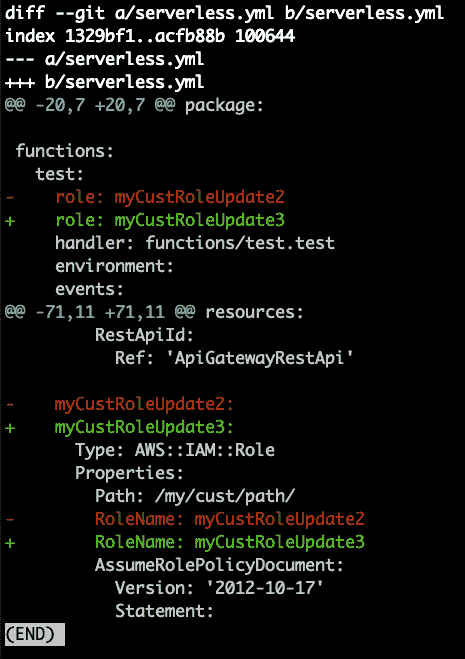
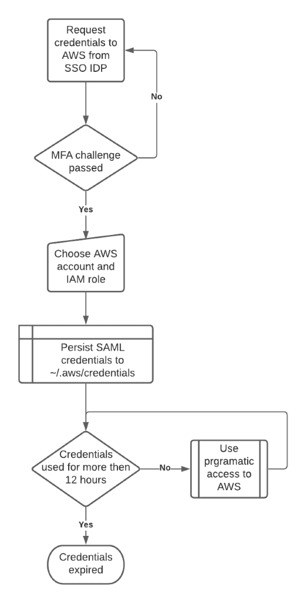

# Amazon Web Services 上保护身份和访问管理的最佳实践

> 原文：<https://thenewstack.io/best-practices-for-securing-identity-and-access-management-on-amazon-web-services/>

[Bridgecrew](https://bridgecrew.io/) 赞助本帖。

 [马特·约翰逊

Matt 在不太阳光的英国曼彻斯特工作，负责 Bridgecrew 的开发人员关系。无论是撰写文章、发表演讲还是发布新功能，Matt 都热衷于帮助开发运维团队简化、自动化和提高他们的基础架构安全性。](https://www.linkedin.com/in/mattjohnsonuk/) 

即使对于中等规模的云部署，在 AWS 内管理访问也不总是一项简单的任务，但 [AWS 身份和访问管理](https://aws.amazon.com/iam/) (IAM)试图让它变得更容易。

[https://www.youtube.com/embed/Qr2PZkpBpwo](https://www.youtube.com/embed/Qr2PZkpBpwo)

视频

前提很简单。您有用户(人对机器)和角色(机器对机器)，它们需要对某些服务进行受控访问。使用 IAM，您可以分配策略来确定每个用户和角色是否可以访问某些服务。

强大的 IAM 系统维护最小特权(POLP)原则，该原则只授予用户和角色对特定资源显式需要的权限。然而，维护安全的 IAM 经常与快速构建、试验新技术以及减少团队间的摩擦相矛盾。就像其他 DevOps 挑战一样，随着我们从单片电路转移到微服务和函数计算，IAM 的复杂性只会增加。

随着环境中 IAM 对象的数量及其影响范围的增长，回答简单的问题会变得很困难，例如:

*   为用户分配了哪些策略？
*   策略是否分配给组？它们是内联策略吗？
*   其他人可以承担其他用户和主体的角色吗？

IAM 授权流中还有一些特性使这种范围界定变得复杂，比如来自 AWS 帐户范围之外的隐式拒绝和服务控制策略。

IAM 授权流程。来源: [AWS](https://docs.aws.amazon.com/IAM/latest/UserGuide/reference_policies_evaluation-logic.html)

有几种方法可以帮助开发人员保持 IAM 配置整洁、可审计和大小合适，但是自动化是一个关键的组成部分。在本帖中，我们将探讨实现 IAM 自动化的一些常见主题。

## 可见性是关键

在 IAM 规模调整领域(有时在分析师圈子中称为云基础架构授权管理，简称 CIEM)，最大的挑战之一是深入了解您现有的 IAM 配置。Scott Piper 开发的 [CloudMapper](https://github.com/duo-labs/cloudmapper) 等工具有助于创建 AWS 环境中当前 IAM 状态的即时可见性。通过查询 API，它可以构建您当前状态的图像，并验证安全参数，以确定以下事项:

*   用户年龄多大？用户的密钥有多长？
*   特定的角色曾经使用过附加策略提供访问的 API 吗？

从这种可见性开始，是理解哪里有过度宽松的定义和默认配置，然后可以对其进行适当调整的唯一方法。同样重要的是，要随着您的环境的增长以及基础 IAM 权限的变化而不断进行监控，以满足不断发展的需求。为此，您可以修补或求解。

运行时检测适合于识别已经存在的东西。当运行时事件已经在您的环境中运行时，您可以使用基于事件或活动的检测，例如搜索特权过高的 iam、手动更改和未使用的网络配置。您还可以检查基于 API 的标准，如密钥轮换策略、加密设置和查询日志记录服务的状态。像网飞的 [RepoKid](https://github.com/Netflix/repokid) 和 [Aardvark](https://github.com/Netflix-Skunkworks/aardvark) 这样的工具采用了不同的方法来帮助实现动态 IAM 分析及其对持续政策调整的好处。

在下一次部署之前，在运行时识别和修补东西是很棒的。为了不断维护安全的 IAM 并防止问题再次出现，您可能希望考虑一种不可变的方法。

## 基础设施即代码和 IAM

基础设施即代码(IaC)框架，如 Terraform 和 CloudFormation，使云供应更加可控和可重复。通过持续扫描，它们还可以更容易地提前嵌入安全控制和策略实施。

IaC 对于正确确定 IAM 的规模并长期维护它也很重要。Kinard McQuade 的 [Policy Sentry](https://github.com/salesforce/policy_sentry) 等工具引入了自动化策略生成，Bridgecrew 的开源工具 [AirIAM](https://airiam.io) 有助于将动态 IAM 转换为机器可读的文件。

对于任何给定的 AWS 帐户，AirIAM 只需使用 IAM 只读权限，即可将 AWS IAM 配置转换为大小合适的 Terraform 代码。通过利用 IAM 访问顾问数据，AirIAM 可以快速生成 IAM 配置中未使用的密钥、旧帐户和未绑定角色的列表。它还更进一步，根据实际的 API 使用情况提供了减少角色权限的建议。

将 IAM 转变为 IaC 为 IAM 自动化带来了难以置信的机遇。它为测试提供了基础，就像自动化单元和集成测试一样。它还使您能够通过代码审查过程和自动化 CI/CD 管道，在 IAM 之上添加工作流和防护栏(正如我们将在下面展示的)。

## 使用策略即代码实施 IAM 最佳实践

构建时对 IAM 配置的静态分析首先阻止了东西进入云中。使用像 Bridgecrew 的 [Checkov](https://checkov.io/?utm_source=newstack_iam) 这样的工具可以用一个可扩展和可定制的框架来满足这个“静态分析”的需求。

除了防止常见安全错误配置的 450 多项策略之外，Checkov 还提供对几个 IAM 配置问题的早期警告检测，例如:

*   确保没有 IAM 政策文件允许*作为语句的操作。
*   确保不创建允许完全*_*管理权限的 IAM 策略。
*   确保 IAM 角色只允许特定的服务或主体承担它。

## IAM 治理

通过持续实施 IAM 策略和定期调整 IAM 规模，您可以对 IAM 的安全状况保持相对较高的信心。但是，因为 IAM 是非常特定于上下文的，所以您仍然没有看到全貌。

从 AWS APIs 获得洞察力的工具只能捕获已经部署的环境；因此，它仍然存在潜在的漏洞。并且扫描开箱即用的最佳实践缺乏对您独特的权限需求和基准的了解。

管理未来 IAM 使用的一种方法是使用您选择的策略引擎来构建基于属性或基于策略的访问控制。这定义了如何通过使用结合了不同属性(用户、资源、环境等)的策略来授予访问权限。)

防止访问问题进入实时部署并跟踪 IAM 漂移的另一种方法是比较预部署和更改的 IAM 配置，以确定是否有任何更改。例如，您可以使用 AirIAM 和 GitHub 操作、Slack 通知和一些 if-then 逻辑来区分大小合适的基线和提交的新 IAM 配置。

本教程更深入地探讨了如何利用这种方法作为自动化构建管道的一部分；还可以通过定期比较 AWS 环境中的请求状态和实际对象来检测手动 IAM 配置更改。

## 人工访问 AWS 资源

上述实践将允许您发现和修复旧的、未使用的或潜在的危害 IAM 用户和角色。考虑到 IAM 并不存在于泡沫中，我们的最后一个最佳实践走向了不同的方向。

如果没有适当的控制措施，IAM 访问键会带来一些安全风险，包括:

*   **加密劫持:**使用访问密钥，利用云计算资源挖掘加密货币。
*   **数据泄漏:**一旦访问密钥遭到破坏，可以访问这些密钥的数据资源或计算资源也可能遭到破坏，具体取决于 IAM 配置文件的边界。如果访问键具有启用编辑 AWS Lambda 的角色，并且 Lambda 可以访问 RDS 实例，则该实例数据可能会受到损害。
*   **恶意活动:**过度宽松的访问密钥可以授予关闭实例的访问权限，并导致应用程序停机。

查看[本教程](https://bridgecrew.io/blog/how-to-get-ephemeral-access-keys-to-an-aws-account-using-mfa/)，它使用[onelogin-python-AWS-assume-role](https://github.com/bridgecrewio/onelogin-python-aws-assume-role)来确保访问权限只授予与用户身份和 MFA 相关的临时密钥。

该过程不仅降低了访问风险，还简化了管理的用户对象数量，确保用户离开时访问终止，并减少了入职步骤。

## 结论

说到底，IAM 只是云安全难题中的一部分——尽管是极其重要的一部分。在 Bridgecrew，我们很高兴能够让 IAM 最小权限自动化更容易、更有效地帮助团队[开发和维护安全的 IAM](https://bridgecrew.io/iam-least-privilege-automation/) 。

亚马逊网络服务是新堆栈的赞助商。

通过 Pixabay 的特征图像。

<svg xmlns:xlink="http://www.w3.org/1999/xlink" viewBox="0 0 68 31" version="1.1"><title>Group</title> <desc>Created with Sketch.</desc></svg>