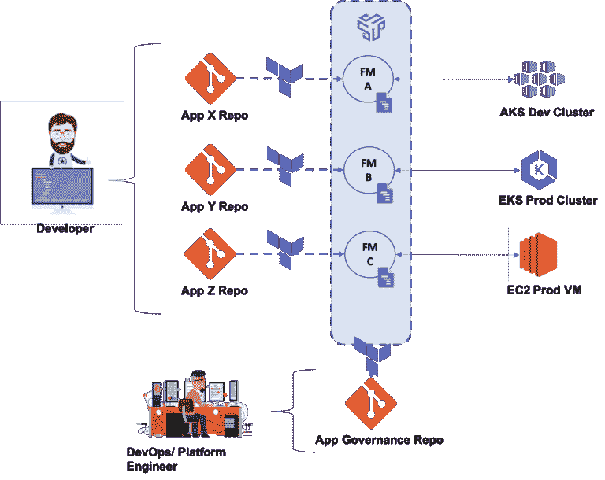

# 使用 Terraform 解锁应用程序的最佳实践

> 原文：<https://thenewstack.io/best-practices-for-unlocking-appops-with-terraform/>

[](https://www.linkedin.com/in/bruno-a-a369028/)

 [布鲁诺安德拉德

布鲁诺是 Kubernetes 开发者平台 Shipa 的 CEO。Bruno 曾在 Juniper Networks、HTBASE、Oracle 和 IBM 担任软件工程职务。](https://www.linkedin.com/in/bruno-a-a369028/) [](https://www.linkedin.com/in/bruno-a-a369028/)

高效管理、调度和控制 Kubernetes 集群对于许多率先进行云原生和微服务现代化工作的 DevOps 团队来说是一项挑战。Terraform 在团队中广受欢迎，因为它提供了解决这些障碍的便捷工具，使得直接从 CI/CD 管道创建和编辑环境成为可能。然而，开箱即用的 Terraform 缺乏帮助开发人员部署和控制作为内部开发人员平台(IDP)一部分的应用程序的功能。实现这些功能需要一个额外的要素:AppOps 模型。

DevOps 定义并实施安全和治理等策略。开发人员部署、管理和支持他们的应用程序。他们可以跨多个 Kubernetes 集群和异构基础设施这样做，使用一个不依赖于底层基础设施的单一定义模型。

[](https://cdn.thenewstack.io/media/2021/08/7b62e2c0-image1.png)

下面是 AppOps 模型可以发挥作用的一些用例:

## 用例#1:应用程序部署

使用 Kubernetes，开发人员快速部署应用程序的能力至关重要。通常，DevOps 团队必须制作并精心维护 Terraform 部署模板，以实现这种开发速度。然而，[Shipa provider for terra form](https://learn.shipa.io/docs/terraform)让开发人员能够自行部署应用，从而将开发团队从这些负担中解放出来。

以下示例创建了一个应用程序，为其分配了一个 CNAME，并从现有的 Docker 映像部署它:

```
terraform  {
  required_providers  {
    shipa  =  {
      version  =  "0.0.1"
      source  =  "shipa.io/terraform/shipa"
    }
  }
}
provider  "shipa"  {}
resource  "shipa_app"  "app1"  {
  app  {
    name  =  "terraform-app"
    teamowner  =  "dev"
    framework  =  "dev-framework"
  }
}
resource  "shipa_app_env"  "env1"  
{
  app  =  "terraform-app"
  app_env  {
    envs  {
      name  =  "SHIPA_ENV1"
      value  =  "test-1"
    }
  }
}
resource  "shipa_app_cname"  "cname1"  {
  app  =  "terraform-app"
  cname  =  "test.com"
  encrypt  =  true
}
resource  "shipa_app_deploy"  "deploy1"  {
  app  =  "terraform-app"
  deploy  {
    image  =  "docker.io/shipasoftware/bulletinboard:1.0"
  }
}

```

重要的是，您不需要学习或维护复杂的 Kubernetes 工件就可以做到这一点。

开发人员还可以指定和部署相同的应用程序定义，而无需了解他们正在使用的底层基础设施，无论是 Kubernetes 还是 Linux。该框架在应用程序部署时自动应用定义的规则。开发人员能够理解并使用这种应用规范模型，直接利用 Terraform 作为其 IDP 策略的一部分。

## 用例 2:定义策略

在 Kubernetes 中跨许多团队和应用程序大规模地维护策略和治理既具有挑战性又非常复杂。将 Terraform 与提供商配对，可以快速引入基于角色的访问控制、资源消耗、注册控制、网络策略等治理规则。

在下面的代码中:

*   *provisioner* 定义了整个框架是绑定到 Kubernetes 集群还是 Linux 服务器。
*   *安全*定义了在每个应用程序部署之前和之后执行的应用程序安全扫描，并列出任何可以安全忽略的漏洞。
*   *app_quota* 控制应用程序被允许如何扩展；*访问*控制哪些团队可以部署应用；*计划*控制应用程序内存和 CPU 消耗限制。
*   *network_policy* 定义了入口和出口服务之间允许的通信，并使开发人员能够在部署后为自己的应用程序定义定制的网络策略。
*   最后， *container_policy* 控制在应用程序部署期间可以从哪些注册表中提取映像，阻止来自不可信来源的映像。

```
terraform  {
  required_providers  {
    shipa  =  {
      version  =  "0.0.1"
      source  =  "shipa.io/terraform/shipa"
    }
  }
}
provider  "shipa"  {}

resource  "shipa_framework"  "prod-framework"  {
  framework  {
    name  =  "production-services"
    resources  {
      general  {
        setup  {
          public  =  false
          default  =  false
          provisioner  =  kubernetes
        }
        security  {
          disable_scan  =  true
          scan_platform_layers  =  false
          ignore_components  =  ["apt",  "bash",  "..."] 
          ignore_cves  =  ["CVE-2020-27350",  "CVE-2011-3374",  "..."] 
        }
        app_quota  {
          limit  =  "5"
        }
        access  {
          append  =  ["dev-team"]        }
        plan  {
          name  =  "production-plan"
        }
        network_policy  {
          ingress  {
 policy_mode  =  "allow-custom-rules-only"
 custom_rules  {
              id  =  "rule-name"
              enabled  =  true
              description  =  "rule description"
              allowed_apps  =  ["app1",  "app2"]              
              ports  {
                port  =  8080
                protocol  =  "TCP"
              }
 }
          }
          egress  {
 policy_mode  =  "allow-all"
          }
          disable_app_policies  =  "false"
        }
        container_policy  {
          allowed_hosts  =  ["docker.io/shipasoftware",  "docker.io/shiparepo"]        }
      }
    }
  }
}

```

Terraform 和 AppOps 现在使您的团队能够快速定义策略，并更轻松地满足应用安全要求。组织还可以通过用更多用户能够容易理解和报告的策略替换复杂的策略来追求 DevSecOps 目标。

## 用例 3:将 Terraform 整合到您的 IDP 策略中

通过 Terraform 支持您的内部开发人员平台，开发人员还可以持续管理应用程序和治理策略，有效地关闭 CI/CD 和运营之间的环路。开发人员还可以将应用程序和警报以及应用程序和策略可观察性集成到现有堆栈中，并访问日志和审计报告。总之，这些特性使 IDP 能够提供端到端的 AppOps 模型。

## 通往 AppOpps 的道路就在那里等待着你去选择

使用 Terraform 的提供者来实现 AppOps 消除了与模板相关的开销。它使开发运维人员能够高效地关注安全性和治理，并快速制定策略。它使开发人员能够通过完全启用的 IDP 在没有帮助的情况下部署和管理应用。

*欲了解更多关于 terra form Shipa 供应商的信息，请访问*[*learn.shipa.io/docs/terraform*](https://learn.shipa.io/docs/terraform)。

<svg xmlns:xlink="http://www.w3.org/1999/xlink" viewBox="0 0 68 31" version="1.1"><title>Group</title> <desc>Created with Sketch.</desc></svg>