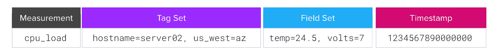
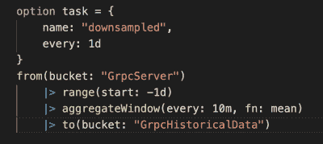

# 构建物联网分析的最佳实践

> 原文：<https://thenewstack.io/best-practices-to-build-iot-analytics/>

今天，物联网(IoT)数据或传感器数据就在我们周围。行业分析师预计，到 2025 年，全球联网设备的数量将从 2021 年的 127 亿台增加到 309 亿台。

谈到物联网数据，请记住它具有特殊的特征，这意味着我们必须规划如何存储和管理它以保持底线。在存储和工具等因素上做出错误的选择会使数据分析变得复杂，并导致成本增加。

单个物联网传感器平均每秒发送一个数据点。一天之内总计超过 80，000 个数据点。一些传感器每纳秒产生一次数据，这大大增加了每天的总量。

大多数物联网[用例](https://www.influxdata.com/use-cases/iot/?utm_source=vendor&utm_medium=referral&utm_campaign=2023-03_spnsr-ctn_best-practices-iot-analytics_tns)也不仅仅依赖于单个传感器。如果你有几百个传感器，都以这样的速度产生数据，那么我们谈论的是大量的数据。一天之内可能会有数百万个数据点需要分析，因此您需要确保您的系统能够处理这种规模的时间序列工作负载。否则，如果您的存储效率低，您的查询返回速度慢，并且如果您没有为这种类型的数据配置分析和可视化工具，那么您的日子就不好过了。

在本文中，我将介绍构建高效且可扩展的物联网分析的六种最佳实践。

## 1.正确启动您的储物空间

几乎所有物联网数据都是[时间序列数据](https://www.influxdata.com/what-is-time-series-data/?utm_source=vendor&utm_medium=referral&utm_campaign=2023-03_spnsr-ctn_best-practices-iot-analytics_tns)。因此，考虑将物联网数据存储在时序数据库中，因为作为针对独特时序工作负载的专用解决方案，它可以提供最佳性能。物联网数据的形状一般包含相同的四个组成部分。第一个只是你正在追踪的东西的名字。我们可以称之为测量，这可能是温度、压力、设备状态或其他任何东西。接下来是标签。您可能希望使用标签为数据添加上下文。想想你收集的实际值的元数据之类的标签。值本身，通常是数字，但不一定是，我们可以称之为字段。最后一部分是指示测量发生时间的时间戳。

知道了数据的形状和结构，当数据在数据库中时，就更容易处理了。那么什么是时间序列数据库呢？这是一个数据库，旨在存储这些数据值(如指标、事件、日志和跟踪)，并根据时间查询它们。与非时间序列数据库相比，在非时间序列数据库中，可以查询 ID、值类型或两者的组合。在时序数据库中，我们完全基于时间进行查询。因此，您可以轻松查看过去一小时、过去 24 小时以及您拥有数据的任何其他时间间隔的数据。一个流行的[时间序列数据库](https://www.influxdata.com/time-series-database/?utm_source=vendor&utm_medium=referral&utm_campaign=2023-03_spnsr-ctn_best-practices-iot-analytics_tns)是 [InfluxDB](https://www.influxdata.com/?utm_source=vendor&utm_medium=referral&utm_campaign=2023-03_spnsr-ctn_best-practices-iot-analytics_tns) ，在云和开源中都有。

## 2.大量摄入

时序数据工作负载往往规模大、速度快且持续不断。这意味着你需要一个有效的方法将数据存入数据库。为此，我们可以看看像 [Telegraf](https://www.influxdata.com/time-series-platform/telegraf/?utm_source=vendor&utm_medium=referral&utm_campaign=2023-03_spnsr-ctn_best-practices-iot-analytics_tns) 这样的工具，这是一个开源的摄取代理，旨在作为 cron 作业来收集时间序列指标。它有 300 多个插件可用于流行的时间序列数据源，包括物联网设备和更通用的插件，如 execd，您可以使用各种数据源。

根据您选择使用的数据库，其他数据接收选项可能包括客户端库，允许您使用自己选择的语言写入数据。例如，Python 是这类工具的常见选项。重要的是，这些客户端库来自您的数据库源，这样您就知道它们可以处理接收流。

## 3.清理数据

当涉及到[清理你的数据](https://thenewstack.io/cleaning-and-interpreting-time-series-metrics-with-influxdb/?utm_source=vendor&utm_medium=referral&utm_campaign=2023-03_spnsr-ctn_best-practices-iot-analytics_tns)时，你有三种选择:你可以在存储数据之前清理它，在它进入你的数据库或你的分析工具之后清理它。存储前清理数据非常简单，只需完全控制发送到存储器的数据，并丢弃您认为不必要的数据。然而，通常情况下，您接收的数据是专有的，并且您无法选择您接收的值。

例如，我的光传感器发送我不需要的额外设备标签，偶尔，如果光源突然丢失，它会发送奇怪的错误值，如 0。对于这些情况，我需要在存储数据后清理它。在 InfluxDB 这样的数据库中，我可以很容易地将原始数据存储在一个数据桶中，将清理后的数据存储在另一个数据桶中。然后，我可以使用干净的数据桶来填充我的分析工具。不需要担心清理工具中的数据，其中的更改不一定会复制回数据库。如果您等到数据到达您的分析工具时才清理它，这可能会使用更多资源并影响性能。

## 4.下采样的力量

清理和缩减像素采样数据是不同的。缩减采样是基于时间聚合数据。例如，从测量中删除设备 ID 是清洁，而导出最后五分钟的平均值是下采样。[缩减采样](https://www.influxdata.com/blog/tldr-influxdb-tech-tips-downsampling-flight-sql-aws-lambda/?utm_source=vendor&utm_medium=referral&utm_campaign=2023-03_spnsr-ctn_best-practices-iot-analytics_tns)是一个强大的工具，就像清理数据一样，它可以节省存储成本，使数据处理起来更容易、更快。

在某些情况下，您可以在将数据存储到永久数据库之前进行下采样，例如，如果您知道您不需要来自物联网传感器的细粒度数据。您还可以使用缩减采样来比较数据模式，例如查找不同日期或不同设备上一天中几个小时的平均温度。缩减采样最常见的用途是聚合旧数据。

您实时监控您的物联网设备，但一旦新数据到来，您会如何处理旧数据？缩减采样获取高粒度数据，并通过应用平均值、平均值和其他运算使其粒度变小。这保留了历史数据的形状，因此您仍然可以进行历史比较和异常检测，同时减少存储空间。

## 5.实时监控

在分析数据时，您可以将其与历史数据进行比较以发现异常，也可以设置参数。不管您的监控方式如何，实时监控非常重要，这样您就可以使用收到的数据快速做出决策并采取行动。[实时监控](https://www.influxdata.com/use-cases/monitoring/?utm_source=vendor&utm_medium=referral&utm_campaign=2023-03_spnsr-ctn_best-practices-iot-analytics_tns)的主要方法包括使用数据库中的内置选项、实时监控工具或两者的组合。

无论您选择哪种方法，查询的快速响应时间和最小延迟都是至关重要的，因为数据到达工具的时间越长，实时性就越差。Telegraf 为各种实时监控解决方案提供输出插件。Telegraf 配置为处理时间序列数据，并针对 InfluxDB 进行了优化。因此，如果您想优化数据传输，您可能需要考虑这种组合。

## 6.历史汇总和冷藏

当您的数据不再具有实时相关性时，通常会继续将其用于历史数据分析。您可能还希望将较旧的数据(无论是原始数据还是缩减采样数据)存储在更高效的冷存储或数据湖中。尽管时序数据库非常适合接收和处理实时数据，但它也需要成为长期存储数据的好地方。

一些跨位置的复制几乎是不可避免的，但是你越能防止这种情况，当然是在备份之外。在不久的将来，InfluxDB 将提供专用的冷藏解决方案。与此同时，您可以随时使用 Telegraf 输出插件将您的数据发送到其他冷存储解决方案。

处理物联网数据时，使用正确的工具非常重要，从存储到分析再到可视化。从一开始就选择最适合您的物联网数据和工作负载的工具，从长远来看，将使您的工作更轻松、更快速。

<svg xmlns:xlink="http://www.w3.org/1999/xlink" viewBox="0 0 68 31" version="1.1"><title>Group</title> <desc>Created with Sketch.</desc></svg>