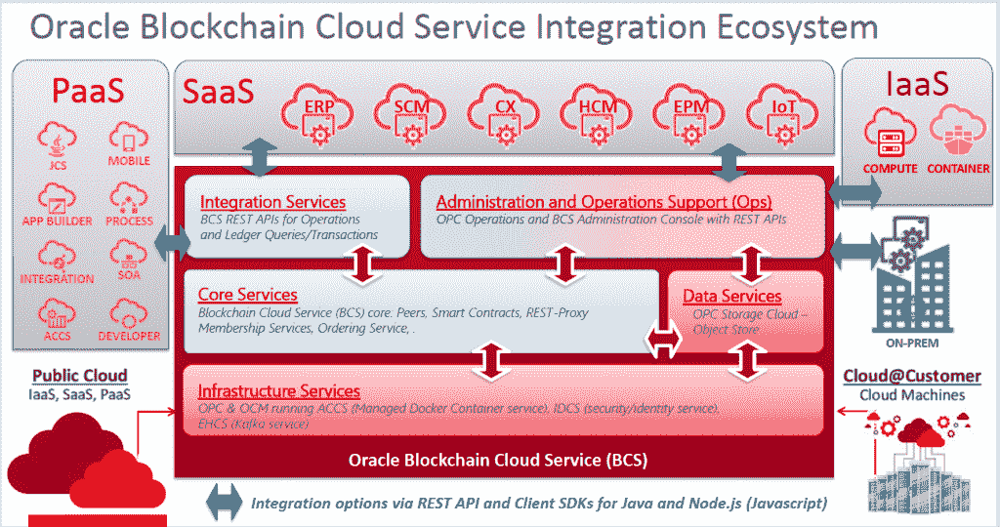

# 超越比特币:甲骨文、IBM 为区块链的工业应用做准备

> 原文：<https://thenewstack.io/beyond-bitcoin-blockchains-expand/>

除了最初用于支持比特币，最近有很多关于区块链的讨论。今年早些时候，我们[报道了在伦敦](https://thenewstack.io/will-blockchain-change-way-businesses-operate/)的一次会议，会上专家小组的观点是有太多的问题需要解决。但那是在二月份，从那以后发生了很多变化。

从最近甲骨文全球大会 2013 的一些区块链会议来看，区块链*的新兴潜在用途令人震惊。*

区块链使用一种也被称为“分布式账本”的技术。这显然适合于财务，因为财务是关于分类账的，但事实证明分布式分类账的概念可以应用于——嗯，几乎所有的东西。

根据 [BlackBook Research](http://www.blackbookmarketresearch.com/) 的数据，70%的医疗保险支付者[计划在 2019 年初](https://www.newswire.com/files/16/40/321b6089f1b01dfd80433bffb0df.pdf)将区块链整合到他们的系统中。离现在还有 15 个月。在拥有超过 50 万会员的付费用户中，这一数字攀升至 98%，其中 14%目前正在测试区块链系统。

IBM 在这项技术上投入了巨资。IBM Global Financing 已经发现，在开始使用区块链时，解决财务纠纷所花费的时间减少了 75%。IBM 首席执行官 Ginni Rometty 夸口说:“互联网为通信做了什么，区块链将为可信交易做什么。”。

麻省理工学院助理教授克里斯蒂安·卡塔利尼在一篇文章中解释道:“区块链可以为你降低两种成本:验证成本和网络成本。”。“分布式分类帐在这些情况下变得如此有用的原因是，如果您记录了那些现在需要在区块链上安全验证的属性，您可以随时返回并免费引用它们。”

对于 OpenWorld，甲骨文推出了[区块链即服务](https://www.oracle.com/cloud/blockchain/index.html)，将于 2018 年初发布。甲骨文集团负责区块链产品开发的副总裁 [Frank Xiong](https://www.linkedin.com/in/frank-xiong-6165142/) 表示，这项服务将捆绑技术，使系统变得私有，并保证符合所有法规，所有这些都与让企业公司参与进来有关。

在熊的演讲中，一张拥挤的幻灯片列出了除金融服务以外的不同行业的使用案例，包括医疗保健、供应链、零售、行李处理、物联网，以及一系列政府跟踪，包括出生证明、财产所有权(所有权和契约)、驾照、福利钱包以及如上所述的社保号码。[甚至书籍](https://thenewstack.io/cultureblocks-experimental-blockchain-e-book-new-kind-ever-evolving-literature/)也可能受到区块链咒语的影响。

## 区块链入门:有什么大不了的？

那么这是什么魔法呢？熊在随后的采访中向我们解释说，通过分布式账本技术，每个人都可以获得一份完全相同的账本，但交易是以“块”为单位进行捕获的然后锁定这些块，创建一个不可变的事务记录。

这种安全性的增加是现在鼓励各行各业的企业认真看待它的因素。比特币是完全开放的，这意味着网络上的任何人都可以随时看到整个账本。很明显，熊说，这对企业是行不通的。但现在，分布式分类帐可能需要对等方的许可才能加入网络，并且能够根据个人贡献者的需求和/或安全许可来限制他们可以看到的内容。

 [来自书库:麻省理工学院

**区块链的一些简单经济学**:当与本地令牌(如比特币和以太坊)结合时，区块链允许分散的经济代理网络定期就共享数据的真实状态达成一致。这种共享数据可以代表货币、知识产权、股权、信息或其他类型的合同和数字资产的交换，使区块链成为一种通用技术，可用于交易稀缺的数字产权，并创建新型的数字平台。由此产生的市场的特点是竞争加剧，进入和创新壁垒降低，隐私和审查风险降低，并允许同一生态系统内的参与者投资支持和运营共享基础设施，而无需将市场权力分配给平台运营商。](https://papers.ssrn.com/sol3/papers.cfm?abstract_id=2874598) 

当一笔交易发生时，它需要得到区块链的人的认可，然后被打包成一个块，然后被附加到分类账中。所以每个人都有一个相同的账本，熊说。这里的关键是，一旦一个区块被认可，没有人可以篡改它。

熊解释说:“如果我改变了那里的一个块，整个事情就变得无效，因为他们使用散列码来恢复先前的记录。如果您做了任何更改，下一个块将无法追加。

熊举了一个例子:一家小型的“从农场到餐桌”的餐饮公司目前正在使用 Oracle 区块链 PaaS 进行测试。

首先，熊说，你总是从业务流程开始。你确定参与者，他们将做出什么贡献，需要支持的具体点，以及谁将提供支持。完成这些后，你就可以开始构建链条了，但不是在此之前。

所以这个客户开始在一个养鸡场跟踪食物，为分类帐收集数据。鸡蛋是有机的吗？原产国是哪里？成本？农民记录这些数据并认可一个区块。

然后鸡蛋被运送到货运线上。农民和运输商创建一个交易批次，签署一个新的区块，该区块被附加到区块链并被分发，使每个人都可以访问该批次号，该批次号兼作跟踪号。

在传输过程中，会收集更多的数据。温度够低能保证新鲜吗？旅途中有电气问题吗？当鸡蛋交付时，运输商和餐馆背书交付，这产生了新的区块。

注意，熊说，这些多个公司，多个行业。这个区块链收集有用的信息。现在，如果需要召回，您可以立即找到该农场分发了多少鸡蛋，它们都在哪里，并让它们下架(或离开厨房)，从而节省数百万美元，因为必须追溯到源头。

总之，在整个过程中的每一步，所有的东西都被清晰地记录下来。没有人可以追溯附加任何东西。

## 为区块链发展

那么，开发者需要了解这项新技术的哪些方面呢？

熊说:永远从商业模式开始。“玩家是谁？流程是怎样的？你打算怎么组织这件事。供应链，资金转移手。这是我的第一件东西，商业模式。”

只有到那时，才开始建造区块链。

甲骨文的区块链 PaaS 工作流程

当然，你可以编写自己的代码，但是你必须了解所有的金融和政府法规以及软件更新。或者您可以注册一个 PaaS，在那里所有这些都会得到处理。

甲骨文的区块链 PaaS 是用 Go 写的。熊称他们的界面对开发者来说非常友好，因为它会引导你完成设置和安装过程。区块链 PaaS 可从各种环境中访问，包括您的笔记本电脑。一旦实例化，就需要在 Go 中编译语言，并放一个可执行的注释。然后系统就可以使用了。

熊说，要开始交易，你需要调用一个“智能合约”，这不像普通的合约。它只是一组软件代码，类似于 API。开发人员负责为业务模型中确定的每个交易创建一个“智能合同”。

因此，智能合约将执行一项交易，比如将资金从 A 地转移到 B 地，或者将这只鸡从这个农场送到那个仓库。然后，参与的玩家认可该交易，创建一个区块，然后附加到网络上的区块链。

## 未来

当被问及对开发者有什么建议时，熊说:“在理解你的商业模式的情况下运用你的编程技能，因为现在你不仅仅是简单地写一个代码。”

他还建议，在不久的将来，一些创业公司将开始以与 API 目前相同的模式开发智能合同。可以在各种区块链中使用和应用的通用智能合约。

<svg xmlns:xlink="http://www.w3.org/1999/xlink" viewBox="0 0 68 31" version="1.1"><title>Group</title> <desc>Created with Sketch.</desc></svg>