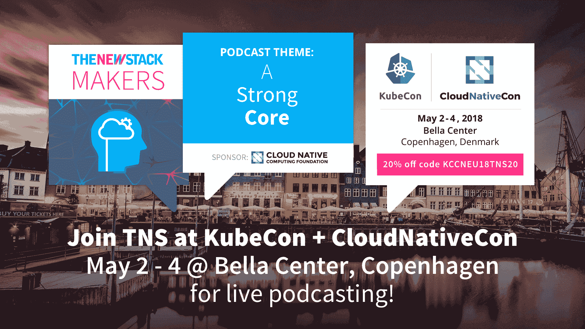

# 超越 CI/CD:Docker 容器的持续入侵和管道驱动的安全性如何保证 Ygrene 的安全

> 原文：<https://thenewstack.io/beyond-ci-cd-how-continuous-hacking-of-docker-containers-and-pipeline-driven-security-keeps-ygrene-secure/>

[](https://ygrene.tech)

 [奥斯汀·亚当斯，高级软件工程师

奥斯汀·亚当斯是一位充满好奇心的技术专家，他以人为本，善于快速学习，乐于用现代解决方案挑战棘手的问题。能够领导和跟随，他有管理经验，知道如何看到一个项目通过所有阶段的执行。他喜欢玩乐，喜欢和家人在一起，喜欢在社区工作。他是一个顾家的男人，梦想拥有一个迷你农场，创造一个可持续的生活环境。](https://ygrene.tech) [](https://ygrene.tech)

最近，我们一直在思考如何提高我们组织的安全性。我们希望不要让你相信软件安全的必要性。如果是这样，在你最喜欢的浏览器上打开 CNN.com 应该就可以了。

我们非常重视安全性。除了 CISSP 认证中针对全方位信息安全提出的一般指导原则，我们还有自动化基础架构合规性扫描、自动化渗透测试(以及喜欢手动测试的人)以及持续监控变更日志中的“安全更新”字样谈到今天的基础设施安全，我们有一个很好的节奏。然而，当我们的扫描器检测到问题时，它在本质上往往是被动的。随着我们的安全焦点的成熟，我们的团队感到需要更多的保证，当我们启动一个应用程序时，它不会背叛我们为保持安全所做的所有基础设施级别的工作。我们开始研究更强大的应用程序/容器安全预防策略和方法。

我们想创造一个短语“持续黑客攻击”所有的酷孩子(和公司)都在为云原生计算时代创造新的口号，所以我们想把我们的口号放在那里。我们将持续黑客行为定义为一套工具和一种理想，保留敏感数据的公司都应该追求这种理想。

我们提出的针对持续黑客攻击的实现被称为管道驱动安全(PDS)。我们希望在我们的工程师中实施安全坚持和采用。为了做好这一点，可以检查安全性的最合理的地方(而不是代码审查)是在构建/部署管道中。我们这项工作的第一次迭代是将各种工具混杂在 CI 管道中。PDS 开始显示出一些价值，但是很明显我们没有组织好我们的工具或目标。

在完善我们的战略时，我们开始采用 STRIDE acronym 安全方法，并将其应用到我们的渠道中。我们将分解首字母缩略词，然后向您介绍我们在装运前用来破碎集装箱的工具。STRIDE 代表欺骗、篡改、否认、信息泄露、拒绝服务和特权升级。每一个都将在下面详细探讨。

 [扎克·阿诺德，伊格内能源基金软件工程师

Zach Arnold 目前在 Ygrene Energy Fund 工作，担任软件工程师，领导该组织将 Kubernetes 用于生产工作负载。他与奥斯汀一起倡导 Ygrene 的微服务运动，并帮助建立整个 PACE 金融行业的信息安全最佳实践。他对 IOT、分布式系统的所有东西都很着迷，他的个人爱好是在 Ygrene 创建机器学习模型来完成各种有趣的学习任务。](https://ygrene.tech) 

当恶意程序/个人伪装成某个受信任的实体，以获得对敏感数据的访问权或以其他方式危及您的信息的机密性、完整性或可用性时，就会发生欺骗。电子欺骗可能发生的地方包括系统资源、用户、网站、权威机构甚至 Docker 容器。为了解决这个问题，我们在构建时做了以下事情来防止欺骗:

1.  我们运行一个脚本，该脚本接受带有 FROM 指令的 Dockerfiles，这些指令指向基本映像的智能白名单。它会拒绝随机抽取不可信图像的图像。白名单是智能的，因为它有一个特定的批准值列表，但也有一些当值不在列表中时的解决策略/计划。其中之一是检查基本映像是否是基本 Docker 标准库映像。我们称之为“血统”，它很快就会被开源。[关注我们](https://ygrene.tech)获取开源时的更新。

2.  在我们的构建管道中，我们以 Docker 内容信任的形式使用[公证](https://github.com/theupdateframework/notary)(CNCF 的一个项目)，以确保我们只提取加密签名的基础映像。使用签名图像并不一定意味着基础图像是友好的，但它保证了我们期望的发布者制作了图像，并且每一层都是我们想要的。当与血统配对时，这允许更坚定的保证我们开始干净。

篡改是由攻击者恶意更改一些数据以对系统进行攻击而引起的。在 Docker 容器中，如果攻击者更改了存储在注册表中的图像而没有更改其关联的元数据，就会发生这种情况。或者，攻击者可以篡改图像的关联标签的元数据，结果，提取的图像不是预期的图像。以下是我们如何打击这些特殊形式的篡改:

1.  使用 Docker 内容信任，我们的构建管道以加密方式对推送图像的元数据进行签名，因此当它稍后被拉取时，如果图像上的元数据与来自公证服务器的解密元数据不匹配，图像将在运行时被拒绝。通过在构建时签名，我们确保了安全的检索和执行。
2.  目前，在我们的容器中，我们只使用 Linux 发行版，它使用包管理器的安全特性来检查包的完整性。大多数包管理器都会这样做。想想 APT，YUM 和 RPM。
3.  当手动提取第三方依赖关系(操作系统依赖关系和代码级依赖关系，如 NPM 和 Bundler)时，我们确保对每个映像进行代码审查，并且只允许使用 SSL 检索资源，包括 git repos，确保校验和得到验证。

*我们计划在未来添加 lint 规则，该规则将自动检查在映像构建时校验和是否得到验证。这可以通过限制`wget`或`curl`来实现，只使用一个包装器，该包装器获取 URL 并验证校验和，也许还有散列算法。[关注我们](https://ygrene.tech)以获取发布时的更新。

4.  我们 lint 我们的 Dockerfiles 确保我们从一个特定的标签中提取基本图像，而不仅仅是一般的“最新”标签。从最新版本中提取基本映像可以考虑到您并不真正知道容器内部正在运行什么的情况。伟大的 dockerfilelint 是 [hadolint](https://github.com/hadolint/hadolint) 和 [dockerfilelint](https://github.com/replicatedhq/dockerfilelint) 。

5.  我们使用 Docker 指令 COPY 而不是 ADD。这是直接来自 Docker 的 CIS 基准指南的另一个建议。ADD 可以像`curl`或`wget`一样提取远程资源，我们已经确定只有在我们可以验证校验和的时候才需要这样做。此外，ADD by nature 允许您添加 URL，并可以对您可能需要或不需要的本地文件执行自动解压缩。如果不手动解压缩、获取资源和验证校验和，您将面临下载恶意软件或您不想下载的软件版本的风险。我们的建议是，如果你小心使用，添加它很好，但这取决于你想有多严格。

当一个恶意的实体做了某件事，同时也剥夺了其他人证明他们做了这件事的能力时，就发生了抵赖。在 Docker 中，构建和推送审计日志是为了揭示谁在什么时间创建了哪个容器的什么版本。这是任何安全问题补救措施的关键部分。在我们的构建管道中，我们试图以几种方式建立对策:

1.  使用带有详细审计日志的 Docker 注册表。
2.  保护我们的构建服务器的运行/审计日志，因为它们包含大量关于谁在什么时间运行了什么任务的信息。
3.  尽可能限制在生产基础设施上采取的任何手动步骤。手动步骤消除了以编程方式或轻松检查谁在何时做了什么的能力。如果它不能在 git 中版本化，我们就“git”可疑。

当攻击者通过某种方式获取组织想要保密的信息时，就会发生信息泄露。当应用程序设计不良时，也会发生这种情况，它会将敏感信息泄露给不应该拥有这些信息的用户(甚至是没有恶意的用户)。)我们使用以下对策来拒绝这些策略:

1.  我们不允许构建 Dockerfile 将敏感主机路径指定为卷装载的映像，也就是说，我们扫描 Dockerfile 以查找像/proc 或/这样的卷装载。如果像这样的容器被构建并放入我们的 Kubernetes 集群，那么如果遭到破坏，它被用来暴露主机信息并帮助进一步渗透我们的整个基础架构的可能性就会增加。
2.  我们挤压(实验 Docker 功能)我们的图像。有时在映像构建期间，您需要一个私钥或凭证来下载所有相关的资源。比如你写过的私家红宝石。不幸的是，当这些密钥或秘密在构建时被放入容器时，它们隐藏在文件系统中，即使运行时不需要它们。当我们绝对需要这样的东西时，我们使用 Docker 指令副本将它放入容器，然后在它被使用后，我们使用 RUN rm …删除它。当您在 docker build 命令中添加了 squash 时，刚刚删除的图层索引将不会出现在最终构建的图像中。这意味着先前在容器中的密钥或秘密现在从所有层中永久消失了。一旦你推送被压缩的图像，它就摆脱了那些你宁愿保守秘密的文件。
3.  我们对每个微服务代码都做了一些有趣的事情。我们对代码库运行静态代码分析，找出已知的代码级安全漏洞。这是特定于语言的，信息的质量将根据您的技术选择而变化，但这是一种很好的方式，可以用清晰的反模式来消除代码的安全性。这里有一份来自 OWASP 的[扫描仪列表可供选择，还有](https://owasp.org/www-community/Source_Code_Analysis_Tools)[一些我们喜欢的](https://github.com/GoASTScanner/gas)。
4.  我们运行自动化的依赖扫描器来检查我们是否使用了最新的、最安全的代码依赖版本。这是非常标准的，但是如果您的组织还没有这样做的话，还是值得一提的。让[保持最新](https://github.com/rubysec/bundler-audit)可能是一件痛苦的事情，但是获得你需要的“升级优先权”的一个方法是说“[这是一个安全问题](https://github.com/albuch/sbt-dependency-check)”同样，OWASP 是一个救生员。
5.  我们做的最后一件事，也可能是最有趣的一件事，是攻击我们的容器，测试是否有任何新代码引入了自动化渗透测试可以利用的漏洞。这就是“持续黑客”真正发挥作用的地方。基本上，我们在伪测试模式下启动服务和附加资源，并将自动渗透机器人指向正在运行的容器，看看会发生什么。如果扫描器返回警告，那么我们拒绝建造。目前，我们将扫描程序定向到 API-docs URL，并希望扫描程序抓取它能找到的任何内容并攻击它。我们现在想要改进的一个方面是能够向扫描器发送已知路径的列表，以便可以测试特定区域的问题。使这成为可能的一个伟大的工具是 zaproxy。

当攻击者采取行动阻止正常情况下的正常通信正常进行时，就会发生拒绝服务。换句话说，一个用户/程序可以影响所有用户的体验。在考虑正常运行时间的情况下构建 Docker 映像，防止 DOS 攻击的一个明确方法是消除映像中的漏洞。任何类型的安全漏洞在被利用时都会导致停机。考虑到这一点，以下是我们扫描图像的方法:

1.  在管道中，我们使用工具来扫描恶意软件和易受攻击的软件包。我们将这些二进制文件调整为拒绝具有高漏洞的图像。因为这些工具对于 Docker 来说是新的，所以我们使用多个。我们在构建中使用的这些工具中的一个将阻止管道继续，我们使用的一个工具被动地扫描存储在图像注册表中的所有图像。这使我们能够防止部署坏容器，如果检测到 CVE 并在同一天发布。但是，如果图像在发货时没有 CVE，但后来有了呢？然后，如果我们的图像包含基于 CVE 数据库的问题，注册表扫描器会提醒我们，因为它们会随着时间的推移而更新。这两者一起提供了一些强大的可见性和预防。我们喜欢的一些工具是[达格达](https://github.com/eliasgranderubio/dagda)、[克拉马夫](https://www.clamav.net/)和[克莱尔](https://coreos.com/clair/docs/latest/)。
2.  使用 Docker 指令运行状况检查。我们以特定的方式使用健康检查。我们使用它来确保应用程序基础进程正确运行。许多编排平台(如 Kubernetes)已经对容器进行了某种网络健康检查。但是，有些容器没有开放端口或传入的 HTTP/gRPC 连接，例如后台作业处理容器。在这里，我们可以通过运行命令来检查流程是否仍在运行，或者流程是否使用了预期的内存量，从而帮助编排工具。

最后，当用户获得的访问权限超过应用程序创建者的期望时，就会发生特权升级。因为 Docker 容器就像婴儿电脑一样，我们可以用同样的方式处理升级问题。我们尝试通过以下方式来防止这些问题:

1.  我们使用 linters 和静态代码分析来拒绝那些只指定根用户作为将在容器内部执行程序的进程的图像。或者，我们为应用程序运行时创建新用户的图像开绿灯。
2.  我们对容器内的包非常明确。我们运行脚本，列出构建服务器上容器内的所有内容。这迫使开发人员看到他们的容器里面有什么，并可以帮助他们检测任何他们不需要的包。我们还没有工具来强制执行运行时所需的最小软件包集(主要是因为这影响了开发人员以他们认为合适的任何方式构建具有依赖关系的服务的自由)，但是仅仅增加意识就足以在我们的场景中实现。显示安装在基于 rpm 的发行版上的所有软件包的一个例子是``docker exec $INSTANCE_ID rpm -qa``
``*   我们还删除了 setuid 和 setgid 特权。这个稍微高级一点，但是它基本上直接根据 Docker CIS 基准进行编码。使用一个叫做 [docker-bench](https://github.com/docker/docker-bench-security) 的工具，我们能够看到存在多少具有 setuid/setguid 权限的可执行文件，然后进行修复。查看这些可执行文件的一种方法是运行``docker run <Image_ID> find / -perm +6000 -type f -exec ls -ld {} \; 2> /dev/null````

 ```至此，我们已经完成了对如何提高 Docker 容器安全性的大幅度分析。我们知道你在说什么:“哇，那是相当多的工作要做。”是的，但是如果你想象自己是一名黑客，并且每次提交都要攻击 Docker 容器，这可能会激励你。Docker 安全还是很新的(因为 Docker 也是！)而且有很大的创新空间。正如你所看到的，我们试图在这一领域进行创新的一种方式是“不断入侵”我们的图像。黑客快乐。

你有没有想出一些我们错过的新奇的东西？[请与我们分享](https://ygrene.tech)！我们也想学习和成长！

*奥斯汀和扎克将于 2018 年 5 月 2 日至 4 日在丹麦哥本哈根举行的[kube con+CloudNativeCon EU](https://events.linuxfoundation.org/events/kubecon-cloudnativecon-europe-2018/attend/register/)大会上发表演讲，主题为“[金融行业足够好:利用 Kubernetes](http://sched.co/Dquv) 中的微服务实现大规模高安全性”。*



本文由 Ygrene 代表新堆栈的赞助商[kube con+CloudNativeCon](https://www.cncf.io/kubecon-cloudnativecon-events/)Europe 撰写。

通过 Pixabay 的特征图像。

<svg xmlns:xlink="http://www.w3.org/1999/xlink" viewBox="0 0 68 31" version="1.1"><title>Group</title> <desc>Created with Sketch.</desc></svg>```