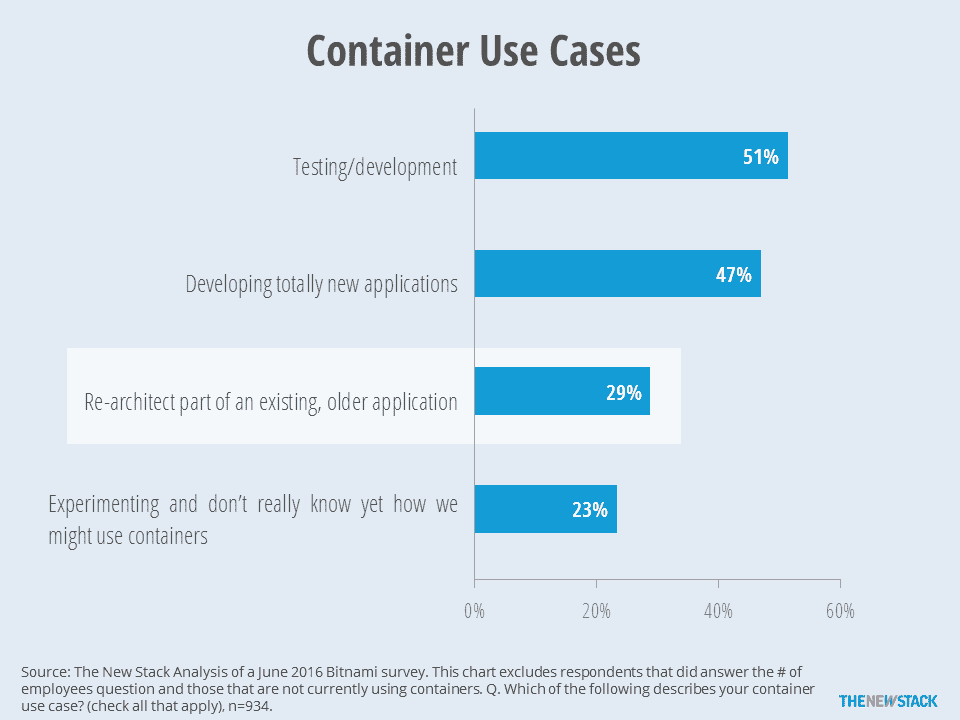
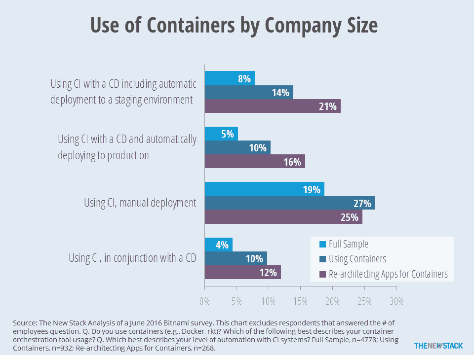

# TNS 研究:绿色领域之外的集装箱再设计

> 原文：<https://thenewstack.io/beyond-greenfield-rearchitecting-containers/>

今年，许多公司开始将容器投入生产。目前，大部分活动都围绕着新的应用。我们预计会有更多的遗留应用程序被容器化，但是没有人知道这个过程需要多长时间。我们知道的是，许多组织还没有为微服务做好准备。如果没有适当的基础设施和流程，公司将没有时间或资源来考虑将其旧工作负载迁移到新的云平台。

人们同时为几种不同的用例部署容器。根据 [Bitnami 针对容器用户的调查](https://bitnami.com/)，51%的用户使用容器进行测试/开发，47%的用户使用容器开发新的应用程序。

一旦这些新应用程序投入生产，IT 部门就会专注于让他们与容器相关的基础设施企业就绪。展望未来，我们的假设是，除非对新应用有特定要求，否则开发人员将选择云原生平台，并使用微服务原则进行开发。这些新场景在初创公司中很常见，但大多数开发人员实际上把时间花在现有的应用程序上。只有 29%的容器用户表示他们将使用容器来重新设计旧应用程序的一部分。然而，大多数进行重新架构的人也会在容器上部署新的应用程序。

在 29%的情况下，许多容器部署用例将会重新架构现有的应用程序。

成本和风险是为容器重新设计遗留应用程序的更大障碍。将新应用程序部署到生产环境中的公司可以慢慢来。如果大规模操作容器的基础设施出现故障，回滚部署相对来说并不痛苦。相比之下，企业更倾向于规避现有应用程序的风险，这些应用程序往往是关键任务或影响大量用户。就成本而言，许多新的应用程序开发都是作为新产品开发来资助的，但传统应用程序通常在 IT 运营预算下维护。除非找到显著的成本节约，否则 IT 运营部门不会为开发人员重新制作一个三年前的定制软件付费。

考虑到额外的风险和成本，组织不愿意重新设计遗留应用程序，除非他们的[微服务](/category/microservices/)和[开发运维](/category/devops/)更加成熟。根据 Puppet Labs 的研究，更小、更快的代码部署是采用 DevOps 过程的组织的特征。

没有 DevOps 精神和相关工具，失败的可能性很高。正如 Forrester 的 [Jeffrey Hammond](https://twitter.com/jhammond) 和 [John Rymer](https://twitter.com/johnrrymer) 在 *[中解释的那样，如何获得微服务设计](https://www.iron.io/resources/white-papers/forrester-report-how-to-capture-the-benefits-of-microservice-design/)* 、*、*“持续集成和交付很难扩展”，简单地加快现有的发布管理流程会导致灾难和不稳定。"

在之前的[文章](https://thenewstack.io/parity-check-container-reality-check/)中，我们报道了很少有公司同时使用持续集成(CI)和容器。然而，使用容器的公司更可能使用 CI。虽然只有 36%的组织使用 CI，但对于容器用户，这个数字上升到 61 %,对于重新设计遗留应用程序的公司，这个数字上升到 74%。CI 的姊妹，连续部署(CD)对于容器部署的成功至关重要。因此，与容器的所有用户相比，为容器重新设计应用程序的公司更有可能使用 CI 和连续部署来自动部署，这并不奇怪(37%对 24%)。

同时使用 CI 和 CD 的公司更有可能为容器重新设计遗留应用程序。

从这个角度来看，Will Kinnard 在撰写关于将遗留应用程序容器化的决定时可能过于乐观了。他声称大多数“可以以当前的形式进行容器化，创造了几个优点，而没有以前实现的缺点。”

即使您的组织拥有全新的 PaaS、在生产中管理容器的经验和 DevOps 成熟度级别，与其他云迁移方法相比，软件重构所需的时间和精力可能仍然不值得。通常，为了避免与重新设计应用程序相关的成本，将工作负载从内部数据中心转移到 IaaS 会更具成本效益。要更详细地评估这一决策，分析师 David Linthicum [认为](http://www.cloudtp.com/2015/12/04/refactor-vs-lift-and-shift-vs-containers/)应该评估以下变量:

*   代码和数据可移植性
*   应用和数据性能
*   支持更高性能的云原生特性
*   利用微服务的能力
*   治理和安全
*   业务敏捷性

现在，再考虑一下“无服务器”和功能即服务(FaaS)。目前，几乎所有无服务器的努力都围绕着新的应用程序，并且基本上都是在容器之上。无服务器还需要大量的重新设计。没有必要的工具、基础设施和组织成熟度，为无服务器世界重写软件不应该在你的短期计划中。然而，IT 领导在进行当前状态应用程序评估时，考虑的是一两年后的情况。从这个角度来看，也许你应该同时考虑集装箱和 FaaS。

Bitnami 是新堆栈的赞助商

通过 Pixbay 的特征图像。【T2

<svg xmlns:xlink="http://www.w3.org/1999/xlink" viewBox="0 0 68 31" version="1.1"><title>Group</title> <desc>Created with Sketch.</desc></svg>