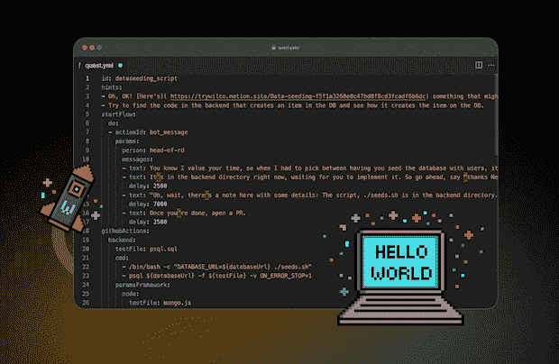
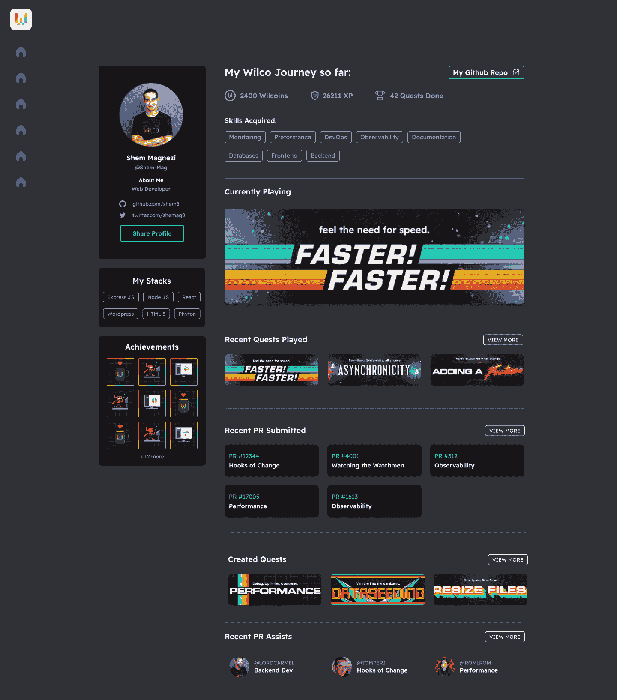

# 超越 Hello World:创业游戏开发技巧

> 原文：<https://thenewstack.io/beyond-hello-world-startup-gamifies-development-skills/>

如果你不是和[一起长大的，那么请选择 80 年代的自己的冒险](https://www.cyoa.com/)故事，嗯……我很抱歉。他们很棒:你开始了冒险，选择了一条路，这条路要么让你在故事中前进，要么让你死去；在这种情况下，你后退一步，再试一次。美好时光。

如果作为一名软件工程师，你能把同样的玩耍元素带到你的发展中，会怎么样？这基本上是创业公司 [Wilco](https://www.trywilco.com/) 背后的想法，该公司提供模拟开发人员培训游戏。

这家以色列初创公司周二发布了一个 SDK，允许个人创建和分享自己的开发任务。Wilco 还将在明年 1 月举办一场[的探索构建黑客马拉松活动，以鼓励开发者创造教授开发技能的游戏。](https://www.trywilco.com/hackathons/quest-builder-jan23)

## 简而言之，探索

这些任务使用一家虚拟公司 Anythink 来模拟现实世界中类似生产的系统，为开发人员提供日志记录、监控、分析、负载平衡和真实数据集任务。这些模拟都围绕着现实世界的任务，比如在生产中找到一个[性能问题](https://thenewstack.io/the-data-quality-problem-and-its-impact-on-application-performance/)并确定根本原因。

“当谈到软件工程时，人们认为这一切都归结于语言，但成为一名优秀的开发人员所需的技能是编码以外的技能——你在这个过程中学会的软硬技能的结合，你可以在任何堆栈中学会，”该公司的首席执行官兼联合创始人 Freund 上的[告诉新堆栈。“这就是为什么如果我有两个候选人，其中一个有 10 年的经验，但从未接触过我的投资组合，另一个只有一年的经验，在所有条件相同的情况下，我会更喜欢有 10 年经验的人，尽管我必须告诉他们我的技术投资组合的具体情况。”](https://www.linkedin.com/in/onfreund/?originalSubdomain=il)

这些都是威尔科的任务所围绕的高层次、经验丰富的技能类型。这一探索发生在一个名为“游戏中的小吃”的虚拟休闲频道中，开发者在这里与虚拟同事互动。你可以被分配一项新任务，同事可以协助你完成发展任务。任务可能很“简单”，比如设置你的第一个 [Kubernetes 实例](https://thenewstack.io/kubernetes-101-install-kubernetes-on-rocky-linux/)(我目前的任务——是的，我被困住了)或者构建一个[前端应用](https://thenewstack.io/key-concepts/frontend-development/)，它是为云配置的，并与后端集成。他们目录中的其他[任务](https://www.trywilco.com/catalog)关注于错误修复、可观察性、后端部署，以及识别和解决应用程序中的异步问题。

如果你需要支持，可以通过游戏自己的 it 支持人员、Joebroom Penalope Grantbranch 或 Wilco 的 Discord 服务器。该游戏还与 GitHub 连接，允许开发人员建立项目组合。

## 用例

图片由 Wilco 提供

Freund 说，SDK 主要基于 YAML，允许开发者创建详细描述各种场景的 YAML 文件。该平台旨在教授开发人员技能，而不是教授语言，但目前，它支持使用 Node.js、Python、Ruby on Rails 和 React 进行实践。根据 Freund 的说法，在数据库方面，它提供 Postgres 和 MongoDB。

Wilco 可能是游戏化的，但据 Wilco 称，去年开发者创业市场吸引了约 370 亿美元的投资。不过，这些培训通常是为了让开发人员编写他们的第一个代码——“你好，世界”——而不是开发开发人员在工作中管理的更复杂的流程。

弗罗因德在宣布 SDK 的新闻稿中说:“演示沙盒应用程序和‘Hello world’教程没有正确传达产品提供的优势和价值。”“开发人员需要亲自动手，使用产品来解决他们面临的问题，以便充分理解它的价值。”

编辑器的早期用户包括像 [CircleCI](https://thenewstack.io/circlecis-enterprise-features-are-now-free/) 、[军械库](https://thenewstack.io/sponsor/armory/)和 [Permit.io](https://www.permit.io/) 这样的开发公司。设计合作伙伴 New Relic 的四个以可观察性为中心的探索已经由数千名开发者完成。其他技术公司正在利用这些问题作为他们产品的教育或销售演示，以展示它将如何解决现实世界的问题。该公司表示，至少有一个人已经利用 Wilco 建立了一个工作组合和土地工作。

图片来自 Wilco

弗罗因德引用的另一个新兴用例是使用 quests 作为项目事后分析；它不是创建一个没有人会阅读的乏味的工作文档，而是将这个过程游戏化，因此它可以作为现在和将来开发人员的学习经历。他补充道，任务的设计相当快——在一次有七个团队参加的黑客马拉松中，一个下午，开发者就能创建七个任务。

弗罗因德说:“我们建议的是我们所说的任务剖析——建立一个突出那个场景的任务，然后人们不仅会以一种更身临其境的方式体验它，他们实际上也会想要体验它，因为他们从中获得了乐趣。”“一旦你创造了足够多的任务，你实际上是以任务的形式保存了工程团队的知识。这是一个正规团队基本上正在消失的知识。”

<svg xmlns:xlink="http://www.w3.org/1999/xlink" viewBox="0 0 68 31" version="1.1"><title>Group</title> <desc>Created with Sketch.</desc></svg>