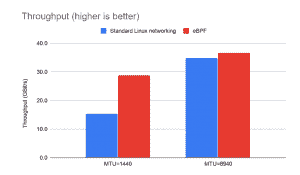
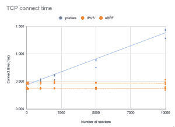

# 超越 Kube-Proxy:Calico 项目利用 eBPF 实现更快的数据平面

> 原文：<https://thenewstack.io/beyond-kube-proxy-tigera-calico-harnesses-ebpf-for-a-faster-data-plane/>

由于 Linux 内核中新引入的 [eBPF](https://lwn.net/Articles/740157/) 的强大功能，Tigera 已经能够为其专注于 Kubernetes 的 [Calico](https://www.projectcalico.org/) 网络管理软件配备新的数据平面模式，这种模式可以加速 pod 到 pod 的数据通信，并消除对 Kubernetes 的 kube-proxy 进行流量管理的依赖。

Tigera 在大约一年前开始与 eBPF [一起发布工作，但这是 Calico 的第一次发布，完全利用了新的 Linux 内核技术的力量，Tigera 的联合创始人兼首席技术官 Alex Pollitt](https://thenewstack.io/tigera-harnesses-ebpf-to-give-calico-kernel-level-functionality/)[说。](https://www.tigera.io/)

“我们希望从基本面中得出我们正在做的事情，相信我们正在为用户构建正确的东西，”Pollitt 说。“我们研究了 Linux 内核中的每个网络构建模块，了解了它们的工作原理和交互方式。”

新的数据平面将作为传统 Calico 数据平面的一个选项提供。Pollitt 说，那些使用新版本 Linux 内核(最好是 4.8 或更新版本)的组织将能够利用新的解决方案。他说，特别是那些把性能放在首位的组织，应该测试这个版本。新的 eBPF 数据平面模式，可作为技术评论，既可以[扩展到更高的吞吐量](https://www.projectcalico.org/introducing-the-calico-ebpf-dataplane/)，同时每 GBit 使用更少的 CPU。

目前，超过 150，000 个 Kubernetes 集群运行 Calico，不仅包括裸机实现，还包括跨亚马逊 Web 服务、Azure 和谷歌云运行的实现。Calico [最初是为 OpenStack 创建的，旨在](/project-calico-and-the-challenge-of-cloud-native-networking/)使用 IP 路由等互联网技术，而不是交换、虚拟网络、覆盖网络或其他复杂的方法，轻松地将数据包从网络的一部分传输到另一部分。

Calico 是为非常动态的环境设计的，可以管理成千上万个随时改变位置的端点。Calico 与谷歌的零信任安全模型非常契合，该模型假设网络和主机会被入侵，因此限制了可能造成的损害。

## 输入 eBPF

单击以嵌入。

eBPF(extended Berkeley Packet Filter)，一个[最近对 Linux 内核](https://thenewstack.io/linux-technology-for-the-new-year-ebpf/)的介绍，是内核内部的一个虚拟机，提供高级、高速、可扩展的网络包过滤。过去由外部模块完成的工作可以由内核本身来执行，速度要快得多。

对于 Calico，eBPF 提供了加快数据流量的工具，同时降低了高端 Kubernetes 部署的网络复杂性。使用这种数据平面消除了对 [kube-proxy](https://kubernetes.io/docs/reference/command-line-tools-reference/kube-proxy/) 的需求，Kubernetes 的内置网络代理通过 iptables 处理负载平衡。虽然 kube-proxy 很适合日常使用，但随着 iptables 中映射的服务数量的增长，它的伸缩性并不好。它需要 IPVS (IP 虚拟服务器)来有效地扩展成千上万的服务。

Calico 数据平面通过更高效的查找映射提供了与 IPVS 类似的可扩展性能，但完全不需要 kube-proxy。它减少了服务器的第一个数据包延迟，这将在不断提供大量服务的环境中带来显著的改善。内核功能减少了 CPU 开销。数据平面保留外部客户端源 IP 地址，一直到 pod(非常适合故障排除)，并且还支持 [DSR(直接服务器返回)](https://medium.com/@dieswaytoofast/direct-server-return-in-the-real-world-b08affb1fe74)，其中返回流量不需要通过原始入口环回。

新发布的 Calico 版本 3.13 [还包括](https://docs.projectcalico.org/v3.13/release-notes/)一个自动检测功能，用于检测在 kubeadm 上运行时用于 pods 的 IP 地址范围。Calico v3.13 将在 [Calico Enterprise v2.8](https://www.tigera.io/tigera-products/calico-enterprise/) 中推出。

Calico 的人员将在今天(3 月 17 日)上午 10:30(太平洋标准时间)的云计算原生计算基金会网络研讨会上更详细地解释这项技术。

云计算原生计算基金会是新堆栈的赞助商。

<svg xmlns:xlink="http://www.w3.org/1999/xlink" viewBox="0 0 68 31" version="1.1"><title>Group</title> <desc>Created with Sketch.</desc></svg>