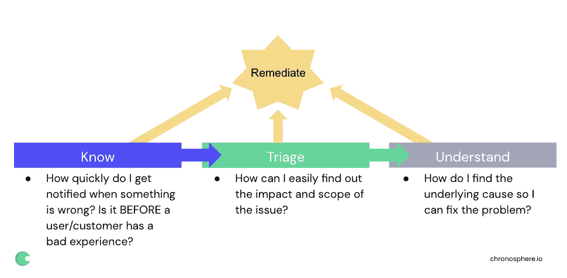

# 超越可观察性的三大支柱

> 原文：<https://thenewstack.io/beyond-the-3-pillars-of-observability/>

 [马丁·毛

马丁·毛是 Chronosphere 的联合创始人兼首席执行官，该公司重新定义了对云原生世界的监控。他之前在优步，领导开发和 SRE 团队创建和运营 M3，这是世界上最大的生产监控系统之一，存储数百亿个时间序列，每秒实时分析数十亿个数据点。在此之前，他是 AWS EC2 团队的技术负责人，也曾在微软和谷歌工作过。](https://www.linkedin.com/in/martinmao/) 

Gartner 将可观察性定义为监控向流程的演变，该流程提供对数字业务应用的洞察、加速创新并增强客户体验。如今，DevOps 运动和云原生架构使数字企业变得更具竞争力，这推动了对卓越可观察性的需求。

在 DevOps 之前，工程师很少考虑操作他们构建的系统。工程师现在需要考虑建立更容易观察的系统。为了更好地理解可观察性如何影响结果，工程师应该思考三个关键问题的答案:

1.  当出现问题时，我多快能得到通知？是在用户/客户有不好的体验之前吗？
2.  我如何方便快捷地对问题进行分类并了解其影响？
3.  我如何找到潜在的原因以便解决问题？

不管存在什么工具，使用什么工具或解决方案，回答上述三个问题的能力是可观测性应该关注的。

## 什么是不可观测性

今天，有许多人将可观测性定义为数据类型的集合——三大支柱:日志、度量和分布式跟踪。这种孤立的可观察性方法并不关注结果，而是过度关注技术工具和底层数据格式。

简单地让系统发出所有三种数据类型并不能保证更好的结果。此外，许多公司发现产生的可观察性数据的数量与从这些数据中获得的价值之间几乎没有关联。

## 将可观察性分为 3 个阶段

我们不是第一个批评三大支柱的人。我们同意其他人——像慈善专业的学生和 T2·本·西格曼在那里提出的批评。代替三个可观察性的支柱，我们开发了一个关注结果而不是输入的可观察性的方法，我们称之为三个阶段。这些阶段侧重于积极的可观察性结果以及团队为实现这些目标可以采取的步骤。

> 传统的三大支柱——日志、指标和分布式跟踪——已经过时，过度关注技术工具和底层数据格式，而不是结果。

在每个阶段，重点是尽快减轻对客户的影响或补救问题。补救是减轻客户痛苦并将服务恢复到可接受的可用性和性能水平的行为。在每个阶段，工程师都在寻找足够的信息来修复问题，即使他们还不知道根本原因。

### 第一阶段:了解问题

知道问题正在发生就足以触发补救。例如，如果您部署了新版本的服务，并且该服务触发了警报，则回滚部署是修复问题的最快途径，而无需了解事件的全部影响或诊断根本原因。将变更引入系统是生产问题的最大来源，因此在引入这些变更时了解问题是关键。

**成功的关键:**

*   快速警报:缩短问题发生和发出通知之间的时间。
*   将通知范围限定在需要采取行动的团队:从一开始就确定问题的范围并将其发送给正确的团队。
*   提高信噪比:确保警报具有可操作性。
*   自动化警报设置:自动化或模板化警报可以帮助工程师了解问题，而无需复杂的设置过程。

**工具和数据:**

*   警报
*   指标(本机指标以及从日志和跟踪生成的指标)

### 阶段 2:对问题进行分类

了解问题的范围有助于补救。例如，如果您确定只有一个实验组中的客户受到影响，关闭该实验可能会解决问题。

为了帮助工程师对问题进行分类，他们需要能够快速将警报放入了解有多少客户或系统受到影响以及影响程度的背景中。出色的可观察性使工程师能够以数据为中心，聚焦于上下文相关的数据来诊断问题。

**成功的关键:**

*   **情境化仪表板**:让警报直接链接到仪表板，仪表板不仅显示警报的来源，还显示相关的情境数据。
*   **高基数支点**:允许工程师进一步分割数据，可以让他们进一步隔离问题。
*   **利用现有的工具**:总是假设每个用例都被完美地工具化是不现实的，所以能够利用现有的工具是很重要的，但是要尽可能地将它们链接起来以获得最佳的上下文环境。

**工具和数据:**

### 第三阶段:了解问题。

对事件进行事后分析通常是一种在错综复杂的依赖关系网中导航的练习，并试图确定您需要与哪个服务所有者合作。

出色的可观察性让工程师能够直接观察到潜在的问题。此外，它还提供了有助于解决潜在问题的见解，以防止事故再次发生。

**成功的关键:**

*   易于理解的服务依赖关系:确定遇到当前问题的服务的直接上游和下游依赖关系。
*   在工具和数据类型之间跳转的能力:对于复杂的问题，您需要在日志给出的细节和跟踪仪表板上的指标给出的趋势和异常值之间反复跳转，最好是在单个工具中。
*   找到根本原因的时间:有时无法避免在事故期间执行根本原因分析，在这种情况下，在警报通知中或在使用仪表板进行分类的过程中发现可能的原因可以减少找到根本原因的时间。

**工具和数据:**

*   跟踪
*   日志
*   韵律学
*   仪表板

## 结论

出色的可观察性可以带来竞争优势、世界级的客户体验、更快的创新和更快乐的开发人员。但是组织不能通过仅仅关注输入和数据(三个支柱)来实现很好的可观察性。通过关注这里概述的三个阶段和结果，团队可以实现可观察性的承诺。

<svg xmlns:xlink="http://www.w3.org/1999/xlink" viewBox="0 0 68 31" version="1.1"><title>Group</title> <desc>Created with Sketch.</desc></svg>