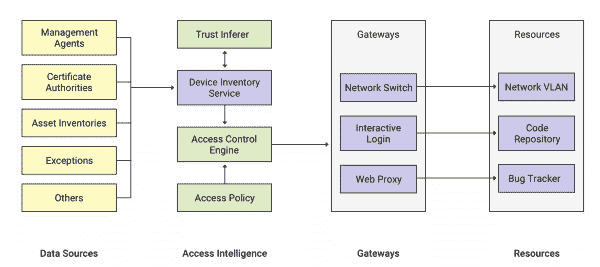

# beyond corp:Google 是如何抛弃 VPN 实现远程员工访问的

> 原文：<https://thenewstack.io/beyondcorp-google-ditched-virtual-private-networking-internal-applications/>

如今，谷歌面向员工的应用程序都不在虚拟专用网上。它们都有公共 IP 地址。

谷歌基础设施产品营销负责人[尼尔·穆勒](http://www.nealmueller.com/)断言，该公司认为这种被称为 [BeyondCorp](https://cloud.google.com/beyondcorp/) 的方法是实现云安全的“新云模式”，他最近在纽约举行的[奥赖利安全](https://conferences.oreilly.com/security/sec-ny)会议上向[介绍了这种方法。](https://conferences.oreilly.com/security/sec-ny/public/schedule/detail/61327)

这种模式可以归入安全社区的许多范畴，包括“零信任”或“无边界”安全。它与传统的安全方法相反，Mueller 将其描述为“城堡”方法，即使用强大的防火墙来隔离只能通过虚拟专用网络(VPN)访问的内部网络。

“城堡”方法的问题在于，一旦边界被攻破，整个内部网络以及所有相关的应用程序都将面临风险。“不要相信你的网络。谷歌公司工程项目经理 Max Saltonstall 也参加了演示。网络钓鱼、中间人、SQL 注入攻击都在 VPN 上找到了沃土。

此外，VPN 使用起来很麻烦，降低了性能，尤其是对海外员工而言。对于管理员来说，这也不是在公园里散步。要设置一个新用户，管理员通常必须配置云网络，并设置 IPSec 规则和防火墙规则，即 VPN。接下来是大量的测试。

穆勒说，在谷歌，“我们接受了墙壁不起作用的事实”。“我们决定完全拆除围墙，而不是在所有这些基础架构周围安装 VPN。”

谷歌的方法包括全面的库存管理，即跟踪谁拥有网络中的哪台机器。设备清单服务从多个系统管理源(如 Active Directory 或 Puppet)收集关于每台设备的各种实时信息。

然后，身份验证基于一组“信任层”,代表敏感度不断增加的级别。无论员工使用什么设备或从世界上的什么地方登录，他们都可以获得适当的访问级别。访问级别越低，对设备本身的检查就越不严格。

“访问权限是根据上下文授予的:你是谁？有没有强认证？你用的是什么？我对你的设备了解多少？”索尔顿斯托尔总结道。

网络本身是没有特权的。对于身份管理，该公司使用安全密钥，这比密码更难伪造，并且与个人用户本身相关。每台工作设备都有谷歌颁发的证书。整个网络的加密是通过 TLS(传输层安全性)完成的，TLS 终止于接入代理。

博彦公司基础设施(USENIX)

所有的公司资源都在这个超级反向代理的背后。基于其“信任引擎”提供的决策，代理决定是否提供对所需应用程序的访问。根据分层信任模型，如果权限到位，它会将请求连同安全凭证一起转发给应用程序。漏洞扫描器会定期检查应用程序本身的漏洞。

索尔顿斯托尔说，令人惊讶的是，谷歌能够将包括远程人员在内的所有员工转移到这一新模式，而且干扰最小。

为了准备 2013 年开始的透明转移，迁移团队记录了谷歌员工在旧网络上的所有行为，然后重新运行新网络上的流量模拟。这种监控[每天收集大约 80TB 的数据](https://www.informationweek.com/mobile/mobile-devices/google-beyondcorp-breaks-with-enterprise-security-tradition/d/d-id/1325017?)(这种模式得益于谷歌所有的内部应用程序都已经在网络上的事实)。

“如果你回放新网络上的当前流量，你可以看到什么会中断，”Saltonstall 说。这使得团队能够识别出那些尚未完全兼容的终端服务，以及能够无缝切换到新网络的用户。

索尔顿斯托尔说，这种方法有一些额外的好处。为新员工提供 Chromebooks 是一个最小的过程，只需要不超过 90 秒的配置设置。

Saltonstall 说，使用“BeyondCorp”方法，“你将操作问题转化为工程问题，然后用工程方法解决它们”。"所有令人沮丧、令人厌烦的人工繁重工作都变成了自动化."

<svg xmlns:xlink="http://www.w3.org/1999/xlink" viewBox="0 0 68 31" version="1.1"><title>Group</title> <desc>Created with Sketch.</desc></svg>