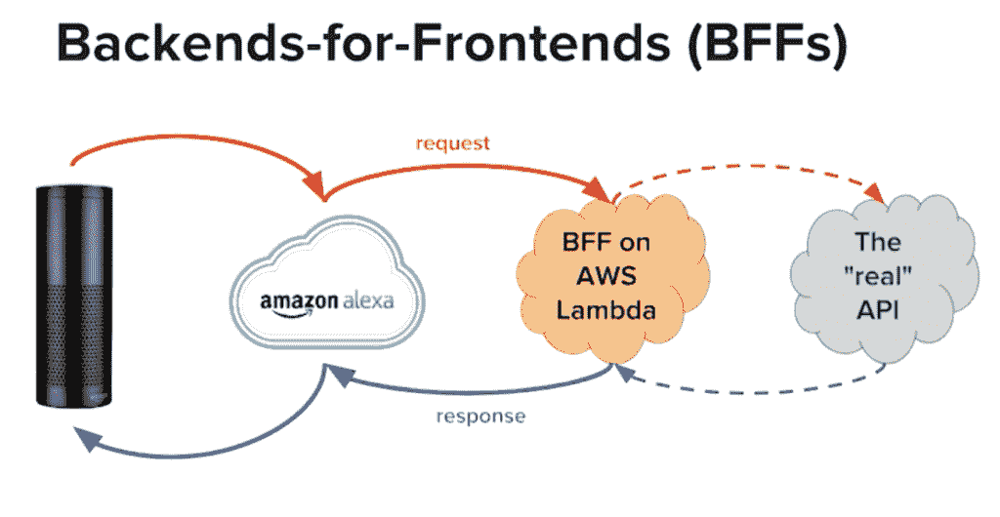
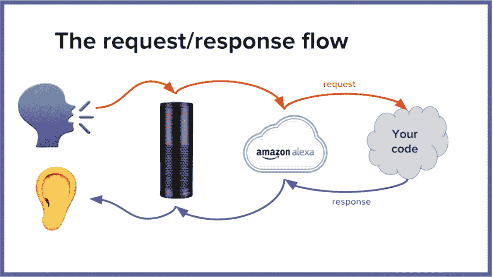
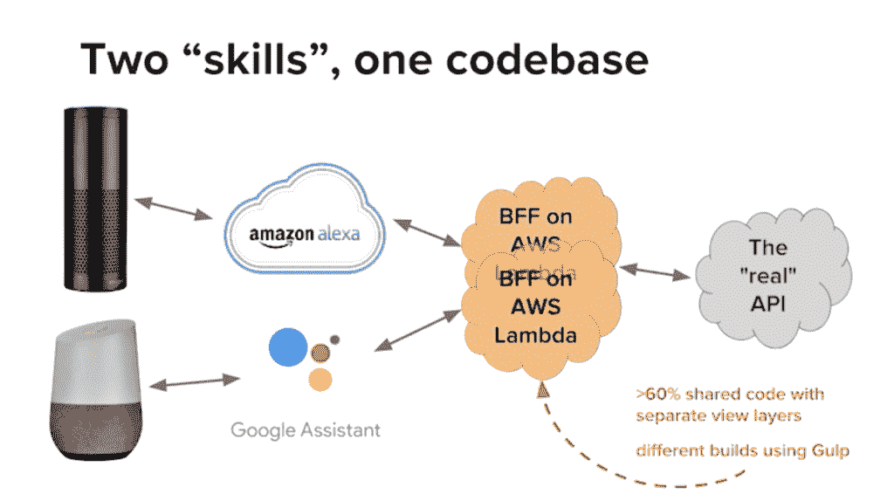

# BFFs:用 Node.js 开发 NPR 的语音用户界面

> 原文：<https://thenewstack.io/bffs-developing-nprs-voice-user-interface-with-node-js/>

"[好的，谷歌](http://ok-google.io/)，问 [Alexa](https://www.amazon.com/Amazon-Echo-And-Alexa-Devices/b?ie=UTF8&node=9818047011) 看看 Siri 能不能给 [Cortana](https://www.microsoft.com/en-us/cortana) 推荐一部用 [Bixby](https://www.samsung.com/global/galaxy/apps/bixby/) 看的电影。"

2018 年是虚拟助手崛起的一年。世界上一些最大的公司都在争相把他们的“智能扬声器”放在你的家里:亚马逊的 Alexa，谷歌助手，微软 Cortana，苹果 HomePod。尽管语音用户界面远未解决问题，但这些设备仍然销售迅速，甚至比 iPhone 第一年的销售速度还要快。

[美国国家公共电台](https://www.npr.org/)从一开始就致力于语音用户界面领域。如今，消费者并不真的购买收音机——这些钱正被转移到家用智能设备上。当用户说出“Siri”或“Alexa”或“好的，谷歌…”等在家调用的词语时，NPR 渴望成为语音导向的目的地之一。 [Nara Kasbergen](https://www.linkedin.com/in/narakasbergen/) 是 NPR 的高级全栈网络开发人员，也是这家非营利广播公司五人语音 UI 开发团队的成员之一。作为她在下个月的 [Node+JS Interactive](https://events.linuxfoundation.org/events/node-js-interactive-2018/) 会议上演讲的预演，Kasbergen 与新的 Stack 谈论了她帮助为 NPR 构建下一代语音 UI 框架的工作。

**那么:智能音箱，还是虚拟助手？这项技术的最佳名称是什么？**

嗯，“智能音箱”更像是营销术语。真的，他们还没有那么聪明，至少现在还没有。“扬声器”这个词让它听起来像是家具，意味着只是淡出背景。但是这些东西并不是仅仅坐在你的餐桌上的被动的东西:他们的制造商希望他们在你的生活中扮演一个非常积极的角色，帮助你做事，增加你与他们品牌的联系和意识，等等。所以从事语音 UI 工作的开发者更愿意称之为“虚拟助手”。虽然真正主动的帮助部分，你可以说，“Alexa，帮我预约理发”或“预订餐厅”——这只是现在才成为可能。

不过，目前研究表明，主要的活跃使用案例是人们在早上准备工作时使用它们来收听和了解新闻。我们绝对想在所有这些设备上出现，这样你就可以说，“Alexa，玩 NPR”——然后一些事情真的发生了。

那么，你如何设计一个无屏幕界面的原型呢？

当我告诉人们我是做什么工作的时候，他们通常会回答‘你一定在做机器学习和自然语言识别方面的一些有趣的事情。’不幸的是，事实并非如此。所有这些都发生在云中。

事情是这样的:你对着你的设备说话。设备本身做一些非常基本的处理，然后将其发送到云服务，为您的特定设备提供动力(在这一点上，我们几乎是在谈论 Alexa 或谷歌)。云服务做了大量的自然语言处理，将其翻译成标准格式的 JSON 请求，然后发送给你的代码。您的代码——可以存在于云中或裸机中——获取 JSON blob，执行原始请求所要求的任何操作，然后产生响应。这也是一种标准的、可预测的 JSON 格式，云服务将其发送回设备，设备通过语音、播放音频等方式响应用户。



亚马逊和谷歌有开发语音用户界面的官方软件开发工具包，它们非常好用。他们从解析这些作为请求的 JSON 大块中提取了很多样板文件，然后还生成了作为响应的 JSON 大块。因此，我们的主要工作是介于两者之间的部分。

总的来说，这一切的代码一点也不难。它实际上产生了相当无聊的代码样本。如果你曾经编写过一个非常基本的 Express 服务器，它接受一个请求并返回一个响应，这就是全部。没有机器学习，没有人工智能，什么都没有。对我们来说，最大的挑战是平衡平台限制和用户期望——这是让我们夜不能寐的事情。

**你认为自己在这里的实际角色是“为前端构建后端”？**

当我们第一次开始工作时，在我们试图为 Alexa 构建的第一个技能上，我们意识到我们实际上已经为前端构建了一个后端。我们立刻称之为我们的好朋友。就像，前端是 Alexa，后端是我们正在使用的“真正的”API 真正的意思是它已经存在，可以生产了。在这两者之间是我们应用程序的所有业务逻辑所在的地方；我们为 Alexa 编写的代码实际上只是接受一个请求，从该请求中计算出它需要进行什么 API 调用……然后为 Alexa 服务产生一些 JSON 响应。



当我们准备将这项工作扩展到 Google Assistant 时，我们高兴地意识到我们不需要重新编写相同的业务逻辑。相反，我们意识到，我们可以建立两个 BFF——一个用于 Alexa，一个用于 Google——但除此之外，大约 60%的代码是共享的。共享代码是输出到这个“真正的”API 的代码，这是所有业务逻辑存在的地方。不同的代码是特定于平台的代码，它接收不同格式的请求，并产生不同格式的响应。不过，基本上其他一切都是一样的，所以我们决定全部放在一个代码库中。现在我们只需使用 Gulp 生成不同的构建，然后将这些构建打包成一个 zip 文件并上传到 Lambda。



我们能够做到这一点的方法是使用一个非常旧的概念，它完全不再性感和酷了，但对于这个用例来说非常非常好:模型视图控制器模式。因此，控制器是共享代码，它调用 API，然后计算出错误和有效响应。视图是 Alexa 与 Google Assistant 不同的部分——代码接受这个模型并为每个模型生成个性化的 JSON 格式——而模型是我们称为 GenericResponseModel 的这个类。它有 Alexa 和 Google Assistant 都支持的所有公共属性的字段。比如输出语音，也就是说话者所说的:

```
class  GenericResponseModel  {
 public audioUrl  =  ‘’;
 public outputSpeech  =  ‘’;
 public repromptSpeech  =  ‘’;
 public cardContent  =  ‘’;
}

```

**node . js 在等式的什么地方进入？**

对这些应用程序中的任何一个进行无服务器开发都是很有意义的，因为在这些预先存在的途径上开发会容易得多。这使得 node.js 成为明显的赢家，因为它是目前唯一一种在所有无服务器平台上受支持的语言，包括 Azure 函数。

Node 已经很好地与我们现在主要开发的平台一起工作，因为 SDK 是健壮的，这使我们的生活更容易。还因为，对我们 NPR 人来说，这是我们感觉最流利的语言。尽管我们在这个语音 UI 项目上只有 2 个开发人员，但是这个部门有 20 个其他的开发人员…所以使用 Node 意味着每个人都可以参与到我们的代码评审中来。或者，如果我们在项目中调换人员，他们会毫无问题地接手我们的工作，因为他们已经很熟悉了。

**说到堆栈…**

Node.js 用 Typescript， [Jest](https://jestjs.io/) 进行测试。部署到 AWS Lambda，使用 [CloudFormation](https://aws.amazon.com/cloudformation/) 进行设置，并使用 [Dynamo DB](https://aws.amazon.com/dynamodb/) 作为我们的云数据库存储提供商。CloudWatch 用于记录，Google Analytics 用于收集信息。这是一个有趣的选择，因为它是为网站设计的，但我们也为 Node 使用了 universal analytics SDK，只是将所有内容作为自定义事件发送。这让我们的营销部门非常高兴，因为他们对 GA 感到满意。

**参与语音 UI 开发的开源机会？**

活跃在开源社区的朋友一直在问我他们能构建什么。我的工具包中缺少的是什么，例如，有一个用于语音 UI 开发的形式化框架会有帮助吗？我的回答是框架不会有帮助，因为代码并不那么难，现有的 SDK 在去除样板文件和抽象方面做得很好。我们所纠结的实际上是 QA——我们确实编写了单元测试，但归根结底，我们并不确信这些单元测试肯定能证明语音助手总是能做你想让它做的事情。我们都来自 web 开发，主要是前端，我们都习惯于使用 Selenium 这样的工具或 Nightwatch.js 这样的高级包装器来编写端到端测试。有了这些来证明，当你推出一个新功能或修复一个 bug 时，它不会破坏其他一切。

我们现在还没有类似的东西用于语音 UI 开发。现在，每当我们构建新的东西或做出改变时，我们基本上必须进入一个有 Alexa 或 Google Home 的房间，运行所有这些测试脚本。因此，如果你正在为你的下一个开源项目或创业寻找一个想法，请随时接受这个想法，并让我知道你构建了什么！

运行 [Node+JS Interactive](https://events.linuxfoundation.org/events/node-js-interactive-2018/) 会议的 Linux 基金会是新堆栈的赞助商。

通过 Pixabay 的特征图像。

<svg xmlns:xlink="http://www.w3.org/1999/xlink" viewBox="0 0 68 31" version="1.1"><title>Group</title> <desc>Created with Sketch.</desc></svg>