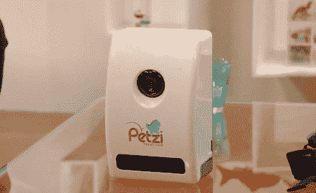
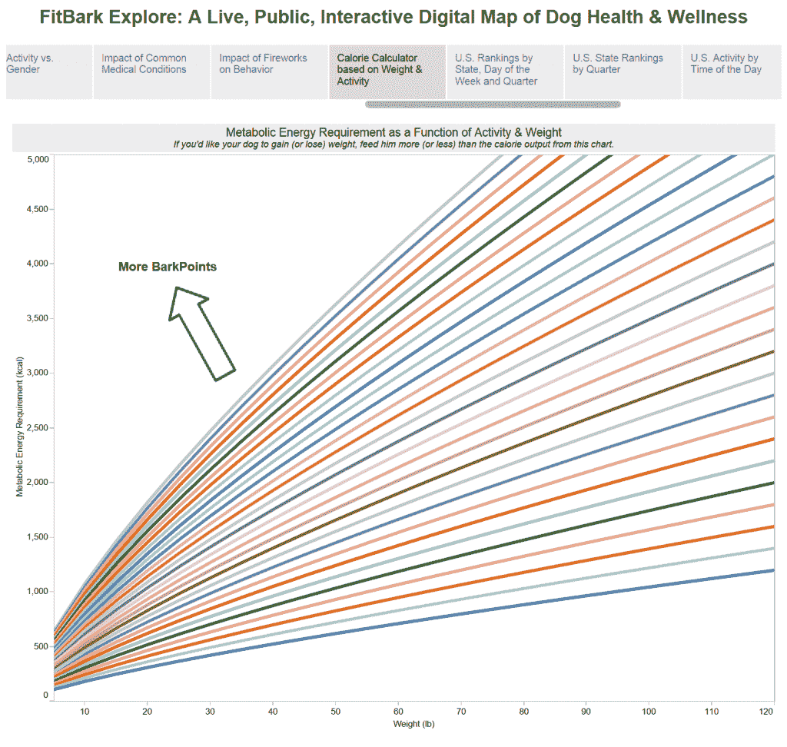

# 大数据成为宠物技术

> 原文：<https://thenewstack.io/big-data-comes-pet-tech/>

宠物技术最近在 NBC 新闻创建的新技术网站 [Mach](https://www.nbcnews.com/mach) 上有了自己的板块。马赫描述了[“宠物科技”如何让你远程观察你的宠物](https://www.nbcnews.com/mach/mach/pet-tech-will-transform-dog-s-life-some-surprising-ways-n764756)，甚至与它们玩耍或分发零食。(“你看着菲多跑过去，摇着尾巴狼吞虎咽…”)

很难低估宠物技术变得多么流行。2015 年，*卫报* [报道了](https://www.theguardian.com/lifeandstyle/2015/jun/20/internet-of-pets-technology-track-dog-fit)关于“最近引入快速增长的宠物联网设备市场的数百种产品之一”是的，几百个。该报报道称，到 2025 年，我们将在宠物技术上花费 26 亿美元。

马赫采访了 [Petcube](https://petcube.com/) 的首席执行官兼联合创始人雅罗斯拉夫·阿日纽克，该公司生产一种高清“宠物相机”，还可以让你与宠物交谈，并分发零食。

Azhnyuk 说这种新技术有双重吸引力。首先，它可以让宠物主人对他们的宠物有新的认识——当然，“即使我们不在同一个物理空间，我们也可以接近它们。”

[https://www.youtube.com/embed/K5mpSq4zCLg?feature=oembed](https://www.youtube.com/embed/K5mpSq4zCLg?feature=oembed)

视频

一段 2 分钟的精彩视频展示了一些模型宠物被分发零食的盒子吓到了。它们优雅地跳跃着吞下远程投掷的小球。甚至有一只猫似乎在追逐遥控激光笔上的红点。视频以“重新想象宠物护理”结束

因此，宠物技术显然是一个时机已经成熟的想法。2013 年 [Petzi](https://www.petzi.com/) [在 IndieGogo 上为“PetziTreatCam”筹集了 130，210 美元，这是一个远程摄像头，让宠物主人可以看到他们的宠物，与它们交谈，甚至远程给它们一个奖励。](https://www.indiegogo.com/projects/petzitreatcam-enjoy-your-pet-anywhere-at-anytime#/)

Petzi 并不是唯一一个发现大众投资者渴望其产品的观众。 [PlayDate](http://www.startplaydate.com/) 出售一个遥控的“智能球”，里面有一个摄像头，由手机应用程序控制。T2 去年在 IndieGogo 上筹集了 824，267 美元，几乎是他们最初目标的六倍。2015 年，宠物主人又投入了 137，924 美元来资助[宠物机器人监控器](https://www.indiegogo.com/projects/petbot-smart-pet-monitor-that-keeps-you-connected-pets#/)。(“使用 PetBot 的‘半人工智能’和吠叫通知，你可以训练你的宠物向你发送自拍……”)pet bot 甚至为你的宠物实现了面部识别技术——以及“[吠叫识别](https://thenextweb.com/gadgets/2015/08/31/petbot-uses-petificial-intelligence-to-let-your-cat-or-dog-send-you-selfies/#.tnw_Md3319SO)”，它在假设狗吠意味着有事发生的情况下发送通知。

这个功能也适用于猫——尽管我个人不需要每次我的猫喵喵叫时都收到通知。

“人们会不遗余力地与他们的宠物保持联系，关注并照顾他们，”PetBot 的联合创始人告诉 [the *Guardian*](https://www.theguardian.com/lifeandstyle/2015/jun/20/internet-of-pets-technology-track-dog-fit) ，“这种驱动力足以将这个行业推向巨大的高度。”

所以现在有几十个宠物科技的例子——还有一些很高的期望。牵引公司的人甚至承诺“为你的宠物遥控”——这包括训练你的狗对夹在它项圈上的一个小装置的振动做出反应。

https://youtu.be/AHtu8nixY_g

马赫还采访了一家名为 Whistle 的公司的首席执行官本·雅各布斯(Ben Jacobs)，他认为自己已经开发出了一种产品，可以“让宠物父母安心，这是他们迫切需要的。”它使用 GPS 信号追踪你的宠物的位置和活动——“在街上或 3000 英里以外，”它的网站吹嘘道。如果你的宠物离开指定的安全区域，它会通知你，并且可以显示你的宠物在过去 24 小时内去过的任何地方。它甚至包括一个“活动监控”功能，并提供全国范围的覆盖——每月 9.95 美元的订阅。

现在至少有一家公司正在采用大数据方法来监测宠物健康: [FitBark](https://www.fitbark.com/) 。该网站承诺“为更好的健康决策提供深刻的、可操作的见解”，认为一只更健康的狗可能意味着更少的兽医账单，甚至增加你的宠物的预期寿命。该网站还[分享了迄今为止](https://www.fitbark.com/explore/)从宠物生成的数据中收集到的见解:

*   小狗比人类婴儿睡得少。
*   马耳他狗在烟火表演时会焦躁不安。
*   在世界范围内，我们最喜欢的遛狗时间是下午 6 点
*   马萨诸塞州的狗非常活跃。
*   瑞士有世界上最活跃的狗。

有时数据证实了预期，但其他数据似乎挑战了传统智慧。例如，该公司最近认为，每天给狗喂完全相同数量的食物是没有意义的。“狗的日常活动范围极其广泛。这意味着我们需要开始根据活动和目标体重调整食物消耗量。例如，为了保持他的体重，当你和你的狗一起进行 3 小时的徒步旅行时，你的狗可以吃更多的食物，相比之下，当他整天独自在家时，你的狗可以吃更多的食物。

该网站还自豪地展示学术研究人员的证明。格拉斯哥大学的研究员 Cathy Wyse 博士将 FitBark 称为“科学中令人兴奋的新生力量的一部分，这种大数据集的产生可以让我们更接近健康和生活方式之间关系的真相，”他指出，日常宠物监测可以在非常早期的阶段检测疾病和其他变化。

在所有的宠物技术中，FitBark 似乎是最认真地收集数据并使其具有可操作性的。“从来没有人描述过狗的健康、睡眠、健康和行为，”该网站争辩道。该公司在 100 多个国家拥有 200 多个品种的客户。

该网站还提供了 [FitBark Explore](https://public.tableau.com/profile/fitbark#!/vizhome/shared/JMW6TQB8M) ，“一个实时的、公共的交互式狗狗健康数字地图。”他们把他们的戴着 FitBark 的狗社区描述为“一个前所未有的知识库:世界上第一个实时、公开、互动的狗狗健康数字地图。”

FitBark 的 CEO 认为，在我们的宠物身上收集的指标有一天可能会像任何其他大数据集一样被挖掘。“我们正在从我们现有的用户中，为所有品种、所有尺寸、所有年龄范围的狗创建一个基线，”贝茜·福尔[告诉*卫报*报纸](https://www.theguardian.com/lifeandstyle/2015/jun/20/internet-of-pets-technology-track-dog-fit)，“所有这些信息以前都是不可获得的。”

《T4 卫报》将其描述为“宠物互联网”的到来

“虽然宠物和动物的临床研究在规模、规模和预算方面一直受到限制，但健身追踪器和其他设备正在为兽医和动物健康专业人士提供新的大量数据，”文章的作者总结道。

但是不要忘记拥有一只宠物是为了什么:和我们毛茸茸的同伴在一起。NBC 的马赫还采访了马克·贝科夫博士，他是科罗拉多大学博尔德分校生态学和进化生物学的名誉教授，也是几本动物伦理学书籍的作者。他对技术的看法？

“它不应该取代人类在狗的生活中的中心作用。”

* * *

# WebReduce

通过 [Petcube](https://petcube.com/bites/) 的特征图像。

<svg xmlns:xlink="http://www.w3.org/1999/xlink" viewBox="0 0 68 31" version="1.1"><title>Group</title> <desc>Created with Sketch.</desc></svg>