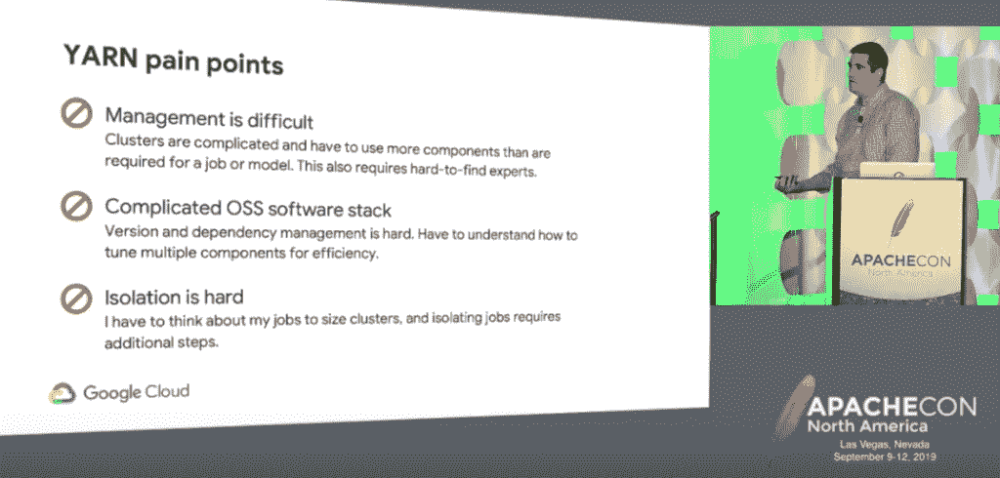

# 大数据:谷歌用 Kubernetes 代替 YARN 来调度 Apache Spark

> 原文：<https://thenewstack.io/big-data-google-replaces-yarn-with-kubernetes-to-schedule-apache-spark/>

Kubernetes 作为大数据应用程序的资源管理器提供了一些强大的优势，但也带来了自身的复杂性。

最近在 ApacheCon North America 的演讲中，[谷歌开放数据和分析产品经理 Christopher Crosbie](https://www.linkedin.com/in/christopher-crosbie-81434961/) 指出，虽然[谷歌云平台](https://cloud.google.com/) (GCP)提供了开源大数据堆栈的托管版本，包括用于机器学习的 Apache [Beam](https://beam.apache.org/) 和 [TensorFlow](https://www.tensorflow.org/) ，与此同时，谷歌正在与开源社区合作，使开源大数据软件更加云友好。

[https://www.youtube.com/embed/8W88qAFdAUU?feature=oembed](https://www.youtube.com/embed/8W88qAFdAUU?feature=oembed)

视频

“当人们使用这些大数据堆栈从本地迁移到云时，他们往往会开始拼凑所有不同的工作负载，在适当规模的集群上运行这些工作负载，或者真正适当的规模和形状，”他解释道。

“因此，你可能会有许多 BI 或报告应用程序试图坚持使用内存密集型集群，或者你会有一堆机器学习作业，你会坚持使用这些计算密集型集群。但是，把所有这些拼凑起来，并弄清楚哪些工作是相互关联的，这可能是一项相当困难的任务。”

这就是为什么谷歌和开源社区一直在尝试用 Kubernetes 作为安排 Apache Spark 的替代方案。

克罗斯比在谷歌的[云数据平台](https://cloud.google.com/dataproc/)团队工作，该团队提供托管的 [Hadoop](https://hadoop.apache.org/) 和 [Spark](https://spark.apache.org/) 。这些分布式系统需要一个集群管理系统来处理诸如检查节点健康状况和调度作业等任务。克罗斯比说，有了 Apache Spark，你可以像调度程序纱线、Mesos、独立模式或现在的 Kubernetes 一样运行它，Kubernetes 现在是实验性的。

它使用[自定义资源定义](https://kubernetes.io/docs/concepts/extend-kubernetes/api-extension/custom-resources/)和[操作符](/solved-kubernetes-operators-for-clustered-database-deployments/)作为扩展 Kubernetes API 的手段。到目前为止，它已经为 [Spark](https://github.com/GoogleCloudPlatform/spark-on-k8s-operator) 和 [Apache Flink](https://github.com/GoogleCloudPlatform/flink-on-k8s-operator) 开发了开源操作程序，并且正在开发更多。

对于不想在 Google Cloud 中运行这些应用的用户，他们可以下载一个 [Helm chart](https://helm.sh/) 并在其他云或本地运行他们的 Kubernetes 集群。

他指出了使用 Kubernetes 作为资源管理器的三个主要好处:

*   统一管理——如果您的组织已经在其他地方使用 Kubernetes，请放弃两个集群管理界面。
*   隔离作业的能力——您可以将模型和 ETL 管道从开发转移到生产，而没有令人头疼的依赖性管理。
*   弹性基础设施——您不必担心调整和构建集群、操作 Docker 文件或 Kubernetes 网络配置。

但他说，也有权衡，概述了他所谓的“从纱线到 Kubernetes 的阴阳两极”:

“如果你已经进入了 Kubernetes 世界，它提供了一个统一的界面，但如果没有，如果你还没有在这个生态系统中投资，这可能只是另一种需要管理的集群类型。

Kubernetes 将使您的数据科学家和开发人员能够利用大量资源。如果您的服务器在白天很忙，您可以在晚上不太忙的时候运行大数据作业。但是如果你已经在尝试用 YARN 做这件事，你用 YARN 做的一切都将被抛弃，因为 Kubernetes 有一种不同的方式来管理资源。

开发人员会喜欢 Kubernetes，因为他们可以开始加入所有这些定制配置。但是你肯定会想要追踪他们在做什么。大多数公司知道如何使用纱线，寻找什么，警惕什么。"

“有了 Kubernetes，你肯定会有日志记录，但你必须重新思考这些日志实际上是什么样子，”他说。

如果每个人都在使用经过生产测试的旧版 Spark，但一名数据科学家非常希望这是一项新功能和最新版本的 Spark，他们可以将其打包为一个容器，使用 Kubernetes 运行所有相同的基础架构，并且工作不会发生冲突。

但是对于很多用例来说，开发人员可能会发现他们正在处理一些他们没有预料到的事情。经常出现的一个例子是 Kubernetes 网络配置，用于访问一些不属于标准的数据源。这就是谷歌一直试图与运营商解决的问题。

有了 Kubernetes，您可以从考虑集群级别的事情，到只考虑分配内存、CPU 和其他资源的特定任务。你真的可以隔离那些容器。但是有时候你想在不同的任务之间共享数据，在这个更加孤立的世界里，这可能会有点困难。

Kubernetes 有很多非常酷的功能，尤其是在安全方面，比如秘密经理。但是安全也会变得更加复杂，他说。

“这让我想起了那些俄罗斯娃娃中的一个，你有一个帐户中的帐户-你有一个运行服务帐户的虚拟机，然后在其中实际上有一个 Kubernetes 服务帐户，其中有 Kerberos 主体，”他说，并补充说，跟踪所有这些有时可能是一个问题。

<svg xmlns:xlink="http://www.w3.org/1999/xlink" viewBox="0 0 68 31" version="1.1"><title>Group</title> <desc>Created with Sketch.</desc></svg>