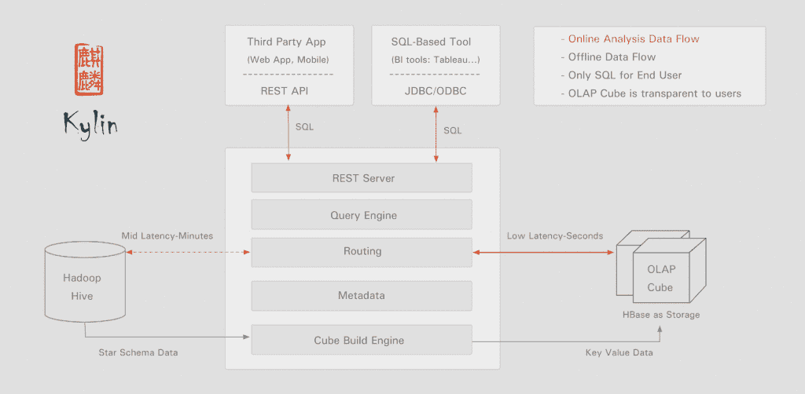

# 易贝分布式数据的“极限”OLAP 引擎得到 Apache 的支持

> 原文：<https://thenewstack.io/big-data-tool-kylin-now-top-level-apache-project/>

一个由易贝首先开发的分布式分析引擎，名为 [Kylin](https://blogs.apache.org/foundation/entry/the_apache_software_foundation_announces85) ，已经被 Apache 软件基金会接受为一个完整的顶级项目。该软件可以帮助组织使用标准的业务分析工具来查询大数据仓库。

“在易贝，我们收集每个易贝屏幕上的每个用户行为。易贝数据服务和解决方案高级总监 Wilson Pang 解释说:“当其他 OLAP(在线分析处理)引擎在数据量上挣扎时，Kylin 可以在几毫秒内实现查询响应。“我们也开始将 Kylin 用于近实时数据流存储和分析引擎。总而言之，麒麟是易贝产品分析平台的关键后端组件

该电子商务网站在内部构建了通过 ANSI SQL 处理非常大的 OLAP 立方体的技术。据报告，其最大的用例是分析超过 120 亿条源记录，生成 14tb 以上的立方体。其 90%的查询延迟不到 5 秒。

在开源方面，易贝在[的博客文章](http://www.ebaytechblog.com/2014/10/20/announcing-kylin-extreme-olap-engine-for-big-data/#.VE5_gvnF9JY)中解释说，加速 Hadoop 上的分析并允许使用 SQL 兼容工具的技术并不新鲜，但它寻求在加快速度的同时仍允许业务用户使用熟悉的工具。它与 Tableau 集成，与 Microstrategy 和 Excel 的集成正在进行中。

麒麟建筑。

该公司在 2014 年 10 月将代码作为 Apache 孵化器项目提交，标志着它相对快速地上升到顶级项目的地位。作为一个顶级项目，Kylin 现在得到了 Apache Software Foundation 的[组织、法律和财务支持](http://www.apache.org/press/#about)，这应该会加速它的开发，面向更广泛的潜在用户。

Kylin 与一系列其他大数据工具争夺市场份额，包括开源项目 [Hive](https://hive.apache.org/) 、 [Druid](http://druid.io/) 和 [Drill](https://drill.apache.org/) 。

中国团购网站 Meituan.com 的工程技术高级研究员李文称赞了这些功能，包括对 10 亿条记录的亚秒级查询延迟、高可扩展性以及与商业智能产品的无缝集成。

Kylin 的工作原理是从 Hive 中读取数据，运行 MapReduce 进行预先计算，将立方体数据存储在 HBase 中，并使用 Zookeeper 来协调作业。

它的 [v1.0(酝酿中)版本](http://kylin.apache.org/blog/2015/09/06/release-v1.0-incubating/)于 9 月 6 日发布， [v1.1](http://kylin.apache.org/blog/2015/10/25/release-v1.1-incubating/) 于 10 月 25 日发布。

“过去 30 年来，许多技术都使用相同的理论来加速分析。这些技术包括存储预先计算的结果以服务于分析查询的方法，生成具有所有可能维度组合的每个级别的长方体，以及计算不同级别的所有指标，”易贝在捐赠代码时解释道。

“当数据变大时，预计算处理变得不可能，即使使用强大的硬件也是如此。然而，借助 Hadoop 的分布式计算能力，计算作业可以利用成千上万的节点。这使得 Kylin 可以并行执行这些计算，并合并最终结果，从而大大减少处理时间。”

它利用开源的动态数据管理框架 [Apache 方解石](https://calcite.apache.org/)来解析 SQL 和插件代码。它支持多种访问方法，包括 JDBC ( Java 数据库连接)、ODBC(开放式数据库连接)和用于编程访问的 REST API。

该平台的核心组件包括:

*   **元数据管理器:**作为元数据驱动的应用，其他所有组件都依赖于它。
*   **作业引擎:**它处理所有离线作业，包括 shell 脚本、Java API 和 MapReduce 作业。它协调所有作业，并确保每个作业执行和处理故障。
*   **存储引擎:**这个引擎管理底层存储——特别是长方体，它们被存储为键值对。它使用 HBase，但也可以扩展到支持其他 K-V 系统，如 Redis。
*   **REST 服务器:**REST 服务器是应用针对 Kylin 开发的入口。应用程序可以提交查询、获取结果、触发多维数据集构建作业、获取元数据、获取用户权限等。
*   **ODBC**
*   **查询引擎:**一旦多维数据集准备好了，查询引擎就接收并解析用户查询。然后，它与其他组件交互，将结果返回给用户。

它吹捧的特性包括一个简单的网络界面来管理、构建、监控和查询多维数据集；在多维数据集/项目级别设置访问控制的安全功能；以及对 LDAP(轻量级目录访问协议)集成的支持。

特征图片:[adaptelux](https://www.flickr.com/photos/125216703@N02/)制作的[剧羽](https://www.flickr.com/photos/125216703@N02/16779897456/in/photolist-ryMmUQ-6iKWTy-6dLnZZ-5huHnb-4MFWW6-9B4GeZ-tcwS5-atDuit-5PMUY-cdH6JY-6iKXdU-6Hjpne-7z4gSQ-de9V2g-bTwRvp-fz5NbX-4DcwZv-xavgV-u4etfH-biKKVk-6zyB6C-7zHevp-6NGQfD-6MVs2R-wBAn8b-bPoYUK-ayL35F-dVVg2H-9Y83Fy-bT6kGT-9dJFqH-pHLfqY-9o5wfV-dURSTS-sgH62u-qhK798-uVAVys-6LCdMG-AoJ9Nf-5UPX37-wBdFUj-7NqxrT-6iFLVg-7SEAST-biQfKM-793QAr-7vX7Gy-aEwhH5-6Pn2Az-4HtAKe)，获得 **CC BY-SA 2.0** 授权。

<svg xmlns:xlink="http://www.w3.org/1999/xlink" viewBox="0 0 68 31" version="1.1"><title>Group</title> <desc>Created with Sketch.</desc></svg>