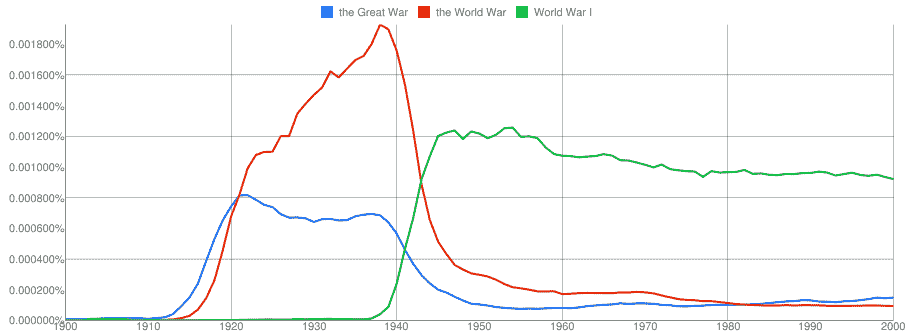

# 大数据会把你引入歧途

> 原文：<https://thenewstack.io/big-data-will-lead-astray/>

技术记者、杰西·杜涅茨(Jesse Dunietz)的博士生在上周的一篇令人震惊的文章中警告说，数十亿个数据点不一定能让我们摆脱误解我们结果的容易犯的错误，或者隐藏在我们原始大规模数据集构建中的隐藏偏见的危险

他写道，“人们很容易认为，在如此庞大的数据背后，依靠大数据的研究不会出错。”“但庞大的数据会给结果带来一种虚假的确定感。

“其中许多很可能是伪造的，其原因应该让我们暂停任何盲目信任大数据的研究。”

本月早些时候，麻省理工学院发表了一篇热情洋溢的文章[关于“数据资本”](https://thenewstack.io/decision-making-hot-delicious-data/)(将可操作的情报称为“大多数组织的最大资产”)。但现在，Dunietz 对“大数据傲慢”提出了警告。他提出了一些生动的例子:

> 从异常庞大的数据集生成长达一个世纪的图表的能力几乎是任意权威的。

谷歌的[“Ngram Viewer”工具](https://books.google.com/ngrams)允许搜索大量的数字化书籍，并绘制出几个世纪以来短语的频率。该工具的蓝色按钮诱使访问者“搜索大量书籍”——据报道，谷歌已经扫描了世界上所有出版书籍的 4%。但是 Dunietz 引用了佛蒙特大学研究人员的工作，他们去年秋天指出谷歌的数据集[现在包括了大量的科学文本](http://journals.plos.org/plosone/article?id=10.1371/journal.pone.0137041#pone.0137041.ref007)。“结果是学术文章中常见的短语激增，但一般来说不太常见，”他们写道，并补充说，图书语料库仍然“重要”，但更像是一个参考词典，而不是一个流行图书图书馆。

虽然谷歌较小的英语小说收藏避免了太多科学文献的陷阱，“总体而言，我们的发现对从谷歌图书语料库中提取的绝大多数现有主张提出了质疑，”佛蒙特州的研究人员写道，“并指出在使用这些数据集得出关于文化和语言进化的广泛结论之前，需要充分描述语料库的动态。”

这不是唯一的问题。每本书只有一个副本，最晦涩的书享有同等的权威，与更受欢迎，广泛阅读，并在他们的时间有影响力的书籍。“例如，从英国小说的数据中，你可能会得出结论，在 20 世纪的 20 年里，每个角色和他的兄弟都被命名为兰尼，”Dunietz 写道。但这种上升显然只是厄普顿·辛克莱在 1940 年至 1953 年间出版了 11 部关于兰尼·巴德的不同小说时创造的一个奇怪的数据假象。

什么时候它不再是科学了？曾经， [XKCD](http://xkcd.com/) 漫画家兰道尔·门罗分享了该工具的一张图表，其中一条蓝线显示了过去 45 年中“蓝线”一词在谷歌书籍中的出现频率。他创建了一个有几十个图表的网页，显示了从四个字母的单词到单词“希望”的使用频率在过去的 45 年里,“上升趋势”这个词显然一直在下降，而事实上，自 1975 年以来,“受欢迎程度激增”这个词一直在激增。但门罗似乎也在暗示类似的讽刺观点。从异常庞大的数据集生成长达一个世纪的图表的能力几乎是任意权威的。

“几十年前，这种规模的证据是一个白日梦，”Dunietz 写道。“然而，今天，1500 亿个数据点实际上已经过时了……”作为另一个警示性的例子，他还引用了谷歌短命的“流感趋势”工具令人惊讶的混合结果，该工具最初声称准确率为 97 %,但后来证明完全错误。“事实证明，谷歌流感趋势在很大程度上预测了冬天，”Dunietz 写道。

但这个轶事让他对我们对模式的追求持乐观态度，因为哥伦比亚大学的另一名研究人员能够通过合并两组数据，然后使用其中一组来微调另一组的预测，从而超越 CDC 和谷歌算法。“当大数据不被视为灵丹妙药时，它可能会带来变革…”Dunietz 总结道。

"团队所需要做的就是批判性地评估他们对数据的假设."

* * *

# WebReduce

<svg xmlns:xlink="http://www.w3.org/1999/xlink" viewBox="0 0 68 31" version="1.1"><title>Group</title> <desc>Created with Sketch.</desc></svg>