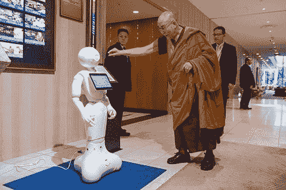
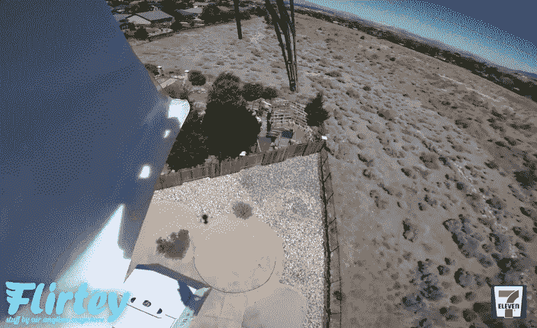

# 2016 年的大问题:我们能信任我们的技术吗？

> 原文：<https://thenewstack.io/big-question-2016-can-trust-technologies/>

随着新的一年开始，这是最后一次回顾 2016 年的好时机。我称之为终极大数据问题:过去 12 个月发生了什么？如果每一刻都是一个装满记忆的容器，那么这里尝试从过去一年的伟大 Hadoop 集群中梳理出一些意义。仔细看看 2016 年，似乎清楚地提出了一个大问题:人类能信任自己的技术吗？

## 喜忧参半的一年

我们的技术变得越来越强大——现在已经超越了我们这些卑微的人类。谷歌的 DeepMind 人工智能[在 3 月](https://thenewstack.io/alphagos-win-human-go-champion-means-ai/)击败了世界冠军围棋选手，他们说这证明了他们的人工智能“在[找到人类不一定看到的解决方案](https://techcrunch.com/2016/03/17/google-defeating-go-champion-shows-ai-can-find-solutions-humans-dont-see/)的潜力。”几周之内，一个机器人就学会了(在动物身上)完成整个外科手术，这让几家新闻媒体都提出了同样的问题:“[你会信任一个机器人外科医生吗？](https://www.google.com/webhp?sourceid=chrome-instant&rlz=1C5CHFA_enUS690US690&ion=1&espv=2&ie=UTF-8#q=Would+you+trust+a+robot+surgeon%3F&tbm=nws)

但是就在同一个月，纽约的斯隆-凯特琳癌症纪念中心透露，现在已经有 43 名不同的外科医生在进行机器人辅助手术。那年夏天，《纽约每日新闻》报道了另一个发人深省的故事 IBM 的沃森“[在 10 分钟内正确诊断出一名 60 岁妇女的罕见白血病](http://www.nydailynews.com/news/world/ibm-watson-proper-diagnosis-doctors-stumped-article-1.2741857)——这是一个医学之谜，东京大学的医生们已经错过了好几个月。”

我们对未来科技的希望已经越来越高。甚至达赖喇嘛也被发现与一个机器人互动，2045 化身项目的人们也声称教皇陛下也在支持他们的项目，通过将人类意识转移到人造大脑来实现“控制永生”。

但是如果我们的技术出错了呢？这个问题也在 7 月份出现，当时特斯拉 Model S 的车主在使用该系统的“自主巡航控制”时死于车祸

这可能是不知情的消费者首先面临的问题。早在二月份，安全研究员 [Brian Krebs](https://krebsonsecurity.com/) 发现了 Foscam 广受欢迎的互联网支持的安全摄像头，它穿透了防火墙，并“秘密地、持续地连接到由中国硬件制造商运营的一个巨大的点对点网络”这种行为在默认情况下是激活的——并且很难停用——有时这种功能甚至不会以产品的名义向用户宣传。

克雷布斯的二月头条？"[这就是为什么人们害怕‘物联网’](https://krebsonsecurity.com/2016/02/this-is-why-people-fear-the-internet-of-things/)。"

到了 9 月份，Krebs 自己也受到了攻击，他的网站面临着每秒 600 千兆位的大规模拒绝服务攻击，来自[一个由受损物联网设备](https://krebsonsecurity.com/2016/02/this-is-why-people-fear-the-internet-of-things/)组成的僵尸网络，讽刺的是，主要由“暴露在互联网上的路由器、IP 摄像头和 DVR 组成，并受到弱密码或硬编码密码的保护。”

几周之内，该僵尸网络的源代码被[公之于众](http://www.pcworld.com/article/3132571/hackers-create-more-iot-botnets-with-mirai-source-code.html)，很快另一个僵尸网络攻击成了新闻，臭名昭著的 10 月 21 日，为互联网其余部分提供域名服务的 Dyn 被关闭。Engadget 的一个标题将其描述为[“那一次你的智能烤面包机打破了互联网”](https://www.engadget.com/2016/10/28/that-time-your-smart-toaster-broke-the-internet/)。

但不幸的是，僵尸网络创建软件被命名为 Mirai 未来组合，这是日语中“未来”的意思

这不是我们技术的唯一问题。三月份，一个困惑的亚马逊回声不小心劫持了某人的恒温器。同一个月，微软一款新的人工智能增强聊天机器人在 twitter 上被恶作剧者劫持。他们[欺骗微软的 TayAndYou Twitter 账户](https://thenewstack.io/requiem-tay-reactions-microsofts-teenaged-ai-gone-bad/)鹦鹉学舌地回应种族主义和其他不恰当的评论，甚至在她第一天上线之前。

## 灾难和欲望

也许 2016 年将作为我们对技术的希望和恐惧的碰撞而被铭记。今年，第一款完全由谷歌制造的安卓智能手机——尽管在几个月内，至少一些用户报告了屏幕[在随机时刻](http://www.techtimes.com/articles/190056/20161225/google-pixel-issues-some-pixels-keep-freezing-getting-randomly-unresponsive-for-minutes.htm)冻结的问题。但至少他们不必召回任何产品，因为它们着火了——这是今年秋天三星的 Galaxy Note 7 面临的问题。

尽管科技公司在 2016 年面临许多其他破坏性的新闻报道，但至少其中一些伤口是自己造成的。年末，苹果告别了 iPhone 7 上的[耳机插孔和 MacBook Pro 上的](http://www.theverge.com/2016/9/7/12823596/apple-iphone-7-no-headphone-jack-lightning-earbuds)退出键。Reddit 上的一个玩笑者为一系列带标题的照片吸引了超过 45，000 次投票，这些照片描绘了戴着苹果无线 AirPod 耳机试图慢跑时的挫败感。

随之而来的批评风暴提醒人们，每一种大众消费品总是在公众舆论的法庭上面临一场残酷的审判。一位苹果营销高管引用了鼓舞人心的论点，即耳机的决定需要勇气——“继续前进，做一些新的事情，这对我们所有人都有好处”——呼应了史蒂夫·乔布斯的一次著名演讲[(关于为什么 iOs 停止支持 Flash)。](https://9to5mac.com/2016/09/09/steve-jobs-quote-phil-schiller-iphone-7/)

这是一个反复上演的故事，新技术带来了好消息和坏消息。无人机在 2016 年也有一些不好的宣传——例如，世界职业棒球大赛的一名投手由于无人机相关的受伤(由于他的小指顶部有一个小伤口)，不得不重新安排他的出场[。但是在 2016 年，无人机被考虑用于](http://www.usatoday.com/story/sports/mlb/indians/2016/10/14/cleveland-indians-pitcher-trevor-bauer-mlb-playoffs-lacerated-finger/92067230/)[在印度](http://timesofindia.indiatimes.com/city/bengaluru/Bengaluru-may-give-India-drones-to-transport-organs/articleshow/52138236.cms)运送器官——实际上[从雷诺](https://thenewstack.io/seven-eleven-kicks-off-era-commercial-drone-deliveries/)的一家 7-11 便利店运送思乐冰。12 月，亚马逊终于完成了第一次商业无人机送货。

也许真正的教训是，技术进步总是从一个混杂的袋子开始，一种猴子的爪子，它可以满足你的愿望，同时毁掉你的生活。问问那个带着无人机拍摄婚礼的家伙吧——结果看到无人机撞上了婚礼宾客，导致了无数诉讼和一个非常愤怒的新娘。

罗纳德·里根曾经说过，当你开拓新的领域时，有时会发生痛苦的事情。"这都是冒险和拓展人类视野的一部分."大约 30 年前，他在挑战号航天飞机爆炸后发表讲话，告诉一个哀悼的国家“未来不属于懦夫；它属于勇敢者。”

不出所料，人类继续朝着科技增强的未来前进，无法抗拒它的承诺和潜力。到 12 月，美国交通部甚至提出了车对车数据共享的标准，以鼓励人类和人工智能司机做出更好的驾驶决策，提高了未来我们的生活依赖于车联网安全的可能性。

因此，随着新的一年开始，我想我会永远记得一个 Twitter feed 如何在 Twitter 上度过了 2016 年，滑稽地将物联网讽刺为“[狗屎互联网](https://twitter.com/internetofshit?ref_src=twsrc%5Egoogle%7Ctwcamp%5Eserp%7Ctwgr%5Eauthor)”但是到了圣诞节，只要有人在 Twitter 上查他的名字，他就会用谷歌主页让他的圣诞彩灯闪烁[:](https://twitter.com/internetofshit/status/813171159634219010)

这对我们所有人都是一个教训。有时候，一项新技术令人兴奋的诱惑是无法抗拒的。

<svg xmlns:xlink="http://www.w3.org/1999/xlink" viewBox="0 0 68 31" version="1.1"><title>Group</title> <desc>Created with Sketch.</desc></svg>