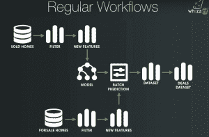
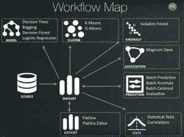

# BigML 的 WhizzML 如何简化机器学习自动化

> 原文：<https://thenewstack.io/bigmls-whizzml-programming-language-eases-machine-learning-automation/>

据说[机器学习](/category/machine-learning/) [ML]将最终理解所谓的大数据。现在 ML 有了自己的编程语言。

今年早些时候，BigML 发布了[whiz ml](https://bigml.com/whizzml)，这是一种专门为构建自动机器学习工作流而设计的领域特定语言【DSL】。它是一种完整的语言，包括变量、数据结构、条件和数学函数，自带原生调用来创建数据集。

BigML 的首席信息官[保罗·彼得森](https://www.linkedin.com/in/poul-petersen-9b236b)说，和所有好的机器学习资源一样，WhizzML 是 API 优先的，使它“可组合”，允许更好、更快的自动化。

“我们的愿景是让从数据到见解变得容易，”彼得森说。WhizzML 可以提供一种方法来克服这些最终的机器学习障碍，使用工作流自动化和自动模型选择来编写和共享工作流，使将工作流的复杂性提取到可重用的执行中成为可能。

WhizzML 也允许算法选项，允许用户测试不同的选项来找到最准确的结果。它还可以自动完成数据完善过程，确定丢失数据的位置以及哪种组合最适合预期结果。这种模型调整有助于特性选择，甚至可以识别哪些特性会增加噪声，哪些应该使用，哪些应该避免。

## 自动化学习

在最近关于该主题的网上研讨会中，Petersen 谈到了来自自动化洞察的发现，包括学习:

*   如何减少流失？
*   如何提高转化率？
*   如何提高医疗诊断水平？
*   如何减少诈骗？

但是，尽管许多大企业正在聘请学者来研究机器学习和下一级深度学习，但这并不能帮助美国 98%的小企业，因为它们负担不起内部数据科学家。这就是为什么机器学习自动化是最热门的流行语。

[https://www.youtube.com/embed/0AV9PHgD3wc?feature=oembed](https://www.youtube.com/embed/0AV9PHgD3wc?feature=oembed)

视频

当机器学习只是部分自动化时，彼得森指出了出现的几个问题:

*   你应该使用数百种算法中的哪一种？
*   你的机器学习怎么和数据一起伸缩？
*   你如何处理真实数据？缺失数据？混合数据类型？
*   如何调整算法以获得最佳性能？使用参数？
*   您如何自动化这些决策？

Petersen 指出，关于自动化数据的最后一点是自动化机器学习的关键部分，因为这是实现实时决策的部分——本质上自动化允许该过程快速而频繁。

> “(机器学习自动化)的愿景是让从数据到洞察变得容易。”

WhizzML 构建时考虑了自动化，并围绕手工选择的算法进行设计，这些算法以一种可理解的方式满足上面提到的真实数据和可伸缩需求。彼得森说，一旦这一点到位，机器学习就可以朝着准确性的方向调整。

“机器学习的肮脏秘密是，准确度的最大改善往往来自特征工程和模型调整，而不是选择不同的算法，”他说。

## 机器学习中的自动化工作流

在机器学习的背景下，工作流是指特定的任务可以按顺序链接在一起，然后实现自动化。机器学习本质上是迭代的，许多机器学习工具需要重复甚至手动的任务。有了自动化的工作流程，您就可以提取外部变量并使其更有价值。

Petersen 解释说，“如果没有工作流程，过多关注基础设施，输出就成了次要目标。”他继续指出“不是每个人都能实现复杂的工作流，但是很多人可以重用它们。”

下面，您将看到一个房地产大数据工作流的典型用例示例，目的是预测房屋的销售价格，因为虽然“位置、位置、位置”吸引了所有人的注意力，但定价才是最重要的。

 这种机器学习模型用于在所有当前待售的房屋中寻找交易，然后在输出端，它会告诉预测价格和标价之间的差异。这种工作流程适用于较小的公司，但无法扩展到其他城市以获得更广泛、更准确的视图，因为这种典型的工作流程意味着您必须手动处理不同的来源、特征工程和数据的后处理。这给人为错误和不精确的输出留下了很大的空间。

“现在，建模和调整等更高级别的任务也可以自动化，从而有可能完全消除从数据到见解的路径中的人工交互需求，”Petersen 说。

下面你可以看到一个例子 WhizzML 的工作流程图。

## 在 WhizzML API 的代码背后

上面的网上研讨会介绍了使用 WhizzML via 的代码，然后通过 API 处理机器学习。以下是对 WhizzML API 资源类型的概述:

*   **脚本** —工作流的书面表达，定义运行工作流所需的输入和输出。
*   **库**——包含可以包含到其他脚本中的 WhizzML 代码，允许您提取可重复使用的想法而无需复制。
*   **执行** —指定一个脚本和一组给定的输入，然后执行一组输出。这允许你看到你的机器学习努力的历史，包括使用了什么脚本、输入和输出。

作为 WhizzML 版本的一部分，该公司已经更新了 Python、Node.js、Swift 和 Objective-C 绑定。它还包括一个其他用户脚本的图库，这样你就不必马上创建自己的脚本，也可以直接从 GitHub 库导入。其中一些是免费的，而另一些是由创建者收费的，但所有这些都是由 BigML 团队审查的。

由于机器学习自动化比纯科学更具艺术性，WhizzML 有一个名为 REPL 的交互式外壳，用于调试和试验编程语言，如语法和代码更改。BigML 团队正在努力开放 REPL 代码的源代码，这样你就可以更容易地在自己的环境中使用它。

<svg xmlns:xlink="http://www.w3.org/1999/xlink" viewBox="0 0 68 31" version="1.1"><title>Group</title> <desc>Created with Sketch.</desc></svg>